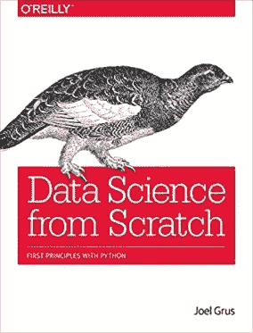
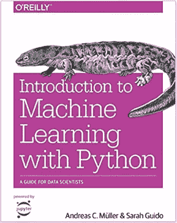

# 如何在线学习数据科学:你需要知道的一切

> 原文：<https://towardsdatascience.com/how-to-learn-data-science-online-all-you-need-to-know-bde77303b8a6?source=collection_archive---------32----------------------->

## Python、SQL、机器学习、作品集以及其他在线资源

来源: [Adobe 股票](https://stock.adobe.com/ca/)

这是**利用*在线*资源进入数据科学**的完整路线图/课程。

无论你是想免费学习*还是更高效地学习**，本指南将带你一步步走上正确的道路。我们将讨论*技能*、*在线课程*、*书籍*以及其他*资源*。*

*你会发现:*

*   *数据科学的**基础** (Python、SQL、机器学习/统计)以及如何学习它们。*
*   *为什么以及如何建立**数据科学组合**。*
*   ***深入数据科学世界的其他技巧/资源**。*

*立即开始您的数据科学之旅！*

# *我们是谁，为什么要遵循这个路线图？*

*Justin 和 Lianne 都在数据科学领域工作了 5 年多。我们曾在各种行业工作过，如营销、欺诈、反洗钱和大数据技术。Justin 拥有计算机工程学士学位和统计学硕士学位(后来的)；而 Lianne 拥有统计学学士和硕士学位。*

*数据科学是计算机科学和统计学的混合。我们俩都是从一边开始失踪的。因此，我们理解学习其他领域以进入数据科学的挑战。凭借我们的工作经验，我们也了解行业的需求。*

*我们写下这个路线图(和数据博客中的[)是为了帮助更多的人进入这个有趣而有前途的领域。](https://www.justintodata.com/)*

*这些建议都是基于我们多年的经验加上数小时的研究。*

*希望你能找到有用的东西。*

# *第 0 步:感受数据科学*

> *为什么是数据科学？我应该进入这个领域吗？*

*花点时间想象一下:*

*   *你可以*基于**数据分析**探索世界*，发现模式/真相。*
*   *你可以通过使用**先进技术**、**机器学习算法**来*影响世界*。*
*   *你有一份你热爱的**高薪工作****。***

***如果所有这些听起来像你想要的，那么数据科学就是为你准备的！***

***查看这些 YouTube 视频，更好地了解数据科学:***

*   ***[什么是真正的数据科学？由数据科学家讲述](https://www.youtube.com/watch?v=xC-c7E5PK0Y)***
*   ***[揭开数据科学的神秘面纱:TED 演讲](https://www.youtube.com/watch?v=iJUzouXg5kY)***
*   ***[预测股票价格](https://www.youtube.com/watch?v=SSu00IRRraY)***

***请记住，数据科学对许多不同的行业都很有用，例如:***

*   ***机器人学***
*   ***营销***
*   ***金融***
*   ***卫生保健***

***它可以用于许多不同的应用，例如:***

*   ***分析学***
*   ***预言；预测；预告***
*   ***分类***
*   ***建议***
*   ***自然语言处理***

***还有各种数据科学职业道路。您可以是报告分析师、数据分析师或数据科学家。它们都需要不同的优势/技能。***

***毕竟，拥有一套新技能不会有坏处。***

***一旦你下定决心，让我们开始艰苦的(但*有趣的*)工作。***

# ***步骤 1:学习数据科学的基础知识***

***[数据科学](https://en.wikipedia.org/wiki/Data_science)是不同领域的混合体，包括计算机科学、统计学、信息科学、数学。所以你需要同时具备编程/编码技能和理论知识。***

> ***我们需要知道哪些数据科学的基础知识？***

***最终，我们所有的努力都是为了在数据科学领域开创事业。你可能想知道雇主想要什么:***

> ***哪些数据科学语言/工具？***
> 
> ***有哪些顶级技能？***
> 
> ***对学历的最低要求是什么？***

***这就是为什么我们根据[实际上是](https://indeed.com)的招聘信息总结了上述问题的答案。查看帖子[2020 年数据科学家的热门技能有哪些](https://www.justintodata.com/in-demand-skills-for-data-scientists/)寻找答案。***

***为了让开始变得简单，我们将重点关注以下技术技能:***

*   ***计算机编程语言***
*   ***结构化查询语言***
*   ***机器学习(包括基础统计)***

*****提示**:还有其他工具/技能比如生产系统，软技能。但是你会一路发现它们。他们也依赖于工业。没有必要一开始就把一切都压得喘不过气来。***

*****披露**:以下所有推荐课程、书籍都是由我们*独立挑选和测试*。一些课程和书籍有平台或亚马逊的附属链接，这意味着如果你通过它们购买，你不会多花一分钱，但我们会得到一小笔佣金。这有助于我们保持光明。谢谢！***

## ***数据科学在线课程***

***我们应该从许多不同的课程中挑选哪些课程？***

***下面我们总结一下最流行的平台的特点。***

***我们会针对 **Python** / **SQL** / **机器学习**的每个话题提供更多*详细*推荐。请继续阅读，找出答案。***

******

*   ***迎合没什么经验的人***
*   ***注重基础，易于掌握***
*   ***使用 Python/SQL/R 交互环境***
*   ***数据科学项目组***

***[试试 DataCamp](https://www.datacamp.com?tap_a=5644-dce66f&tap_s=820377-9890f4&utm_medium=affiliate&utm_source=justintodatajustintodata)***

******

*   ***可以免费旁听特定时间的部分课程***
*   ***付费证书***
*   ***主要由麻省理工学院、哈佛大学等学院/大学的教授授课***

***[试试 edX](https://www.awin1.com/cread.php?awinmid=6798&awinaffid=697497&clickref=edx+home+page+summary+table&ued=https%3A%2F%2Fwww.edx.org%2F)***

******

*   ***可以免费旁听部分课程***
*   ***付费证书***
*   ***大多由来自各种顶级学院/大学的教授授课***

***[试试 Coursera](https://click.linksynergy.com/deeplink?id=WiOo3A5woE8&mid=40328&murl=https%3A%2F%2Fwww.coursera.org%2F)***

******

*   ***拥有最大的课程选择，任何人都可以成为平台上的讲师***
*   ***良好的审查系统***

***[试试 Udemy](https://www.udemy.com/)***

******

*   ***由谷歌、AWS、IBM 等顶级科技公司打造并获得认可***
*   ***更深入:纳米学位需要 4-5 个月才能完成(每周 5-10 小时)***
*   ***有现实生活中的项目被审查***
*   ***提供技术指导支持***
*   ***提供个人职业服务***

***[试试 Udacity](https://www.anrdoezrs.net/links/9267194/type/dlg/https://www.udacity.com/)***

## *****Python*****

***Python 是最需要的数据科学语言，而且可以免费使用。它是一种功能强大的语言，可以帮助您完成大多数数据科学任务，甚至更多！***

***r 是另一种流行的数据科学语言。然而，如果你仍然在 R 或 Python 之间挣扎，请阅读[2020 年数据科学家的热门技能是什么](https://www.justintodata.com/in-demand-skills-for-data-scientists/)。***

***根据我们的经验，我们编制了一份对数据科学至关重要的清单:***

*   ***数字类型***
*   ***布尔类型***
*   ***列表***
*   ***设置***
*   ***字典***
*   ***功能***
*   ***日期***
*   ***文件***
*   ***字处理***
*   ***条件句—如果/否则***
*   ***环***
*   ***软件包—安装、导入等***

***这听起来像很多概念。***

*****更新:**刚入数据现推出 ***免费*** [Python 速成班:突入数据学](https://www.justintodata.com/learn-python-free-online-course-data-science/)！***

***该课程对初学者友好，涵盖了开始数据科学所需的基础知识。点击下面的链接注册/了解更多信息！***

*** [## 为数据科学学习 Python:免费在线课程-数据入门

### 从你注册后的第二天开始，我们将每隔一天向你发送 6 封电子邮件/课程。大多数课程将…

www.justintodata.com](https://www.justintodata.com/learn-python-free-online-course-data-science/) 

但是不要担心，我们复习了会有帮助的在线课程。以下所有课程包含了我们刚刚提到的大部分概念，你可以很容易地在课程期间/之后填补空白。

查看以下评论:

*   **内容质量/覆盖面**基于上述基本知识列表和我们的判断。
*   **承受能力**是以金钱为基础的。$符号越多，课程越贵。
*   **推荐的课程**包括我们认为最好的课程，涵盖了 Python 的*基础*。我们逐一审查了每个平台*上的不同选项。*

**注意**:介质不允许表格。为了更好的观看体验，请查看原帖[如何在线学习数据科学:你需要知道的一切](https://www.justintodata.com/how-to-learn-data-science-online-all-you-need-to-know/)。

[**DataCamp**](https://www.datacamp.com?tap_a=5644-dce66f&tap_s=820377-9890f4&utm_medium=affiliate&utm_source=justintodatajustintodata)

**内容质量** / **覆盖率:4/5**

**负担能力:$**

**推荐课程:**

课程以模块形式提供，
所以需要以下所有:
–[Python 简介](https://www.datacamp.com/courses/intro-to-python-for-data-science?tap_a=5644-dce66f&tap_s=820377-9890f4&utm_medium=affiliate&utm_source=justintodatajustintodata)
–[中级 Python](https://www.datacamp.com/courses/intermediate-python-for-data-science??tap_a=5644-dce66f&tap_s=820377-9890f4&utm_medium=affiliate&utm_source=justintodatajustintodata)
–[编写高效的 Python 代码](https://www.datacamp.com/courses/writing-efficient-python-code?tap_a=5644-dce66f&tap_s=820377-9890f4&utm_medium=affiliate&utm_source=justintodatajustintodata)
–[在 Python 中处理日期和时间](https://www.datacamp.com/courses/working-with-dates-and-times-in-python?tap_a=5644-dce66f&tap_s=820377-9890f4&utm_medium=affiliate&utm_source=justintodatajustintodata)

[**edX**](https://www.awin1.com/cread.php?awinmid=6798&awinaffid=697497&clickref=edx+home+page+python+table&ued=https%3A%2F%2Fwww.edx.org%2F)

**内容质量** / **覆盖率:4/5**

**负担能力:**审核一段时间获得**免费**获得*或*获得
证书获得 **$**

**推荐课程:** [数据科学 Python 基础](https://www.awin1.com/cread.php?awinmid=6798&awinaffid=697497&clickref=edx+python&ued=https%3A%2F%2Fwww.edx.org%2Fcourse%2Fpython-basics-for-data-science)

[Coursera](https://click.linksynergy.com/deeplink?id=WiOo3A5woE8&mid=40328&murl=https%3A%2F%2Fwww.coursera.org%2F)

**内容质量** / **覆盖率:3.5/5**

**负担能力:**审核为**免费** *或*
领取证书为 **$$**

**推荐课程:** [Python 为大家特殊化](https://click.linksynergy.com/deeplink?id=WiOo3A5woE8&mid=40328&murl=https%3A%2F%2Fwww.coursera.org%2Fspecializations%2Fpython)

[**Udemy**](https://www.udemy.com/)

**内容质量** / **覆盖率:4.5/5**

**承受能力:$$$**

**推荐课程:** [完整 Python Bootcamp:在 Python 3 中从零到英雄](https://www.udemy.com/course/complete-python-bootcamp/)

[uda city](https://www.anrdoezrs.net/links/9267194/type/dlg/https://www.udacity.com/)

**内容质量** / **覆盖率:5/5**

**负担能力:$$$$**

**推荐课程:** [用 Python 进行数据科学编程](https://www.anrdoezrs.net/links/9267194/type/dlg/https://www.udacity.com/course/programming-for-data-science-nanodegree--nd104)

**提示** :
以上大部分课程都没有涵盖安装程序，这可能会让人感到困惑。查看我们的帖子，获得逐步指导:[如何安装/设置 Python，并立即准备数据科学](https://www.justintodata.com/install-python-and-prep-for-data-science/)。学习编码的同时练习是必不可少的。我们不可能一下子掌握 Python 中的每一个包/函数。先把基础学起来，边练边学别人就行了！

在进入机器学习之前，也有必要熟悉两个必须知道的包:

*   [NumPy](https://numpy.org/) : 一个允许高效数值运算的低级包。所有其他 Python 机器学习包都使用它。
    你可以在他们的网站上看一下[教程](https://eur05.safelinks.protection.outlook.com/?url=https%3A%2F%2Fdocs.scipy.org%2Fdoc%2Fnumpy%2Fuser%2Fquickstart.html&data=02%7C01%7C%7Cf46f53a1c1534cddfd8808d7d36d9ab8%7C84df9e7fe9f640afb435aaaaaaaaaaaa%7C1%7C0%7C637210340002857234&sdata=MJMW3IWpNDKNu67QW%2F7Mf4nyMa8aOXBJj1x%2BRloEvgk%3D&reserved=0)，这也是一个很好的参考值得保留。
*   熊猫(Pandas):一个建立在 NumPy 基础上的包，用于数据清理、管理和探索。
    这很容易掌握，但可能会令人困惑，因为做事的方式各不相同。从阅读这份[材料](https://eur05.safelinks.protection.outlook.com/?url=https%3A%2F%2Fpandas.pydata.org%2Fdocs%2Fgetting_started%2F10min.html&data=02%7C01%7C%7Cf46f53a1c1534cddfd8808d7d36d9ab8%7C84df9e7fe9f640afb435aaaaaaaaaaaa%7C1%7C0%7C637210340002867225&sdata=HtXnr%2BJLy64y0aLWp4Nn%2FH8auE3xtYlrwuX99zsJuxs%3D&reserved=0)开始。你也可以尝试搜索一些在线课程来获得更深入的信息。下面我们也会推荐几本书。

## **SQL**

SQL 是经典的，并且仍然是从数据库中提取数据的主要语言。大多数公司的数据库中都有数据，这使得 SQL 成为数据科学的一项基本技能。

根据我们的经验，我们编制了一份对数据科学至关重要的清单:

*   挑选
*   过滤器
*   加入
*   聚集
*   分组依据
*   子查询
*   公式
*   创建表格
*   索引/键
*   窗口功能
*   数据库表图表

查看以下评论:

*   **内容** **质量/覆盖面**基于以上列举的必备知识和我们的判断。
*   **承受能力**是以金钱为基础的。$符号越多，课程越贵。
*   **推荐课程**包括我们认为最好的课程，涵盖了 SQL 的*基础知识*。
    我们逐一查看了每个平台上的不同选项*。*

**注意**:介质不允许表格。为了更好的观看体验，请查看原帖[如何在线学习数据科学:你需要知道的一切](https://www.justintodata.com/how-to-learn-data-science-online-all-you-need-to-know/)。

[**DataCamp**](https://www.datacamp.com?tap_a=5644-dce66f&tap_s=820377-9890f4&utm_medium=affiliate&utm_source=justintodatajustintodata)

**内容质量** / **覆盖率:5/5**

**负担能力:$**

**推荐课程:**

课程以模块的形式提供，
因此需要以下全部:
–[SQL 简介](https://www.datacamp.com/courses/introduction-to-sql?tap_a=5644-dce66f&tap_s=820377-9890f4&utm_medium=affiliate&utm_source=justintodatajustintodata)
–[SQL 中的联接数据](https://www.datacamp.com/courses/joining-data-in-postgresql?tap_a=5644-dce66f&tap_s=820377-9890f4&utm_medium=affiliate&utm_source=justintodatajustintodata)
–[中级 SQL](https://www.datacamp.com/courses/intermediate-sql?tap_a=5644-dce66f&tap_s=820377-9890f4&utm_medium=affiliate&utm_source=justintodatajustintodata)
–[SQL 中的探索性数据分析](https://www.datacamp.com/courses/exploratory-data-analysis-in-sql?tap_a=5644-dce66f&tap_s=820377-9890f4&utm_medium=affiliate&utm_source=justintodatajustintodata)
–[PostgreSQL 汇总统计和窗口函数](https://www.datacamp.com/courses/postgresql-summary-stats-and-window-functions?tap_a=5644-dce66f&tap_s=820377-9890f4&utm_medium=affiliate&utm_source=justintodatajustintodata)–
–[SQL 中的关系数据库简介](https://www.datacamp.com/courses/introduction-to-relational-databases-in-sql?tap_a=5644-dce66f&tap_s=820377-9890f4&utm_medium=affiliate&utm_source=justintodatajustintodata)

[**edX**](https://www.awin1.com/cread.php?awinmid=6798&awinaffid=697497&clickref=edx+home+page+sql+table&ued=https%3A%2F%2Fwww.edx.org%2F)

**内容质量** / **覆盖率:4/5**

**负担能力:**审核一段时间获得**免费** *或*
获得 **$** 证书

**推荐课程:** [数据科学 SQL](https://www.awin1.com/cread.php?awinmid=6798&awinaffid=697497&clickref=edx+sql&ued=https%3A%2F%2Fwww.edx.org%2Fcourse%2Fsql-for-data-science)

[**Coursera**](https://click.linksynergy.com/deeplink?id=WiOo3A5woE8&mid=40328&murl=https%3A%2F%2Fwww.coursera.org%2F)

**内容质量** / **覆盖率:4/5**

**负担能力:**审核为***或*
赚取证书为 **$$****

****推荐课程:** [数据科学 SQL](https://click.linksynergy.com/deeplink?id=WiOo3A5woE8&mid=40328&murl=https%3A%2F%2Fwww.coursera.org%2Flearn%2Fsql-for-data-science%2F)**

**[**Udemy**](https://www.udemy.com/)**

****内容质量** / **覆盖率:4/5****

****承受能力:$$$****

****推荐课程:** [完整 SQL Bootcamp](https://www.udemy.com/course/the-complete-sql-bootcamp/)**

**[**Udacity**](https://www.anrdoezrs.net/links/9267194/type/dlg/https://www.udacity.com/)**

****内容质量** / **覆盖率:3.5/5****

****负担能力:免费****

****推荐课程:** [用于数据分析的 SQL](https://www.anrdoezrs.net/links/9267194/type/dlg/https://classroom.udacity.com/courses/ud198)**

## ****机器学习/统计学****

**机器学习是人们谈论最多的数据科学。我们把它留在最后，因为它需要编程技巧来应用它的算法。机器学习的课程通常也包括统计学的基本概念。**

**查看以下评论:**

*   ****内容** **质量/覆盖面**基于我们的判断。
    机器学习有不同的课题。我们需要在学完基础知识之后，在具体领域进行更深入的挖掘。**
*   ****承受能力**是以金钱为基础的。$符号越多，课程越贵。**
*   ****推荐课程**包括我们认为涵盖了机器学习*基础*的最佳课程。
    我们逐一查看了每个平台上的不同选项*。***

****注意**:介质不允许表格。为了更好的观看体验，请查看原帖[如何在线学习数据科学:你需要知道的一切](https://www.justintodata.com/how-to-learn-data-science-online-all-you-need-to-know/)。**

**[**数据营**](https://www.datacamp.com?tap_a=5644-dce66f&tap_s=820377-9890f4&utm_medium=affiliate&utm_source=justintodatajustintodata)**

****内容质量** / **覆盖率:4/5****

****负担能力:$****

****推荐课程:****

**课程以模块形式提供，
因此需要以下所有内容:
–[使用 Python 中基于树的模型进行机器学习](https://www.datacamp.com/courses/machine-learning-with-tree-based-models-in-python?tap_a=5644-dce66f&tap_s=820377-9890f4&utm_medium=affiliate&utm_source=justintodatajustintodata)
–[使用 Python 中的时间序列分析](https://www.datacamp.com/courses/time-series-analysis-in-python?tap_a=5644-dce66f&tap_s=820377-9890f4&utm_medium=affiliate&utm_source=justintodatajustintodata)
–[使用 Python 中的线性分类器](https://www.datacamp.com/courses/linear-classifiers-in-python?tap_a=5644-dce66f&tap_s=820377-9890f4&utm_medium=affiliate&utm_source=justintodatajustintodata)
–[使用 Python 中的聚类分析
–](https://www.datacamp.com/courses/cluster-analysis-in-python?tap_a=5644-dce66f&tap_s=820377-9890f4&utm_medium=affiliate&utm_source=justintodatajustintodata)[使用 XGBoost](https://www.datacamp.com/courses/extreme-gradient-boosting-with-xgboost?tap_a=5644-dce66f&tap_s=820377-9890f4&utm_medium=affiliate&utm_source=justintodatajustintodata)
–[使用 Keras 进行深度学习简介](https://www.datacamp.com/courses/introduction-to-deep-learning-with-keras?tap_a=5644-dce66f&tap_s=820377-9890f4&utm_medium=affiliate&utm_source=justintodatajustintodata)**

**[**edX**](https://www.awin1.com/cread.php?awinmid=6798&awinaffid=697497&clickref=edx+home+page+ml+table&ued=https%3A%2F%2Fwww.edx.org%2F)**

****内容质量** / **覆盖率:3/5****

****负担能力:**审核一段时间获得***或*
获得证书获得 **$******

******推荐课程:** [用 Python 分析数据](https://www.awin1.com/cread.php?awinmid=6798&awinaffid=697497&clickref=edx+ml&ued=https%3A%2F%2Fwww.edx.org%2Fcourse%2Fanalyzing-data-with-python)****

****[Coursera](https://click.linksynergy.com/deeplink?id=WiOo3A5woE8&mid=40328&murl=https%3A%2F%2Fwww.coursera.org%2F)****

******内容质量** / **覆盖率:4/5******

******负担能力:**审核为***或*
获得证书为 **$$********

******推荐课程:******

****都是理论多应用少:
—[应用数据科学配 Python 专精](https://click.linksynergy.com/deeplink?id=WiOo3A5woE8&mid=40328&murl=https%3A%2F%2Fwww.coursera.org%2Fspecializations%2Fdata-science-python) *或*
—[机器学习配吴恩达](https://click.linksynergy.com/deeplink?id=WiOo3A5woE8&mid=40328&murl=https%3A%2F%2Fwww.coursera.org%2Flearn%2Fmachine-learning)(非 Python)****

****[**Udemy**](https://www.udemy.com/)****

******内容质量** / **覆盖率:3.5/5******

******承受能力:$$$******

******推荐课程:** [用 Python 进行机器学习、数据科学和深度学习](https://www.udemy.com/course/data-science-and-machine-learning-with-python-hands-on/)****

****[**Udacity**](https://www.anrdoezrs.net/links/9267194/type/dlg/https://www.udacity.com/)****

******内容质量** / **覆盖率:5/5******

******承受能力:$$$$******

******推荐课程:******

****两个学位都非常全面实用:
[数据分析师纳米学位](https://www.anrdoezrs.net/links/9267194/type/dlg/https://www.udacity.com/course/data-analyst-nanodegree--nd002)
[数据科学家纳米学位](https://www.anrdoezrs.net/links/9267194/type/dlg/https://www.udacity.com/course/data-scientist-nanodegree--nd025)****

## ****数据科学免费在线教程****

****也有一些免费的在线书面教程。它们是很好的参考资料，因为它是基于文本的，易于搜索。但是它们通常没有结构，不像课程/书籍那样容易理解。****

## ****计算机编程语言****

****我们为没有编程经验的人推荐[在线课程](https://www.justintodata.com/how-to-learn-data-science-online-all-you-need-to-know/#online_platforms_summary)。但是，如果你对 Python 之外的编程很有经验，你可以自学。****

****查看我们的帖子，了解设置环境的逐步说明:[如何安装/设置 Python，并立即准备数据科学](https://www.justintodata.com/install-python-and-prep-for-data-science/)。****

****并且看一看 [W3School Python 教程](https://nam01.safelinks.protection.outlook.com/?url=https%3A%2F%2Fwww.w3schools.com%2Fpython%2Fdefault.asp&data=02%7C01%7C%7C226521092ac34b6930f508d7d119b417%7C84df9e7fe9f640afb435aaaaaaaaaaaa%7C1%7C0%7C637207780627738046&sdata=zsuzDcHkkM2qg0lfJU2x992wJ4A4mP9BLhHXb7R9KnA%3D&reserved=0)或者 [Python Doc。](https://nam01.safelinks.protection.outlook.com/?url=https%3A%2F%2Fdocs.python.org%2F3%2F&data=02%7C01%7C%7C226521092ac34b6930f508d7d119b417%7C84df9e7fe9f640afb435aaaaaaaaaaaa%7C1%7C0%7C637207780627738046&sdata=d7CUDHCaY9dQWmmhijGSWMYVVT3SkO9seTpG6fqTj%2Bw%3D&reserved=0)****

## ****结构化查询语言****

****和 Python 一样，还有 [W3School SQL 教程](https://www.w3schools.com/sql/) [。](https://nam01.safelinks.protection.outlook.com/?url=https%3A%2F%2Fdocs.python.org%2F3%2F&data=02%7C01%7C%7C226521092ac34b6930f508d7d119b417%7C84df9e7fe9f640afb435aaaaaaaaaaaa%7C1%7C0%7C637207780627738046&sdata=d7CUDHCaY9dQWmmhijGSWMYVVT3SkO9seTpG6fqTj%2Bw%3D&reserved=0)看一看了解基础。****

****[PostgreSQL](https://www.postgresql.org/) 和 [MySQL](https://www.mysql.com/) 都是免费的开源数据库。它们在真实的生产环境中也很常见。您可以尝试安装它们，并使用示例数据库进行练习:****

*   ****[PostgreSQL 示例数据库](https://wiki.postgresql.org/wiki/Sample_Databases)****
*   ****[MySQL 示例数据库](https://dev.mysql.com/doc/employee/en/)****

****学习更高级的窗口函数也很重要。查看以下流行服务器的说明:****

*   ****[PostgreSQL](https://www.postgresql.org/docs/9.1/tutorial-window.html)****
*   ****[MySQL](https://dev.mysql.com/doc/refman/8.0/en/window-functions.html)****
*   ****[SQL Server](https://www.sqlservertutorial.net/sql-server-window-functions/)****

## ****机器学习/统计****

****我们找不到任何涵盖所有必要材料的免费在线教程。所以我们推荐线上课程或者书籍。****

****如果你预算紧张，试试上面的[免费在线课程](https://www.justintodata.com/how-to-learn-data-science-online-all-you-need-to-know/#machine_learning_courses)。****

## ****数据科学书籍****

****阅读是一种传统的学习方式。****

****我们推荐阅读基础书籍或者只关注概念的书籍。更深入的编程内容有时会过时。****

****这些书可能涵盖多种技能，所以我们把它们放在一起，而不是分成 Python/SQL/机器学习部分。****

****[从零开始的数据科学](https://www.amazon.com/Data-Science-Scratch-Principles-Python-ebook/dp/B07QPC8RZX/ref=as_li_ss_tl?dchild=1&keywords=Data+Science+from+Scratch&qid=1585668029&s=digital-text&sr=1-1&linkCode=ll1&tag=678906b-20&linkId=51e843cc40f431566d3e3af3731db9e3&language=en_US)是我们找到的开始数据科学的最佳书籍。****

********

****阅读这本书需要一些基本的先决条件。它涵盖了广泛的主题，例如:****

*   ****数据科学，机器学习导论****
*   ****Python 和 SQL 基础知识****
*   ****线性代数、统计和概率基础****
*   ****数据处理****
*   ****从简单的线性回归到更先进的神经网络的模型****

******提示**:这本书没有深入涉及主题。但这是一个很好的开始。一旦你了解了数据科学的各个方面，你就会找到一条更清晰的道路。****

****[Python 机器学习简介:数据科学家指南](https://www.amazon.com/Introduction-Machine-Learning-Python-Scientists-ebook/dp/B01M0LNE8C/ref=as_li_ss_tl?dchild=1&keywords=Introduction+to+Machine+Learning+with+Python:+A+Guide+for+Data+Scientists&qid=1585594653&s=books&sr=1-1&linkCode=ll1&tag=678906b-20&linkId=72416e48996c59079da24d84cc98ddf9&language=en_US)如果你想专注于数据科学的机器学习方面，这是一个很好的开始。****

********

****这本书包括:****

*   ****机器学习简介****
*   ****Python 基础****
*   ****机器学习算法、模型****

****此外，看看这些初学者友好的书籍:****

*   ****[学习 Python:强大的面向对象编程](https://www.amazon.com/Learning-Python-Powerful-Object-Oriented-Programming-ebook/dp/B00DDZPC9S/ref=as_li_ss_tl?crid=1URKE3L7B56CN&dchild=1&keywords=learning+python&qid=1585594709&s=books&sprefix=Learning+Python,stripbooks-intl-ship,182&sr=1-1&linkCode=ll1&tag=678906b-20&linkId=788d0385ff4f14ed80cee9a3abe1b7d3&language=en_US)****
*   ****[绝对初学者的机器学习:简明英语介绍](https://www.amazon.com/Machine-Learning-Absolute-Beginners-Introduction-ebook/dp/B07335JNW1/ref=as_li_ss_tl?dchild=1&keywords=Machine+Learning+For+Absolute+Beginners:+A+Plain+English+Introduction&qid=1585594766&s=books&sr=1-1&linkCode=ll1&tag=678906b-20&linkId=0fb475e06444843cf8362f448488ccea&language=en_US)****

****如果你已经知道了一些基础知识，可以试试下面的书来提高技能:****

*   ****[用于数据分析的 Python:与 Pandas、NumPy 和 IPython 的数据角力](https://www.amazon.com/Python-Data-Analysis-Wrangling-IPython-ebook/dp/B075X4LT6K/ref=as_li_ss_tl?dchild=1&keywords=Python+for+Data+Analysis:+Data+Wrangling+with+Pandas,+NumPy,+and+IPython&qid=1585594822&s=books&sr=1-1&linkCode=ll1&tag=678906b-20&linkId=12aea44ccf9c4b0074a196654a47e87a&language=en_US)****
*   ****[Python 数据科学手册:处理数据的基本工具](https://www.amazon.com/Python-Data-Science-Handbook-Essential-ebook/dp/B01N2JT3ST/ref=as_li_ss_tl?dchild=1&keywords=Python+Data+Science+Handbook:+Essential+Tools+for+Working+with+Data&qid=1585594878&s=books&sr=1-1&linkCode=ll1&tag=678906b-20&linkId=99ec7940705256dc305d1395fb5e5277&language=en_US)****
*   ****[使用 Scikit-Learn、Keras 和 TensorFlow 进行机器实践学习:构建智能系统的概念、工具和技术](https://www.amazon.com/Hands-Machine-Learning-Scikit-Learn-TensorFlow-ebook/dp/B07XGF2G87/ref=as_li_ss_tl?dchild=1&keywords=machine+learning&qid=1585666921&s=books&sr=1-1&linkCode=ll1&tag=678906b-20&linkId=ed3031211d13907a69fa82b3cda9ed0f&language=en_US)****

******提示**:不可能一下子掌握这些课程和书本上的所有概念。很容易感到迷茫和沮丧，但不要放弃和练习。
这就是下一步非常关键的原因。经过几个周期的学习和练习，你会成功的！****

## ****摘要****

****学习数据科学的基础知识仍然有很多选择！有时候选择太多并不理想。****

****你拥有的选项越多，你就越有可能选择*无*选项。****

****所以，简单来说:****

*   ****想**学免费**，选择 [Coursera](https://click.linksynergy.com/deeplink?id=WiOo3A5woE8&mid=40328&murl=https%3A%2F%2Fwww.coursera.org%2F) 或者 [edX](https://www.awin1.com/cread.php?awinmid=6798&awinaffid=697497&clickref=edx+home+page+end+summary+table&ued=https%3A%2F%2Fwww.edx.org%2F) ，审核无认证，结合[在线免费教程](https://www.justintodata.com/how-to-learn-data-science-online-all-you-need-to-know/#free_tutorials)。
    别忘了我们的**免费** [Python 速成班:闯入数据科学](https://www.justintodata.com/learn-python-free-online-course-data-science/)！****
*   ****如果你想在有预算的情况下高效地学习，请选择数据营或 T21 书籍。****
*   ****如果你想系统而有效地学习，这将节省你大量的时间和精力，选择。****

# ****步骤 2:构建数据科学组合****

****构建数据科学组合非常重要，主要有两个原因:****

*   ****不弄脏自己的手，不去实践，就没有真正的收获。所以在学习了必要的知识之后，把它们应用到现实生活中是很好的。****
*   ****这是向你的潜在雇主展示你既有热情又有能力做的事情的最好方式。****

****遵循以下一般程序:****

## ****找到一个有趣的问题/话题****

****这个初始过程至关重要，因为人们更关心数据科学能做什么，而不是理论和算法。他们希望数据科学项目变得有趣、有用。我们使用的任何数据科学工具/模型都应该围绕我们试图解决的问题。****

****请记住，数据科学可以应用于许多不同的领域，因此:****

*   ****如果你有梦想中的行业，关注相关问题可以帮助你找到梦想中的工作。****
*   ****如果没有，试着从日常生活中一些你感兴趣的问题开始。****

****给出一些想法，****

*   ****我们喜欢看体育比赛，所以我们发现利用数据科学赚点外快很酷。****

**** [## 如何提高体育博彩赔率 Python 中的一步一步指南-只是进入数据

### 体育博彩可能不仅仅是利用你的直觉。查看我用来赚 20，000 美元的数据科学策略…

www.justintodata.com](https://www.justintodata.com/improve-sports-betting-odds-guide-in-python/) 

*   我们有兴趣了解更多关于我们最喜欢的健身 *YouTube 频道*，所以我们深入研究它的数据。

 [## 如何用机器学习技术获得更多的 YouTube 浏览量——仅仅是数据

### 在这篇文章中，我们用 Python 对 YouTube 数据应用了机器学习算法。我们将包括端到端流程…

www.justintodata.com](https://www.justintodata.com/get-more-youtube-views-with-machine-learning/) 

*   我们想更多地了解*冠状病毒*，这种疾病极大地影响了我们的生活。所以我们也研究了它的数据。

 [## 什么是冠状病毒死亡率与超参数调整-只是进入数据

### 这是利用在线资源进入数据科学的完整路线图/课程。你是否想学习…

www.justintodata.com](https://www.justintodata.com/coronavirus-death-rate-with-hyperparameter-tuning/) 

你肯定能找到一个数据科学能帮上忙的有趣话题！

## 查找与主题相关的公开数据集和文章

有了问题的想法后，我们可以开始寻找数据集进行分析。

一些数据可以通过**公共数据源**轻松访问，例如:

*   [卡格尔](https://www.kaggle.com/datasets)
*   [我们的数据世界](https://ourworldindata.org/)
*   政府网站如[美国开放数据源](https://www.data.gov/)、[加拿大统计局](https://www150.statcan.gc.ca/n1/en/type/data?MM=1)
*   [用于数据集搜索的谷歌工具](https://datasetsearch.research.google.com/)

有些可能需要你**收集数据**。但是不要担心，Python 可以帮你实现。

例如，为了获得 Indeed 工作发布数据，我们用 Python 从 [Indeed 网站](https://indeed.com/)抓取数据。看看[如何在 Python 中使用 NLP:一个实用的分步示例](https://www.justintodata.com/use-nlp-in-python-practical-step-by-step-example/)。

提示:许多文章建议参加 Kaggle 竞赛，但我们发现许多数据集或解决方案并不现实。

## 将知识应用于数据集

一旦我们有了数据集，就该深入研究了。我们需要:

*   探索数据
*   清理数据

 [## Python 中的数据清理:终极指南(2020)——只进入数据

### 我们用 Python 创建了这个新的完整的分步指南。你将学习如何寻找和清理的技巧:丢失…

www.justintodata.com](https://www.justintodata.com/data-cleaning-python-ultimate-guide/) 

*   研究解决问题的好办法
*   将算法/模型应用于数据

如果你更喜欢从一些指导开始，搜索有清晰的分步说明和实践的文章。例如，你可以查看我们的[博客](https://www.justintodata.com/blog/)上的文章，在那里我们解释了完整的过程并提供了 Python 代码。

**提示**:你可以尝试实现不同的模型来探索同一个数据集。这是展示你技能的好方法。

## 写信炫耀工作

最终，我们需要让世界了解我们的工作:

*   在 [GitHub](https://github.com/) 上发布你的代码。查看 [Hello World GitHub 指南](https://guides.github.com/activities/hello-world/)了解基础知识。
    别忘了创建一个自述文件和评论。你的代码甚至可能对同一主题的其他人有所帮助。
*   写文章总结工作。
*   并在平台上发布文章，如:
    –[LinkedIn](https://www.linkedin.com/)
    –[Medium](https://medium.com/@justintodata)
    –[Twitter](https://twitter.com/JustintoData)
    –[脸书](https://www.facebook.com/justintodata/)团体
    –或个人网站
    我们爱 Medium，因为你甚至可以根据浏览量获得一些报酬。媒体上最大的数据科学出版物是面向数据科学的。
*   或者将文章推销给其他出版物，如 [KDnuggets](https://www.kdnuggets.com/) 、 [Dataquest](https://www.dataquest.io/blog/write-for-dataquest/) 。

**提示**:项目的结果有时候不一定要完美。但是一定要解释你是如何处理这个问题的。

# 第 3 步:与数据科学世界接轨

现在我们有一个作品集来展示我们的技能。联系数据科学的真实世界非常重要。

如前所述，你可以加入不同的社交网络:

*   [领英](https://www.linkedin.com/)
*   [脸书](https://www.facebook.com/justintodata/)
*   [推特](https://twitter.com/JustintoData)
*   [中型](https://medium.com/@justintodata)

你也可以通过参加 [Meetup](https://www.meetup.com/) 和 [Eventbrite](https://www.eventbrite.com/) 的活动来尝试结识真实的人。

[Stack Overflow](https://stackoverflow.com/) 也是一个技术社区，在帮助他人的同时获得你的问题的答案。

# 最后的话

进入数据科学职业道路并不容易。但这是一个有益的和有影响力的！

所以请不要放弃，继续努力。

祝你好运！

如果你有任何问题，请留下评论。我们会尽力回答他们。

在你离开之前，别忘了 [*报名参加刚刚进入数据快讯*](https://www.justintodata.com/) ！或者在[推特](https://twitter.com/JustintoData)、[脸书](https://www.facebook.com/justintodata/)上与我们联系。
所以您*不会*错过我们的任何新数据科学文章！

【https://www.justintodata.com】原载于 2020 年 4 月 1 日**。**

* [## 如何在 Python 中使用 NLP:一个实用的分步示例——只进入数据

### 这是利用在线资源进入数据科学的完整路线图/课程。你是否想学习…

www.justintodata.com](https://www.justintodata.com/use-nlp-in-python-practical-step-by-step-example/)  [## 如何在 5 个步骤中可视化决策树——仅在数据中

### 这是利用在线资源进入数据科学的完整路线图/课程。你是否想学习…

www.justintodata.com](https://www.justintodata.com/visualize-a-decision-tree-in-python/)  [## 如何安装/设置 Python 并为数据科学做准备——直接进入数据

### 我们将带您逐步完成设置 Python 环境的过程。您将学习:如何安装 Python…

www.justintodata.com](https://www.justintodata.com/install-python-and-prep-for-data-science/)********