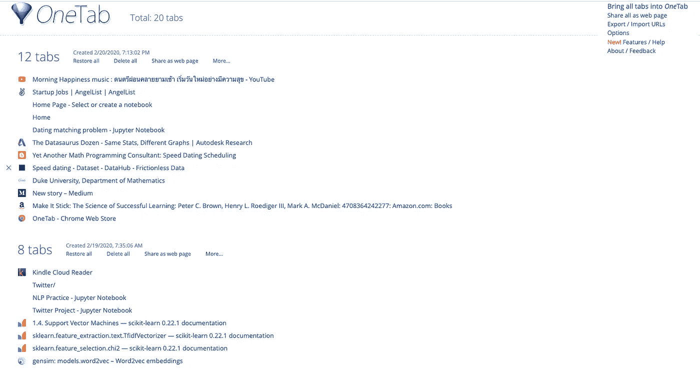
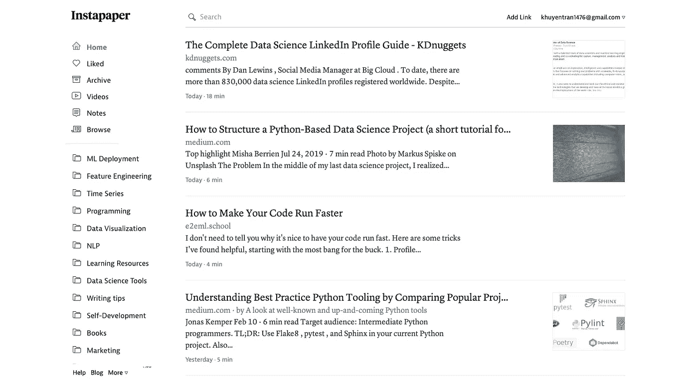
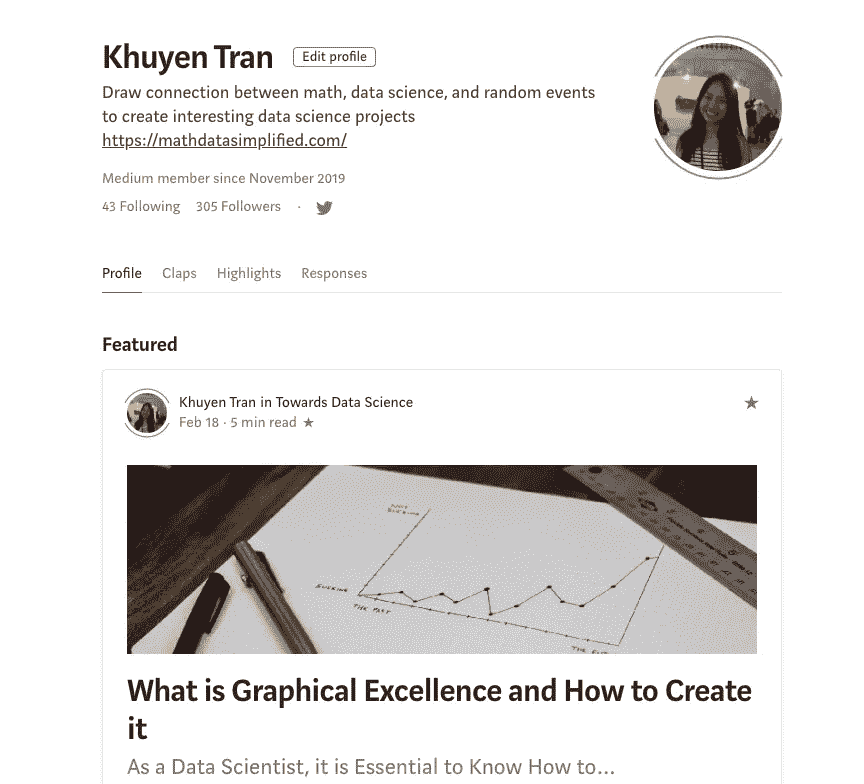

# 当生活不给你喘息的机会，如何学习数据科学

> 原文：<https://towardsdatascience.com/how-to-learn-data-science-when-life-does-not-give-you-a-break-a26a6ea328fd?source=collection_archive---------2----------------------->

## 我努力为数据科学贡献时间。但是发现新的策略使我能够提高学习速度，完成更多的事情

# 每一次挣扎都有出路

带着进入数据科学领域的目标，你决定想要获得什么样的技能。现在你只需要有时间坐下来获得这些技能。最终，你会成为一个有竞争力的候选人，得到你想要的工作。

但是生活不会让你坐下来。它要求你继续努力，做好自己的本职工作，同时还希望你能在简历中获得 2 年以上的工作经验。你感到停滞不前和沮丧。你知道你需要学习并完成一些项目，但发现坚持你的承诺是如此困难。那么应该放弃吗？

史蒂夫·哈拉马在 [Unsplash](https://unsplash.com?utm_source=medium&utm_medium=referral) 上拍摄的照片

两个月前我经历了同样的事情。作为一个有 5 门课和一份工作的数学系学生，我发现很难找到时间学习数据科学。在我快要放弃的时候，我告诉自己要继续走下去。这不是努力工作的问题；这是关于更聪明地工作。我只是需要改变我的学习策略。

> 不是多努力的问题。这是关于运作系统。
> 
> Snapchat 首席执行官埃文·斯皮格尔

现在，我设法完成了许多有趣的数据科学项目，每周至少发表 2 篇文章，在 NLP 研究中有新的发现，同时保持我的 4.0 GPA。当我不断问自己如何能更有效地工作时，我找到了方法。由于新方法对我有用，我想与您分享这些方法，希望您也能采用一些方法，在短时间内获得这些技能，让您的数据科学之旅更加愉快。

# 先完成一件事，然后再继续另一件事

## 我过去做的事

连续几周每天花一个小时在一个项目上。当我完成的时候，我觉得我什么都没完成。

## 我的新方法

**设定一个我想完成的小目标**，并在**短时间内完成它。比方说，当我从学校回来时，我会告诉自己:我想在 2 小时内完成我的学校作业，并在 2 小时内完成我的 NLP 项目。明天我将在到校前写一篇 2 小时的短文。**

知道我可以在很短的时间内完成这些事情让我很兴奋，并处于流中。我可以集中注意力几个小时而不分心。看到我的工作完成让我感到有动力，有动力继续下去。

# 创造一个孤立的环境

## 我过去做的事

为我想完成的不同项目和我想阅读的新文章打开几个浏览器。知道还有许多事情需要完成，我感到心烦意乱。

## 我的新方法

一旦我完成了一件事，我就**关闭所有与前一项工作**相关的文件或浏览器，继续下一项工作。如果工作还没有完成，我想以后再回到网站，我就用[一个标签](https://chrome.google.com/webstore/detail/onetab/chphlpgkkbolifaimnlloiipkdnihall?hl=vi)把多个浏览器压缩成一个。清楚地看到我的浏览器可以防止我的注意力分散，集中在工作上。

稍后当我想回到我的工作时，我只需打开一个选项卡，就可以快速访问我自己的工作。

我一直在采用的另一个小秘密是:把我的手机设置成飞行模式，关闭我的 MacBook 上的任何通知。我会在我选择的时间回复消息。任何消息都可以等待。

# 管理勘探和开发之间的关系

## 我过去做的事

我知道在数据科学领域，学习新知识和更新新技术和技巧是非常重要的。所以我每天会花很多时间去探索不同的工具，阅读很多文章，却不去应用它们。我感到筋疲力尽，无能为力，因为我意识到有太多的东西我需要学习，但我还没有学到任何一个

## 我的新方法

每当我在 Medium 或其他网站上看到有趣的文章时，如果我当时正在做什么，我会浏览一些有价值的文章，将它们保存到 [Instapaper](https://www.instapaper.com/) ，并将其归入特定的类别(数据科学、编程、数学、数据 viz 等)，以便我以后可以轻松访问它们。当我有少量空闲时间时(比如在公交车上，在线路上，或者在午餐时间)，我会拿出我保存在 app 中的文章来阅读。一旦我读完，我要么删除它们，要么保存它们，如果我以后想访问或尝试代码的话。

通过创建我自己的阅读空间和习惯，我能够在完成工作的同时用新知识更新自己。

# 分享我所学到的

## 我过去做的事

每天默默的做着工作。当我该在简历上展示我的工作时，我没有什么可展示的，因为我在完成工作后从未分享或发表过。

## 我的新方法

把一个大项目分成几个小项目。在 Github 上推送我的小成就，或者在 Medium 上分享我的短代码。然后我会在 LinkedIn，Twitter，或者我的[网站](https://mathdatasimplified.com/)上分享我的项目和文章。我从不忽视我的任何项目和小成就。

如果你因为觉得自己的作品不够好而犹豫要不要分享，那你永远都不够好。一旦你分享并收到他人的积极(或消极)反馈，你会更有动力去提高你的技能来分享更好的内容。

# 将“我需要做”转换为“我想做”

## 我过去做的事

“我可以跳过今天的项目吗？不，我不应该找借口，因为我已经向自己承诺，无论如何，每天都要花一个小时在数据科学上。这种想法给了我一种义务感，这个项目就像家庭作业或工作一样。我并不期待着手这个项目。

## 我的新方法

告诉自己，如果我愿意，我可以跳过我的项目，跳过写文章，跳过我的研究。没有人强迫我做这件事。这个想法出人意料地改变了我对工作的看法。我有选择我想做什么的自由，我仍然选择做我的项目。说明我真的很喜欢这个项目！这会很有趣的。我立刻感到精力和热情有所提升，开始着手这个项目。

# 结论

> 不管你认为你能还是不能，你都是对的
> 
> 亨利福特

要成为一名数据科学家，我还需要掌握许多技能。但是当我看到我的新方法实验帮助我有效地获得新技能并完成更多工作时，我知道如果我不放弃并有勇气改变那些不起作用的方法，我最终会实现我的愿景。

感谢您阅读我的文章。我很乐意听听你对这些策略的看法，以及哪些策略对你有效。

我喜欢写一些基本的数据科学概念，并尝试不同的算法和数据科学工具。你可以在 LinkedIn 和 T2 Twitter 上与我联系。

星[这个回购](https://github.com/khuyentran1401/Data-science)如果你想检查我写的所有文章的代码。在 Medium 上关注我，了解我的最新数据科学文章，例如:

 [## 使用 Python 最大化您的生产力

### 你创建了一个待办事项清单来提高效率，但最终却把时间浪费在了不重要的任务上。如果你能创造…

towardsdatascience.com](/maximize-your-productivity-with-python-6110004b45f7)  [## 高效 Python 代码的计时

### 如何比较列表、集合和其他方法的性能

towardsdatascience.com](/timing-the-performance-to-choose-the-right-python-object-for-your-data-science-project-670db6f11b8e)  [## 字典作为 If-Else 的替代

### 使用字典创建一个更清晰的 If-Else 函数代码

towardsdatascience.com](/dictionary-as-an-alternative-to-if-else-76fe57a1e4af)  [## 什么是卓越的图形以及如何创建它

### 作为一名数据科学家，了解如何制作重要的图表至关重要

towardsdatascience.com](/what-graphical-excellence-is-and-how-to-create-it-db02043e0b37)