# 不编码如何学习数据科学

> 原文：<https://towardsdatascience.com/how-to-learn-data-science-without-coding-9bf34cf053e5?source=collection_archive---------36----------------------->

## 谈论是否有可能，以及从哪里开始…

[照片](https://unsplash.com/photos/pypeCEaJeZY)由[活动创作者](https://unsplash.com/@campaign_creators)在 [Unsplash](https://unsplash.com) 拍摄

数据科学是计算机科学中要求最高、最受欢迎的领域之一。人们可能会认为，一般来说，数据科学家需要了解 Python 和编程才能获得成功。虽然这在一定程度上可能是真的，但在这篇文章中，我们讨论了没有编程数据科学是否可能，以及如果你不是程序员，如何开始学习。*TL；DR:有低代码经验学习数据科学是有可能的。微软和 Udacity 刚刚宣布了一项合作，将帮助你做到这一点！*

自从数据科学家成为如此受欢迎的职业以来，我确信许多人开始考虑学习数据科学，并且他们中的许多人都感到气馁，因为他们认为一个人需要成为一名优秀的程序员。大部分人认为了解机器学习是从 Python 开始的。但是，我必须向你保证，事实并非如此！在学习 Python 之前，有一些数据科学的基本原理需要你先学习**，完全不需要任何编码就可以开始解决很多现实世界的问题！**

> 数据科学最重要的事情是开始从数据、特性、准确性测量等方面考虑问题。是通过编写 Python 程序还是通过其他工具来训练模型并不重要。

让我们考虑一个例子:假设你想了解哪些照片更适合社交媒体。例如，在博客帖子中插入小猫的照片以吸引注意力是否有意义，或者观众已经厌倦了那些俗气的照片？一张照片在社交媒体上获得大量赞需要什么？

让我们看看如何从数据科学的角度来解决这个问题。

# 像数据科学家一样思考

数据科学依赖于数据。所以我们需要做的第一件事是收集数据集。在我们的案例中，我们有一个客观的指标来衡量观众对某些内容的喜欢程度，这就是喜欢的数量。

# 获取数据集

有多种因素会影响赞的数量:图片本身、相应的文本或者发布的日期和时间。让我们只关注图片，并从 Instagram 中获取一个图片样本，以及相应的赞数。因此，我们的初始数据集将由一张照片(URL)和它收到的一些赞组成。

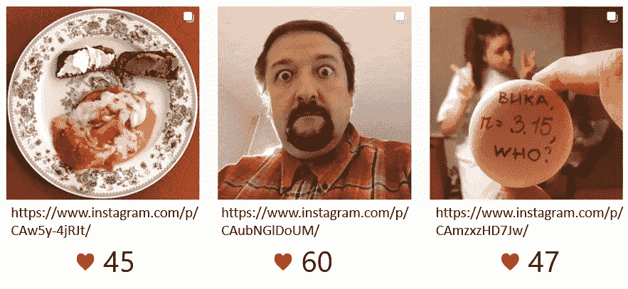

一旦我们有了数据，我们需要弄清楚我们将解决哪个问题。机器学习可以处理许多典型问题，其中最重要的是:

*   **分类**问题，当我们需要把我们的对象分成两个或更多的类时。分类问题的一个例子是过滤垃圾邮件，因为我们需要将每封邮件分类为垃圾邮件或非垃圾邮件。
*   在一个**回归**问题中，我们需要预测一个数字。预测一家商店每天售出的冰淇淋数量就是一个很好的例子。
*   **聚类**问题可以帮助我们找到相似类型的对象，并根据某种相似性原则将它们分组在一起。
*   **异常检测**允许我们发现不同于“正常”的数据

在我们的例子中，我们有一个**回归问题**，因为我们希望建立一个模型来预测我们的照片将获得的赞数。

# 提取特征

传统的机器学习模型使用**表格数据**，其中每个数据点由表格中的一行表示，该表格由**特征**(模型的输入值)和**标签**(我们试图预测的值)组成。虽然更高级的神经网络模型可以直接处理图像，但它们需要更多的数据来训练，所以我们在这里不讨论它们。

为了训练模型，我们首先需要执行**特征化**，即从图片中提取数字或分类特征。我们可以使用[认知服务](https://docs.microsoft.com/azure/cognitive-services/?WT.mc_id=personal-blog-dmitryso)计算机视觉 API 来做到这一点。认知服务可以将一张图片作为输入，然后返回计算机可以在这张图片中“看到”的一切:关于人、物体、主色的信息，以及图片上出现的任何文本。例如，我们可以提取以下特征:

*   主要图像类别:食物、肖像、建筑、风景等。
*   照片上的人脸数量及其年龄(平均年龄，如果有多张人脸)
*   背景和前景颜色
*   哈希标签。在表格中表示散列标签的方式被称为**一键编码**——每个标签将由一列表示，如果标签对应于图片，则包含 1，否则包含 0。

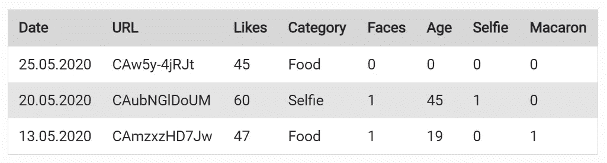

我们可能还想添加日期作为一个功能。添加日期可能很棘手，因为模型最适合数字，而日期不仅仅是一个数字。因此，我们可能希望用从开始日期算起的天数来表示一个日期，并添加“星期几”作为另一个特性，因为帖子的受欢迎程度可能在很大程度上取决于这一天。我们可能还想添加“周末”二进制特性来尝试和检测周末活动的变化。

> 在数据集的最初设计中，以及在收集哪些数据的整个问题上，投入了大量的思考。这个过程往往比实际的模型训练更重要，不需要编码就可以完成。

有时候数据准备的过程可以用 Excel 来完成，在数据集上调用认知服务可以用 [Power Apps](https://docs.microsoft.com/powerapps/?WT.mc_id=personal-blog-dmitryso) ( [本文档](https://docs.microsoft.com/powerapps/maker/canvas-apps/cognitive-services-api/?WT.mc_id=personal-blog-dmitryso)描述如何)或者[微软 Flow](https://flow.microsoft.com/?WT.mc_id=personal-blog-dmitryso) 来实现。

在这个例子中，我已经为你准备好了数据集。此处以 CSV-table [的形式提供。](https://raw.githubusercontent.com/shwars/NeuroWorkshopData/master/Data/instagram/instagram_onehot.csv)

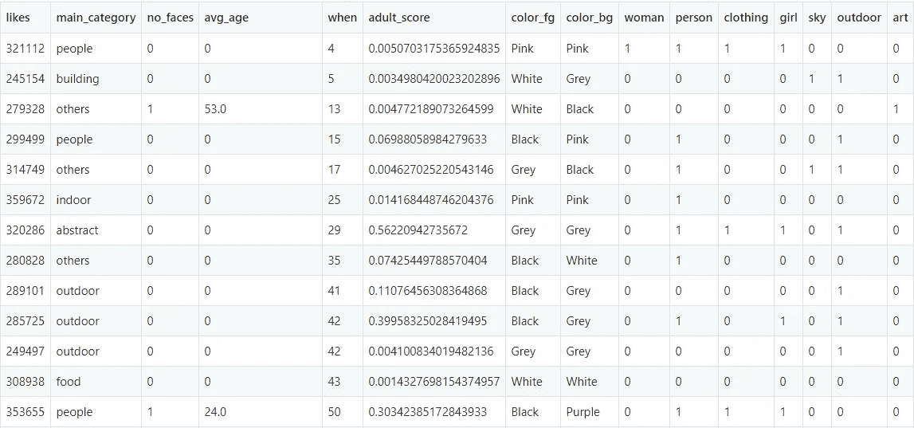

现在有了数据，就可以开始模特训练了！而即使是这看似最难的一步，不用编码也能实现！

# Azure 机器学习

我将向您展示如何使用微软的主要机器学习服务[**Azure Machine Learning**](https://azure.microsoft.com/services/machine-learning/?WT.mc_id=personal-blog-dmitryso)在不编码的情况下训练模型。这项服务既面向需要处理海量数据和计算工作量的专业数据科学家，也面向刚刚迈出机器学习第一步的初学者。对于初学者来说有两个特别有用的技术: [AutoML](https://docs.microsoft.com/azure/machine-learning/concept-designer/?WT.mc_id=personal-blog-dmitryso) 和 [Designer](https://docs.microsoft.com/azure/machine-learning/concept-automated-ml/?WT.mc_id=personal-blog-dmitryso) 。使用 AutoML 从头到尾不编码的过程在文档中有[的描述，但是我们在这里也要概述一下。](https://docs.microsoft.com/azure/machine-learning/tutorial-first-experiment-automated-ml/?WT.mc_id=personal-blog-dmitryso)

要开始使用 Azure ML，您需要创建一个**工作区**。你可以开始跟随[我的教程](http://aka.ms/azml_starter)，或者[官方文档](https://docs.microsoft.com/azure/machine-learning/how-to-manage-workspace/?WT.mc_id=personal-blog-dmitryso)。工作空间将与机器学习任务相关的所有东西组合在一起:数据、计算资源、实验结果和训练模型。

# 定义数据集

首先，我们需要创建一个**数据集**。由于我们将使用来自互联网的数据集，我们只需要指定 CSV 文件的 URL。

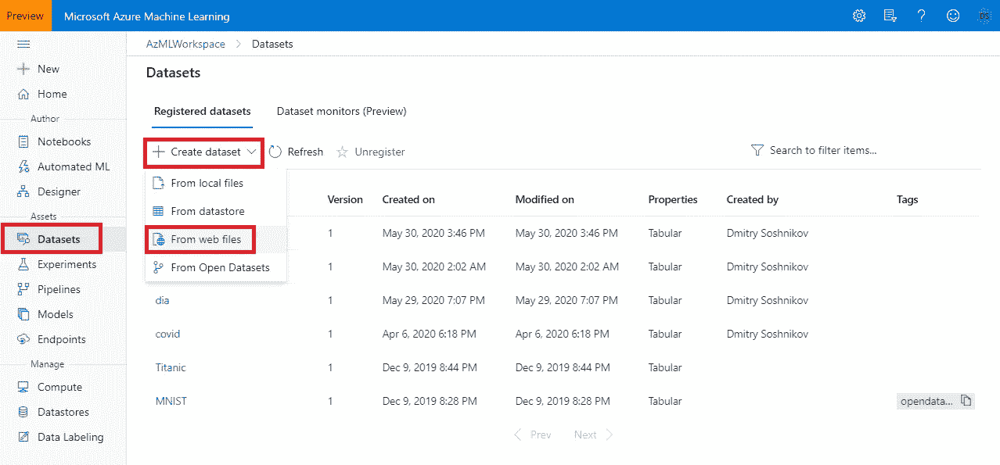

选择一个选项*从 Web 文件*创建数据集，指定**表格**数据集类型，并选择一个选项使用第一行作为标题。您应该会看到这样的数据预览屏幕:

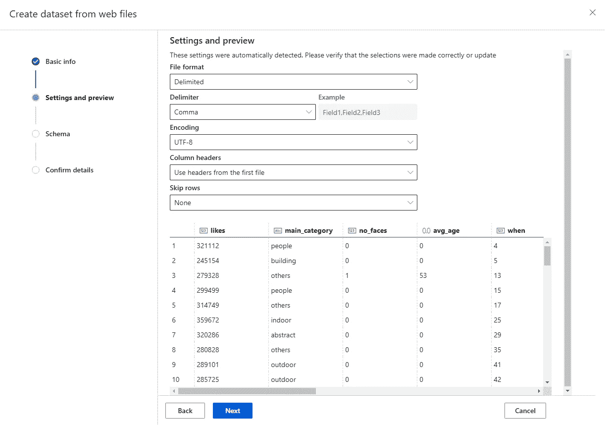

创建数据集后，可以在**数据集**部分找到它，您可以查看数据并以各种方式探索它们:

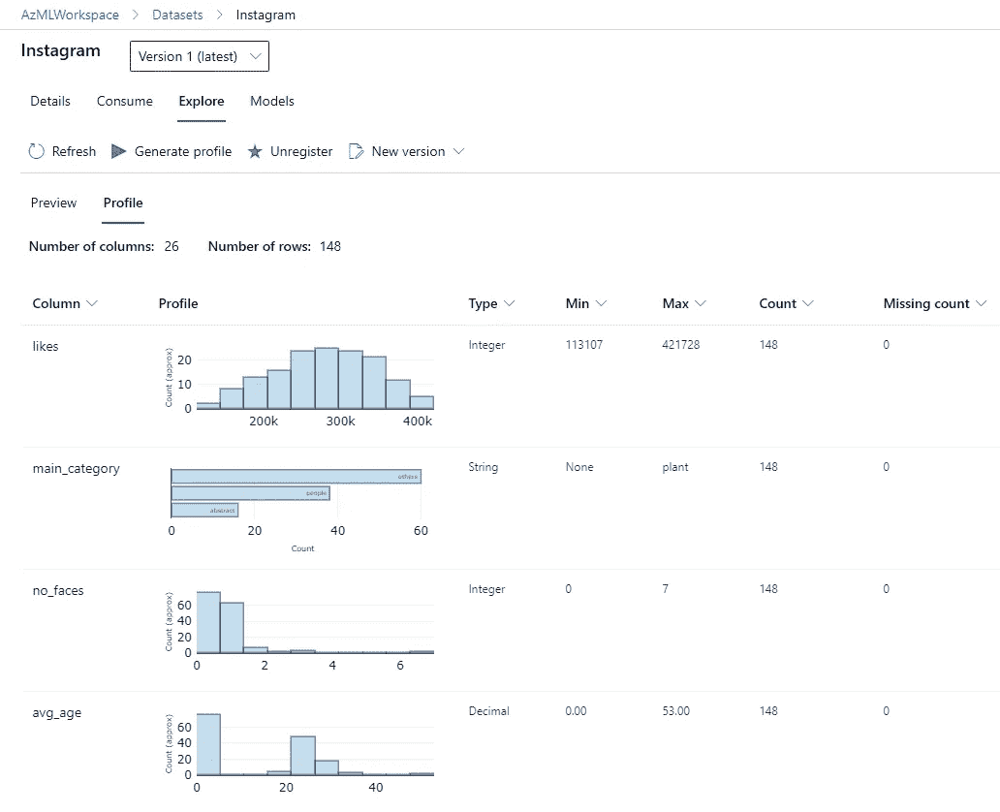

# 训练自动模型

有了数据集，你就可以在上面训练不同的机器学习模型。但是，如果您不是数据科学家，您可能不知道使用哪个模型。此外，可能会发生数据集中的某些列需要从训练中排除的情况，例如, **URL** 字段，它不包含对预测有用的信息，因为每个 URL 在数据集中只出现一次。

**自动 ML** 是一种尝试训练不同机器学习算法直到找到最佳算法的技术。它还执行一些巧妙的特性分析来排除无意义的列，并在需要时做一些额外的特征化。如果问题是可解的——它通常可以找到一个相当好的模型。当然，这是以花费更多的计算能力去尝试许多可能的模型为代价的，但计算能力绝对比好的机器学习专业人员更容易找到。

要使用自动 ML，您只需要几个简单的步骤:

*   点击 ML 门户中的**自动 ML** ，选择要使用的数据集。
*   选择了一个**实验名**和**目标列**。在我们的例子中，我们需要预测喜欢的数量，所以目标列应该是`likes`。

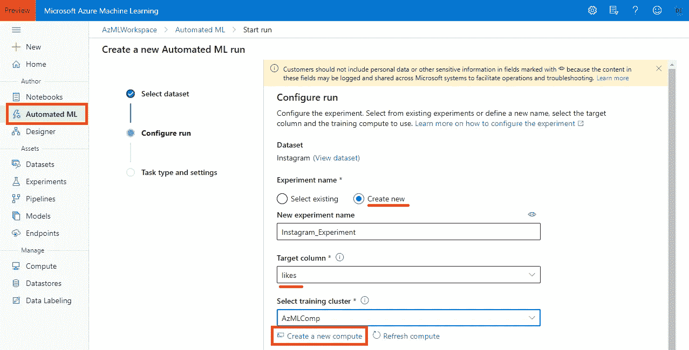

*   你需要一些计算机来训练这个模型。您需要**创建一个新的计算**，并指定一个集群。通常最好将最小节点数设置为 0，这样当您不执行任何训练时，集群会自动关闭。至于虚拟机类型，对于简单的任务，比如我们正在做的最便宜的选择，`Standard_D1`应该足够了。

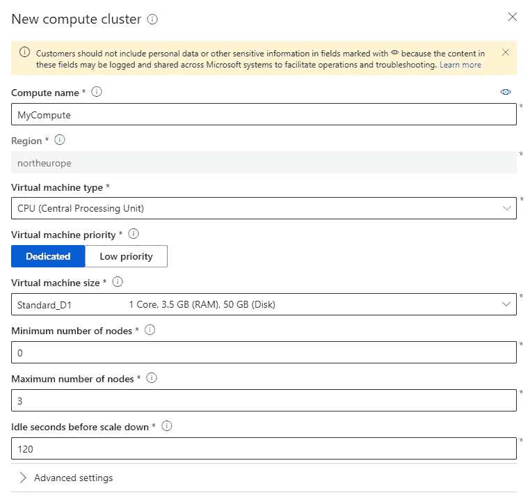

*   在下一页中，您选择一个任务类型:**分类**、**回归**(我们的案例)或**时间序列预测**。如果你知道你在做什么，你也可以改变一些**配置设置**或**特征设置**。
*   点击**完成**。

之后，实验就要开始了。训练不同的模型可能需要一段时间，这取决于您在集群中指定的最大节点值和虚拟机的类型。在我的例子中，对于 1 个节点的`D1`,花了大约 3 个小时才找到最佳模型。

您可以在门户网站的**实验**部分找到该实验:

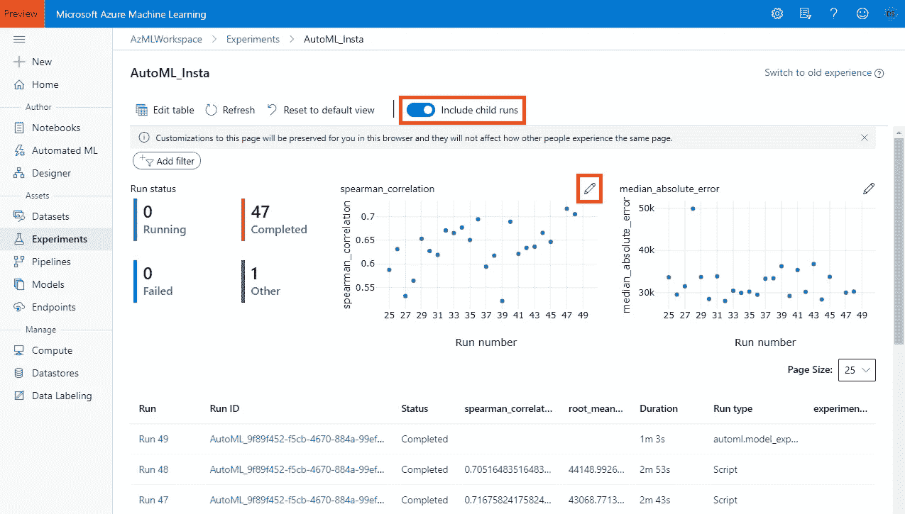

最初，实验将只包含一次运行，但是您需要点击 **Include child runs** 来显示训练不同 ML 模型的所有不同子实验。您可能还需要调整图表的参数，以便更好地了解所达到的精确度。

现在让我们取消选择 **Include child runs** ，并选择主实验。打开详细信息页面后，单击**模型**以查看 AutoML 尝试训练的所有算法的列表，以及它们相应达到的精度(在我们的示例中，因为我们正在训练回归模型，所以我们使用 [spearman 相关性](https://en.wikipedia.org/wiki/Spearman%27s_rank_correlation_coefficient)来反映模型的“质量”):

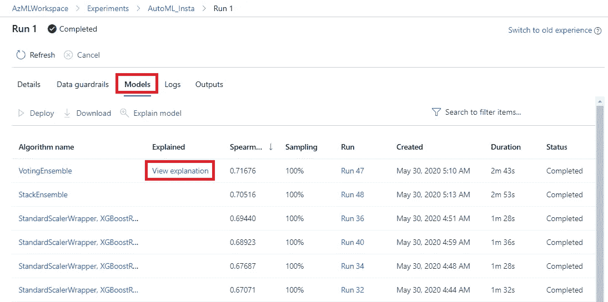

# 了解模型

经过训练的模型现在允许我们预测我们计划发布的任何照片的点赞数。然而，我们更想要的结果是一组关于获得更好的用户对照片反应的**建议**。换句话说，我们想了解哪些特性会影响结果，以及如何影响。

> **模型可解释性**通过观察不同的特性如何影响最终结果，我们可以更好地理解模型。

当使用 AutoML 训练一个模型时，默认情况下 Azure ML 也会在最佳模型上运行可解释性实验——这就是为什么你会在顶级模型旁边看到**视图解释**链接。点击它被带到模型解释屏幕，在那里你可以探索不同的功能发挥的效果。

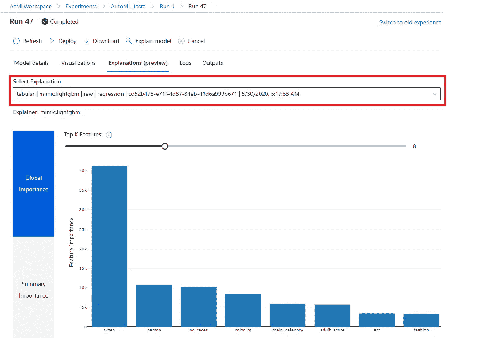

首先，您可以探索工程特性(默认情况下选择此视图)或原始特性的重要性。我们可以通过更改下拉菜单**切换到原始特征视图，选择解释**指向**原始**模型。

在下图中，您可以看到特性的重要性。最重要的特征是发布日期(**当**)，其次是**人**标签，然后是**面数**、**前景色**和**主类别**。这允许我们对我们的问题域做出一些结论:

*   获得更多喜欢最重要的因素是时间。这可能是因为随着时间的推移，越来越多的人喜欢旧帖子，因为随着时间的推移，越来越多的人发现了它们
*   肖像贴子(有一张大照片)越来越受欢迎
*   照片的整体色彩起着相当重要的作用
*   照片的类型也很重要，但没有我们想象的那么重要。我们需要进一步调查哪种类型的照片更受关注

因此，在创建了一个机器学习模型之后，由于可解释性，我们能够看到哪些因素促成了一张照片的流行。我们也可以直接使用该模型，给它一张照片作为输入(事先通过认知服务)，它将预测估计的喜欢数量，这样我们就可以测试潜在的候选人并进行比较。

# 如何开始学习

对于想开始学习数据科学但没有深厚编程功底的人，微软和 Udacity [刚刚宣布了针对微软 Azure](https://blog.udacity.com/2020/06/introducing-microsoft-and-udacitys-new-training-collaboration-and-the-machine-learning-scholarship-program-for-microsoft-azure.html) 的 [机器学习奖学金计划。您可以在**2020 年**7 月 30 日之前](https://www.udacity.com/scholarships/machine-learning-scholarship-microsoft-azure) [**申请**](https://admissions.udacity.com/apply/microsoft-azure-machine-learning) 。更多细节请见[微软博客](https://azure.microsoft.com/en-us/blog/announcing-azure-machine-learning-scholarships-and-courses-with-udacity/?WT.mc_id=personal-blog-dmitryso)和 [Udacity 博客](https://blog.udacity.com/2020/06/introducing-microsoft-and-udacitys-new-training-collaboration-and-the-machine-learning-scholarship-program-for-microsoft-azure.html)。

微软和 Udacity 今天宣布的计划将由两部分组成。前 10000 名申请者将被提供第一门基础课程**Azure 上的机器学习入门，并有低代码体验**。这个课程会持续 2 个月，它会教你如何做出像这样的数据驱动的结论，以及如何在几乎不用编码的情况下训练和使用机器学习模型。它将包括以下重要主题:

*   解决问题的数据科学过程
*   不同类型的数据(表格数据、文本等。)和准备数据
*   监督与非监督学习
*   特征工程
*   深度学习与机器学习(即何时应该、何时不应该使用神经网络)
*   分类、回归、聚类等最重要的算法。
*   [负责任的人工智能](https://www.microsoft.com/ai/responsible-ai/?WT.mc_id=personal-blog-dmitryso)和人工智能的公平性

最佳表现者(根据结果和社区参与程度选出)将获得奖学金，并报名参加微软 Azure 的**机器学习纳米学位项目。**

如果你以前没有认真尝试过数据科学，我绝对鼓励你报名参加这个课程，体验一下数据科学，并告诉你的非开发人员朋友这个课程。开始这一旅程从未如此简单！

*原载于 2020 年 6 月 17 日 https://soshnikov.com**[*。*](https://soshnikov.com/azure/how-to-learn-data-science-without-coding/)*