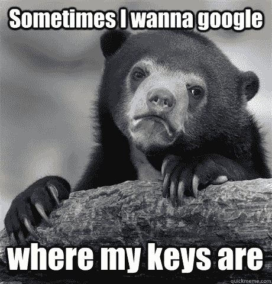

# 数据科学家如何更快地学习

> 原文：<https://towardsdatascience.com/how-to-learn-faster-for-data-scientist-cfd96d317ce6?source=collection_archive---------39----------------------->

## 学会学习的有效策略

哈雷戴维森在 [Unsplash](https://unsplash.com?utm_source=medium&utm_medium=referral) 上的照片

我的故事标题是“*你在试图成为数据科学家时受挫的原因*”，我收到了许多回复，询问我们如何成为更好的学习者的技巧。作为这些回答的结果，我开始深入思考“*更好的学习者”*意味着什么？

 [## 当你试图成为一名数据科学家时感到沮丧的原因

### 将最优秀的人与众不同的隐藏技能

towardsdatascience.com](/the-reason-youre-frustrated-when-trying-to-become-a-data-scientist-2d2b8b402811) 

关于这一点，我把更好的学习者定义为以更快的速度保留更多知识或技能的人。这个比率因人而异，但是学习的过程非常相似，你可以通过下面的链接了解更多。

 [## 学习数据科学的 3 个阶段

### 了解学习的 3 个阶段，以及我们如何将其有效地应用于数据科学学习

towardsdatascience.com](/3-stages-of-learning-data-science-9a04e96ba415) 

# 序幕

“能力越大，责任越大”这句耳熟能详的话并没有完全抓住我们内心产生极端力量的事实。然而，当我们把这句话反过来说，当我们承担起责任时，就能找到力量。对你所要求的负很大的责任？我们关注什么，事情的意义，我们的错误，我们的责任。我们现在的结果是我们过去决定的体现，为了确保我们在未来实现我们想要的结果，我们应该对现在负责。

> “责任越大，力量越大”——吉姆·奎克

# 解构缩写词

如果你想成为一个更好的学习者，要快速思考。

[C.Valdez](https://unsplash.com/@valdez?utm_source=medium&utm_medium=referral) 在 [Unsplash](https://unsplash.com?utm_source=medium&utm_medium=referral) 上拍摄的照片

## **F**——忘记

## A -活性

## s 州

## t 型教学

婴儿是超级学习者！我很幸运有一个 1 岁的侄女可以观察，所以没有必要做思想实验。我看到她从被到处带着，到爬行，到站立，到静态舞蹈，到走路，到动态舞蹈，到爬楼梯，到开门，现在说出三个词——“恶心”、“恶心”和“啊哦”。因此，我的许多例子可能与我对我侄女的观察有关。尽管如此，这不会阻止我们做一个简单形式的迁移学习来将这些例子应用到数据科学中。

## **忘记**

图片来源:【http://www.quickmeme.com/meme/3thj73 

为了成为更好的学习者，我们应该忘记三件事，对于我们社区中的已婚人士来说……不，你的妻子不在其中。排名不分先后:

#1 - **我们所知道的**

当我们年轻时，我们完全是海绵。地球是我们的科学实验室。让我们想象一下，如果我的侄女在她出生的那一刻就已经知道如何走路，那将是一场灾难。她的骨头会立刻让她失望，因为她根本没有这个能力。

然而，这就是我们所做的！当我们觉得我们已经知道了一些事情时，当我们回顾它时，更容易掩盖这些信息。为了成为更好学习者，我们必须忘记我们已经知道的东西。

如果我花时间去掌握线性回归和逻辑回归，我理解深层神经网络的内部工作方式会有多快？

> “你的头脑就像一个降落伞；它只有在打开时才有效”

#2 - **什么不急**

我敢说你可以在我侄女看 CBeebies 节目的时候和她说话。你会被贪婪地忽视。所以当翻滚先生在的时候，我不会在这里捣乱，坏主意。

我知道这个世界上很少有人相信他们可以一心多用，你知道吗，他们可能可以。不幸的是，我是这个部门中不那么幸运的大部分人中的一员。但是，如果你在这群人中注意，这不是我们的缺陷，这是我们的力量。当我们在想很多事情的时候，我们的大脑几乎无处不在，在不同的任务之间转移注意力。或者，当我们专注于一项任务而忘记所有其他任务时，我们就进入了一个极其微妙的地方，叫做当下。

如果你还记得前奏的话，我们在这个地方所做的事情将决定我们未来取得的成果。

> “当我们忘记不紧急的事情时，我们通过进入现在为自己提供了一个在未来取得更好结果的机会。”Kurtis Pykes)

#3 - **限制**

我侄女刚走两步就摔倒了，我一分钟都没想到她会认为走路不适合她，因为她站直了，又试了一次。

以下是我从初学者数据科学家那里听到的一些限制性观点——如果您听到了一些有趣的观点，请随意添加您自己的观点:

*   “我没有博士学位”
*   “我没有数据科学学位”
*   “编程是为聪明人准备的”

这些陈述可能是事实，但是这些原因并不是阻止你成为数据科学家的原因，而是你的信念。

> “如果你为自己的局限而战，你就能保留它们”——吉姆·奎克

## 活跃的

彼得·康伦在 [Unsplash](https://unsplash.com?utm_source=medium&utm_medium=referral) 上的照片

我不会称自己为学者。事实上，由于我的选择，我上大学晚了 4 年，尽管 12 个月里每周上两天课，我还是迫不及待地想让它结束——这是可以理解的，因为我当时正在学会计。

我不确定其他国家，然而，我完全反对我们在英国被教育的学习方式——或者可能只是我的学校，我不知道。对我来说，好的学习是安静地消耗信息的印象一直是荒谬的，也许对其他人有用，但对我来说，这是不正确的。

> “学习不是一项观赏性运动”——吉姆·奎克

我们人类是创造者，这是我们最深刻的知识所在。进一步说，当我们积极参与创造的过程时，我们绝对可以学到我们想要的任何东西。你问，怎样才能在学习中变得更积极？

*   做笔记
*   提问
*   履行

> 你越积极，你学得越多

## **状态**

[丁泽宇摄李](https://unsplash.com/@dingzeyuli?utm_source=medium&utm_medium=referral)在 [Unsplash](https://unsplash.com?utm_source=medium&utm_medium=referral)

个人经历以及约翰·霍普金斯医学院进行的广泛心理学研究证实，情绪高涨时发生的事情比不太激动的事情更令人难忘。该研究称，“情绪唤醒时释放的一种激素通过增加神经重新布线形成新的记忆回路的位置的化学敏感性，刺激神经细胞记住事件。”

在这里阅读更多关于这个[的内容](https://www.sciencedaily.com/releases/2007/10/071004121045.htm#:~:text=Scientists%20have%20now%20identified%20the,to%20form%20new%20memory%20circuits.) …

> 信息×情感=长期记忆

对许多人来说，这是一个“啊哈”的时刻。是的，你忘记了学校教你的一切，因为你在课堂上很可能处于一种无聊的状态。通过改变我们所处的状态，我们可以成为更好的学习者。

*怎样才能提高自己的状态？*

*   学习时，要像完全精力充沛时那样定位自己。
*   想一想你将从学习中获得的好处——比如更高的薪水，在 kaggle 上更有竞争力等等。
*   保持好奇、着迷和快乐。
*   有好的姿势
*   横膈膜呼吸

> "出售你的聪明，购买困惑."–贾拉鲁丁·鲁米，13 世纪苏菲神秘主义者

## 教

[国家癌症研究所](https://unsplash.com/@nci?utm_source=medium&utm_medium=referral)在 [Unsplash](https://unsplash.com?utm_source=medium&utm_medium=referral) 上拍摄的照片

> “如果你想把你的学习曲线缩短一半，那就带着把它教给别人的意图去学习。”—未知

教书确实能给你一些疯狂的刺激。我记得有人第一次就我的一篇文章找到我，问我一个关于他们正在做的项目的问题……我们不想误导人们，所以我们自然会给予更多额外的关注，我们会做更好的笔记，我们会做任何我们认为必要的事情来提供可靠的信息。此外，当你在教学中被某个现象绊倒时，这可以作为你需要更深入学习以获得更好理解的反馈。

> "当我教一样东西时，我会学两遍."—吉姆·奎克

我经常对人们说，他们应该把他们正在学习的东西写在博客上，或者想办法把他们正在做的事情公之于众，这样其他人也可以学习。额外的关心和反馈对你的成长至关重要，对我来说也是如此。

## 包裹

成为更好的学习者是一种技能，就像任何技能一样，它需要时间才能完全诞生。尽管如此，不断的刻意练习将提高你的学习能力，反过来增加你实现成为数据科学家目标的可能性。

> 注:这个故事是高度启发吉姆 Kwik 的教导。他有一个非常有用的播客叫做“Kwik Brain ”,我建议你看看这里的。

如果您认为我遗漏了什么，或者您想向我指出什么，或者如果您仍然不确定什么，您的反馈是有价值的。发个回应！

然而，如果你想和我联系，我在 LinkedIn 上是最活跃的，我也很乐意和你联系。

 [## Kurtis Pykes -人工智能博客-走向数据科学| LinkedIn

### 在世界上最大的职业社区 LinkedIn 上查看 Kurtis Pykes 的个人资料。Kurtis 有两个工作列在他们的…

www.linkedin.com](https://www.linkedin.com/in/kurtispykes/) 

我最近增加了我的 PyTrix 系列，在那里我展示了可以用 Python 做的对数据科学家有用的很酷的事情。我已经更新了我的时间表，现在每周都会做这个系列。你可以在下面的链接中看到前两个 PyTrix 故事:

 [## Python 中的矢量化

### PyTrix#1:加速我们的 Python 代码

towardsdatascience.com](/vectorization-in-python-46486819d3a)  [## 使用 Numpy 数组:索引

### 访问 Numpy 数组中的元素

towardsdatascience.com](/working-with-numpy-arrays-indexing-e4c08595ed57)