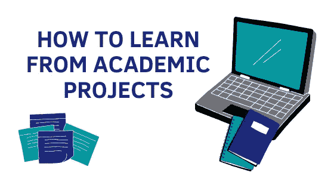

# 如何从学术项目中学习

> 原文：<https://towardsdatascience.com/how-to-learn-from-academic-projects-ca55f73e47c4?source=collection_archive---------40----------------------->

## 专业建议:不要在大学提交低质量的项目

***作者注:*** *这篇文章是关于你如何通过在大学从事优质项目来学习核心概念的。虽然很多讨论的观点是经验性的，但我认为它们对大多数 CSE 本科生都适用。*

演员表:作者

公司希望看到你所做的工作，而不是你在课程中所做的。这些是我所在学校的一位“分班老师”说的话。这是他微妙的方式让我们知道，为分数而做的项目对雇主来说并不重要。我不知道是否到处都是如此。

但是，我认识的人证实了上述说法。他们觉得招聘人员不太关心学术项目。事实上，他们想看看这些候选人还做了什么。等等，先不要把雇主描绘成恶棍。

大量的学术项目是由学生完成的，因为他们必须这样做。没有激情或欲望去学习这些努力。这导致工作缺乏质量。对任何人来说都是无聊、无趣且没有价值的工作。

如果我们，学生自己低估了我们的工作，为什么招聘人员不应该呢？此外，招聘人员对我们项目的看法肯定是次要的。最重要的任务是从这些项目中获取知识。

竞争不是在候选人的项目之间，而是在那些项目中的想法和实现之间。这是关于你学了多少和应用了多少。

> 大量的学术项目是由学生完成的，因为他们必须这样做。

基于项目的学习的基础提倡实践方法的重要性。这些课程旨在为学生提供一个通过暴露来学习的范例。然而，就像人类的传统一样，这种方法经常被我们误用。

# 什么是基于项目的学习(PBL)？

> PBL 将知行合一。学生学习核心课程的知识和要素，但也应用他们所知道的来解决真实的问题并产生重要的结果。PBL 的学生利用数字工具生产高质量的协作产品。PBL 重新将教育的重点放在学生身上，而不是课程——这一转变是全球要求的，它奖励无形资产，如动力、激情、创造力、同理心和弹性。这些不能脱离教科书来教，而必须通过经验来激活。 *—托马斯·马卡姆(* [*来源*](https://en.wikipedia.org/wiki/Project-based_learning) *)*

上述定义可以说是对 PBL 核心内容的最好概括。为了简洁起见，让我们把 PBL 压缩成一个基本短语— ***边做边学。***

参与项目可以让学生:

*   理解现实世界中的问题
*   将理论概念应用于实践
*   与同事讨论建议解决方案的功效
*   组织想法，并通过实施来实现它们
*   提高沟通技巧

不幸的是，今天课堂上的 PBL 通常不遵循这些原则。这不是方法上的错误。反而是学术项目一般理解上的短板。我们容易误解学术项目的全部目的。

# 等等，我真的误解了大学项目的目的吗？

**嗯，你正在读这篇文章，因为你确实在读。事实上，几乎每个人都这样。无论你是坐在教室的前排还是后排，都没有关系。这也和你的成绩无关。**

已经说过我们都误解了项目的含义，现在是时候用一些事实来支持我的论点了。所以，我希望你仔细阅读下面的问题，并在心里回答它们(是/否)。

1.  你是否曾经因为项目将被评估的部分而过度烦恼？
2.  你有没有在一个项目上拖延到截止日期前的最后一周？
3.  你曾经提交过别人的项目作为你自己的项目，而没有对原始项目进行重大升级吗？
4.  你曾经提交过一个包含代码的项目而没有检查代码效率，没有必要的文档或者没有考虑你的分析的可重复性吗？
5.  你曾经提交过一个项目，要求你写一份报告，从互联网上复制超过 30-40%的报告？
6.  你有没有因为确信没有人会检查代码，而从互联网上随机获取结果，并作为自己的结果传递出去？
7.  你有没有在完成报告后从网上随便找来一些引文，只是为了填满“参考文献”部分？
8.  你有没有因为相信“演示比内容更重要”而花更多的时间在演示上，而不是项目本身？

如果这 8 个问题中至少有 2 个你的答案是“是”， ***欢迎加入那些误解学术项目目的的人的俱乐部。*** *我已经和你一起 3 分了。*

# 学术项目的目的

我们所看到的期末成绩的 40-70 %,实际上远不止这些。项目帮助我们实现的不仅仅是分数。正是我们从这些项目中获得的大量知识帮助我们为未来的职业生涯奠定了基础。

*   学术项目为我们提供了一个将理论知识应用于实践的平台。
*   项目有助于更多地关注“问题”并找出“更有效”的方法来解决它。
*   项目促进创新思维。它们有助于用更非传统但有效的替代方案取代对现有解决方案的所有狭隘、传统的理解。
*   通过项目，我们学到了很多关于学术领域合作的知识。协作工作很重要，因为它允许对某一特定主题有不同的意见，并最终导致没有个人偏见的产出。
*   最重要的是，项目在很大程度上帮助个人寻找自力更生的能力。

项目的每个部分都有助于我们对以前不太了解的某个方面有更多的了解。

> 一个学术项目远不止占 40-70%的分数。

# 从项目中学习的常见障碍

在这一部分，我列出了一些我们在大学做学术项目时最常犯的错误。这个列表并不详尽，所以请在评论区添加更多内容！

## 选择一个非常普通的话题

选择一个每个人都在工作或写作的主题太容易了。它浪费了在独特或有价值的问题陈述上工作的大好机会。不太受欢迎的项目会让你的观众更感兴趣。因此，要想脱颖而出，你必须在不太常见的想法上下功夫。

## 选择一个雄心勃勃的主题

一个看起来像是下一个伟大发明的想法通常是你头脑中的一个诡计，除非你有一个合适的计划来实现它。本科生通常很难区分理性想法和独角兽。因此，使用现实的尺度来衡量项目选择是很重要的。

## 跟随炒作，而不是问题

我无意冒犯，但似乎几乎每个人都在解决一个问题，因为他们希望 ***使用*** 数据科学。数据科学是一个伟大的领域。但是如果我们被炒作所驱使，我们就会对问题视而不见。我们在技术或我们使用的工具上停留的时间越长，我们的解决方案就越有限。

## 从互联网上挑选代码

从互联网上复制代码并作为你自己的提交可能有它自己的一套伦理问题。但是，学生们经常绕过这些，因为我们大多数人认为，“这不是犯罪。所以，何必在意呢？”。这种想法的愚蠢超出了本文的范围。通过盲目地复制代码，我们通常得到的只是一个临时的修复和许多错过的增强技能的机会。

## 最后一分钟匆忙完成

在提交前一天开始任何学术项目都不是一种有效的学习方式。你可能会完成它并得到一个分数，但它从来都不是你最好的作品。你在学习代码上的分数几乎为零。

## 对文档皱眉头

记录学术项目是任何项目中最容易被忽视的方面。这就是为什么很难向他人很好地解释我们的项目，即使我们已经做了一些真正好的工作。记录所有采取的步骤，包括那些失败的步骤，总是很重要的。

## 不善于团队合作

没有完美的团队成员。只有团队成员互补不足，作为一个队列一起有效学习。不幸的是，这是最难理解的想法之一。我们成为糟糕的团队成员有几个原因:

*   我们觉得我们的队友不够了解，往往看不起他们。
*   当我们看到一个不工作的团队时，我们不能停下脚步。因为，归根结底，他们是你的朋友或同事。*你选择拥有比坏血*更坏的最终产品。
*   你觉得没人能跟上你，你工作得太快了。你工作负担过重，最后弄得一团糟。

当然，在这里指责游戏不是正确的做法。更聪明的选择是选择你的团队，让它让你工作并为你试图解决的问题服务。

# 主课——如何从项目中“学习”？

前一节强调了学习的障碍，而这一节讨论了解决方案。我花了 4 年时间在一个学科上进行本科学习，在这个学科中，你的知识深度是由你的项目质量来衡量的。

以下几点总结了这些似乎对我有用的技巧。希望这些对你的事业有所帮助。

## **不要太担心这些项目带来的分数或负担**

把分数看作是你所做事情的额外收获。将项目纳入课程的真正想法是为学生提供一个自学技能的机会，这些技能在一个学期的范围内是学不到的。

## **选择合适的团队**

如果选择你的队友是在你的控制之下，建立一个可以一起工作的团队。选择最亲密的熟人加入我们的团队是我们都会犯的错误。一个团队最好不要建立在*谁和谁*是朋友的基础上，而是建立在*谁能和谁*一起做出有效贡献的基础上。

## **关注问题**

当我们有了目标，我们会学到更多。在项目中，我们的目标是我们希望解决的问题。所以，一心一意专注于此是可以创造奇迹的。

## **提前计划**

不要等到最后一刻才开始你的项目。积极主动，当你被告知这件事的时候，就制定一个计划去做。虽然有几种方法可以成功地进行规划，但我不确定哪种方法适合你。所以，我会让你来决定！

## **为您的项目设置结构**

一个有组织的项目结构将有助于理解你所做的工作。这将证明对你和你的项目读者都有好处。如果你正在从事数据科学项目，一个可以帮助你的模板是 [Cookiecutter 数据科学](https://drivendata.github.io/cookiecutter-data-science/)。

## **维护实验室笔记本**

一个粗略的本子，在上面潦草地写下你所有的实验、结果、问题和与项目的互动，这将有助于你在准备最终报告时知道该写些什么。

## **在别人之前打破你的解决方案**

每个解决方案都有缺陷。每一个。所以，永远要知道你工作中的陷阱和你所做的假设。通过这种方式，你向你的评估者或雇主或评论家表明你*知道你的项目*。

## **保持开放的态度**

虚心接受反馈。每个论点都有多个方面。所以，把批评当作一种新的提高方式。

## **与同事一起回顾你的进步**

讨论你的工作，如果不是太机密的话。外部视角将有助于改进你的工作。

## **让谷歌成为你的搜索源，但不要过度依赖**

不要依赖互联网来获取最简单的代码片段。互联网一定不是让你增值的东西，你应该是让你有价值的东西。

## **诚实地报告你的结果**

如果你的项目遇到了瓶颈或者失败了，不要隐瞒。报告你的问题并诊断你所面临的问题。如果人们知道你失败的地方，他们就有更好的机会帮助你。

## **抄袭代码并不完全错误**

只要你给别人的代码添加了属性，那么他们的代码并没有错。总是鼓励使用别人写的东西来构建和改进你的项目。然而，如果你打算拿起整个程序，然后把它们当成你自己的，那就太愚蠢了。

## **不要小看其他项目**

没有“更好”的项目。每个项目都是独立的。它可能是你用 iris 数据集进行的简单数据分析，也可能是一个全新的深度学习框架，但两者都需要同等的尊重。不是每个人都有相同的资源和能力，所以*尊重*他人的工作。

# 结论

在当代世界，学历是衡量人们很多方面的最重要的标准。然而，具有讽刺意味的是，作为获得这些学位旅程一部分的学术项目被严重低估了。

嗯，我们中的一些人可能在某些项目上非常努力，但老实说，没有人会在意，除非我们的努力转化为他们的价值。因此，唯一阻碍我们学习和创造惊人项目的是我们自己的想法。我们需要改进这一点。

一个计划周密、结构良好的项目可以帮助你学习新概念，这比在上面做一门课程要容易得多。此外，一个写得好的项目向你的读者展示你的关心。在一个越来越自私的世界里，能够关心他人的舒适肯定会让你超越很多竞争对手。