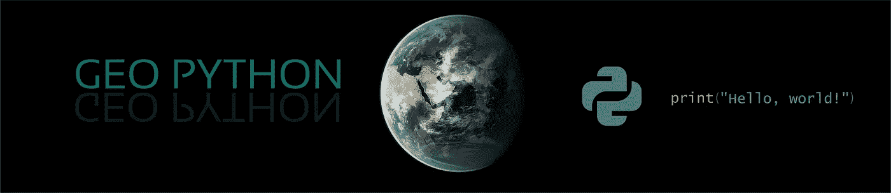
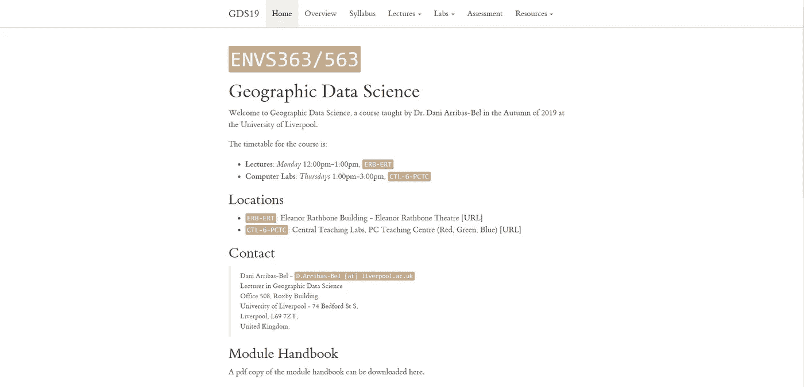
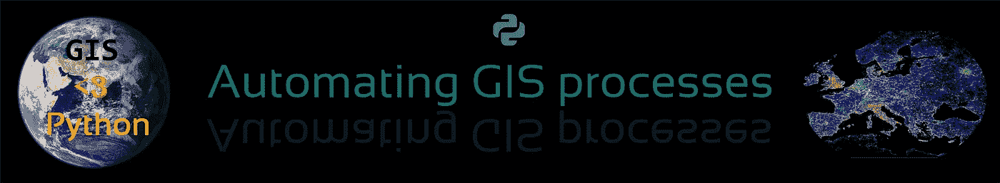
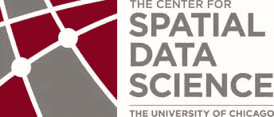
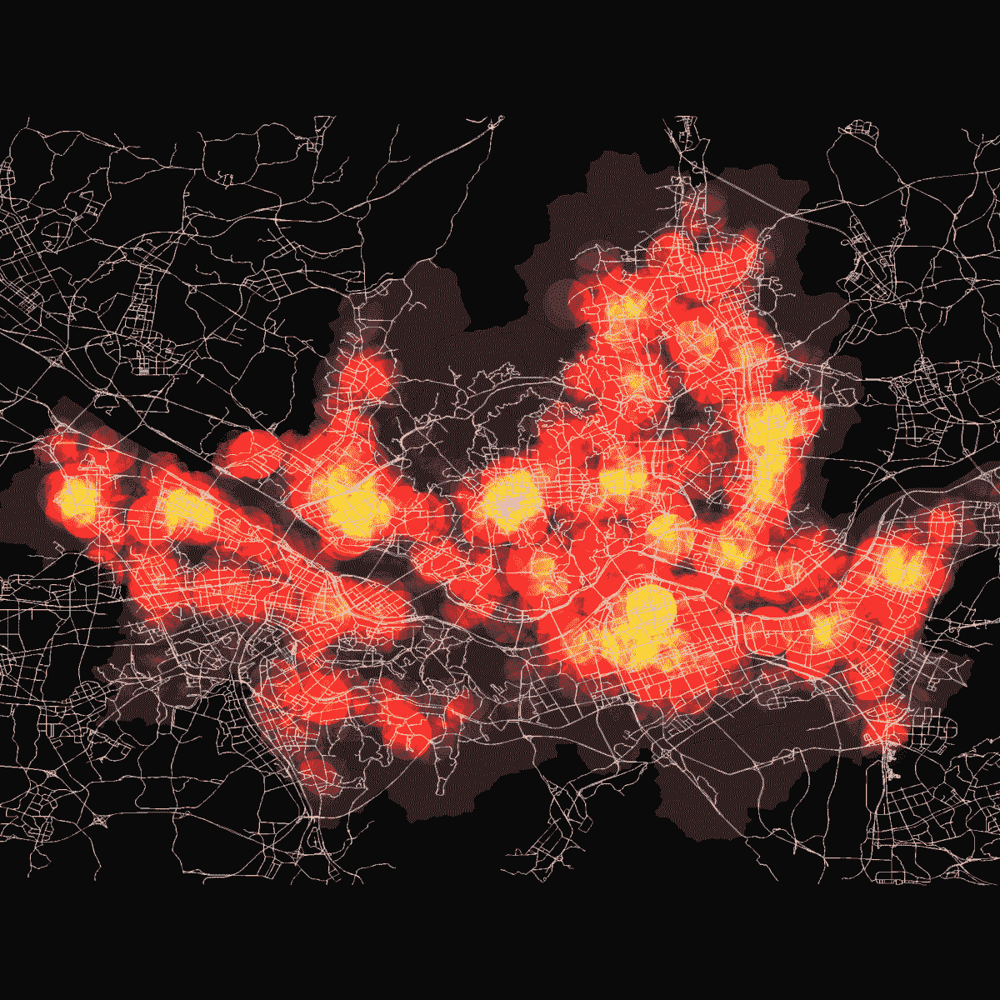

# 2020 年如何免费学习地理空间数据科学

> 原文：<https://towardsdatascience.com/how-to-learn-geospatial-data-science-for-free-in-2020-f486d91adfc7?source=collection_archive---------11----------------------->

## 免费的在线课程，学习最先进的地理空间数据科学。

在 [Unsplash](https://unsplash.com?utm_source=medium&utm_medium=referral) 上由[aslylmaz](https://unsplash.com/@aslylmz?utm_source=medium&utm_medium=referral)拍摄的照片

地理空间数据科学是一个蓬勃发展的领域。然而，学习地理空间数据科学对于新手和中级用户来说都是一项艰巨的任务。与主流数据科学资源相比，该专业领域的学习资源和途径更少为人所知，也更少被共享。我知道在 Courser、EDX 等主要 MOOC 提供商那里寻找地理空间数据科学资源是多么痛苦和令人失望…

> 地理数据科学是专门研究数据科学的空间组成部分的学科。它带来了数据科学领域中特定于地理数据的理论、概念和应用。

在本文中，我分享了最新的免费课程，可以帮助您实现地理空间数据科学领域的学习目标。你会发现一个宝贵的资源宝石启动你的职业生涯在地理空间数据科学。

这个列表中包含的资源主要在 Python 生态系统中。在这个列表中，我们还包括初级和高级资源。

## 1.Geo Python(赫尔辛基大学-2019 年最新版本)

[Geopython 球场横幅](https://geo-python.github.io/site/)

这门[课程](https://geo-python.github.io/site/)是您开始地理空间数据 Python 编程之旅的好地方。您将学习 python 编程基础，重点关注地理空间应用。本课程涵盖 Python 中的基本数据类型、数据处理和可视化。包括讲座视频、Jupyter 笔记本、GitHub 练习在内的所有资料都是开源的，可以免费获取。

我最喜欢这门课程的一点是，它不仅对初学者来说是用户友好的，而且还教会你数据科学世界中使用的最先进的技术和工具，包括 Jupyter 笔记本电脑。如果您是 Python 或地理空间世界的新手，我强烈建议从这里开始。

材料可在[课程主页](https://geo-python.github.io/site/)获得

## **2。地理数据科学(**利物浦大学—2019 年最新发布)

[地理数据科学课程页面](http://darribas.org/gds19/index.html)

地理数据科学`(ENVS363/563)`是一门结构良好的课程，在地理空间数据科学领域有很多实际应用。这门课程有两个主要部分:讲课和实验。本课程涵盖的主要主题包括数据科学基础和地理空间数据的机器学习应用。

虽然没有视频讲座，但讲座的幻灯片是免费提供的。附带 Jupyter 笔记本的实验室也是开源的，并提供了许多关于地理空间数据科学不同方面的详细工作。

[课程首页](http://darribas.org/gds19/)。

## 3.GIS 流程自动化(赫尔辛基大学-2019 年最新版本)

[自动化 GIS 流程横幅](https://automating-gis-processes.github.io/site/)

本课程是列表中第一门课程的后续课程， [Geo python](https://geo-python.github.io/site/) 及其所有资源均可在线免费获取。自动化 GIS 流程提供了关于如何使用 Python 编程语言执行一些常见 GIS 任务的教程。它还提供托管 Jupyter 笔记本(Binder)，您可以在浏览器中进行交互，而无需设置编程环境。这是一门中级课程，需要掌握 Python 语言知识。

课程资料:[课程主页](https://automating-gis-processes.github.io/site/)。

## 4.空间数据科学(芝加哥大学-2017 年)

空间数据科学中心

这是一门高级课程，详细解释了许多空间统计概念的理论基础。本课程涵盖的主题包括探索性空间数据分析(ESDA)、空间回归和地理空间数据的无监督聚类。

本课程的实验室使用 Geoda 软件，但是在 [Pysal](https://pysal.readthedocs.io/en/latest/) — Python 空间分析库—功能的帮助下，用 Python 实现大多数实验练习是可行的，并且是一个很好的实践项目，可以增强您的理解。

讲座视频: [Youtube](https://www.youtube.com/playlist?list=PLzREt6r1Nenlu-MBaxCRL2KZNk62n7o1g)

## 5.空间数据科学和应用(Coursera)

空间数据科学旗帜。

此列表中的最后一门课程通过空间大数据世界中的各种示例和应用，突出了地理空间数据科学的高级应用。虽然本课程没有任何编程任务，但它很好地介绍了空间数据科学的实际应用，包括所使用的工具和开源解决方案中的分步过程。

课程链接: [Coursera](https://www.coursera.org/learn/spatial-data-science) 。

# 结论

该列表重点介绍了最佳和最新的地理空间数据科学课程。在另一篇文章中，我将分享关于地理空间数据科学的最新书籍。让我知道，如果你有任何其他额外的课程在这个领域，我没有包括在这个列表中。