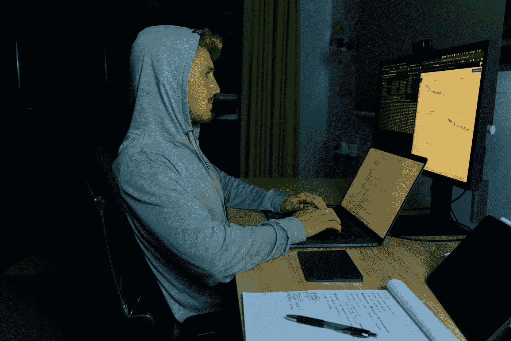

# 如何在学习机器学习的同时提高健康水平

> 原文：<https://towardsdatascience.com/how-to-learn-machine-learning-and-improve-your-health-at-the-same-time-8593b33257fd?source=collection_archive---------29----------------------->

## 这里有一个新规则:如果你的模型在移动，你也在移动。

一个穿着灰色连帽衫的胡子拉碴的男人坐在电脑前，看着亏损曲线下降。照片来自:[当我的机器学习模型](https://youtu.be/94UCgt89G04)在 YouTube 上训练时，进行全身锻炼。

现在是时候问自己两个问题了。

1.  什么不会改变？
2.  会有什么变化？

# 一段时间后一切都变了

那是最好的故事开始的地方。或者至少它们包含了一个弧线，这个弧线带着一个角色经历了一系列的事件，之后一切都不一样了。

我们假设这个角色是你(还有我，因为我也在想这些事情)。

当一切恢复正常时，你会觉得有什么不同？

首先，我们必须明白，正常并没有一个统一的定义。你有你的故事，我有我的。你知道吗？

成为故事主角的美妙之处在于你可以创造它。你可以写下什么改变了，什么没有改变。

也许你已经意识到你所做的活动有一半是不必要的。或者你拥有的一半垃圾不能给你带来快乐。

# 学习机器学习(或任何东西)的公式

上个月底我发表了一个视频叫 [*不要学机器学习*](https://youtu.be/cyLWtMSry58) 。潜在消息的点击标题。

切忌当驴。

一个人如何避免成为驴子？

当问题出现时，通过识别并采取相应的行动。

驴子问题来自一个故事，一只驴子被困在一桶水和一堆食物之间。它不能决定它是饿还是渴，所以它看了一眼水，然后看了看食物，然后又看了看水，食物，水，食物，水。

最终，由于无法做出任何决定，驴子饿死了。

也许你以前遇到过这个问题。卡在两件(或更多)事情之间，全神贯注于考虑每一件事情，结果什么都没发生。

现在。

有很多方法来看待这个问题。或许，拖延决定会有所帮助。

你等待的时间越长，你就变得越聪明，你就能做出更好的决定。

或者拖延本身是一个信号，没有可行的选择，你应该选择没有。你知道俗话说，如果你不能决定，答案是否定的。

让我们把这个和学习机器学习联系起来。

我被问到的最一致的问题是，“我如何学习机器学习？”。

通常它会伴随着。

> *“我没有数学经验，还能学吗？”*
> 
> *“我没有统计学或者神经科学的背景，怎么办？”*

对此，我的第一反应是“如果每个人在开始做某件事之前都需要背景知识，那么没有人会开始做任何事。”

我不会这样说，当然，我的回答更有礼貌，但在这篇文章中我可以更直接。

这里的驴问题很明显。有人有兴趣学习一个新的话题，但是考虑到摆在他们面前的无限的途径，他就退缩了。

修复？

如果你面前的现有路径都不起作用，你必须自己创造一条。

这里有一个万无一失的方法。

1.  使用在线课程和材料(你足够聪明，可以找到这些)来建立知识基础。追求技能，而不是证书。
2.  通过创建自己的项目，将你的知识基础转化为具体的知识(无法教授的知识)。

问题。

## 哪些资源最好？

很多都是入门绰绰有余。看评论。尝试一个，看看它是否能激发你的好奇心，让你继续下去。

## 如果外面有更好的东西呢？

驴的问题。避免。你会通过尝试一些事情来弄明白这一点，看看它是否适合你，如果不适合就继续前进。记住，你做的比你想的更聪明。

## 我学过一些入门课程，我应该做什么项目？

你自己的。

## **如何？**

设计一些可能行不通的东西。

制作一个玩具来打动你的顾客、你的粉丝和你自己。不要担心做出什么东西来给竞争对手或你的同行留下深刻印象。

## **我的努力白费了怎么办？**

99%的努力都浪费了。但是如果你从来没有奉献过，你就永远没有机会去成就那 1%不属于你的人。

注意我们所经历的是如何应用于学习几乎任何东西的。

最重要的一点是，在任何给定的时刻(不可能预测)，你不是关注什么是正确的，而是关注趋势。

你正在培养学习的习惯(以课程为基础)和创造的习惯(建立自己的项目)。

过一会儿，你会发现一个暗示另一个。很快，你的创造会推动你的学习，而你的学习也会推动你的创造。

你用来学习的工具和资源会随着时间而改变，但是如何培养学习的习惯，培养实验的习惯不会改变。

# 在学习机器学习的同时改善健康

我承诺这里会包括健康。

健康不会改变。

失去健康，你还有什么？

如果你在学习机器学习，我要给你一个新的规则。

每次你的模型在动，你的身体也在动。

想象一下，你正在训练一个神经网络，或者对一个随机森林进行网格搜索。模特搬家。身体在动。

也许你去散步，做些俯卧撑，或者伸展一下久坐后紧绷的臀部。之后，你回来检查结果。好消息是，尽管你的损失功能一点也没有减少(你忘了加上`optimizer.step()`)，你的身体感觉很好。

为什么？

缺乏运动导致身体堵塞。当你的身体堵塞时，你的思想也堵塞了。你不想那样。

同样，这可以追溯到学习一个新的话题。

对于任何给定的主题(尤其是机器学习)，入门的资源都可能是巨大的。因此很有可能出现驴的问题。

和健康一样，有很多关于饮食、运动的教条，但是没有一个像趋势一样重要。

让我说清楚。

运动的习惯比运动的种类更重要。

学习的习惯和使用你所学的知识去创造比你用来学习的资源更多。

如果你想改善你的健康，你的知识，你分解问题和建立解决方案的能力，最好的方法是以小行动的形式，日积月累。

# 创建自己的反馈回路

好吧。

你可能会想，“丹尼尔，我被一头驴的问题卡住了，我能做什么？”。

除了我们已经讨论过的，这里有一些你可以采取的步骤。

## 对事物进行分级

你的健康，你的学习，你的创意，你的人际关系，其他对你很重要的事情。从 1 到 5，它们是如何叠加的？应该首先解决最低的问题。读完这篇文章后，把它们写下来。

## **30 天**

获得评定后，设计 1-3 个步骤，在接下来的 30 天内，你可以采取这些步骤来评定最低的等级。这里少即是多。从尽可能小的行动开始。可能是每天花 10 分钟散步或阅读。或者去掉你收藏的 15 个标签，坚持选择最能激发你好奇心的那一个。

## **后续**

任何互动中被忽略的一点是跟进。不要小看它。在 30 天结束时，重做评级并问自己:

*   我移除了什么？(记住，如果你正在读这篇文章，你的生活可能会通过减法而不是加法得到改善)。
*   我学到了什么？
*   我创造了什么？
*   我是怎么移动的？
*   什么保持不变？
*   未来 30 天有什么变化？

这个活动不需要超过一个小时。但是你正在做的是创造你自己的反馈回路。完全自我驱动。

因为。

如你所知，没有人比你更关心你。无论是学习新的东西还是照顾你的健康，都取决于你。

# 需要灵感？

我拍了一个我遵循新规则的视频:模特动，身体动。过来跟着走。

这篇文章最初是作为 2020 年 4 月期的[吃、动、学、做](https://dbourke.link/newsletter)播出的，这是我大约每月发送一次的时事通讯，面向饥饿、活跃、好奇的创作者。你可能是其中之一。更多类似这样的作品，一定要[报名](https://dbourke.link/newsletter)。