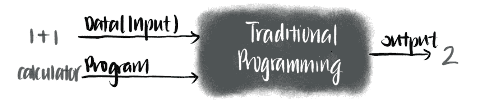
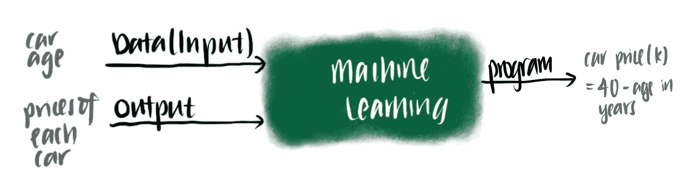
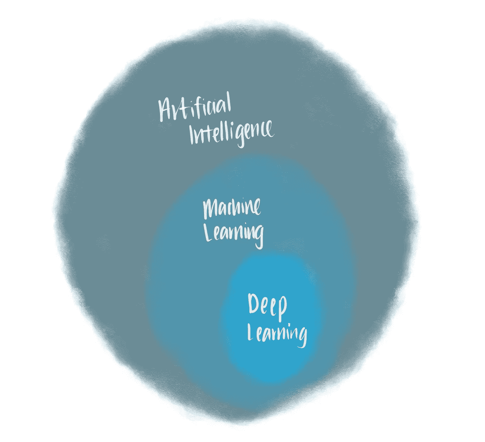
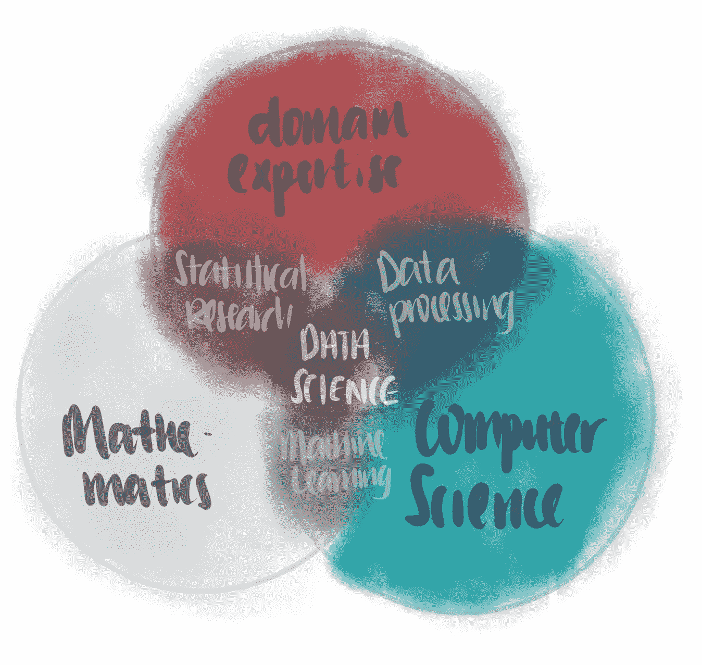
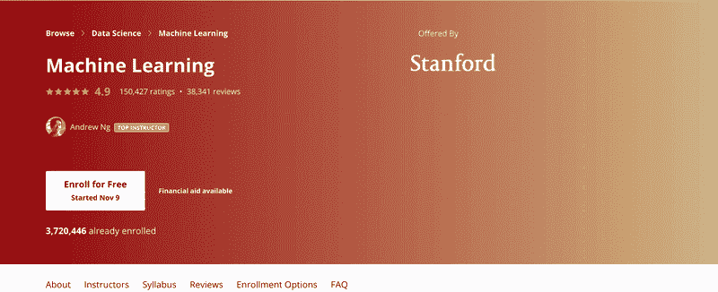
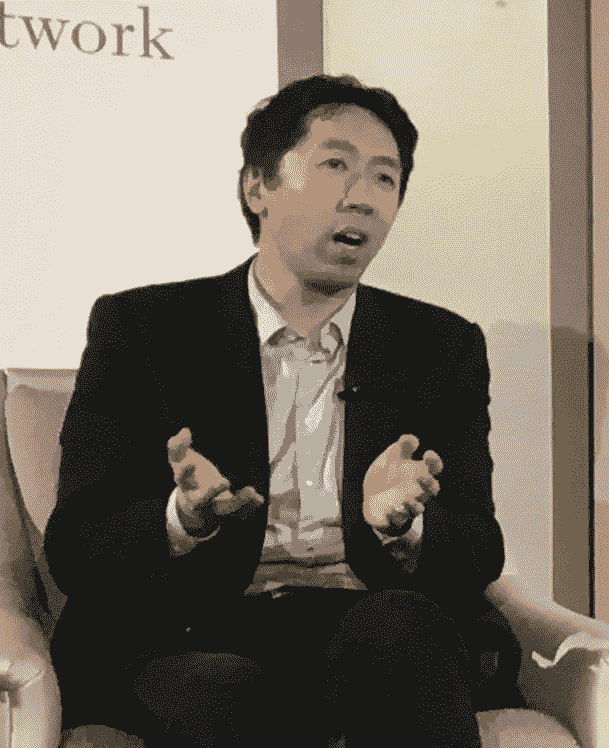
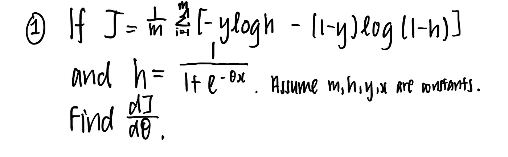
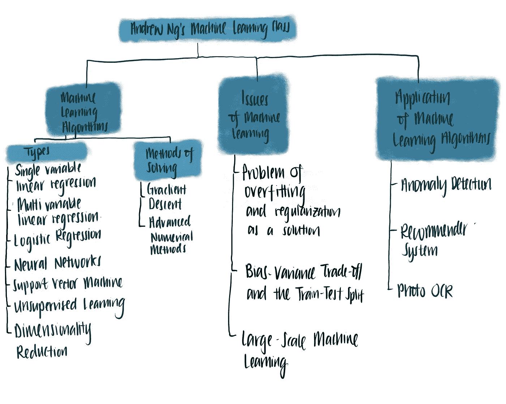
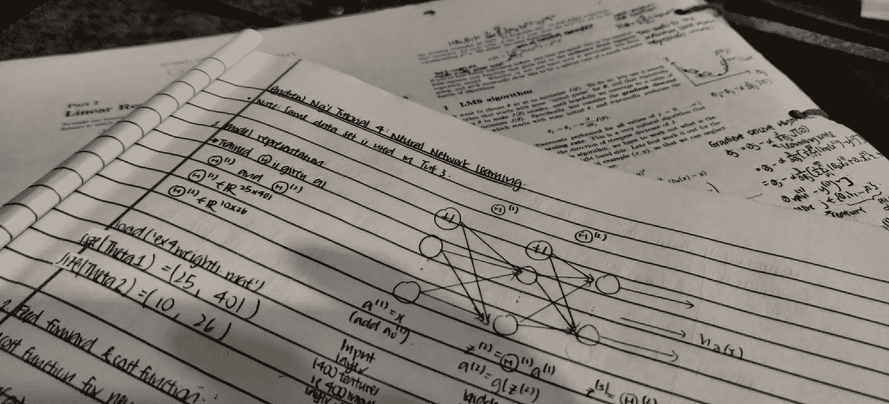

# 2020 年如何学习机器学习和数据科学

> 原文：<https://towardsdatascience.com/how-to-learn-machine-learning-data-science-in-2020-5233e766e0af?source=collection_archive---------18----------------------->

## 从线性回归到神经网络开始的最佳课程

想学习机器学习或数据科学但不确定从哪里开始？我当时就在那里——我还记得那些漫漫长夜，我在互联网的信息海洋中搜索，寻找最能利用我时间的课程。经过一番艰苦的挖掘，我发现了一些关于学习机器学习的优秀资源，我用这些资源进行了面试，并在数据领域获得了一个角色。在这篇文章中，我将分享我最喜欢的机器学习课程，这样你就可以直接投入到学习机器学习中，而不用像我一样花上几个晚上研究相同的主题。

马库斯·温克勒在 [Unsplash](https://unsplash.com?utm_source=medium&utm_medium=referral) 上的照片

今天，机器学习经常被吹捧为解决许多世界问题的银弹——它给了我们有效的网络搜索、无人驾驶汽车、实时语音识别，甚至极大地揭开了人类基因组的神秘面纱。它在我们日常生活中的普遍存在反映了它在大规模改善人类生活方面的效用和潜力，这也是机器学习的吸引力所在。

对于对学习它不感兴趣的局外人来说，它只不过是一个笼罩在神秘阴云中的时髦词。对于希望从事机器学习的新人来说，机器学习可能看起来像一个深奥的概念，具有很高的进入门槛。然而，机器学习不必神秘或难以理解。带着开始追求机器学习知识的真诚愿望和一点耐心，你现在正处于开始解决它的最佳位置。

# 但是什么是机器学习呢*？*

我喜欢把机器学习看作是教会机器自己学习的科学。更严格地说，机器学习之父亚瑟·塞缪尔在 1959 年将其优雅地定义为

> 这个研究领域赋予计算机无需明确编程就能学习的能力[1]

这与我们定义的传统编程截然不同。在传统编程中，我们给计算机一段程序和一个输入。反过来，我们期望一个输出。例如，如果我们给一个计算器程序提供 1+1 的输入，我们都知道输出是什么。

作者插图

然而，通过机器学习，我们给计算机一些输入和输出。随着时间的推移，机器会更好地学习输入和输出之间的关系。当我们给出一个新的输入时，它能告诉我们预测的输出。

例如，埃隆计划买一辆二手特斯拉。他在 Craigslist 上研究特斯拉汽车的价格，发现一辆接近新车的特斯拉起价约为 4 万美元。他还意识到，随着车龄的增长，特斯拉的价格会下降约 1000 美元。然后，他预测 5 年车龄的汽车——你已经猜到了——是 35，000 美元。

作者插图

换句话说，埃隆只是发明了回归——机器学习中的一个重要概念！在机器学习中，程序识别输入和输出之间的模式，并预测输出。

这辆特斯拉的价格是多少？尼克·科尔曼在 [Unsplash](https://unsplash.com?utm_source=medium&utm_medium=referral) 上拍摄的照片

# 人工智能和深度学习呢？

这些是与机器学习密切相关的术语。他们彼此之间到底是什么关系？这在图表中得到最好的体现—

人工智能、机器学习和深度学习的关系。作者插图

正如你从这张维恩图中看到的，深度学习是机器学习的一个子集，其中的算法模拟了我们大脑传输信息的方式——从神经元到神经元。深度学习通常被视为更复杂的机器学习形式。因此，学习者应该在深入学习之前掌握机器学习的基础知识。

另一方面，机器学习是人工智能(AI)的子集。通俗地说，AI 被定义为机器以各种形式展示的认知智能的模仿，包括但不限于推理、规划和学习。[2]

# 这些与数据科学有什么关系？

数据科学是一个跨学科的领域，它使用从数学、计算机科学和领域知识中提取的技术和理论。[3]为了说明什么是数据科学，我喜欢使用下面的维恩图。

机器学习与数据科学的关系。作者插图

如您所见，数据科学是不同领域知识的结合，包括数学、计算机科学和领域专业知识。机器学习是数学与计算机科学相遇的地方——计算能力与应用于大型数据集的优雅数学方程的融合。因此，机器学习是数据科学的重要组成部分。

# 好吧，我现在明白了。我如何学习它？

有太多的机器学习课程来学习机器学习。这涵盖了从机器学习入门到研究生水平的课程，从物理课程到在线课程的所有领域。

在数据科学领域的新手中很受欢迎的一些介绍性机器学习课程包括:

*   Udacity 的机器学习入门课
*   Datacamp 的/ [Dataquest](https://www.dataquest.io/course/machine-learning-fundamentals/) 使用 Python 的机器学习基础
*   哥伦比亚大学在 EdX 上的机器学习
*   Udemy 上的机器学习 A-Z
*   哈佛大学的免费机器学习课程
*   …

名单还在继续！

> 就我个人而言，我尝试了列表中的一些机器学习课程，但对其中一些课程提供的深度和严谨性不太满意。

如果你正在寻找一门严格的机器学习课程，将有助于你成为一名数据科学家，你来对地方了。今天，我将分享我个人最喜欢的机器学习入门课程，我从中受益匪浅——这就是 Coursera 上吴恩达(斯坦福大学)的机器学习。我也将分享我的建议，关于什么是需要的知识，在课堂上期待什么，以及如何在课堂上发挥你的最佳水平。

# 吴恩达在 Coursera 上的机器学习

机器学习中的[课程](https://www.coursera.org/learn/machine-learning?)一直被吹捧为初学者最好的机器学习课程。该课程在 370 万名注册者的 15 万个评分中得到 4.9 分，这暗示了它的可信度。

你可以免费听课(审计版)。作为学习者，你可以随时免费注册。然而，如果你是免费注册的，你将没有资格获得证明你已经完成课程的证书。您将无法提交和接收大多数编程练习和测验的反馈。

你可以在 Coursera 上注册 7 天的免费试用，也可以在 7 天结束前的任何时候返回课程。

证书费用为 49 美元。就我个人而言，我发现证书是一个很好的方式来证明我有必要的动力来完成这个课程。有需要的学习者也可以获得经济资助，所以请随时联系 Coursera。这里是如何—

作者插图

这门课的讲师吴恩达几乎不需要介绍。他是斯坦福大学的兼职教授，Coursera 和 Google Brain 的联合创始人，百度的前副总裁，不用说，他是机器学习领域极具影响力的人物。

吴恩达。史蒂夫·杰维特森通过[维基共享资源](https://creativecommons.org/licenses/by/2.0)拍摄的图片

# 为什么我很高兴上了这门课

一年多前，我想从事数据科学，但不知道从哪里开始，我疯狂地在谷歌上搜索'*如何学习数据科学'*。我很快被铺天盖地的资源和庞大的学习内容——数学、概率、统计、机器学习——淹没了，争先恐后地选择了似乎最受欢迎的课程，那就是[吴恩达的机器学习。](https://www.coursera.org/learn/machine-learning?)

我现在可以说，我很高兴我上了这门课。

我仍然记得已经完成了这门机器学习课程，并想去数据科学实习碰碰运气——至少可以说，我绝对吓坏了，但我参加了这门课的事实让我平静了一些。那些最早的数据科学面试告诉我，大多数机器学习从业者都熟悉，或者至少认识这门课程。当我参加这些面试时，当我提到我完成了课程时，招聘经理点头表示同意，这让我很受鼓舞。

照片由[蒂姆·高](https://unsplash.com/@punttim?utm_source=medium&utm_medium=referral)在 [Unsplash](https://unsplash.com?utm_source=medium&utm_medium=referral) 上拍摄

我完成了这门课，这为招聘经理提出后续问题提供了一个跳板，比如*“你从这门课中学到了什么”、“这门课最具挑战性的部分是什么”*和*“你如何在我们公司应用这门课的内容？”*

> 事后看来，完成课程的行为可能被视为学习动机的标志和机器学习基础知识的展示——这两者都是招聘经理在数据科学职位上寻求的基本素质。

诚然，当我的简历只有这门课程时，我并没有获得数据科学实习。然而，它给了我信心，让我可以开始说该领域专家的语言。有了它，我能够与数据科学专家交流并向他们学习。

# 这门课是给谁上的

**这门课是为希望在数据分析、数据科学、机器学习或人工智能领域从事技术工作的严肃学生开设的。**它也面向没有机器学习背景的初学者或寻求机器学习概念复习的人。虽然没有明确提到，但这门课的数学严谨性将强烈吸引那些渴望深入了解机器学习的学习者，同时让那些对机器学习的细节不感兴趣的学习者却步。

因此，时间承诺不是微不足道的。完成本课程总共需要大约 60 个小时。假设你每天能投入 2 个小时，这个课程需要一个月。根据你对数学和编程的熟练程度，时间可能会有所不同。

# 这门课*不是*给谁上的

记住这一点，这门课不是为寻求对机器学习及其如何解决问题的一般定性理解的*非技术学习者开设的，你可能更适合参加同样由吴恩达指导的 [AI for everyone](https://www.coursera.org/learn/ai-for-everyone) 。这门课的目标是希望理解人工智能领域和术语的非技术专业人士。这堂课也短得多，只需要 6 个小时的时间。*

还有，如果你没有学习数学和编程的想法，这门课可能不是最容易的课。你可能会发现很难保持你的动力和兴趣。

# 好吧，数学听起来很难。没有数学可以做机器学习吗？

数学对马丁·路德·金很重要。由[杰斯温·托马斯](https://unsplash.com/@jeswinthomas?utm_source=medium&utm_medium=referral)在 [Unsplash](https://unsplash.com?utm_source=medium&utm_medium=referral) 上拍摄的照片

不完全是。在不理解数学的情况下进行机器学习会带来严重的缺点。首先，你盲目实现机器学习的技能很容易被自动化的机器学习 AutoML 取代，就像那些由[谷歌云](https://cloud.google.com/automl)实现的。其次，数据科学家的价值在于，在考虑运行时和存储复杂性以及算法对数据集的适用性之后，仔细选择一种性能最佳的适当算法。

想象你是一辆汽车的主人。当然，当汽车行驶时，你能平稳地驾驶汽车。然而，如果有一天你需要从头开始制造一辆汽车，或者如果你需要对一辆有故障的汽车进行故障排除，你将需要了解保持汽车在道路上行驶的齿轮和车轮。如果你不了解汽车的内部运作，这些都是不可能的。现在，汽车是一种数据科学算法——如果你不知道它在内部是如何工作的，你就无法建立一种机器学习算法。

> 作为数据科学家、分析师和工程师，我们的角色不仅是使用机器学习模型，还要构建、维护和部署它。要做到这一点，你需要知道数学。

# 好吧，我确实想学，但是我没有扎实的数学或者编码背景…

别担心！Coursera 上的课程没有实际的先决条件——你完全可以在没有我下面提到的任何课程的情况下开始上课。然而，我建议你先修一些课程，这将增加你在这门课上成功的机会。

## ***推荐编码背景***

在参加了 [Datacamp](http://datacamp.pxf.io/6bo6yV) 和 [Dataquest](https://www.dataquest.io/course/python-for-data-science-fundamentals/) 的 python 和 R 课程后，我对 MATLAB 和 python 有了非常基本的了解，开始了这个课程。本课程很早就对 MATLAB 进行了简要而温和的介绍，因此如果您没有必要的编码经验，也不必担心。这有助于学习者快速掌握所需的编码熟练程度。

如果你熟悉其他编程语言，但不熟悉 MATLAB，我建议你直接进入课程，不要太担心语言。但是，如果您仍然想花一些时间学习 MATLAB，我推荐以下由提供的优秀资源

1.  [麻省理工学院开放课件](http://ocw.mit.edu/courses/mathematics/18-s997-introduction-to-matlab-programming-fall-2011/library/videos/)(免费)或
2.  [Coursera 上的范德比尔特大学](https://click.linksynergy.com/deeplink?id=fIlfo4eMbWU&mid=40328&murl=https%3A%2F%2Fwww.coursera.org%2Fspecializations%2Fmatlab-programming-engineers-scientists)(付费)。

伊利亚·巴甫洛夫在 [Unsplash](https://unsplash.com?utm_source=medium&utm_medium=referral) 上拍摄的照片

## ***推荐数学编码背景***

本课程假设了高中水平微积分和线性代数的一些知识。你对数学越精通，就越容易轻松通过这门课程，反之亦然。

吴恩达的课确实提供了一些线性代数的复习，所以如果你对线性代数生疏了，也不必担心。

也就是说，我仍然建议你在开始上课之前问自己以下问题

*   我是否自信地知道微分法则？如果没有，可以去看看[汗学院的微分学课程。](https://www.khanacademy.org/math/differential-calculus)
*   我知道什么是矩阵以及如何对矩阵进行运算(转置、算术、点积)吗？如果没有，查看一下[可汗学院的线性代数播放列表。](https://www.khanacademy.org/math/linear-algebra)

下图是课堂上遇到的一些数学问题。你对这样的符号感到舒服吗？如果没有，使用上面的链接给自己一个快速复习可能是个好主意。

# 期待什么

要学习机器学习，通常需要知道

*   可以用机器学习解决的不同类型的问题。
*   解决不同问题的不同类型的算法。
*   每种算法在不同数据集上的优缺点。
*   支撑每个算法的数学和假设。
*   机器学习的权衡(偏差-方差权衡)
*   机器学习的最佳实践。
*   机器学习算法的应用。

为了涵盖这些概念，吴恩达的课程被分成由算法组织的章节。每个类都是有逻辑的:它首先向读者提供算法的简要介绍和它在现实世界中应用的突出例子，从而为读者做好准备。然后，它通过令人信服的图形解释建立读者对算法的直觉。这种直觉减少了理解算法数学的摩擦，这在课程中广泛涉及，但并不过分。

讲座结束后，你可以用小测验来测试你的理解程度。为了内化你的学习，你也将有机会使用基本原理在 Matlab 中从头实现算法。

[绿色变色龙](https://unsplash.com/@craftedbygc?utm_source=medium&utm_medium=referral)在 [Unsplash](https://unsplash.com?utm_source=medium&utm_medium=referral) 上的照片

## 你将在这堂课上学到的东西

该课程提供了对机器学习前景的广泛鸟瞰视角。这是本课程涵盖的概念的思维导图。

# 优秀的书籍伴侣

虽然吴恩达的课程没有官方教科书，但我发现当我有疑问时，查阅教科书很有帮助。为此，我推荐教材[统计学习入门](https://www.learndatasci.com/out/amazon-introduction-statistical-learning/)，这本书也可以在网上免费获得。这本书提供了清晰的解释和插图，以增强你对机器学习算法的数学直觉。一个警告是它使用 R 作为主要的教学语言。

# 取得进步的技巧和诀窍

*   **提问**

长时间停留在同一个地方真的很容易。Coursera 为像您这样的学习者提供了一个提问的论坛。如果你确实需要帮助，请随时联系我，我会尽我所能帮助你。

*   **慢慢来**

本课程涵盖的概念绝不简单。这门课进展缓慢是很自然的，所以一定要慢慢来。

*   **小休**

当您对某个代码块尝试了足够长的时间，却没有得到想要的输出时，也许是时候后退一步，休息一下了。

*   **沿途做笔记。**

我发现在纸上做笔记和编码非常有帮助，因为我可以通过绘制图表来可视化概念。我还发现，在我的电脑上实现代码之前，先把代码写在纸上很有启发性，因为这有助于我形成自己的想法。

我发现一路上做笔记非常有帮助。图片作者。

如果你相信，我强烈建议你今天就开始，今天就试一试。

# 这门课结束后去哪里

恭喜你！现在你已经完成了课程，你渴望更多的知识，你已经有了什么是机器学习及其数学基础的良好基础，你准备好了更多。以下是我对你可以追求什么的一些建议。

*   重温[其他数据科学技能](/how-to-teach-yourself-data-science-in-2020-f674ec036965) (SQL、python 和 R)
*   创建有趣的项目来展示你的新技能。
*   参加统计学和概率的课程。
*   从 Coursera 上的 deeplearning.ai 上[深度学习](https://click.linksynergy.com/deeplink?id=fIlfo4eMbWU&mid=40328&murl=https%3A%2F%2Fwww.coursera.org%2Fspecializations%2Fdeep-learning)的课。
*   拿本课的进阶版 [CS229 机器学习](https://www.youtube.com/watch?v=jGwO_UgTS7I&list=PLoROMvodv4rMiGQp3WXShtMGgzqpfVfbU)。这需要(本科生/研究生)对线性代数、统计和概率有深入的了解。

# 如果你有兴趣成为一名数据科学家…

这是一个关于如何在 2020 年学习数据科学的四部分系列。下面可以参考一下。

*   [第 1 部分—使用 SQL、Python 和 R 进行数据处理](/how-to-teach-yourself-data-science-in-2020-f674ec036965)
*   第 2 部分—数学、概率和统计(即将推出)
*   第 3 部分—计算机科学基础(即将推出)
*   第 4 部分—机器学习(你来了！)
*   第 5 部分—您的个人数据科学顶点项目(即将推出)

# 结论

作为一个对机器学习一无所知的学习者，在我上了这门课之后，我感到了难以置信的希望。它为我学习其他机器学习和数据科学概念提供了很好的基础。如果你坚持下去，我相信你很快就能完成这门课程，并有同样的感觉。

祝你的学习之旅一切顺利！如有任何建议或问题，请随时通过 LinkedIn 联系我。

 [## Travis Tang |数据分析师

www.linkedin.com](https://www.linkedin.com/in/travistang) 

# 结论

[1] [米切尔，汤姆](https://en.wikipedia.org/wiki/Tom_M._Mitchell) (1997)。[机器学习 。纽约:麦格劳·希尔。](http://www.cs.cmu.edu/~tom/mlbook.html)[ISBN](https://en.wikipedia.org/wiki/ISBN_(identifier))[0–07–042807–7](https://en.wikipedia.org/wiki/Special:BookSources/0-07-042807-7)。[OCLC](https://en.wikipedia.org/wiki/OCLC_(identifier))36417892。

【2】[罗素，斯图亚特 j .](https://en.wikipedia.org/wiki/Stuart_J._Russell)；彼得·诺维格(2009 年)。 [*人工智能:一种现代方法*](https://en.wikipedia.org/wiki/Artificial_Intelligence:_A_Modern_Approach) (第三版。).新泽西州上马鞍河:普伦蒂斯霍尔。国际标准书号 978–0–13–604259–4。

[3]达尔，V. (2013 年)。[《数据科学与预测》](http://cacm.acm.org/magazines/2013/12/169933-data-science-and-prediction/fulltext)。*ACM 的通讯*。**56**(12):64–73。[doi](https://en.wikipedia.org/wiki/Doi_(identifier)):[10.1145/2500499](https://doi.org/10.1145%2F2500499)。[S2CID](https://en.wikipedia.org/wiki/S2CID_(identifier))6107147。[于 2014 年 11 月 9 日从原件存档](https://web.archive.org/web/20141109113411/http://cacm.acm.org/magazines/2013/12/169933-data-science-and-prediction/fulltext)。检索于 2015 年 9 月 2 日。