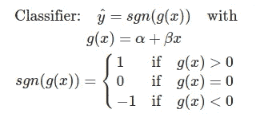

# 如何用支持向量机学习非线性数据集

> 原文：<https://towardsdatascience.com/how-to-learn-non-linear-separable-dataset-with-support-vector-machines-a7da21c6d987?source=collection_archive---------24----------------------->

## 支持向量机简介及其在非线性数据集上的应用

# 动机

## 支持向量机

什么是支持向量机？支持向量机是监督学习模型，分析数据进行分类。单独类别的样本点由一个尽可能宽的间隙**分开。**

作者图片

如上图所示，间隙是用黑色圆圈的两点定义的黄色区域。边框绘制在黄色区域的中间。当新的样本点进来时，它们将被**预测为属于它们落入的那一侧的类别**。

## 但是我们的数据并不总是线性的

如果数据像上面一样是线性可分的，那么我们用线性分类器来分离这两个类就没有问题了。但是如果我们的数据是像这样的非线性可分的呢:

作者图片

正如我们所看到的，即使来自不同类的数据点是可分的，我们也不能像上面那样简单地画一条直线

作者图片

那么，我们如何使用支持向量机来拟合非线性数据集呢？本文将带您了解如何做到这一点。读完本文后，您应该能够**理解内核、gamma 和 C 的作用，以及如何操纵它们来适应您的数据集**。

# SVM 的实验

## 创建数据集和绘图功能

从创建非线性数据集开始。

您应该会看到类似这样的内容。

作者图片

我们还需要一个名为`plot_decision_region`的绘图函数，就像[这个](http://3776d8abd4204a2efd4792888337592c)一样。由于本文的目标是理解 SVM，如果您想使用数据集并遵循本文，请随意复制并粘贴下面的代码。

## 线性 SVM 的尝试

在扭曲我们的算法之前，让我们先试试标准的线性 SVM

`C`是与错误分类相关的成本。`C`的值越高，正确分离数据集的算法就越严格。我们使用`kernel='linear'`进行线性分类。

作者图片

正如我们所看到的，即使我们将成本设置得非常高，这条线也没有很好地分离红色和蓝色点。一些蓝点和红点在错误的一边。

## 径向基函数核

到目前为止，我们已经使用了线性分类器的形式

我们可以看到，g(x)是一个线性函数。当 g(x) >0 时，预测为 1。当 g(x) <1 时，预测为-1。但是由于我们不能像上面那样使用线性函数来处理非线性数据，我们需要将线性函数转换成另一个函数。

你不需要理解我们是怎么得到像上面这样的函数 g(x)的。请注意:

*   ||x-x_i||是距离公式。我们根据两点之间的径向距离来区分这两点。
*   西格玛是一个调节参数。西格玛越大，分类器对距离差异越不敏感。
*   范围从 0 到 1 的函数。
*   距离越大，函数越接近零。这意味着两点更有可能是**不同的**。
*   **距离**越小，函数越接近零。这意味着两点更有可能**相似。**

这个分类器似乎是我们非线性数据的一个很好的候选。让我们检查一下

`gamma`是 1/sigma。记住 sigma 是一个调节函数。因此，伽马值越小，西格玛值越大，并且分类器**对各个**点之间的距离越不敏感。****

作者图片

让我们试着把伽玛放大，看看会发生什么

作者图片

厉害！似乎将伽马值放大 100 倍可以提高我们的分类器对训练集的准确性。我们把这个伽玛乘以 10 怎么样？

作者图片

看起来分类器努力使训练集的准确度更接近于零。那么这是否意味着如果我们将 gamma 增加到 10000，它会更加精确呢？不完全是。如果伽马太大，分类器最终对差异不敏感

作者图片

让我们改为增加 C。还记得 C 是做什么的吗？c 是与整个数据集的错误分类相关联的成本。换句话说，增加 C 将**增加对**整个数据集**的灵敏度**，而不仅仅是单个数据点。

让我们用一个下拉栏来快速观察 C 值增加的差异

作者图片

厉害！我们已经找到了参数，所以我们的 SVM 分类器成功地分离了两组点。

# 下一步是什么

我希望这篇文章能让你直观地了解什么是 SVM 分类器，以及如何使用它来学习非线性数据集。当然，如果您的数据是高维的，您不能总是基于上述可视化来判断您的分类器的性能。一个好的做法是根据训练集训练数据集，并在测试集上使用混淆矩阵或 f1 分数等指标。

你可以玩玩这本[笔记本](https://github.com/khuyentran1401/Data-science/blob/master/machine-learning/SVM_Separate_XOR.ipynb)中提供的代码，以建立对 SVM 更好的直觉。

我喜欢写一些基本的数据科学概念，并尝试不同的算法和数据科学工具。你可以在 LinkedIn 和 T2 Twitter 上与我联系。

星[这个回购](https://github.com/khuyentran1401/Data-science)如果你想检查我写的所有文章的代码。在 Medium 上关注我，了解我的最新数据科学文章，例如:

 [## 如何为你最喜欢的可视化工具创建下拉菜单和滑动条

### 使用 Python Widget，您可以用 3 行代码升级可视化

towardsdatascience.com](/how-to-create-a-drop-down-menu-and-a-slide-bar-for-your-favorite-visualization-tool-3a50b7c9ea01)  [## 如何有效地微调你的机器学习模型

### 发现为您的 ML 模型寻找最佳参数非常耗时？用这三招

towardsdatascience.com](/how-to-fine-tune-your-machine-learning-models-with-ease-8ca62d1217b1)  [## 自然语言处理中的卷积神经网络

### 什么是卷积神经网络，如何利用它进行情感分析？

towardsdatascience.com](/convolutional-neural-network-in-natural-language-processing-96d67f91275c)  [## 如何用 Github 组织你的数据科学文章

### 被新信息淹没？现在，您可以轻松地跟踪文章并为其创建自定义注释

towardsdatascience.com](/how-to-organize-your-data-science-articles-with-github-b5b9427dad37)  [## PyTorch 是什么？

### 想想 Numpy，但是有强大的 GPU 加速

towardsdatascience.com](/what-is-pytorch-a84e4559f0e3)