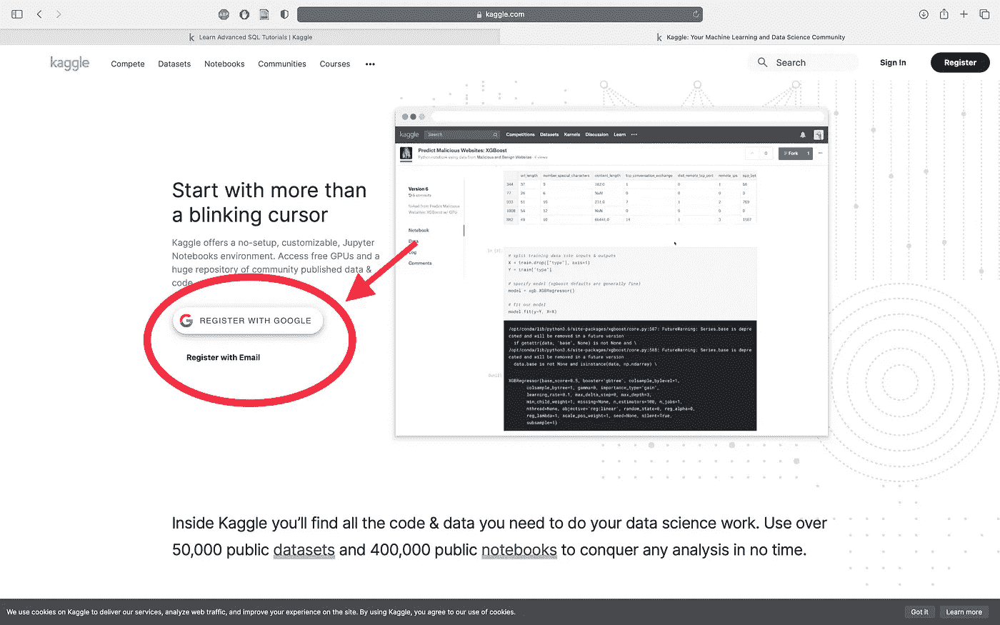
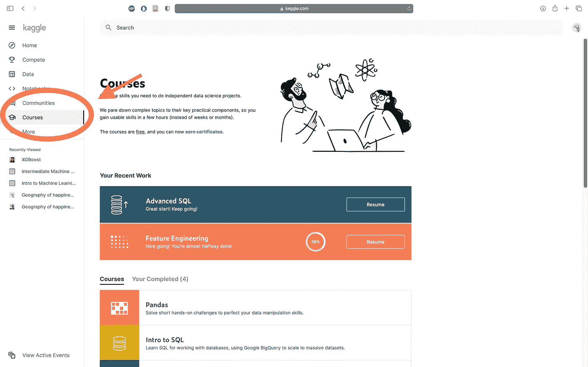
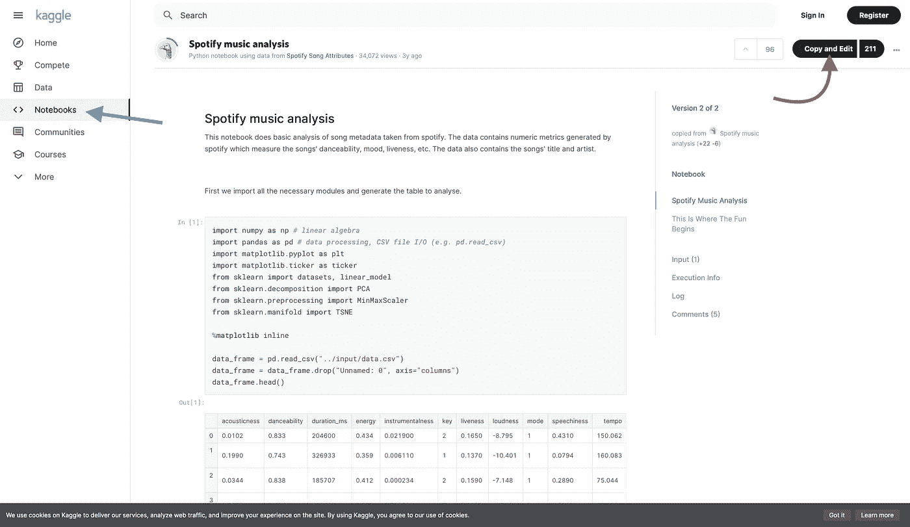

# 如何用 Kaggle 免费学习数据科学和机器学习的基础知识

> 原文：<https://towardsdatascience.com/how-to-learn-the-basics-of-data-science-and-machine-learning-for-free-with-kaggle-f122347eece3?source=collection_archive---------72----------------------->

## 与 Kaggle.com 一起学习数据科学和机器学习的初学者指南

图片由 [Unsplash](https://unsplash.com?utm_source=medium&utm_medium=referral) 上的 [Alexandru Acea](https://unsplash.com/@alexacea?utm_source=medium&utm_medium=referral) 拍摄

[Kaggle](https://www.kaggle.com/) 是一个由数据科学家和机器学习用户组成的在线社区。该网站侧重于共享和分析数据集；并提供带有现金奖励的数据分析和机器学习竞赛。然而，Kaggle 最被忽视的一个方面是为初学者提供的学习这门学科基础的特殊短期课程。Kaggle 课程是免费的，在教授核心基础知识和不向用户灌输可以及时获取的先进概念和信息之间取得了良好的平衡。在这篇短文中，我想向你展示如何通过 Kaggle 课程免费开始学习数据科学和机器学习。

## 签约雇用

首先，你需要注册使用该网站。Kaggle 归谷歌所有，因此如果你已经使用了 YouTube 或 Gmail 等谷歌服务，那么你可以使用该帐户注册一个 Kaggle 帐户。如果你没有谷歌服务帐户，你可以使用任何你喜欢的电子邮件帐户注册。

作者 Rugare Maruzani 截图

## 课程

注册并登录 Kaggle 后，导航至网页左侧的课程部分。作为初学者，您会希望从 Python 课程开始。我已经完成了那门课程，所以你不会在下图中看到它。Python 是机器学习和数据科学的首选语言，尤其是对于初学者。我认为你可以在没有编程经验的情况下直接进入这个课程，但是 Kaggle 建议你在开始这个课程之前熟悉一些绝对的基础知识。当每节课结束时，请点击每节课末尾“轮到你”部分的链接，练习刚刚学到的内容，这一点很重要。

作者 Rugare Maruzani 截图

完成 Python 课程后，我会推荐参加熊猫课程。Pandas 是关键的 Python 库之一，本课程将教你如何使用 Pandas，并向你介绍 Python 中的库是如何工作的。接下来，我会做数据可视化模块，然后介绍机器学习和中间机器学习

## 研究别人的笔记本

Kaggle 的一大优点是社区可以通过笔记本分享他们的数据科学和机器学习工作。作为一个完全的初学者，这些笔记本可能会令人生畏，难以理解，然而，你读得越多，你就会理解得越多，你会注意到更多的模式。我建议在你感兴趣的领域寻找笔记本并研究它们。你会发现笔记本电脑分析健康，体育，人口和疾病的数据以及许多其他主题。您还可以将笔记本复制到您自己的配置文件中，允许您修改和破坏代码，这是一种非常棒的学习技巧。

通过点击“笔记本”选项卡(蓝色箭头)来搜索笔记本，并且可以通过点击“复制和编辑”按钮(红色箭头)来复制笔记本和修补。作者 Rugare Maruzani 截图

## 结论

在参加了一些 Kaggle 课程后，我想你会对数据科学是否是你真正感兴趣并想进一步追求的领域有一个很好的想法。如果是这样，你会注意到其他课程来发展你作为数据科学家和机器学习实践者的技能。完成一门课程后别忘了收藏你获得的证书，分享到 LinkedIn 上！