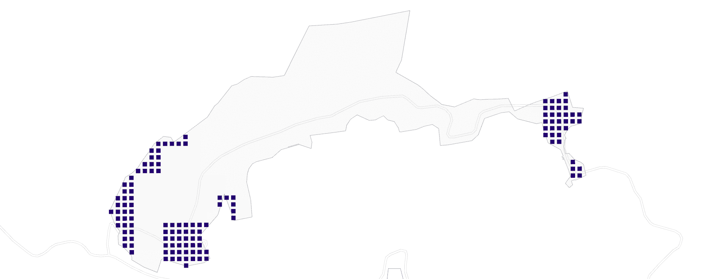
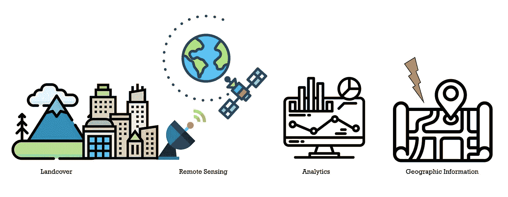
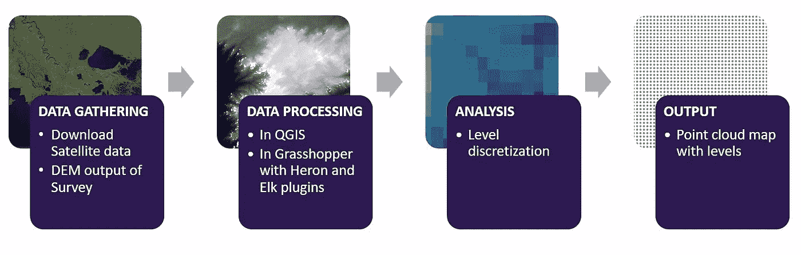
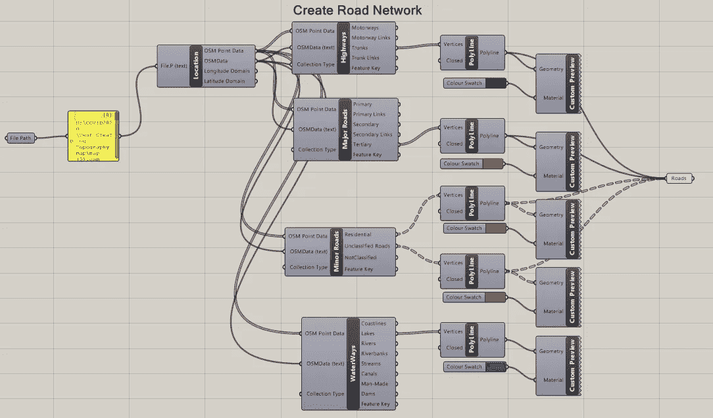
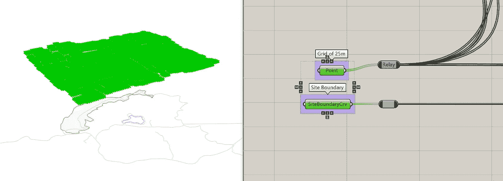
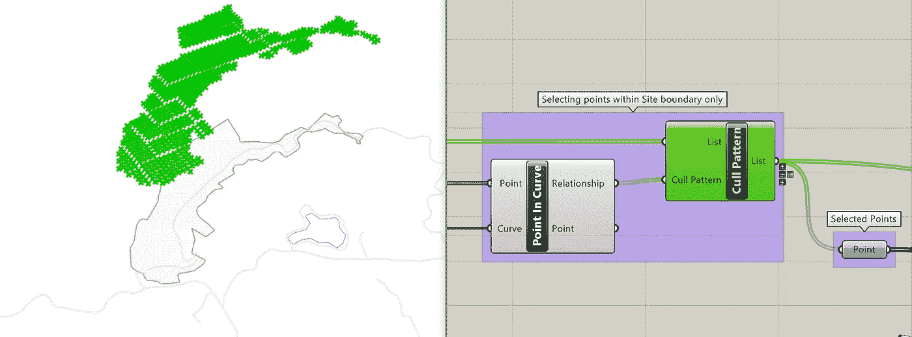
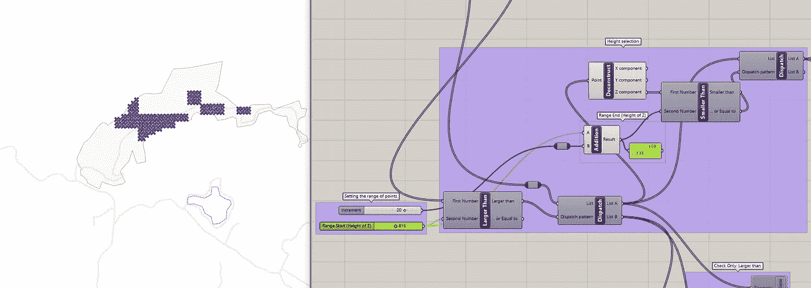

# 如何利用卫星收集的遥感数据在 Grasshopper 中轻松建立一个站点模型

> 原文：<https://towardsdatascience.com/how-to-leverage-on-the-data-gathered-by-satellites-from-remote-sensing-to-easily-model-a-site-in-afc73a006e43?source=collection_archive---------71----------------------->

## 建筑学和数据科学

## 帖子 4:使用 QGIS 和 Grasshopper 插件——Heron 和 Elk

了解场地和地形是任何建筑项目的关键第一步。网站建模可能会变得非常令人生畏，昂贵，或者只是繁琐，经常不得不使用各种软件，只是掌握一个网站的一般意识。我发现最有效的方法是使用 QGIS 和 Rhino Grasshopper 来覆盖我的大部分分析，如等高线映射、风流、太阳辐射、太阳路径和阴影、自然地形等等。我还想在一个软件中参数化地控制这些不同的分析。感谢 Grasshopper 的精彩社区，他们创建了插件来支持它。

数字高程模型的层次离散化。数据来源:美国地质勘探局地球探测器，图片阿迪蒂亚·维诺德-布钦格

**第二步是收集地形数据。**卫星使数据收集变得非常简单，因为数据是免费提供的。建筑项目不仅仅是在其场地边界内定义的。语境很重要。也许它坐落在山谷或山上，靠近一条容易被洪水淹没的河流，或者在一个邻近的建筑阻挡阳光的城市里。就地形而言，您通常需要更大的区域来执行适当的分析并了解周围的环境。

遥感过程。阿迪亚·维诺德-布钦格。来自 Flaticon 的图标归于 [Icongeek26](https://www.flaticon.com/authors/icongeek26) 、 [Freepik](https://www.flaticon.com/authors/freepik) 、[桉树](https://www.flaticon.com/authors/eucalyp)、 [Xnimrodx](https://www.flaticon.com/authors/xnimrodx) 、[苏朗](https://www.flaticon.com/authors/surang)

对于这个更大的区域，我会使用卫星收集的数据。遥感越来越准确地接近真实情况。因此，来自卫星扫描的数据可以成为地球上几乎任何地方的非常可靠的数据源。

# 工作

使用公开可用的数据集对网站建模

# 目标

我的目标是在 20 米和 25 米的网格上以点的形式获得标高。我想利用这一点在总体规划中战略性地定位建筑，这样每个部门/建筑之间至少相距 20 米或 25 米。我还想控制建筑物的高度，同时保持每个建筑物的视野。因此，在稍后的阶段，我将使用进化求解器设置多目标优化，将建筑的高度、标高和视图作为约束条件。

# 计划

Aditya Vinod-Buchinger 场地建模路线图

## 1.收集高程数据作为 DEM(数字高程模型)

使用 Elk、OpenStreetMap 和 QGIS

步骤 1:下载从遥感(卫星扫描)获得的信息，这些信息可以从美国地质调查局免费获得，作为该地区的陆地卫星图像。卫星扫描正变得越来越准确，取决于网站的位置，并可能持有有价值的信息。它们可以很好地显示周围的地形，并可以在稍后阶段与通过勘测获得的更准确的数据相关联。

> [USGS 地球资源管理器](https://gisgeography.com/usgs-earth-explorer-download-free-landsat-imagery/) >选择地区>下载 DEM

或者，您可能会拥有一个 DEM(。tiff)测量员的测量图。

第二步:使用 [Elk](https://www.food4rhino.com/app/elk) 插件、& OpenStreetMap 数据，在 Grasshopper 中采集道路网络、建筑层、水体等 GIS 图层。

创建道路网的定义 Aditya Vinod-Buchinger

我还在 grasshopper 中找到了使用 Heron 插件的替代方法。Heron 是一个很棒的插件，它可以直接将 GIS 数据导入 Grasshopper，而无需通过方法 1。网上有很多这方面的教程。这些定义也可在示例中的[Heron @ food 4 Rino](https://www.food4rhino.com/app/heron)上找到。

我选择了麋鹿。

## 2.从 DEM 中处理和提取高程值

数字高程有多种与 GIS 兼容的格式，例如。为了提取高程，我在中下载了 DEM 栅格。tiff 格式。使用开源地理信息软件 QGIS GRASS 3.2(特别是 GRASS 的最新版本只能执行重采样步骤)，对图像进行处理、重采样并转换为保存 Z 值的点。

> 带 GRASS 的 QGIS >处理工具箱>重采样为 25 米格网>计算 Z 值>将图层另存为点

下一步是将它导入 Grasshopper。

## 3.蚱蜢的分析

**此阶段的输入是从 QGIS 获得的具有 x、y 和 z 值的点云。输出将是基于高程的参数控制的离散组。**

> 作为一个规则，总是参数化你不一定确定的项目，或者希望保持一定的灵活性。
> 
> 例如，面积为 10 平方米但长度和宽度不确定的房间的大小。然后，您将使长度和宽度成为滑块控制的区域的函数。

我希望能够根据高程控制点的分组，以便参数化地离散高程。参数化级别可以控制选择点的标准。

作为点和曲线添加到参数的输入 Aditya Vinod-Buchinger

如何利用卫星收集的遥感数据，在 Grasshopper 中轻松地建立一个站点模型

设置 z 值范围的开始和结束参数 Aditya Vinod-Buchinger

## 4.输出

有了这个我有了；

1.  将级别组织为可控参数特征。
2.  参数化的分组级别，以 5 米为增量
3.  根据我的项目纲要的要求，确定了整个场地的低海拔和高海拔区域，以规划放牧和农田
4.  设置运行进化求解器的阶段，以便在稍后阶段生成选项

# 下一步

包 2:集中和分区

你好，谢谢你看我的帖子！随时拍摄任何问题，你可能有评论。此外，如果您需要任何帮助，请通过 [*LinkedIn*](https://www.linkedin.com/in/adityavinod/) *与我联系。*

*我是一名来自伦敦的建筑师(COA)和技术爱好者。我对构建环境感兴趣，并广泛围绕设计、性能和见解利用数据科学进行架构。我不时从事各种主题的工作，如生成设计、空间分析、能源和环境研究。我是一家生物技术创新公司的项目经理(AEC ),在北非开发一个大规模的可持续项目。*