# 如何在数据科学项目中利用 Visual Studio 代码

> 原文：<https://towardsdatascience.com/how-to-leverage-visual-studio-code-for-your-data-science-projects-7078b70a72f0?source=collection_archive---------19----------------------->

## 直到发现一种新的有效方法，我们才意识到我们是多么低效

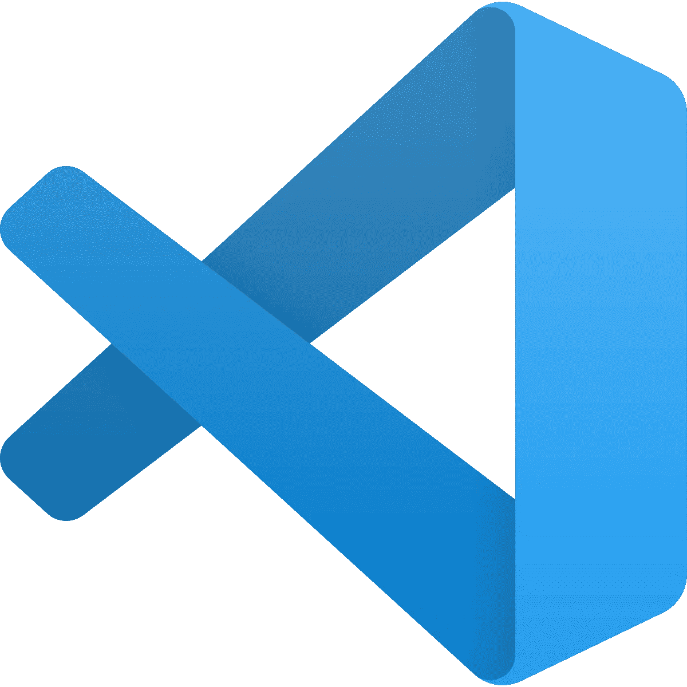

从[维基百科](https://en.wikipedia.org/wiki/Visual_Studio_Code)检索的图片

# 动机

在从事数据科学项目时，您可能需要在 Github 或 Terminal 等不同工具之间来回切换。**额外的几秒钟可以积累成大量的时间浪费。想象一下把所有东西都放在一个地方是多么的快捷和方便。如果你掌握了键盘快捷键，你的工作流程会更快。**

切换到 Visual Studio 代码使我能够通过减少耗时的活动来加快工作流程。[**Visual Studio Code**](https://code.visualstudio.com/)**是微软为 Windows、Linux、macOS 制作的免费源代码编辑器。我喜欢 VS 代码的两大优点是键盘快捷键和有用的扩展，比如嵌入式 git。**

**VS 代码可以为您现有的工作流添加很多东西。在这篇文章中，我将回顾几个我最喜欢的帮助我平衡工作流程的方法。**

# **快捷键**

**当我们有鼠标时，为什么要使用键盘快捷键？因为知道如何使用键盘快捷键可以节省你大量的时间。**

**但是你可能对学习键盘快捷键犹豫不决，因为它需要你去记忆。这是对我有效的策略:**在便笺条上写下几个键盘快捷键**。然后把它们贴在你周围的工作区。每次不记得键盘快捷键的时候就看看便利贴。渐渐地，键盘快捷键会像便利贴粘在你的桌子上一样粘在你的脑海里。**

****

**由 [Kelly Sikkema](https://unsplash.com/@kellysikkema?utm_source=medium&utm_medium=referral) 在 [Unsplash](https://unsplash.com?utm_source=medium&utm_medium=referral) 上拍摄的照片**

**知道了这一招，你应该不会害怕学习任何有用的键盘快捷键。让我们探索一些可以添加到工具箱中的快捷方式。**

## **一次改变所有相似的单词**

**你是否曾经想改变一个变量名，但是发现修改每个变量名很费时间？要一次修复所有相似的单词，只需点击单词并使用**Ctrl+Shift+l。****

**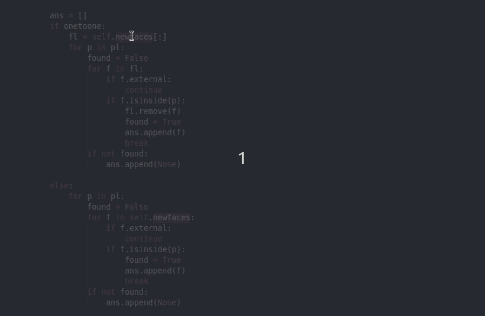**

## **将光标移动到行尾和行首**

**假设您忘记在几行的开头或结尾添加一个单词或字符。您可以手动进入每一行来修复您的错误，但是这很耗时。这是你需要键盘快捷键的时候。你需要做的就是选择你想要改变的行，然后使用 **Alt + Shift + I** 转到行尾。使用向左箭头转到该行的开头。**

**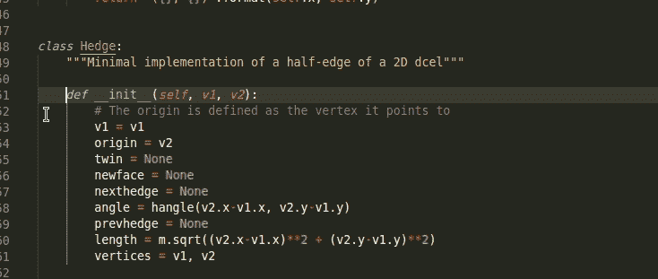**

**或者按住 **Alt 的同时上下移动鼠标**线条也应该可以。**

**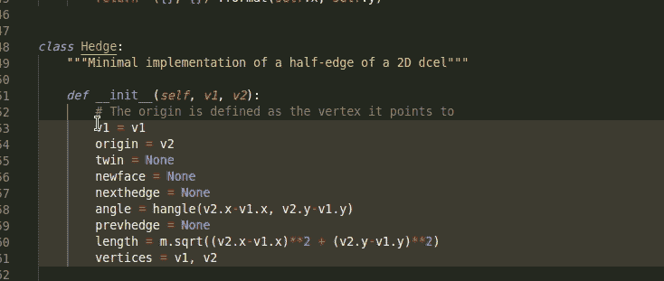**

## **代码折叠**

**您的代码变得非常大，您希望通过隐藏您没有处理的代码来保持专注？这很容易做到，移动到该行，然后使用 **Ctrl + Shift + [** 。要展开，使用 **Ctrl + Shift + ]****

**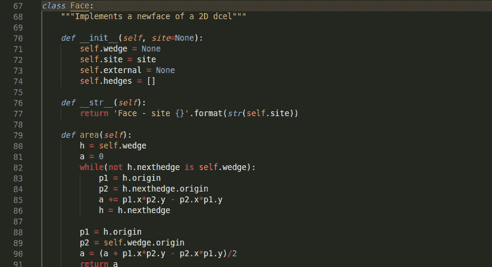**

## **开放终端**

**如果我们想打开一个终端来快速运行你的代码呢？没问题。Ctrl + ` 应该能行。**

**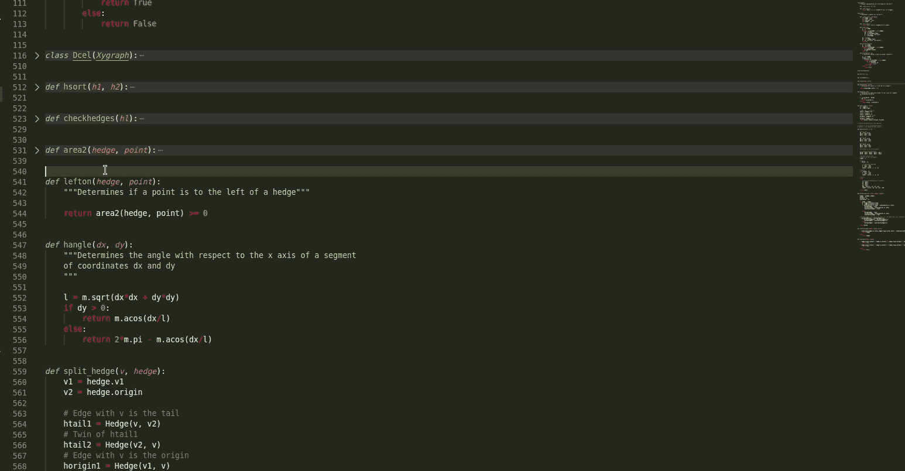**

## **分画面银幕**

**希望能够同时查看两个文件进行比较？这时候我们就可以使用 **Ctrl + \。****

**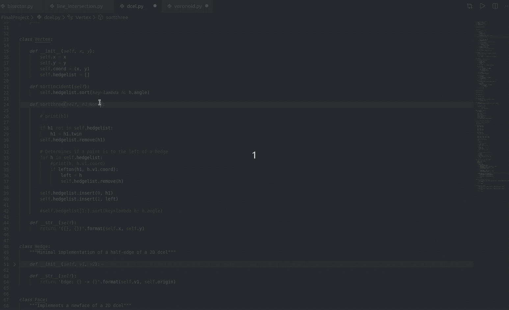**

## **前往该功能**

**假设你想知道一个函数的定义或者回顾这个函数。您可以通过按住 **Alt 键并单击**该函数来快速找到该函数，而不是搜索几个文件夹和许多行代码来找到一个函数。**

**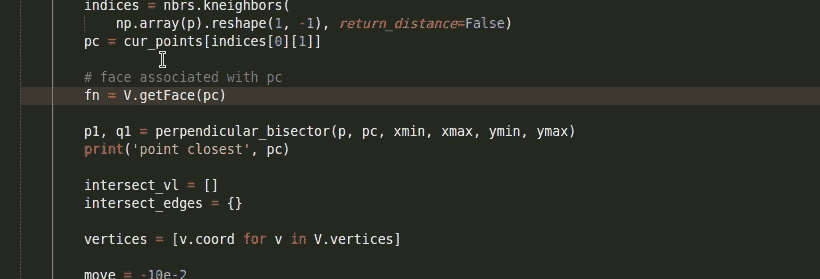**

# **版本控制**

**我真正喜欢 VS 代码的另一个优点是**嵌入式 Git** 。Git 是控制项目版本的有效工具。如果能在文本编辑器中嵌入 Git 就更好了。如果我们碰巧在我的代码中犯了任何错误，我们可能希望与上一个版本进行比较并轻松地修复。**

**要启用 git 版本控制，请添加扩展 GitLens。你可以在左边找到扩展栏，然后搜索 GitLens。然后单击安装。**

**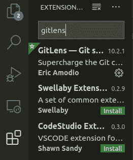**

## **用以前的版本检查行更改**

**只需点击右键，然后选择*用先前版本*打开行变更。我们应该能够检查更改！**

****

## **查看上次提交的更改**

**如果您想将当前提交的某些文件与上一次提交的文件进行比较，该怎么办？你所需要做的就是打开你想要比较的文件。单击左侧导航栏中的 GitLens 图标，然后选择要比较的提交。**

**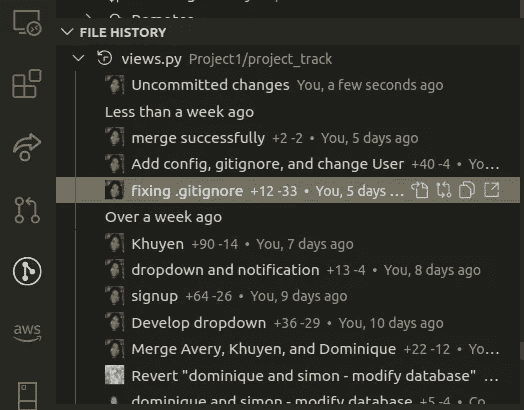**

**会出现一个分屏，颜色显示两个文件之间的不同，就像这样。**

**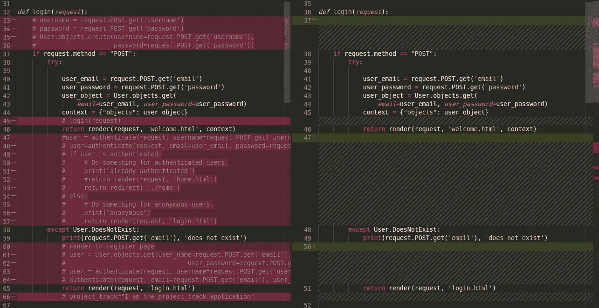**

## **查看日期和作者**

**假设你正在和其他人合作一个项目，你想知道谁在什么时候做了什么改变。单击您关心的代码行，就可以很容易地看到这一点**

**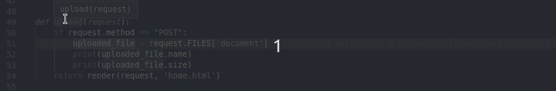**

**如您所见，当我点击每一行时，都会显示作者、日期以及提交消息。**

# **结论**

**我希望这篇文章很好地概述了 VSCode 如何在处理数据科学项目时帮助加速您的工作流。刚开始习惯一个新工具可能会感觉不舒服，但是找到改进我重复活动的方法可以在将来增加你的时间。**

> **每花一分钟，就赚了一小时——本杰明·富兰克林**

**我喜欢写一些基本的数据科学概念，并尝试不同的算法和数据科学工具。你可以在 LinkedIn 和 T2 Twitter 上与我联系。**

**星[这个回购](https://github.com/khuyentran1401/Data-science)如果你想检查我写的所有文章的代码。在 Medium 上关注我，了解我的最新数据科学文章，例如:**

** [## 如何用 Github 组织你的数据科学文章

### 被新信息淹没？现在，您可以轻松地跟踪文章并为其创建自定义注释

towardsdatascience.com](/how-to-organize-your-data-science-articles-with-github-b5b9427dad37)  [## 如何创建可重用的命令行

### 你能把你的多个有用的命令行打包成一个文件以便快速执行吗？

towardsdatascience.com](/how-to-create-reusable-command-line-f9a2bb356bc9)  [## 使用这两个工具在您的机器学习项目中实现可重复性

### 你能打包你的机器学习模型，并根据你的需要挑选一个最好的吗？

towardsdatascience.com](/achieve-reproducibility-in-machine-learning-with-these-two-tools-7bb20609cbb8)  [## 如何有效地微调你的机器学习模型

### 发现为您的 ML 模型寻找最佳参数非常耗时？用这三招

towardsdatascience.com](/how-to-fine-tune-your-machine-learning-models-with-ease-8ca62d1217b1)  [## 如何通过将自己置于合适的环境中来加速您的数据科学职业生涯

### 我感到增长数据科学技能停滞不前，直到我有了一个飞跃

towardsdatascience.com](/how-to-accelerate-your-data-science-career-by-putting-yourself-in-the-right-environment-8316f42a476c)  [## cy thon——Python 函数的加速工具

### 当调整你的算法得到小的改进时，你可能想用 Cython 获得额外的速度，一个…

towardsdatascience.com](/cython-a-speed-up-tool-for-your-python-function-9bab64364bfd)**