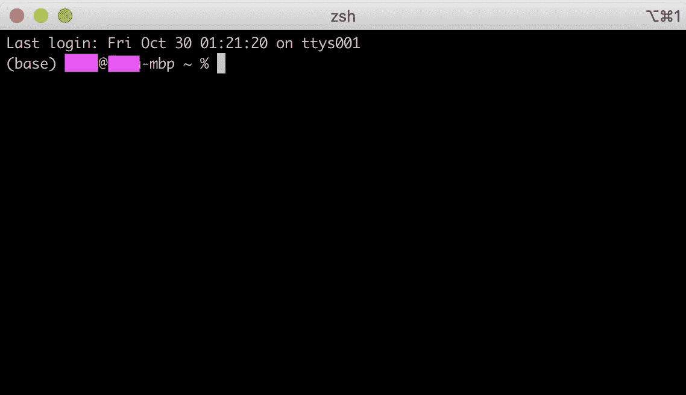
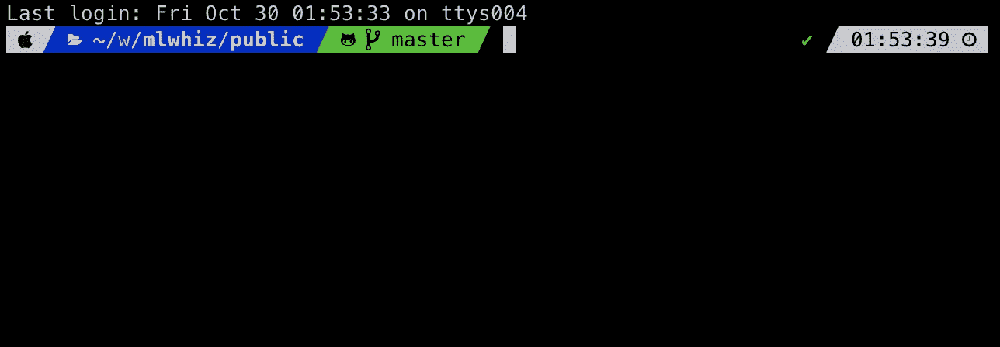
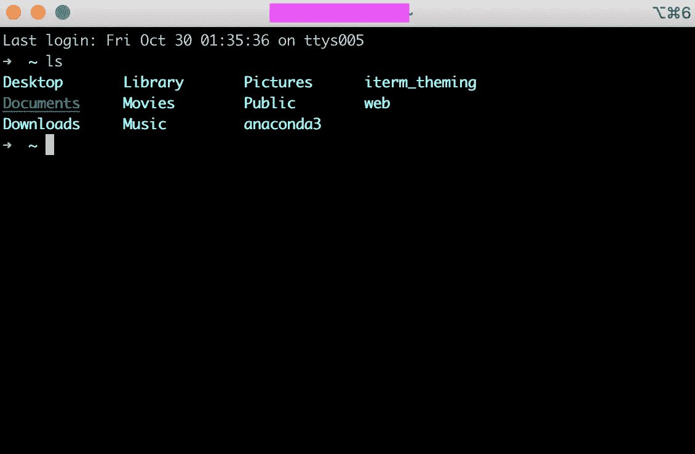
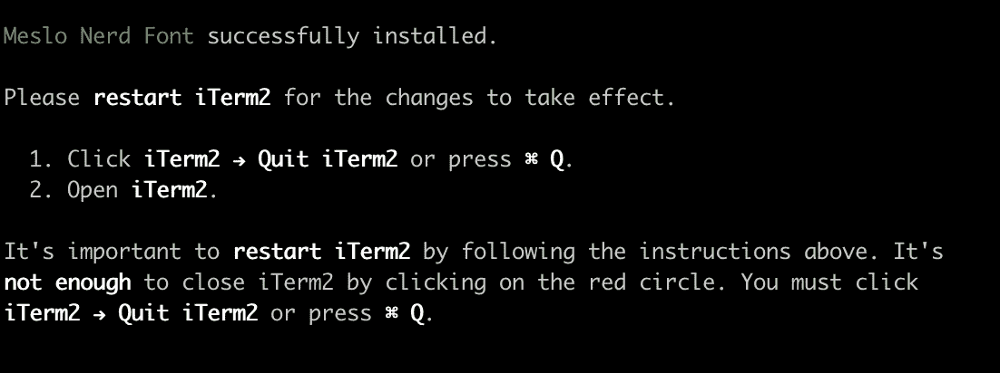
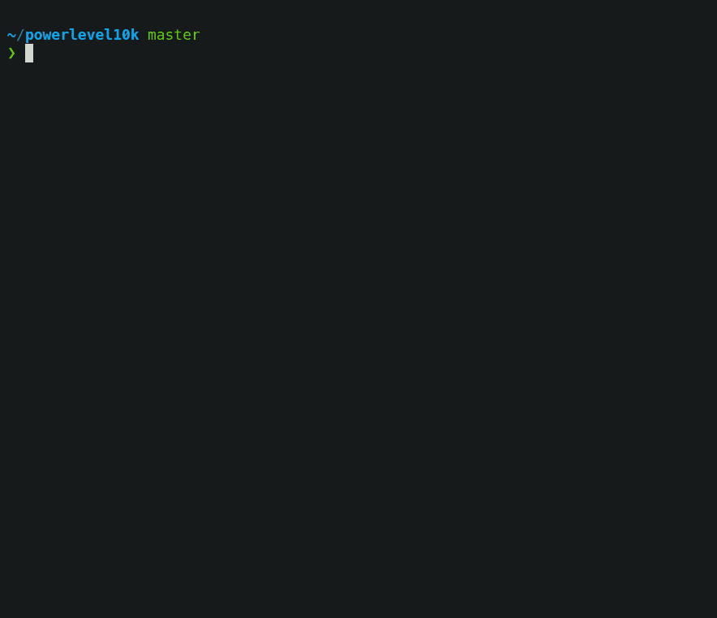
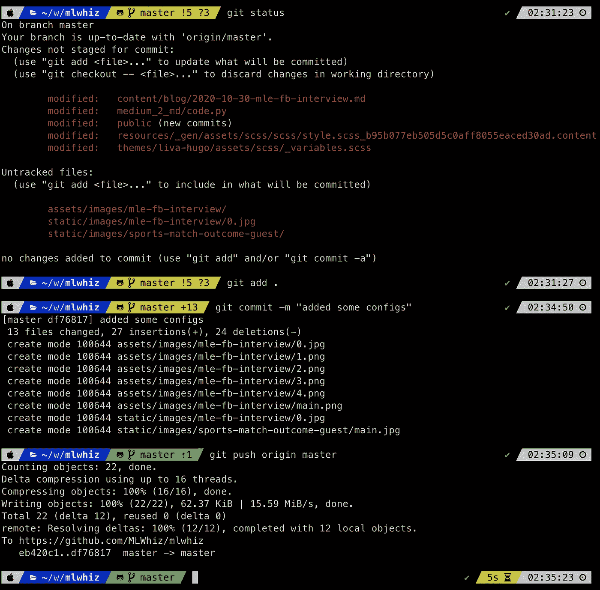
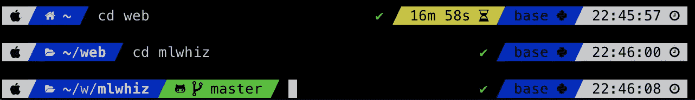

# 如何看起来像一个 10 倍的开发者

> 原文：<https://towardsdatascience.com/how-to-look-like-a-10x-developer-f3d2211cb998?source=collection_archive---------25----------------------->


图多尔·巴休在 [Unsplash](https://unsplash.com?utm_source=medium&utm_medium=referral) 上的照片

## 装饰你的 Mac 终端，在你周围的开发者海洋中显得很酷

我喜欢使用 shell 命令。它们速度很快，并且提供了大量的灵活性来做特别的事情。但是我最喜欢它们的一点——哦，它们看起来太酷了。

或者说我是这样认为的，直到有一天我周围的每个人都在使用 shell 命令。我讨厌这样的发展。凉爽消失了，用黑屏工作变得一天比一天无聊。我必须满足自己与生俱来的出类拔萃的需求。在发布下一个代码时，我需要这个灵感来源。

这不是我工作的咖啡馆？唉，我周围的人开始知道我在做的都是些非常普通的东西。

**所以，我再次问自己——我如何在工作时看起来很酷？**这个问题困扰着每一个开发者，自从开发者的存在以来。就像我是开发人员一样，我想到了同样的老答案— **定制。**

*我向自己承诺，我将拥有最好的终端，我将根据它定制 s * * t*。然后人们会知道我有多酷，我会成为所有值得谈论的话题的焦点。但是，唉——有一样东西是定制的，它不是终端自带的，而我就像周围的每个开发者一样懒惰。我需要一些快速从下面最时髦的终端移动。



但是，就像所有与 shell 相关的事情一样——有些事情很难做*不是一个 bug，而是一个特性*。几十年来，正是 shell 的这一特性让我们开发人员看起来很酷，所以我需要尊重这一点。这使得开发人员更容易达到最高目标——看起来很酷。在开发者看来，没有任何额外的东西意味着你可以用你自己的方式定制你需要的东西。

所以，在这篇文章的最后，这是一个关于我如何让我的终端看起来很棒的演练，我会让终端看起来像下面这样，它显示了 git 的状态，并且有一个非常棒的主题。



# 怎么会？

我想这篇帖子不会像我的每一篇帖子一样广为流传，所以我想我可以告诉你看起来很酷而对我自己的酷没有任何伤害的伟大秘密*。露齿一笑，低声耳语。*这其实很简单。我只是运行了一些命令。

但是，让我们先退一步，然后再去理解发生了什么。您的 Mac 附带有自己版本的终端应用程序。我不会用那个。虽然这个应用很棒，但我已经习惯了使用 iTerm2，因为它提供了所有的定制选项和主题。

要安装这个主题并拥有 iTerm2 终端，首先需要在 MAC 上安装 iTerm2。您可以在 iTerm2 下载页面上的处完成此操作。一旦您安装了 iTerm2，我们将通过一系列步骤让 terminal 再次变得强大。

您需要在我们新的 iTerm2 终端中完成所有这些步骤。我首先创建一个目录来完成我们所有的工作，并在命令行上安装`oh-my-zsh`。什么是`oh-my-zsh`？你可以认为`zsh` shell 类似于`bash` shell，`oh-my-zsh`是一个维护你的`.zshrc`文件的框架，它非常类似于`.bashrc`文件。

```
mkdir iterm_theming
cd iterm_theming
sh -c "$(curl -fsSL https://raw.githubusercontent.com/robbyrussell/oh-my-zsh/master/tools/install.sh)"
```

这将为您安装 oh-my-zsh 及其默认主题，重启后您的终端应该如下所示:



这似乎是一个进步，但并没有太大的进步。现在换个主题吧。谈到主题，我们有多种选择。你可以在 oh-my-zsh 的主题页面获得一个完整的选项列表。

我将使用 [powerlevel10k](https://github.com/romkatv/powerlevel10k) 主题，因为它本身提供了许多配置选项，但是你基本上可以使用任何主题。首先，我们需要运行:

```
git clone --depth=1 https://github.com/romkatv/powerlevel10k.git ${ZSH_CUSTOM:-$HOME/.oh-my-zsh/custom}/themes/powerlevel10k
```

然后用任意编辑器编辑`~/.zshrc`文件中的`ZSH_THEME=”powerlevel10k/powerlevel10k"`。我用了纳米。

一旦您重新启动 iTerm2 会话，您将会看到:


作者图片:Powershell 配置屏幕 1

一旦你按下`y`，你会看到下面的窗口，要求你重启 iTerm2



作者图片:Powershell 配置屏幕 2

一旦你再次重启 iTerm2，你将会看到一个向导，在这里你可以选择你的偏好来配置你的提示符的颜色和样式。



来源:[Github 上的 Powerlevel10k](https://github.com/romkatv/powerlevel10k) 回购

我多次经历这个步骤，以得到我想要的正确风格。如果您不喜欢您设置的样式，您可以使用`p10k configure`命令重新启动小部件。

# 最后一眼

这是我最终得到的造型。这是我在博客上工作时的工作流程。



作者图像:使用终端

正如你所注意到的，它通过使用颜色和符号以一种相当直观的方式向我们展示了提示符本身的大量信息。

*例如，*提示中的黄色表明 git repo 与主数据库不同步。数字`!5`显示了已更改但尚未提交的文件数量。数字`?3`显示了我们应该使用`git add`命令添加的未跟踪文件的数量。而这一切都不需要使用`git status`命令。只要看到绿色提示符中的`⇡1`，就可以看到我们的分支比主分支领先 1 个提交。在右侧，我们可以看到花费了一些时间的命令的执行时间。你可以在主题页面上找到所有符号的描述。

我还在提示中保留了完整的路径，以便在需要时可以获取。尽管有一个小问题。你可以看到路径被缩短到下面的`~/w/mlwhiz`而不是`~/web/mlwhiz`。这不再是一个 bug，而是一个节省空间的特性。诀窍是在提示符下复制粘贴并按 tab 键。你将再次获得完整的路径。



作者图像:使用 2 号航站楼

# 添加更多功能

这还不是全部。除了得到一个漂亮且功能强大的终端，你还可以通过 oh-my-zsh 得到许多插件。上面我们刚刚使用了`git`插件。但是你可以从一长串插件列表中为自己选择一个，你只需要通过将插件名称添加到`.zshrc`文件中的`plugins`列表来安装它。

例如，您可以通过将`plugins=(git)`改为`plugins=(git vscode tmux)`并重启终端，在您的终端中添加插件 [vscode](https://github.com/ohmyzsh/ohmyzsh/tree/master/plugins/vscode) (提供大量 vscode 别名)和 [tmux](https://github.com/ohmyzsh/ohmyzsh/tree/master/plugins/tmux) (提供大量 tmux 别名)。

你还在等什么？让您的终端再次变得伟大。

# 继续学习

如果您想更好地使用 shell，也请阅读我以前的一些关于使用 shell 命令的文章。

[](/impress-onlookers-with-your-newly-acquired-shell-skills-a02effb420c2) [## 用你新获得的壳技能打动旁观者

### 数据科学家的 10 分钟外壳/终端技能

towardsdatascience.com](/impress-onlookers-with-your-newly-acquired-shell-skills-a02effb420c2) 

如果你想了解更多关于命令行的知识，我想你会的，Coursera 上有[UNIX work bench](https://www.coursera.org/learn/unix?ranMID=40328&ranEAID=lVarvwc5BD0&ranSiteID=lVarvwc5BD0-EK0XnncSGKDui6jU1GFilw&siteID=lVarvwc5BD0-EK0XnncSGKDui6jU1GFilw&utm_content=2&utm_medium=partners&utm_source=linkshare&utm_campaign=lVarvwc5BD0)课程，你可以试试。

谢谢你的阅读。将来我也会写更多初学者友好的帖子。关注我在[](https://medium.com/@rahul_agarwal?source=post_page---------------------------)****或者订阅我的 [**博客**](https://mlwhiz.ck.page/a9b8bda70c) 了解他们**。******

****此外，一个小小的免责声明——这篇文章中可能会有一些相关资源的附属链接，因为分享知识从来都不是一个坏主意。****