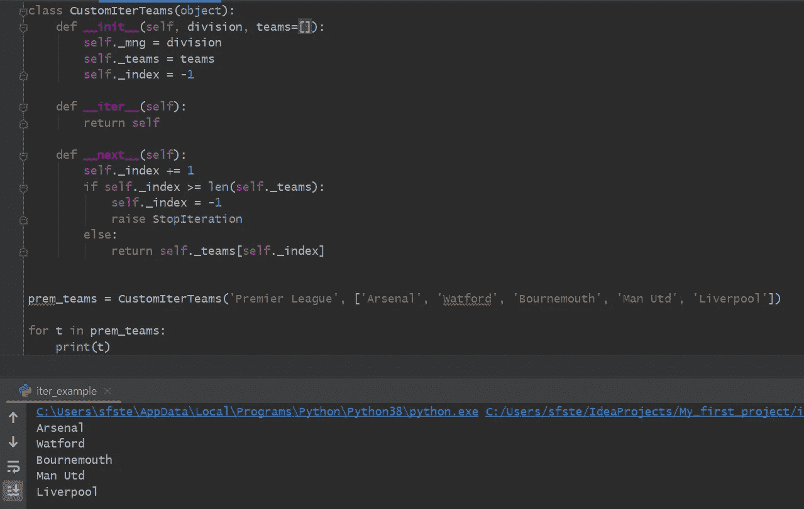
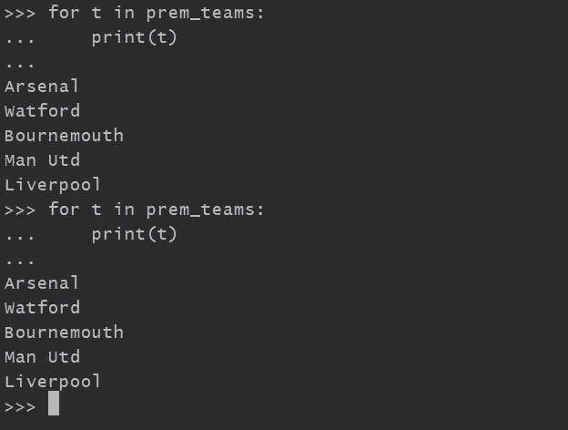
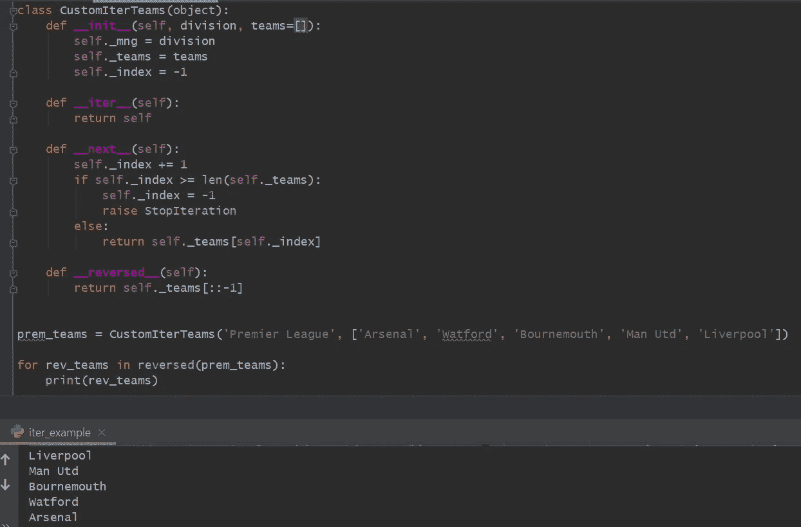
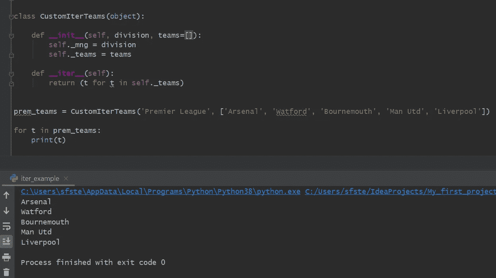

# 如何在 Python 中遍历自己的对象

> 原文：<https://towardsdatascience.com/how-to-loop-through-your-own-objects-in-python-1609c81e11ff?source=collection_archive---------3----------------------->

## Iterables，迭代和迭代您的自定义 Python 对象

图片由[Tine ivani](https://unsplash.com/@tine999)通过 Unsplash 提供

## 目标

本教程旨在帮助你理解什么是迭代和迭代器，以及它们之间的关系。其次，理解 Python for 循环是如何工作的，最终将有助于设计一个可以迭代的用户定义的自定义对象。

## 可重复的

iterable 是一个能够逐个返回其成员的对象。简单地说，iterable 是可以使用 Python 中的 for 循环进行循环的任何东西。序列是一种非常常见的可迭代类型。内置序列类型的示例包括列表、字符串和元组。

## 迭代器

迭代器是表示数据流的对象。您可以通过实现 iterable 的 **iter** 内置函数来创建迭代器对象。

迭代器可用于手动循环遍历 iterable 中的项目。迭代器反复传递给内置的 **next** 函数，返回流中的连续项。当 iterator 中的条目被使用时，它就消失了，最终，当没有更多的数据可供检索时，就会引发一个 **StopIteration 异常**。

## 了解 Python for 循环

发展关于可迭代和迭代器的知识的核心是理解 Python for 循环是如何工作的。为了更好地说明这一点，让我们定义一个可以接受任何 iterable 的函数，并在不使用 for 循环的情况下遍历*。*

我们的功能需要能够实现以下目标:

从 iterable 创建迭代器

从迭代器中重复检索下一项

执行任何预期的操作

当没有更多要检索的项时，引发 StopIteration 异常。

*在 Python for 循环中，iterable 被转换成迭代器。*

我们的自定义函数首先将任何 iterable 转换为迭代器。在 while 循环中，我们从迭代器中获取下一项，并对该项执行任何操作。在这种情况下，我选择编写一个函数来将迭代器中的数字提升 2 的幂，但是可以采取任何操作，例如，我们甚至可以选择简单地打印出容器或集合中的数字。

Python 中所有形式的迭代都是以这种方式工作的。

## 关键定义

为了更好地区分 iterable 和 iterator，进一步细化它们的定义并注意它们的区别会很有帮助。迭代器不能被索引/切片(因为它们可以无限长)。此外，与可重复项不同，它们没有长度。在下面的例子中，试图获取迭代器对象的长度，my_iter_list 引发了一个**类型错误异常**。

iterable 是可以循环的东西。

**>迭代器是代表数据流的对象。它对一个 iterable 进行迭代。**

在为本文进行研究时，迭代器的一个简洁明了的定义来自于 [StackOverflow](https://stackoverflow.com/questions/2776829/difference-between-pythons-generators-and-iterators#:~:text=Every%20generator%20is%20an%20iterator,paragraph's%20definition%20of%20an%20iterator%20.) ，如下所示:

> `iterator`是一个更一般的概念:任何对象的类都有一个`next`方法(Python 3 中的`__next__`)和一个`__iter__`方法(T4)

迭代器允许用户使用和创建惰性迭代器。懒惰的迭代程序不做任何工作，直到我们向它们请求下一个项目。这个特性可以帮助我们处理内存中容纳不下的无限长的可重复项。这被称为**惰性评估**，可以帮助节省内存和 CPU 时间。

## 迭代器协议

如上所述，迭代器对象需要支持以下两种方法，这两种方法组合在一起构成了 Python 迭代器协议:

**邓德/魔术 iter 法:**

*   迭代器。__iter__()
    返回迭代器对象本身。这是允许容器(也称为集合)和迭代器与`for`和`in`语句一起使用所必需的。

**邓德/魔种下法:**

*   迭代器。__next__()
    从容器中返回下一个项目。如果没有更多的项，则引发 StopIteration 异常。

# 创建自己的可迭代类型

我们可能想要创建一个**自定义迭代器**。为此，我们需要一个定义了 **__init__** 、 **__next__** 和 **__iter__** 方法的类。

## 自定义团队

首先，让我们定义一个名为 CustomIterTeams 的自定义类。这个类没有内置的 iterable 行为，但是我们可以在类中实现代码，使我们的自定义用户定义对象的行为像 iterable 一样。

有两种方法可以让自定义的用户定义对象表现得像 iterable。第一种方法涉及定义两个 dunder 或 magic 方法，即 __iter__()和 __next__()。dunder iter 方法只需要返回对象本身。这是因为，当我们编写 for 循环时，这将是我们打算迭代的对象。这个 iter 方法返回一个**迭代器**。

**在幕后，Python 的 for 循环使用迭代器。**

我们的自定义对象现在是一个迭代器，可以使用 dunder next 方法返回流中的连续项。这两种方法共同支持迭代器协议。

在 _ _ init _ _ 构造函数中，我们将对象中的索引设置为值-1。当调用下一个方法时，例如在 for 循环的第一次迭代中，索引的值增加 1。然后，我们检查索引值是否大于用户在第一次创建对象时决定添加的球队列表的长度。如果索引小于团队的长度，我们只需从团队列表中返回具有范围内索引的团队。

一旦索引等于或大于团队列表的长度，我们再次将索引重置回-1(正如它最初在 init 构造函数中设置的那样)，并引发一个 **StopIteration 异常**。

用户现在能够迭代创建的团队。CustomIterTeams 对象 prem_teams 现在是一个迭代器，我们可以遍历它。

一旦索引达到列表的长度，在引发 StopIteration 异常之前，会特意将索引重置为其原始值。实现此功能是为了让用户在同一个会话中执行对象的多次迭代，如下面的 python 提示所示。

我们现在还可以通过简单地实现 dunder reserved 方法来颠倒团队的顺序。

## 定义自定义可迭代类型的简单方法

没有必要为了使用户定义的对象可迭代而定义一个 dunder next 方法。相反，我们只需要让 dunder iter 方法返回一个生成器，这个生成器在我们的团队中循环。**每个生成器都是一个迭代器**。生成器有一个内置的 next 方法，因此不需要在自定义 python 类中实现 next 方法。

这段代码片段的 github 要点可以在[这里](https://gist.github.com/StephenFordham/6d5a250bd2b721b6099ab650a481f1d5)找到，如下所示:

## 总结:

通过包含 iter 和 next 方法，或者简单地在 iter 方法中返回一个生成器，可以在自定义的类中实现迭代。这取决于程序员，但是 iter 和 next 方法的实现稍微长一点，可以添加更精细定义的行为。