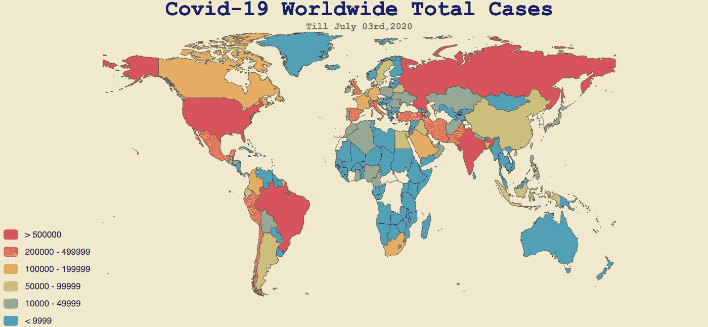

# 如何用 Python 制作冠状病毒世界地图

> 原文：<https://towardsdatascience.com/how-to-make-a-coronavirus-world-map-in-python-734c9fd87195?source=collection_archive---------36----------------------->

## 由 Pyecharts 库支持

新冠肺炎正在全世界传播。可视化数据的最佳方式之一是将数据映射到世界地图。幸运的是，很容易制作一个像下面这样的交互式地图。


这是一个动态图表，每当鼠标悬停在地图上时，数字就会显示出来。要创建这个图表，您只需要几行 Python 代码。

在编写这几行代码之前，您需要安装名为 Pyechart 的可视化包。这是一个 Python echarts 绘图库。它提供了 30 多种图表。最新版本是 1.7.1，发布于 2020 年 3 月 12 日。你可以 pip 安装它。

```
pip install pyecharts==1.7.1
```

软件包安装完成后，我们就可以开始构建地图了。

**第一步:导入库**

```
#import libraries
from pyecharts.charts import Map,Geo
from pyecharts import options as opts
from pyecharts.globals import ThemeType
```

**第二步:导入数据**

新冠肺炎的数据可以从[我们的数据世界](https://ourworldindata.org/coronavirus)网站下载。

该网站提供 CSV、CLSX 和 JSON 格式的完整新冠肺炎数据集。

```
#import data
dataset=pd.read_csv(‘owid-covid-data.csv’)
```

我只会得到 2020 年 7 月 3 日的数据，然后将数据映射到世界地图上。

```
#change date from object data type to datetime data type
dataset[‘date’]=pd.to_datetime(dataset[‘date’])
df = dataset.sort_values(by=['date'], ascending=False) #sort data by date
map_df=df[df['date']=='2020-07-03']
map_df.reset_index(drop=True, inplace=True)
map_df
```


**第三步:创建数据可视化所需的两个数据序列**

```
country=list(map_df[‘location’])totalcases=list(map_df[‘total_cases’])
```

**第四步:生成地图**

有了 7 行，就会得到冠状病毒世界地图。

```
list1 = [[country[i],totalcases[i]] for i in range(len(country))] #prepare data for visualization
map_1 = Map(init_opts=opts.InitOpts(width=”1000px”, height=”460px”)) #create the map and set the size of the map
map_1.add(“Total Confirmed Cases”, list1, maptype=’world’) #add world map
map_1.set_global_opts( #set global configurations
 visualmap_opts=opts.VisualMapOpts(max_=1100000,    is_piecewise=False),
 legend_opts=opts.LegendOpts(is_show=False), #show legend or not
 )
map_1.render_notebook() #show the map in the notebook directly
```


这张地图看起来有点乱。我们需要自定义美化地图。

*4.1 从地图上删除国家名称*

```
list1 = [[country[i],totalcases[i]] for i in range(len(country))] 
map_1 = Map(init_opts=opts.InitOpts(width=”1000px”, height=”460px”)) 
map_1.add(“Total Confirmed Cases”, 
 list1, maptype=’world’) 
map_1.set_series_opts(label_opts=opts.LabelOpts(is_show=False)) #remove country names
map_1.set_global_opts(visualmap_opts=opts.VisualMapOpts(max_=1100000,is_piecewise=False),
 legend_opts=opts.LegendOpts(is_show=False))
map_1.render_notebook() 
```


*4.2 从地图上移除圆点*

```
list1 = [[country[i],totalcases[i]] for i in range(len(country))] 
map_1 = Map(init_opts=opts.InitOpts(width=”1000px”, height=”460px”)) 
map_1.add(“Total Confirmed Cases”, 
 list1, 
 maptype=’world’,
 is_map_symbol_show=False)
map_1.set_series_opts(label_opts=opts.LabelOpts(is_show=False)) 
map_1.set_global_opts(visualmap_opts=opts.VisualMapOpts(max_=1100000,is_piecewise=False),
 legend_opts=opts.LegendOpts(is_show=False))
map_1.render_notebook() 
```


*4.3 将图例从滑动条更改为颜色箱*

```
list1 = [[country[i],totalcases[i]] for i in range(len(country))] 
map_1 = Map(init_opts=opts.InitOpts(width=”1000px”, height=”460px”)) 
map_1.add(“Total Confirmed Cases”, 
 list1, 
 maptype=’world’,
 is_map_symbol_show=False) 
map_1.set_series_opts(label_opts=opts.LabelOpts(is_show=False)) 
map_1.set_global_opts(visualmap_opts=opts.VisualMapOpts(max_=1100000,is_piecewise=True,pieces=[
 {“min”: 500000},
 {“min”: 200000, “max”: 499999},
 {“min”: 100000, “max”: 199999},
 {“min”: 50000, “max”: 99999},
 {“min”: 10000, “max”: 49999},
 {“max”: 9999},]),
 legend_opts=opts.LegendOpts(is_show=False))
map_1.render_notebook() 
```


*4.4 给地图添加标题和副标题*

```
list1 = [[country[i],totalcases[i]] for i in range(len(country))] 
map_1 = Map(init_opts=opts.InitOpts(width=”1000px”, height=”460px”)) 
map_1.add(‘Total Confirmed Cases’, 
 list1,
 maptype=’world’,
 is_map_symbol_show=False)
map_1.set_series_opts(label_opts=opts.LabelOpts(is_show=False)) 
map_1.set_global_opts(
visualmap_opts=opts.VisualMapOpts(max_=1100000,is_piecewise=True,pieces=[
 {“min”: 500000},
 {“min”: 200000, “max”: 499999},
 {“min”: 100000, “max”: 199999},
 {“min”: 50000, “max”: 99999},
 {“min”: 10000, “max”: 49999},
 {“max”: 9999},]),
 title_opts=opts.TitleOpts(
 title='Covid-19 Worldwide Total Cases',
 subtitle=’Till July 05th,2020',
 pos_left=’center’,
 padding=0,
 item_gap=2,# gap between title and subtitle 
 title_textstyle_opts= opts.TextStyleOpts(color=’darkblue’,
 font_weight=’bold’,
 font_family=’Courier New’,
 font_size=30), 
 subtitle_textstyle_opts= opts.TextStyleOpts(color=’grey’,
 font_weight=’bold’,
 font_family=’Courier New’,
 font_size=13)), 
 legend_opts=opts.LegendOpts(is_show=False))
map_1.render_notebook() 
```


通过向主题参数传递不同的值，可以很容易地更改地图的整体外观。

```
list1 = [[country[i],totalcases[i]] for i in range(len(country))] 
map_1 = Map(init_opts=opts.InitOpts(width=”1000px”, height=”460px”**,theme=ThemeType.ROMANTIC**)) 
map_1.add(‘Total Confirmed Cases’, 
 list1,
 maptype=’world’,
 is_map_symbol_show=False)
map_1.set_series_opts(label_opts=opts.LabelOpts(is_show=False)) 
map_1.set_global_opts(
visualmap_opts=opts.VisualMapOpts(max_=1100000,is_piecewise=True,pieces=[
 {“min”: 500000},
 {“min”: 200000, “max”: 499999},
 {“min”: 100000, “max”: 199999},
 {“min”: 50000, “max”: 99999},
 {“min”: 10000, “max”: 49999},
 {“max”: 9999},]),
 title_opts=opts.TitleOpts(
 title=”Covid-19 Worldwide Total Cases”,
 subtitle=’Till July 03rd,2020',
 pos_left=’center’,
 padding=0,
 item_gap=2,
 title_textstyle_opts= opts.TextStyleOpts(color=’darkblue’,
 font_weight=’bold’,
 font_family=’Courier New’,
 font_size=30), 
 subtitle_textstyle_opts= opts.TextStyleOpts(color=’grey’,
 font_weight=’bold’,
 font_family=’Courier New’,
 font_size=13)), 
 legend_opts=opts.LegendOpts(is_show=False))
map_1.render_notebook()
```



有许多选项和参数可供您探索和尝试，以进一步美化您的地图。

享受 Python 中的数据可视化！