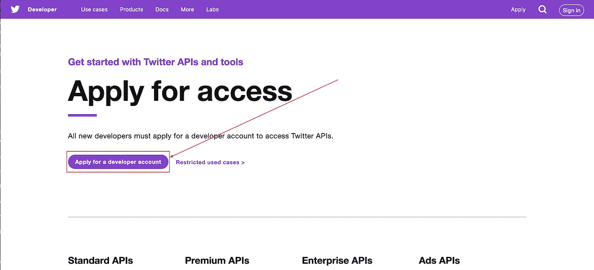
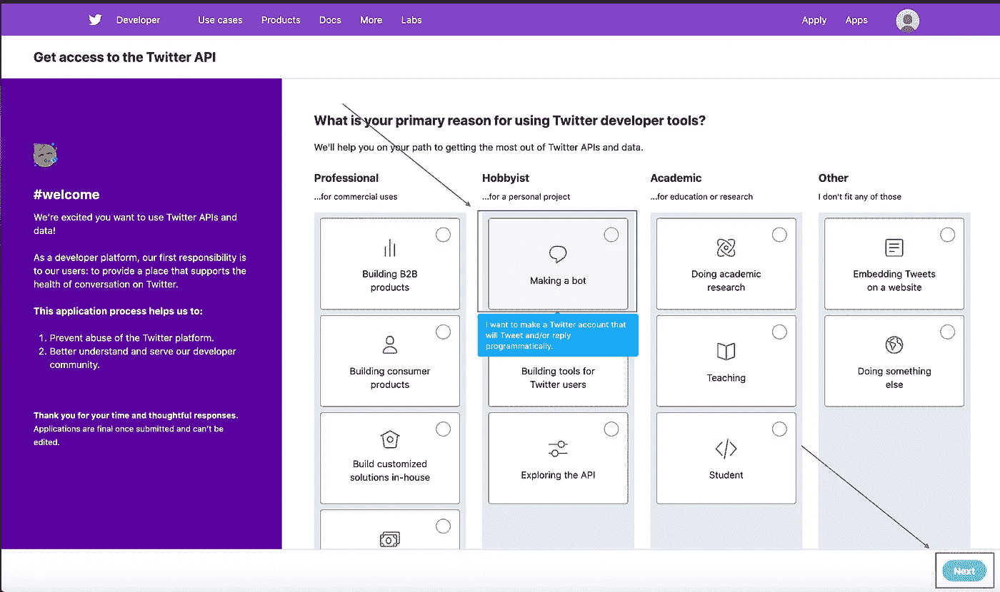
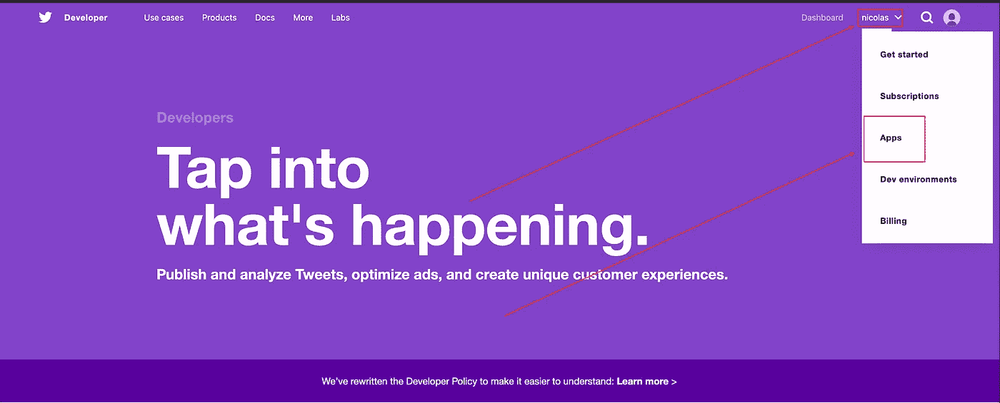
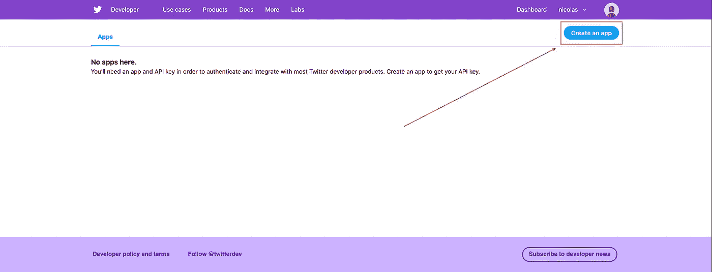

# 如何制作一个 GPT2 Twitter 机器人

> 原文：<https://towardsdatascience.com/how-to-make-a-gpt2-twitter-bot-8669df60e60a?source=collection_archive---------12----------------------->

## 它只有大约 100 行代码，但是 tweets 是无限的。


作者对推特机器人的演绎

# 介绍

我喜欢生成模型。向一台机器展示一堆数据，并让它画一幅画或写一个与原始材料相同的小故事，这是一件神奇的事情。如果我们不能正确地与他人分享，这些愚蠢的小模型有什么用？这毕竟是信息时代。在本帖中，我们将:

1.  从头开始创建一个 Twitter 机器人
2.  训练一个最先进的语言模型来为我们生成文本
3.  使用 Twitter API 来制作您的机器人 tweet！

当你完成教程后，你将能够创建一个像这样的机器人 [one](https://twitter.com/deepproverbs) 来发布生成的谚语。这个项目的所有代码都可以在[这个资源库](https://github.com/nbertagnolli/DeepProverbs)中找到。开始吧:)。

# 设置

本教程将使用 Python3。我们将使用[gp T2-简单库](https://github.com/minimaxir/gpt-2-simple)来训练我们的模型。它依赖于 tensorflow.contrib，后者在 tensorflow 2.0 中已被删除，因此您需要使用早期版本:/。很抱歉。为了简单起见，我把 docker 容器和 Makefile 放在一起，以便在[库](https://github.com/nbertagnolli/DeepProverbs)中运行。您可以通过构建 docker 容器来加载一个工作环境进行游戏:

```
make build
```

然后跑步

```
make run
```

如果 Jupyter 更适合你，你也可以做

```
make run-jupyter
```

请注意，端口设置为 8989，而不是通常的 8888。

# 设置 Twitter

用 Twitter 建立一个机器人只需要你申请一个开发者账户，并把凭证和你想运行的任何代码链接起来。下一节将详细介绍如何设置开发人员帐户。这有点无聊，所以如果你已经有了，就跳到下一部分。

首先登录 Twitter，然后前往他们的[开发者网站](https://developer.twitter.com/)。您应该会看到类似下图的内容。


Twitter 开发者页面

单击右上角的应用按钮。这将带你到一个新的页面，你需要点击“申请一个开发者帐户。”



这将把你带到一个页面，询问你将如何使用开发者账户。我们正在制作一个机器人，所以选择那个，但是如果你感觉辣并且想要做其他事情，也标记那些。



然后填写下一页的所有信息，并添加一个电话号码。


最后一页涉及两个需要回答的问题。下面我概述了我对每个获得批准的问题的回答。如果你打算像我一样使用这个机器人，只是为了有时发推文，请随意复制它们。您可以将其他内容标记为与此 bot 无关。

请用英语描述您计划如何使用 Twitter 数据和/或 API。回复越详细，就越容易审核和批准。

*“我计划建造一个小机器人，它将使用 GPT2、马尔可夫链或 RNN 的某种变体，每天就给定的主题发布简单的推文。目的是通过 Twitter 平台分享这些模型生成的有趣文本。”*

**你的应用会使用推文、转发、赞、关注或直接消息功能吗？**

该应用程序将使用 tweepy Python 库每天更新机器人的 twitter 状态。Python 脚本将从我电脑上的 cron 作业中运行，并将只使用 Tweet 功能。”

你需要等待他们批准你的申请。在这一点上，我们很高兴填写另一个表格描述我们的应用程序！通过单击您的姓名，然后单击应用程序下拉字段，导航至应用程序页面。



单击创建应用程序



填写另一张表格…


一旦所有这些都填好并提交，你就可以开始了。您将在应用页面中看到您的新应用。当你点击细节，你可以得到你的 API 密匙。您只能查看您的访问令牌一次，因此请务必记下它们。我把我的保存在一个 JSON 文件中。这使得我可以很容易地以编程方式访问这些令牌。

```
{"consumer_key": aaaa
"consumer_secret": "bbbb"
"access_key": "cccc"
"access_secret": "dddd"}
```

就是这样！我们终于准备好写一些代码了！

# 获取一些数据

我要让我的推特机器人写一些有趣的谚语。你可以在这里找到我用来训练我的模型[的数据。对于你的，看看你是否能找到一个数据集，其中的主要思想是简短的，并且有相当多的数据。一些想法可能是](https://github.com/nbertagnolli/DeepProverbs/tree/master/Data)[坎耶·韦斯特的推文](https://twitter.com/kanyewest_bot)，现任[和前任](https://twitter.com/deepdrumpf?lang=en)总统的推文，甚至是[魔法卡片](https://twitter.com/roborosewater?lang=en)。

我们将使用的 GPT2 简单模型作用于一个文本文件，所以我们需要做的就是将我们感兴趣的任何文本源编译成一个文本文件。我在培训 GPT2 时喜欢做的一件事是在不同的部分之间添加分隔符，这些分隔符不会出现在文本中。例如，您可以将《箴言》中的所有内容放入一个文件中，或者您可以用“\n==========\n”分隔每个谚语。然后，模型可以了解谚语的开始和结束位置，您可以更容易地解析输出。我已经按照我喜欢的方式设置了谚语文本的格式，其中有一个“\ n = = = = = = = = = = \ n”来分隔每个谚语的结尾，所有多余的字符都已被删除。

# 建造大脑

创建世界级的文本生成模型从未如此简单。当我制作第一个生成模型时，我必须编写大量代码来构建模型、训练模型、从模型中提取合理的预测等等。现在，我们可以在 GPT2 上进行一点迁移学习，并获得比几年前想象的更好的结果。

Max Woolf 创建了一个[惊人的库](https://github.com/minimaxir/gpt-2-simple)，使得微调 [GPT2](https://openai.com/blog/better-language-models/) 变得超级容易。我们将采用他所有的优秀成果，并使用该界面进行培训。以下 30 行代码是微调同类最佳生成模型所需的全部内容。gpt2_simple **finetune** 函数接受几个值得解释的参数。

微调 GPT2 模型的代码

*   **会话**该会话只是当前的 Tensorflow 会话
*   **数据集**这是加载并用于训练的文本文件的路径，稍后将详细介绍。
*   **型号名称**要使用的 GPT2 型号名称可以是 117M、124M 或 355M。124M 在我的 1080Ti GPU 上很好用。
*   **步数**模型要走的步数。这个数字应该足够大，至少可以遍历整个数据集一次，但也不能大到让你无法适应。当在相对较小的数据集上微调 GPT2 时，我喜欢做一到两个时期。然后我进行测试，以确保它生成的内容不是直接来自训练集。

我们可以通过使用`wc`实用程序查看文本中的总字数来计算步骤数:

```
wc Data/proverbs_clean.txt
```

生产

```
1816   15984   93056 Data/proverbs_clean.txt
```

我们可以看到这个文件有 1，816 行，15，984 个单词和 93，056 个字符。步骤中传递给模型的默认字数由 **sample_length** 参数设置，默认为 1023。所以 15984 / 1023 = 15.6。所以每 16 步我们都要检查一次所有的数据。这意味着我们应该训练我们的模型走 33 到 66 步。以避免过度拟合。

要生成给定模型的新文本，我们可以使用 gpt2_simple.generate 函数，如下所示:

```
sess = gpt2.start_tf_sess()
gpt2.load_gpt2(sess, checkpoint_dir=checkpoint_dir)
text = gpt2.generate(
    sess,
    checkpoint_dir=checkpoint_dir,
    length=length,
    temperature=temperature,
    destination_path=destination_path,
    prefix=prefix,
    return_as_list=True
)
```

让我们再次分解这些论点。

*   **sess** 是我们想要使用的 tensorflow 会话
*   **checkpoint_dir** 是从我们的微调到保存的检查点的路径
*   **温度**是大于 0 的值，我喜欢在 0.8 到 2 之间玩。温度越低，你的输出就越稳定和可预测；温度越高，它们就越狂野、有趣，甚至可能是荒谬的。
*   **destination_path** 是保存文本的路径。如果你只是想内联返回它，让这个 **None**
*   **前缀**是个好玩的。它可以是用于播种模型的文本字符串。因此，如果你以“你不应该”开始，那么模型将写下接下来的单词，就好像它以“你不应该”开始一样。
*   **return_as_list** 将使函数返回文本，而不只是打印出来。

运行这段代码，我们可以生成一些谚语！

```
for he that taketh away his beret also with food, and as a disorderly child, so hath a man a very strange prayer
==========
for though it seem good to us to be taken, yet a man that hath it in his heart never cometh out of it
==========
he that hath his substance with him seeketh out knowledge and hath neither toy with his heart
==========
for a stranger cometh when i talk with him, and delivereth him, so that i may give to him even as the blood I drink, and a spare change my food
```

# 建造机器人

我们有数据，一个根据我们的数据训练的模型，和一个 Twitter 开发者账户，剩下的就是把它们连接起来。我们的机器人需要做三件事。

1.  使用 Twitter API 进行身份验证
2.  产生一句谚语
3.  把这句谚语发到推特上。

幸运的是 Tweepy 让第一和第三部分变得非常简单，我们已经完成了第二部分！

## 证明

首先，我们需要将我们的凭证放入 Python。正如我前面提到的，我把我的保存在一个小的 JSON 文件中，所以用 Python 加载它非常容易。

```
# Parse the credentials for the twitter bot
with open("twitter.json", "r") as json_file:
    twitter_creds = json.load(json_file)

# Set the credentials based on the credentials file
CONSUMER_KEY = twitter_creds['consumer_key']
CONSUMER_SECRET = twitter_creds['consumer_secret']
ACCESS_KEY = twitter_creds['access_key']
ACCESS_SECRET = twitter_creds['access_secret']
```

有了所有这些凭证，我们可以使用 Tweepy 通过 Twitter API 进行身份验证。

```
# Authenticate with the Twitter API
auth = tweepy.OAuthHandler(CONSUMER_KEY, CONSUMER_SECRET)
auth.set_access_token(ACCESS_KEY, ACCESS_SECRET)
api = tweepy.API(auth)
```

## 文本生成

现在，我们可以使用之前编写的代码生成新的文本。我将所有这些打包成一个名为 **generate_text** 的小函数。生成文本后，我们要确保不要抓取任何超过 280 个字符的文本，因为这是 Twitter 的 tweet 限制。

```
# Generate some text
generated_text = generate_text(checkpoint_dir, length, temperature, None, prefix)

# Parse out all "sentences" by splitting on "\n———————\n"
split_text = generated_text.split("\n———————\n")

# Filter out all examples which are longer than 140 characters
valid_text = [x for x in split_text if len(x) <= 140]
```

## 推特！

微博现在只有两行了！随机选择一个谚语，然后使用 Tweepy 更新机器人状态！

```
tweet = np.random.choice(valid_text, 1)
api.update_status(tweet[0])
```

就在那里！

# 包扎

我们有代码来生成圣经谚语风格的推文，也有技术来处理任何文本语料库！我通常只是在我的服务器上安排一个 cron 作业，每天运行一到两次。我已经在[库](https://github.com/nbertagnolli/DeepProverbs)中包含了一个 Makefile，使得用一个命令就能让机器人发布 tweet 变得容易。只需运行:

```
make CHECKPOINT_DIR="deepproverbs" TWITTER_CREDS="twitter.json" tweet
```

我把我们今天写的所有代码都打包成了一些漂亮的点击函数，所以应该很容易从命令行运行。