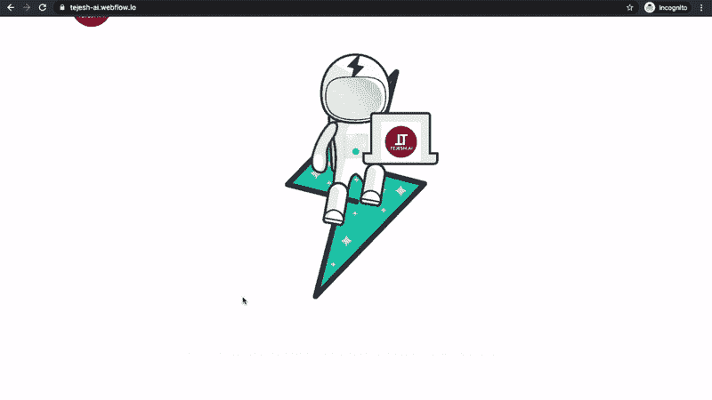
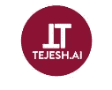
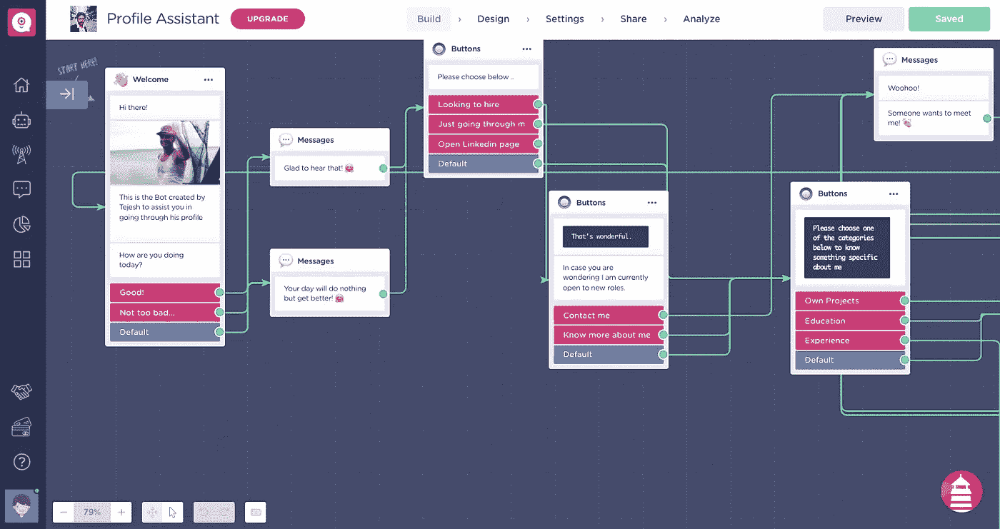
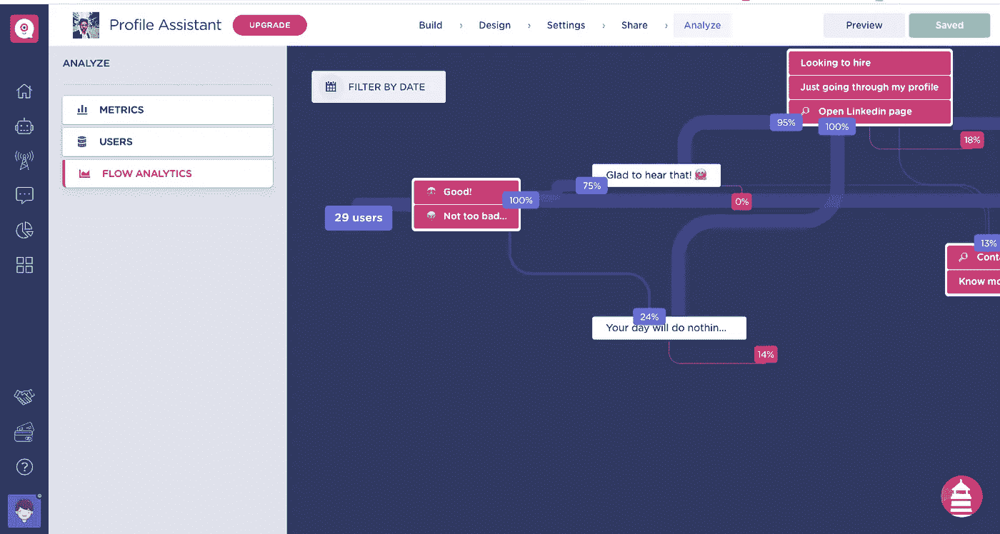
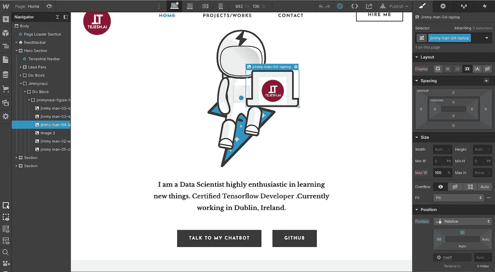
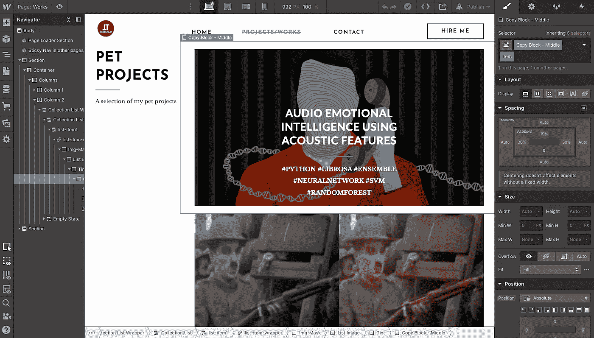

# 如何建立黑仔数据科学投资组合？

> 原文：<https://towardsdatascience.com/how-to-make-a-killer-data-science-portfolio-219424a4e0d2?source=collection_archive---------0----------------------->

## 与聊天机器人集成

达米尔·斯班尼克在 [Unsplash](https://unsplash.com?utm_source=medium&utm_medium=referral) 上拍摄的照片

我会跟你直说。如果你现在试图找一份工作，这绝对是一种折磨，因为数据科学家是 21 世纪最性感的工作，因为竞争非常激烈，每天都在增长。

事实是，除非你站出来，吹嘘自己，否则你不会成功。嘿，*如果你不为自己做，别人也不会做*。

这是我在找工作的时候告诉自己的，仅仅通过简历申请和分享 LinkedIn 和 GitHub 个人资料不会有任何进展。

每个人都忙于自己的生活，你需要让它变得特别，需要时间。然后我认为有一个杀手级的投资组合网站来展示我的项目、技能和兴趣并不是一个坏主意。

> 但是我该怎么做呢？

正如 Julia Nikulski 在她的文章中提到的，作为数据科学家，我们并不经常使用 HTML、CSS、JavaScript 或 Flask。对于一个典型的数据科学家来说，编码和创建一个网站显然非常耗时，而且质量没有保证。

在谷歌上快速搜索后，我找到了数百个教程，可以帮助你在 30 分钟内建立和部署一个像样的单页文件夹。但是他们不是真正的杀手标准质量，我也需要为域名和托管服务支付少量的钱，我不准备这样做。

我保证自己不会投入大量的时间和精力来创建一个网站，因为它只是一个助手，但我希望有一个吸引注意力的杀手级网站，因为我对 NLP 特别感兴趣，我肯定希望在其中集成一个聊天机器人，因为它可以向用户表明我对 NLP 表现出额外的兴趣。准确地说，我个人的要求是

> 没有 HTML / Java 脚本代码
> 
> 零价格和免维护
> 
> 惊艳 UX 吸引眼球
> 
> 笔记本电脑、平板电脑和移动设备布局的单一设计
> 
> 聊天机器人集成
> 
> Linkedin 和 Github 导航

如果你认为我的要求不切实际，甚至贪婪。但我向你保证这是可能的。你可以在这里看到我的作品集。如果你只使用一个信号源，那肯定是不行的，你需要使用 3 个信号源。

1.  Webflow
2.  陆地机器人
3.  坎瓦

ebflow 创建网站，Landbot 创建聊天机器人，Canva 创建徽标。所有这些资源都提供免费增值服务。我确保坚持自由放养。

选择 [Webflow](https://webflow.com/) 的原因是因为你只需点击一个按钮就可以部署你的网站，域名中有你的名字，还有免费的托管服务。要导航到 Chatbot、GitHub、Linkedin 页面，您可以使用带有超链接的按钮。全部免费。下一节将详细介绍 Lanbot 和 Canva。

作者图片来自[作者网站](https://tejesh-ai.webflow.io/)

# 3 步指南:

你可以通过三个简单的步骤获得这样一个令人敬畏的投资组合网站。

## 第一步:标识

为你的网站创建一个标志。

虽然这不是强制性的，但我强烈建议你制作自己的 logo，因为它会立刻让用户感觉他/她进入了你的世界。

作者的徽标图像

您可以使用[canva.com](https://www.canva.com/)从可用的免费徽标模板中快速制作您的徽标。如果你已经有了一个设计方案，你可以在 5 分钟内完成，并下载成图片。

您将在稍后创建网站时在 Webflow 中使用它。

## 步骤 2:聊天机器人

拥有一个个人聊天机器人可以提升你的作品集，让它变得互动和有趣。如果你像我一样对 NLP 领域感兴趣，我认为这是一个必须的广告。

你有两个选择。第一，你可以用 python 自己制作一个简单的聊天机器人，可以谈论你的教育，个人项目，分享你的联系方式等。第二，你可以使用像 Lanbot 这样的免费平台，在不到 15 分钟的时间里创建一个有趣的基本聊天机器人。

如果你想选择第一个选项并寻求帮助，你可以关注徐哲睿的文章

 [## 如何在不到一小时的时间内用 Python 和深度学习创建聊天机器人

### 显然不要指望会是 Siri 或者 Alexa…

towardsdatascience.com](/how-to-create-a-chatbot-with-python-deep-learning-in-less-than-an-hour-56a063bdfc44) 

对于第二种选择(我用过)，有很多平台，比如 [Dialogflow](https://dialogflow.cloud.google.com/#/login) 、 [Collect.chat](https://collect.chat/#_r_geekflare) 、 [Chatfuel](https://chatfuel.com/) 、 [Morph.ai](http://Morph.ai) 、 [Landbot.io](https://landbot.io/) 等

选择 **Landbot.io** 的原因是，据我所知，这是唯一一个平台，它不仅提供了用于集成的 JavaScript 代码片段，还提供了一个超链接，我可以在按钮下使用它进行导航。

一旦你进入了，在 Landbot 中创建一个聊天机器人是很容易的。它更像是 if-else 循环。如果你需要更多的信息，你可以看看兰德机器人的[学院页面](https://landbot.thinkific.com/)。

图片来自作者的 Landbot 创建页面

> Landbot 跟踪用户，并提供关于谁在何时、何地以及如何使用的分析。

来自作者的 Landbot 分析页面的作者图片

如果你在数据科学领域，你知道跟踪数据和信息有多有用。

你可以在这里看到我完全开发的聊天机器人。

 [## Tejesh.ai

### io 是一个创建对话界面来代替表单的工具。不需要编码！

landbot.io](https://landbot.io/u/H-351396-6XX1VDBMWWRQM117/index.html) 

## 第三步:网站

在 Webflow 中，如果你想从头开始建立一个网站，你可以通过拖放内置工具来建立一个网站，或者**更好的选择是，你可以选择和克隆**数百个已经用 Webflow 建立的网站。

 [## 响应式 web 设计工具、CMS 和托管平台| Webflow

### 我们的大学、博客和展示平台为您提供成功所需的教育、见解和灵感…

webflow.com](https://webflow.com/?r=0) 

您可以在 [showcase](https://webflow.com/discover/popular) 选项卡中看到模板。你所要做的就是选择一个适合你风格和品味的网站，并确保你点击 clonable 只看到允许克隆的网站。

> 专业提示:Webflow 中几乎所有的网站都非常漂亮，我觉得很难从中选出最好的。如果你写下你想容易过滤掉的特征，这会对你有所帮助。

确保在项目设置中选择合适的**域名**。我用了有我名字的' **tejesh-ai** '，然后**在图标部分上传你设计的 logo** 。

我创建的作品集是从吉米制作的网站[**克隆而来的**。我对克隆版本做了一些修改，插入了我的徽标，还创建了按钮让用户导航到我的聊天机器人和 Github。****](https://webflow.com/website/Jimmy-Makes-Things-Design-Development-Collective\)

作者的 Webflow 设计页面中作者的主屏幕图像

我使用**集合**在工作页面中列出了一些我选择的项目，并在每个项目的底部设计了一个 GitHub 页面导航按钮。

作者的 Webflow 设计页面中作者的工作屏幕图像

在所有的改变之后，只要确定**在不同的布局上看起来如何，特别是在移动中**。如果你想改变元素的位置，完成后点击顶部的**发布按钮**。

就是这样，你现在可以在你的简历、Linkedin、Twitter 中复制并添加链接，并与全世界分享。

# 最后的话

我知道在这个竞争激烈的数据科学领域脱颖而出并不容易，但做一些小事，比如在你的个人资料中添加一个投资组合，肯定会给你带来优势。如果有人在看到你的作品集后开始和你交谈，不要惊讶。

如果你决定制作一个作品集，请不要满足于平庸的 UX 设计，当你有机会轻松制作一个杀手作品集的时候。

我想给你的一个建议是让你的投资组合保持活力。不管怎样，你添加的项目和作品是人们最关注的。所以请不断更新你的作品👋。

让我知道你是否尝试过这个，如果你面临任何封锁，在这个帖子里留下评论，我会尽力帮助你。

# 参考

1.  《哈佛商业评论》——[https://HBR . org/2012/10/data-scientist-the-sexy-job of-the-ST-century](https://hbr.org/2012/10/data-scientist-the-sexiest-job-of-the-21st-century)