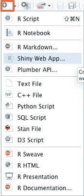
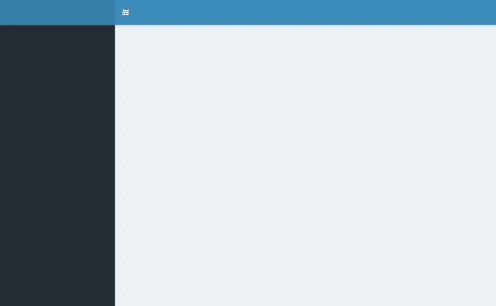
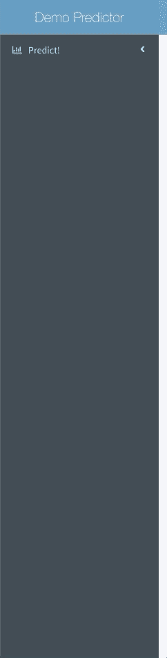
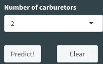
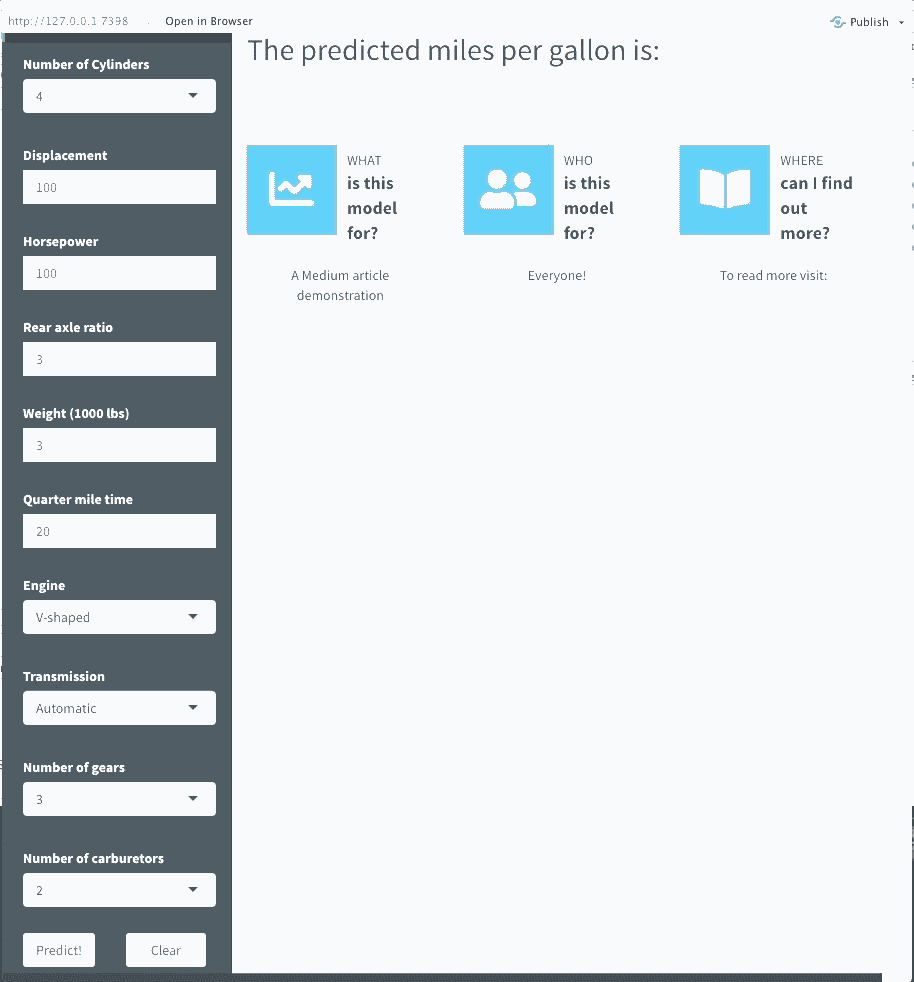

# 如何制作一个专业外观的闪亮应用程序，而不被吓倒

> 原文：<https://towardsdatascience.com/how-to-make-a-professional-shiny-app-and-not-get-intimidated-with-r-991e636dd111?source=collection_archive---------9----------------------->

## 使用 mtcars 的分步示例

# 介绍

这篇文章的目标读者是有 R(最好是 tidyverse)经验的人，他们想学习如何开始制作闪亮的应用程序。对于那些以前没有听说过 Shiny 的人来说，这是一个包，它允许你使用 R 创建 web 应用程序，而不需要知道任何 HTML、CSS 或 Javascript。也就是说，如果你真的想深入应用程序开发，学习 HTML、CSS 和 Javascript 将提高你做更强大的事情的能力，并对应用程序开发过程有更多的控制。然而，由于可以使用如此多的工具，这可能会让人不知所措。因此，这篇文章旨在为*开始*制作一个专业外观的闪亮应用程序提供一些基线代码和闪亮的概念。我希望，通过遵循本文中的步骤，您将能够立即开发出一个干净的高质量的应用程序。每一步，如果你好奇，你可以谷歌一下，我认为这是最好的学习方法之一。

直接进入一个更专业的应用程序，而不是从样板闪亮的例子开始，背后的动机是因为理论和中间的弯路往往会延长*做*的道路，这可能会挫伤你的积极性。我的哲学是，一旦你开始*做*某件事，你将能够 1)为你已经做的先进的事情感到骄傲，2)以后补充细节。我不会对 Shiny 理论或 Shiny 的一些更复杂的底层组件进行太多的详细描述，但 Hadley Wickham 正在进行的在线教科书[是一个很好的资源。因此，对于这篇文章，请耐心听我说，我没有全面解释的任何术语或概念都需要您花费一些精力来查找。](https://mastering-shiny.org)

# 设置

当您第一次安装`shiny`包并重启 RStudio 工作空间时，您会看到一个选项来初始化闪亮的 web 应用程序，如下所示:



这将带你到一个提示，让你选择初始化应用程序在一个单一的文件(应用程序。r)或两个文件(ui。r 和服务器。r)。我将在这里提到，任何闪亮应用的主干都由两个组件组成:定义应用如何出现的 **UI** (用户界面)和定义应用如何工作的**服务器**。对于这个例子，我们实际上有三个文件(ui。r，服务器。r，和 app。r，最后一个是我们加载所有包的地方，`source`UI 和服务器脚本，并运行应用程序。这种三脚本框架通常用于更复杂的闪亮应用程序，尽管我今天将带你们浏览的示例应用程序相当简单，但开始培养良好的习惯还是有好处的。所以你们可以做的是继续做三个新的 R 脚本文件，并把它们命名为“ui”。r”，“服务器。r”和“app。r”。

# app。稀有

让我们从简单的开始。将以下代码复制并粘贴到您的应用程序中。r 文件。

我们目前要关注的主要库是`shiny`和`shinydashboard`。我们使用`shinydashboard`是因为它是一个简洁的包，提供了一个清晰的[接口](https://rstudio.github.io/shinydashboard/index.html)来呈现数据和图表。

# 闪亮的应用程序

因此，在我们继续讨论 UI 和服务器之前，让我们先来讨论一下我们正在构建的应用程序实际上会是什么样的！我们将使用`mtcars`数据集并构建一个简单的线性回归 OLS 模型来预测`mpg`或每加仑英里数。app 界面将允许用户更改各种输入，输出将是一个预测的`mpg`。当然，预测的 mpg 本身是没有意义的，因为模型会被过度拟合(我们在构建模型的同一个数据集上进行预测)，但这不是我们本次练习的关注点。

# UI。稀有

仪表板有三个部分:标题、侧栏和主体。最简单的示例会生成以下内容:

```
ui <- dashboardPage(
  dashboardHeader(),
  dashboardSidebar(),
  dashboardBody()
)

server <- function(input, output) { }

shinyApp(ui, server)
```



因此，对于这个应用程序，我在考虑将输入放在侧边栏(黑色部分)，输出放在主体(浅蓝色部分)。对于更复杂的应用程序，指定单独的标题、侧边栏和主体对象是一个好习惯。我们将从**标题**开始，因为它最简单。

```
header <- dashboardHeader(title = “Demo Predictor”)
```

接下来，让我们开始用我们希望用户能够选择的输入填充**侧栏**界面；这些将是 mtcars 数据集中的预测变量。为了简单起见，我们将分类变量设为 a `selectInput`，它将为用户提供一个下拉菜单选项，而连续变量设为 a `numericInput`，它将允许用户输入一个数字。这些输入基本上有三个关键参数(还有更多，但我会让您自己去探索):输入 ID(稍后我们将在将服务器连接到 UI 时使用)、标签(显示在应用程序中的文本)和值。注意，输入 ID 必须是一个简单的字符串，只包含字母、数字和下划线(不允许空格、破折号、句点或其他特殊字符！)且必须唯一。如需更多类型的输入，请查看本[章节](https://mastering-shiny.org/basic-ui.html#inputs)。

这是它目前的样子:



点击预测！要下拉的菜单项

这里有一些评论。所以我使用`sidebarMenu`布局中的菜单项来存储我想要的下拉菜单，点击即可显示/隐藏。我使用的参数如下(当然还有更多):

```
menuItem(text = "Predict!", tabName = "model", icon = icon("bar-chart-o"),...)
```

其中文本是显示的内容以及菜单项将激活的选项卡的名称。现在不要太担心 tabName，如果我们想对菜单项如何与仪表板的其他部分交互有更多的控制，或者如果我们想用 HTML/CSS/Javascript 进一步定制它，它主要是存在的。请注意，您在代码中列出各项的顺序就是这些项出现的顺序。另外两个组件是“预测！”和“清除”按钮。



目前，如果你按下它们，什么都不会发生，因为我们还没有为这两个按钮指定一个服务器功能，但最终“预测！”将输出一个预测的 mpg 和“清除”重置所有输入。请注意，它们周围有一些代码看起来一点也不像 R 代码。那是因为那是 CSS(层叠样式表)，是一种定制网站元素外观的语言。我写的代码基本上是将两个按钮并排放在同一行，但是同样，不要太担心细节。

最后，让我们填写正文。

在这里，我介绍一个`verbatimTextOutput()`，它将打印预测的 mpg。它通常与`renderText()`成对出现，我将在稍后的服务器代码中讨论。闪亮 UI 设计中的另一个重要概念是`fluidRow()`。流体行的宽度为 12，因此您可以将内容组织在宽度总计为 12 的列或框中。最后一个概念是标记，但这更高级一些，因为标记允许您更好地控制 HTML/CSS/Javascript 元素。在这里，只需要知道`tags$style`允许我改变 CSS 元素来定制字体大小和家族之类的东西。

现在，我们有了所有的 UI 组件，所以我们像这样把所有的东西放在一起。

```
ui <- dashboardPage(header, 
                    sidebar, 
                    body, 
                    useShinyjs()
)
```

# 服务器。稀有

您必须记住的是，对于您做出的任何具有输入 ID 的 UI 决策，您都应该将一个服务器函数与它配对(这是一个通用的经验法则)。所以你会记得我们有所有的 mtcar 变量输入，即“预测！”按钮和“清除”按钮。服务器功能非常简单。我们希望在线性回归模型中使用所有变量输入。我们还将编写一些单独的代码来重置这些值。

这就是输入 ID 变得重要的地方。它必须是唯一的，因为在服务器中，您使用`input$someID`引用输入。我将分解三个功能:

*   `observeEvent()`
*   `eventReactive()`
*   `output$pred <- renderText(pred())`

然而，要理解这些，我不得不谈谈**反应性**。反应是 Shiny 的一个核心组成部分，不可否认，最初你可能很难理解这一点。本质上，反应性的要点是任何时候用户改变输入，我们不希望所有的代码都重新运行；我们希望控制何时重新运行代码的某些部分。这一点很重要，因为想象一下，如果你每次在网站上进行点击或滚动等操作时，网站每次都要重新加载，那将是有史以来最令人沮丧的网站！对于反应性的更深入的描述，请务必查看 Hadley Wickham 的第[章](https://mastering-shiny.org/basic-reactivity.html#reactive-expressions)中的内容。

`observeEvent()`基本上告诉应用程序做一个动作，在这种情况下，在某个动作时将值重置回默认值，在我们的情况下，就是单击我们称为“清除”的`actionButton()`(ID 为“reset”)。我使用`eventReactive()`来指定当用户点击“预测”时我想要运行的代码按钮，这是一些相当简单的 dplyr 和基本预测函数。我甚至可以通过在外部执行争论来提高效率，这样它就不必每次都重新运行，但是现在，由于它是一个小数据集，代码仍然运行得非常快。当我将一个`eventReactive()`语句保存为 R 对象时，为了再次调用它，我必须把它当作一个函数来处理(这是 Shiny 的反应式编程方式)。这就是为什么`pred`变成了`pred()`。最后一件事是呈现我们用`renderText`做的输出，我们必须用正确的 ID 将它分配给输出，所以回想一下在我们的 UI 脚本中，我们指定了`verbatimTextOutput(pred)`。

这是我们运行该应用程序时的样子`shinyApp(ui, server)`。



# 结论

Shiny 是现有 R 用户进入网站和应用程序开发的一种非常简单和用户友好的方式。一个闪亮的应用程序可以成为传达你的见解的强大工具，并允许用户自己探索概念和见解。使用类似`shinydashboard`的东西真的很有帮助，因为不管我们是否意识到，一个应用程序的设计方式真的很重要。我们的体验越无缝、越直观，通常就有越多的隐藏的东西让这一切发生。对于那些对此感兴趣的人，我鼓励使用这个应用程序作为跳板，并尝试融入新的功能。试图学习所有的 HTML、CSS 和 Javascript 太难了，绝对不推荐，所以下面是我推荐的一些资源，供你参考:

*   [高级闪亮提示](https://github.com/daattali/advanced-shiny#shinyjs)
*   [如何让你闪亮的仪表盘跑得更快](https://blog.rstudio.com/2020/07/21/4-tips-to-make-your-shiny-dashboard-faster/?utm_source=appsilon_blog&utm_medium=blog&utm_campaign=appsilon)
*   [Shinyjs](https://deanattali.com/shinyjs/)
*   哈德利·韦翰闪亮的衣服

尽情享受吧！