# 如何制作一个简单的聊天机器人

> 原文：<https://towardsdatascience.com/how-to-make-a-simple-chatbot-841b5efa2094?source=collection_archive---------22----------------------->

## 不到 10 分钟

因为教程通常更容易实时跟踪。

你可能听说过围绕人工智能的炒作。也许你是一个商业领袖或者一个有抱负的学生。不管怎样，你可能已经看到标题声称“人工智能正在崛起”，处于发展的顶峰，准备在工作中包容人类。好吧，我让你自己判断这个决定。在这篇关于构建应用聊天机器人的温和介绍中，我向你展示了任何明智的个人都可以创造的基本能力，这些能力只有通过谷歌上的 [Dialogflow](https://dialogflow.cloud.google.com/) 和 [Actions 提供的工具才能实现。](https://developers.google.com/assistant)

那么，到底什么是***什么是*** Dialogflow 呢？简单的答案是:帮助人们以更简化的方式与技术互动。例如，假设我问我的机器，“今天我附近有哪些咖啡店营业？”对于更传统或硬编码的系统，如果问题不是以这种方式提出的，那么系统就不能理解你在说什么。至少在英语中，用不同的词来传达相同的“意思”有几种方式…

*   “星巴克开门了吗？”
*   “今天我可以去哪些咖啡店？”
*   “什么咖啡馆接移动订单？”

我们喜欢 Dialogflow，因为它可以处理这些不同的最终用户体验。为了打破这种对人类话语差异的基本理解，我将(非常)简要回顾 Dialogflow 背后的一些基本原则，这将使本教程的其余部分更容易理解，并且*应该*为您提供一个未来聊天机器人交互的有用框架。

现在在 Dialogflow 中，我们也有称为**代理的实体。**这些虚拟代理处理与最终用户的对话。这些人经过训练，像呼叫中心代理一样，处理预期的对话。

代理学会识别被称为**意图的东西，**作为人类，我们自然理解为与你的动机有关的东西，或者问某事的原因。也许你听了某人的漫谈，你可能会在内心深处想“说重点！”好吧，你最终能够跟上谈话，因为你在谈话中不断评估某人意图的可能性。同样，意图被用来帮助你的虚拟代理获取一个短语，并理解用户或说话者想要从对话中得到什么，然后通知代理的最终响应。

因此，以咖啡馆为例，意图可以描述为“寻找咖啡馆意图”在您甚至可以点星巴克之前，代理需要知道在哪里可以找到咖啡馆，所以我们在第一次传递中会询问您的邮政编码。有了这个意图，我们的代理就知道要监听什么样的参数，需要提取什么样的数据，以及代理应该给你的最终用户什么样的回答或响应。一些示例响应可能是:

*   "当然，星巴克就在离你 0.1 英里的地方."
*   "离你两公里以内的菲尔茨咖啡已经关门了."

最后，在每个意图中，我们可以定义**实体、**来识别我们应该从用户话语中提取的关键数据。从概念上讲，这些就像是代理应该在对话中寻找的对象，比如“日期”或“位置”也许实体类型甚至更加定制化，例如“咖啡”实体匹配不同类型的咖啡(美式咖啡、摩卡咖啡、冰拿铁咖啡),可以通过我们的咖啡代理商购买。

在我们进入这个过程之前，要考虑的最后一个组件是对话流**上下文**。正如上下文在正常对话中的重要性一样，对话流代理需要理解上下文，以便与意图相匹配。例如，如果你在人行道上随意走到某人面前，说，“好吧，我们点一杯摩卡！”，那么你很可能会受到困惑的目光，而这个谦逊的陌生人可能会说一些类似于“嗯，你是谁？”

然而，如果你先问同一个陌生人“嘿，我附近有什么咖啡店开门吗？”，然后你设置一个“咖啡馆购物环境”因此，如果你接着问“我可以点一杯摩卡吗？”的话，这位先前感到困惑的陌生人可能会做出更正常的反应

使用谷歌助手构建聊天机器人的最后一个“基础”是一个**动作。**顾名思义，一个动作可以是发起与助手互动的第一个切入点。这就像当我们以“嗨，星巴克博士！”为了激活我们的星巴克聊天机器人。然而，更广义地定义，一个动作通过一些服务、应用或逻辑来实现或执行一些用户定义的意图。

如果你还有任何问题，请随时直接联系我或查看 YouTube 视频。与此同时，让我们把手弄脏吧！

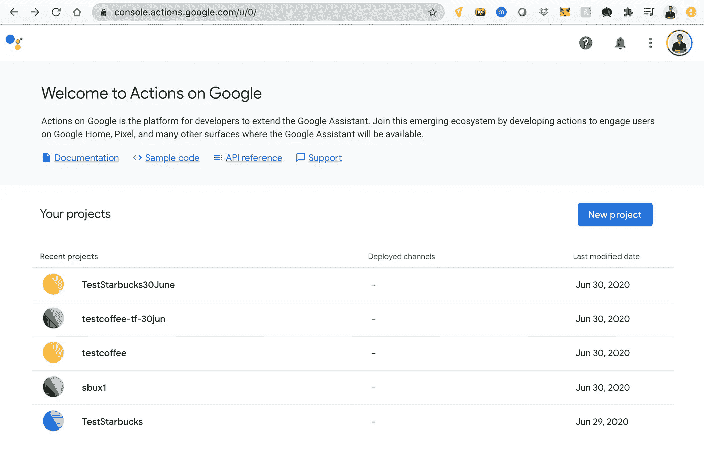

你的首页截图。

1.  首先，你想参观:[https://console.actions.google.com/u/0/](https://console.actions.google.com/u/0/)

2.从这里，你点击“新项目”以确定一个暂定的“项目名称”我们将对其进行自定义，您可以点击“对话”按钮记住，我是 2020 年 6 月 30 日做这个的，所以有可能界面又变了。但是对于那些及时看到这个的人来说，我希望这有助于激起你的兴趣。现在，向下滚动到底部，确保**在 Dialogflow 中定义一个动作。**

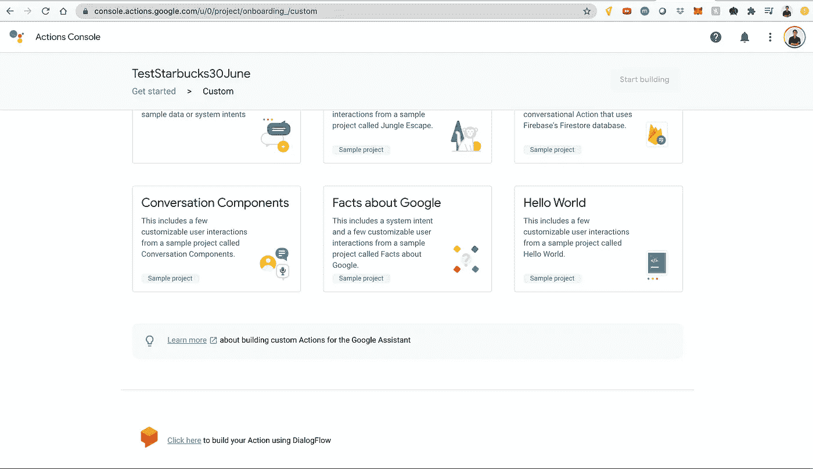

“单击此处使用 Dialogflow 构建您的操作”将位于自定义菜单的底部。

3.接下来，点击“决定如何调用您的操作”。然后，您将看到设置和显示名称。这是我们用来触发我们的代理并激活他或她的名字。我们要打电话给我们的代理商，星巴克的代理商 S。一个好听的中性名字。一定要保存好。

4.然后，您将能够指定操作。点击开始。这将打开一系列窗口，最终将带您进入 Dialogflow，在这一步的加载过程中，您可能需要授权您的 Gmail 登录 Dialogflow。

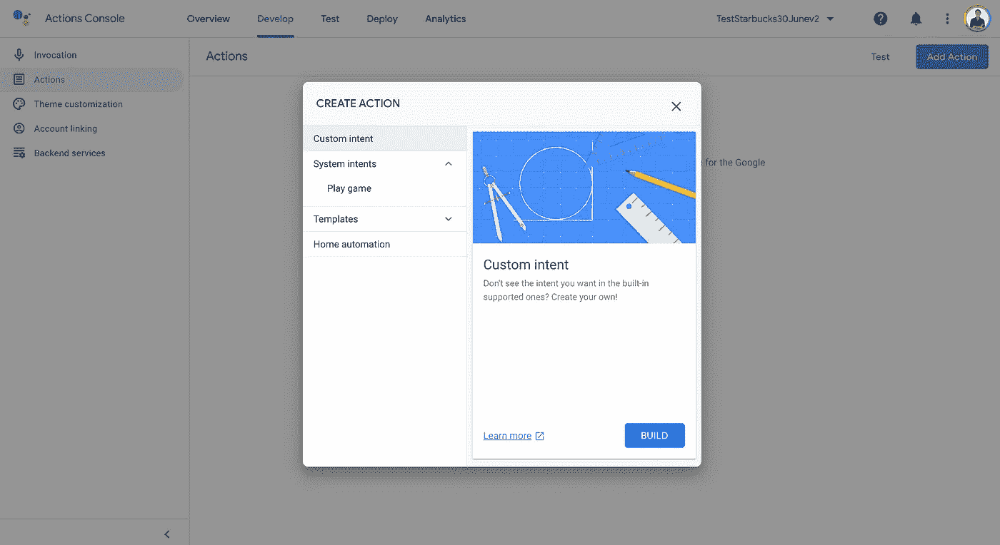

“动作”按钮在左边，在“调用”下面在 Create Action 下，点击“Build”，**应该会把你带到 Dialogflow，如果之前的指示被准确遵循的话。**

**5.从这里，您应该会被带到 Dialogflow 中的“intents”页面。现在我们可以开始构建星芭儿特工的意图了。为相应的对话流选择一个名称，并在继续之前确认您的设置。**

**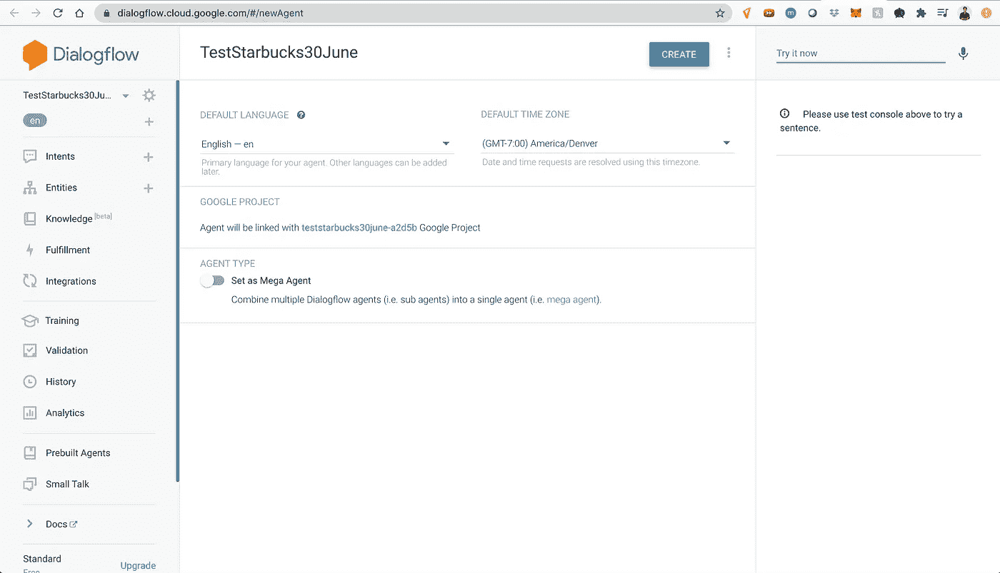**

**您被定向到的默认 dialogflow 页面应该类似于此页面。**

**6.所以我们#幸运，因为我们可以访问默认的欢迎意向对话。太好了。我们要把这一切都扔掉！找到这些训练短语，点击文本字符串右边的垃圾桶图标，就可以把它们全部删除。**

**7.现在，让我们改变回答，针对我们的代理将询问的第一个问题进行定制。我们将通过请求地理定位您附近的星巴克来填充我们的第一个“欢迎，您好”意图。用类似“你住在哪里？”这样的问题填写这一部分或者“我们去星巴克吧。第一，你的邮编是多少？”提供足够的培训短语后，单击保存。单击顶部的蓝色按钮，您应该会在屏幕的右下方看到一个弹出的“intent saved”通知。**

**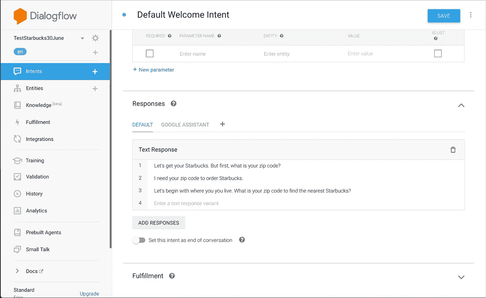**

**响应请求的示例。**

**8.现在，这里有一个很好的实践。在我们使系统变得更复杂之前，让我们测试第一个组件。有用吗？如果管道已经漏水了，你会延长管道吗？大概不会。所以，让我们转换一下话题。让我们回到 Dialogflow 的左侧栏，点击 Integrations。然后，点选谷歌助手，**整合设置。****

**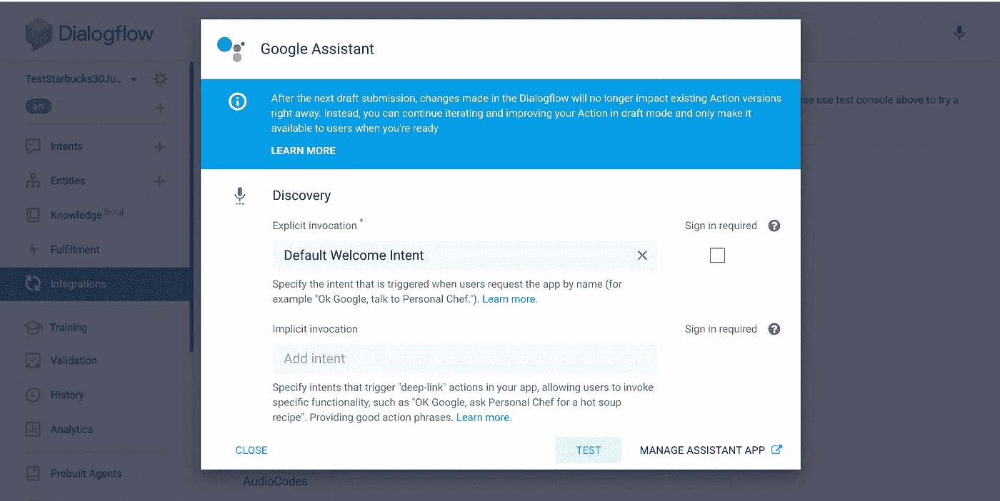**

**点击 Google Assistant 主按钮中的“集成设置”以进入该屏幕。**

**9.在这里，您需要单击 Test。这将我们的动作加载到动作控制台模拟器中。这里有一些很酷的东西，这是由了不起的谷歌开发者社区提供的，他们把这些东西放在一起，不在这个视频的范围内。**

**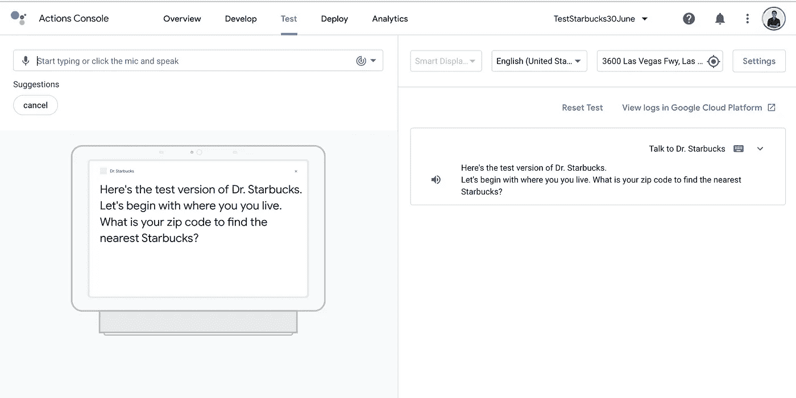**

**为了达到这一点，我点击了“与星巴克博士交谈”，作为我的主要调用，它出现在你现在看到的“取消”的地方**

**10.因此，我们自然希望在之前对话的基础上再接再厉，因此我们将创建一个新的意图。当然，触发这种意图的训练短语必须是我们在前一个中预期的响应。因此，如果我要求一个邮政编码，让我们给系统一些可能的邮政编码有意义，对不对？让我们回到对话流程。然后，我们将单击意向，并将鼠标悬停在默认的欢迎意向上。接下来，我们将创建另一个意向，并填写以下字段。**

**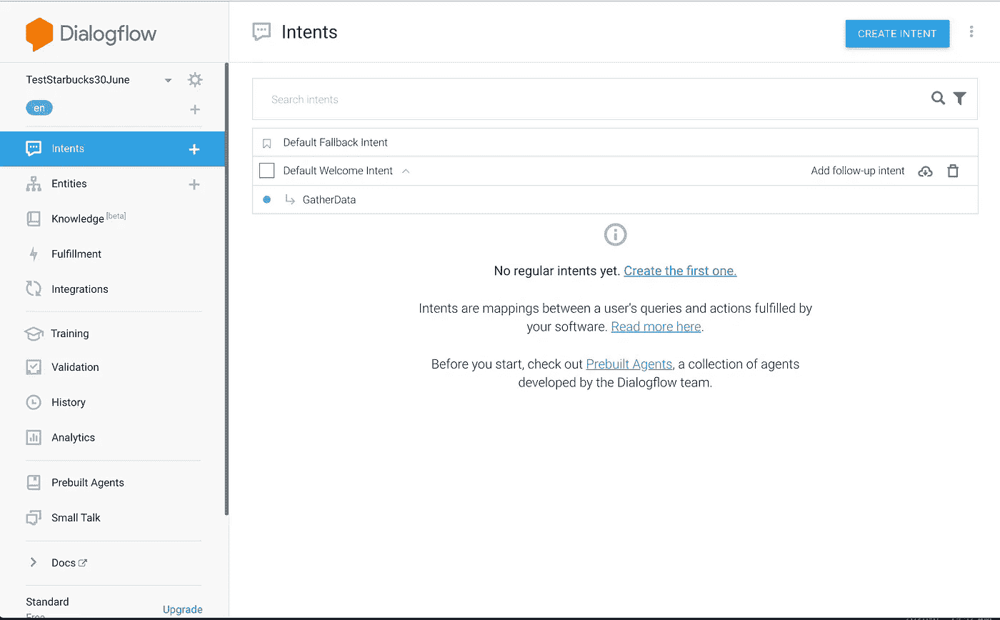**

**当您将鼠标悬停在默认欢迎意向上时，右侧的文本会出现，为您提供“添加跟进意向”的选项在这里，我们可以创建我们的“收集数据”意图。**

**11.重要的是要记住，我们是用这种意图来收集信息的。请注意我是如何填写数据并使其成为必填项的，特别是“尺寸”、“饮料”和“温度”。“如果你从星巴克点餐，他们总是会问这个。欢迎您在这里发挥创意，只要确保创建现实的提示，确定并指定您的代理需要收集哪些参数来获得良好的星巴克订单。下面是一个例子。**

**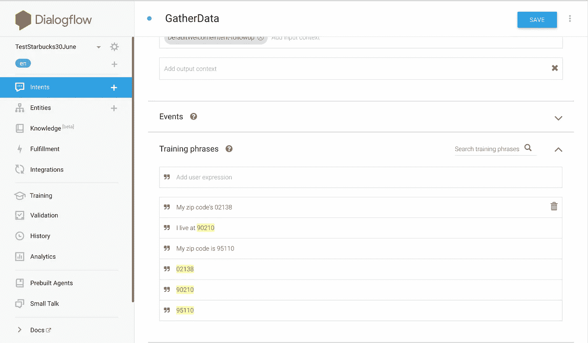**

**在我们的后续意图中，请注意，从逻辑上讲，激活该意图的“训练短语”包含对先前意图提出的“回答问题”的回答:“您的邮政编码是多少？”**

**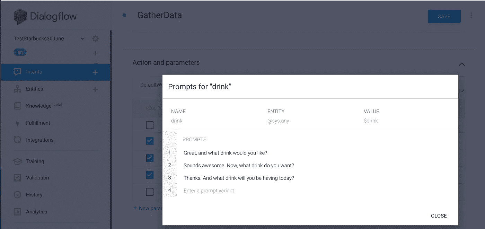**

**在“操作和参数”下，您可以指定代理将用于检索所需实体值的文本提示。在这种情况下，喝酒**

**12.最后一步是让你的星巴克代理指出你的订单的参数并检查它。例如，“你点了一杯大杯冰焦糖玛奇朵吗？”在您成功教会您的代理如何提供这种类型的回应后，我们可以结束对话。**

**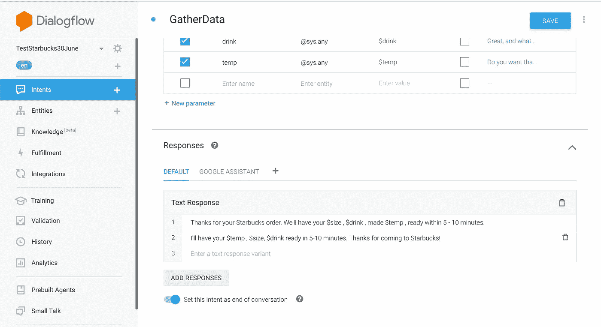**

**请注意，前面确定的实体参数可能会在文本响应中引用。**

**从现在开始，你将有机会在 Google Assistant 测试平台中测试你自己的聊天机器人。当然，这是一个非常基础的“订购星巴克”聊天机器人的介绍版本，它实际上不访问任何 Firebase 数据库，这是一个更接近真实世界的应用程序。如果你有兴趣学习如何做到这一点，那么让我知道！同样，如果你已经看完了这篇文章，那么我希望这篇简短的教程能让聊天机器人不那么神秘。更好的是，如果我已经启发你开始进入人工智能的兔子洞，并建立你自己的聊天机器人！**

**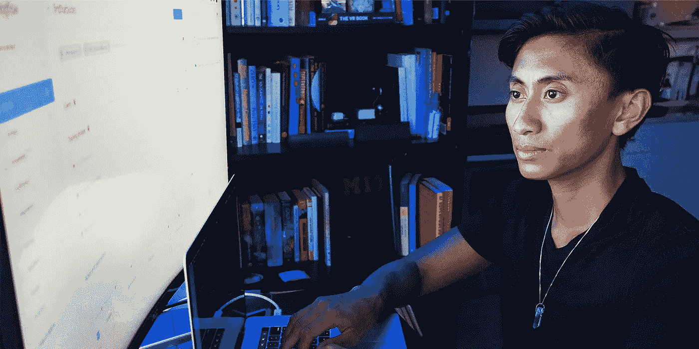**

**在 Insta/Twitter 上找我:@seanbatir。在[https://youtube.com/seanbatir](https://youtube.com/seanbatir)PC:[Mikita Zhur](https://medium.com/u/b24148d80833?source=post_page-----841b5efa2094--------------------------------)了解更多信息**