# 如何用 Python 制作一个 Twitter 机器人

> 原文：<https://towardsdatascience.com/how-to-make-a-twitter-bot-for-free-6bca8298f1ef?source=collection_archive---------13----------------------->

## 了解如何免费使用 Python 和 AWS Lambda 函数开发自己的 Twitter 机器人

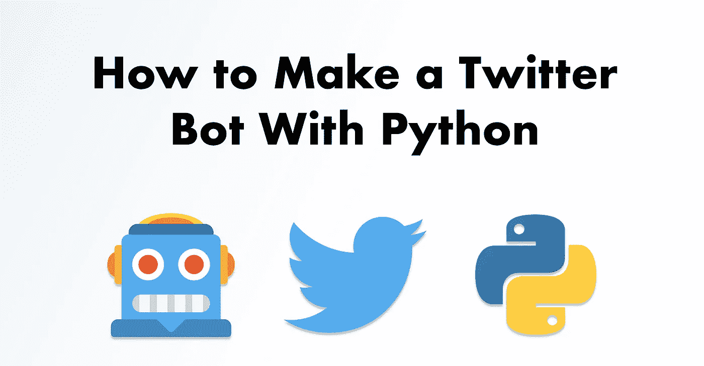

作者图片

# 目录

1.  什么是推特机器人？
2.  制造推特机器人有哪些选择？
3.  如何使用 Python 和 AWS Lambda 制作一个 Twitter 机器人
    -建立一个 Twitter 开发者账户
    -创建一个 Twitter 应用
    -在你的本地机器上开发你的机器人
4.  将您的 Bot 部署为 AWS Lambda 函数
5.  结论

实际上，15%的推特用户可能是机器人。企业、品牌和有影响力的人使用机器人来管理他们的 Twitter 账户。就连我[也在不久前做了自己的](https://twitter.com/dereksiversbot)。

如果你在这里，我猜你想自己做一个。这篇文章将告诉你如何做。您将了解免费制作 Twitter 机器人的不同选项。而且，如果你有技术背景，你将学习如何使用 **Python** 和 **AWS Lambda** 来编码和部署一个机器人。

看完这篇文章，你会知道:

*   什么是**推特机器人**
*   制作 Twitter 机器人有哪些可用的选项
*   如何使用 Python 开发一个 Twitter 机器人
*   如何将自己的 bot 部署为一个 **AWS Lambda 函数**

我们开始工作吧！

# 什么是推特机器人？

这是一个通过 **Twitter API** 管理的 Twitter 账户，以自动方式执行操作。你经常通过 Twitter 的图形界面做的大部分事情也可以通过它的 API 来实现。例如，你可以在预定的时间自动发送推文，用预定义的文本回复推文，或者关注/取消关注其他账户。

尽管 Twitter API 非常灵活，但是您应该记住一些限制。根据 [Twitter 的自动化规则](https://help.twitter.com/en/rules-and-policies/twitter-automation)，以下是**你的机器人可以做的事情**:

*   发布有用的信息
*   回复关注您内容的用户
*   回复直接信息
*   在不打破常规的情况下尝试新事物

下面是你的机器人不能做的事情:

*   违反这些规则中的任何一条
*   滥用 Twitter API 或试图规避费率限制。
*   尝试通过使用除 Twitter API 之外的其他机制来自动化其行为
*   通过推文或未经请求的直接消息向用户发送垃圾邮件

接下来，您将看到制作您自己的机器人的可用选项。

# 制造推特机器人有哪些选择？

根据你的目标，你有多种选择来制作一个机器人。其中一些几乎不需要编码技能。其他人需要部署 Docker 容器的经验。就成本而言，你会发现免费和付费的替代品。

以下是最受欢迎的:

**社交媒体自动化平台:**如果你的唯一目标是按照固定的时间表发送推文，你可以使用这个选项。像 [Buffer](https://buffer.com/pricing/publish) 和 [SocialOomph](https://www.socialoomph.com/pricing/) 这样的平台提供自动安排推文的服务。

*   **优点:**无代码，非常容易设置
*   缺点:只能通过付费订阅(Buffer)或有限免费计划(SocialOomph)获得

**Amit Agarwal 的谷歌脚本**:有一个[流行的谷歌脚本](https://script.google.com/macros/s/AKfycbwWSRgdQ7ji6TH1njlimjZiM81M7MdHA34BliELlrANouhfIBXz/exec)用于制作 Twitter 机器人。它可以让你自动发送推文，发送直接信息，并以预定的速度转发。但你需要让它访问你的谷歌账户数据。这里有一个关于它的很好的教程。

*   **优点:**免费，低代码，易于设置
*   **缺点:**需要访问你的谷歌账户数据，除了预定义的行为之外很难定制，缺少文档

将机器人部署到服务器:如果你有技术背景，你可以用你喜欢的编程语言编写你的机器人，然后部署到服务器。有很好的 [Python](https://realpython.com/twitter-bot-python-tweepy/#deploying-bots-to-a-server-using-docker) 和 [NodeJS](https://dev.to/elaziziyoussouf/how-to-make-a-twitter-bot-for-free--9mg) 的教程。

*   优点:完全可定制，免费或非常便宜
*   **缺点:**难以成立

如果你有一些编程经验，你可以走这条路。它允许你用 Python 或 NodeJS 这样的语言制作一个机器人，并把它部署成一个无服务器的功能。

*   **优点:**完全可定制，对许多用例都是免费的(使用 AWS Lambda 函数)
*   缺点:中等难度设置

这些是你可以用来制作机器人的选项。没有一个一定比其他的更好。根据你想用这个机器人做什么、你的编程经验和你的可用预算来做选择。

在下一节中，您将经历最后描述的选项。你将学习如何使用 **Python** 和 **AWS Lambda 函数**免费开发和部署一个简单的 Twitter 机器人。

> **注意:**要阅读本教程，你必须了解 AWS Lambda 函数的基础知识，并具备 Python 的基础知识。
> 
> 要快速了解 AWS Lambda 函数，请阅读这篇文章的简介
> 
> 要了解 Python 的基础知识，请看一下这些资源

# 如何使用 Python 和 AWS Lambda 制作 Twitter 机器人

在本节中，您将使用 Python 开发一个 Twitter bot，并将其部署为 AWS Lambda 函数。它将遵循一个简单的规则:每天 10:00(UTC)，它将从预定义的列表中随机发布一条推文。一旦你完成教程，你可以改变机器人的逻辑，以适应你的需要。

要创建您的机器人，您需要完成以下步骤:

*   建立一个 Twitter 开发者账户
*   创建一个 Twitter 应用
*   在本地开发你的机器人
*   将您的 bot 部署为 AWS Lambda 函数

最后，在继续之前，您必须准备好以下事项:

*   一个你想用作机器人的推特账号
*   访问 [AWS 账户](https://aws.amazon.com/)
*   [Python > =3.8](https://www.python.org/downloads/)
*   [Git](https://git-scm.com/downloads)
*   [码头工人](https://docs.docker.com/get-docker/)
*   如果你运行的是 **Windows** ，你将需要 [WSL](https://docs.microsoft.com/en-us/windows/wsl/install-win10)

# 建立一个 Twitter 开发者账户

首先在这里申请一个开发者账号[的权限。](https://developer.twitter.com/en/apply-for-access)

在*上，你使用 Twitter 开发者工具的主要原因是什么？*部分选择*制作机器人。*

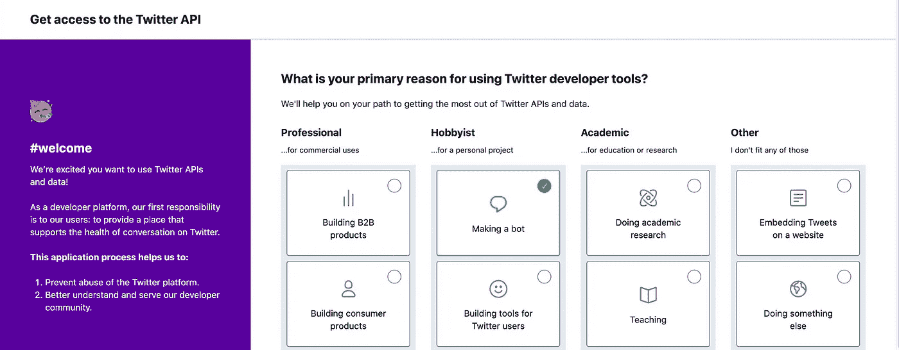

作者图片

在*上填写您的详细信息这是您，对吗？*章节并继续。在下一个板块，*你将如何使用 Twitter API 或 Twitter 数据？*有点繁琐。您需要在多个地方描述您计划如何使用 API。

下面是我如何完成*的一个例子，用你的话说*描述:

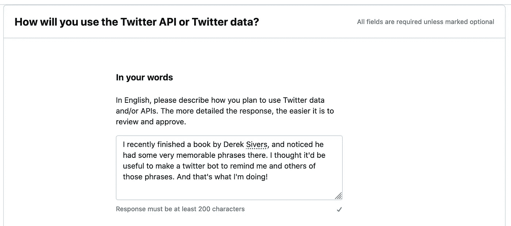

作者图片

使用与我上面提供的描述不同的描述。Twitter 可能会自动检查非常相似的描述，并可能会将它视为垃圾邮件，从而延迟您的申请。

然后，在*细节*子标题下，为*选择*是*您计划分析 twitter 数据吗？*和*您的应用会使用推文、转发、赞、关注或直接消息功能吗？*提问。其他选择*否*。

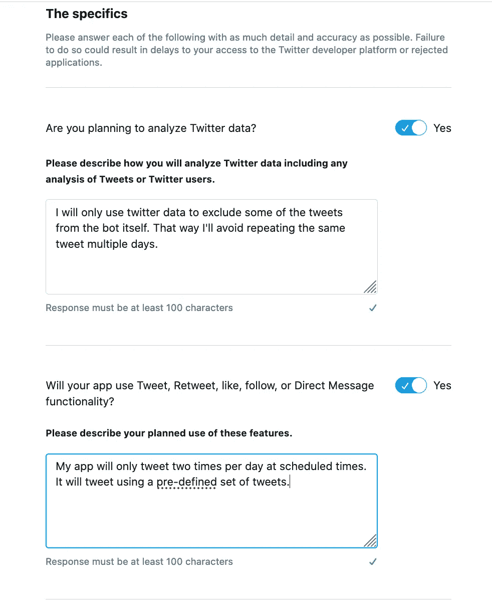

作者图片

完成申请后，会要求您检查详细信息并接受 Twitter 开发者协议。

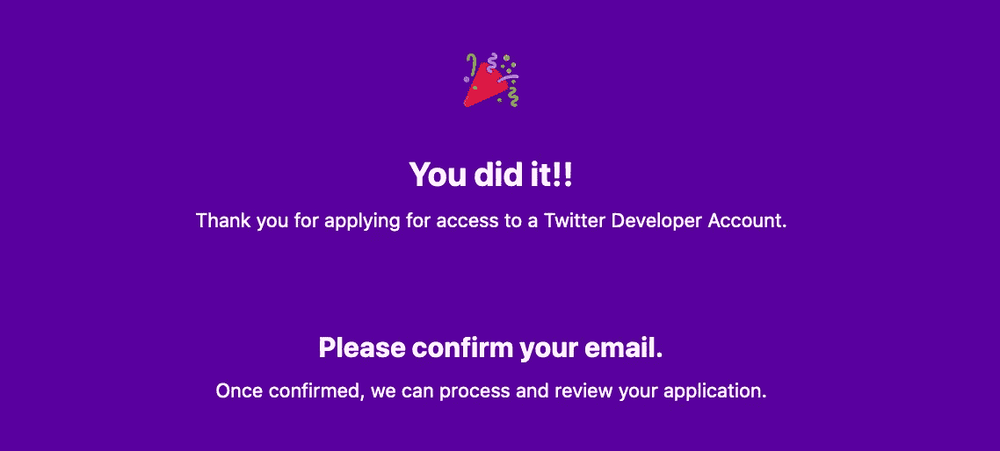

作者图片

最后，您需要确认您的电子邮件，一旦您的帐户获得批准，您就可以创建新的应用程序。这可能需要 48 小时。

一旦您能够访问 *Twitter 开发者门户*，请继续下一部分。

# 创建一个 Twitter 应用

在您的 Twitter 开发者账户被批准后，您将收到一封电子邮件，指引您进入 *Twitter 开发者门户*。您将为您的应用程序选择一个名称，并获得您的 API 密钥。然后，你将被重定向到你的应用程序设置。

在您的*应用设置中，编辑*您的*应用权限*。

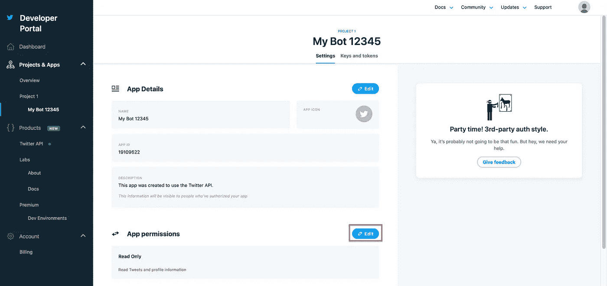

作者图片

将您的*应用权限*从*读取*更新为*读取和写入*并保存更改。

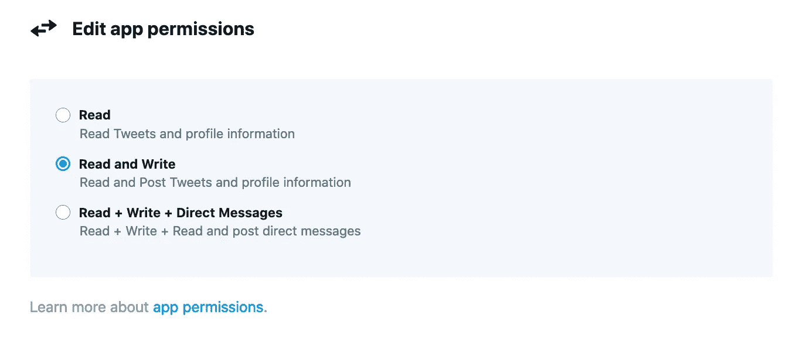

作者图片

更新应用权限后。转到*密钥和令牌。*在那里，您需要重新生成 *API 密钥*和*秘密*，并生成*访问令牌*和*秘密。*

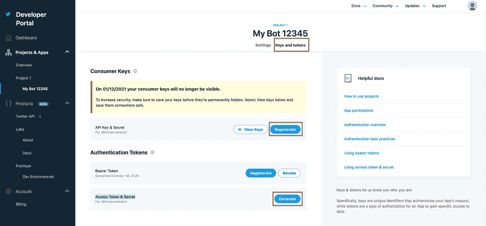

作者图片

你需要这些凭证来自动访问你的 Twitter 账户。把它们存放在安全的地方。

就是这样。你都准备好了。是时候让你的机器人在你的本地机器上工作了。

# 在本地机器上开发你的机器人

为了快速测试和做出更改，您将在本地使用您的机器人。一旦您对它的行为感到满意，您就可以将其打包并作为 AWS Lambda 函数进行部署。为了帮助你打包你的机器人，你将使用一个[库](https://github.com/dylanjcastillo/twitter-bot-python-aws-lambda)和一些有用的脚本。

按照以下步骤设置您的本地开发环境:

1.在你的本地机器上克隆这个库

2.转到项目的根目录，创建一个虚拟环境并激活它:

```
$ python3 -m venv venv 
$ source venv/bin/activate
```

3.使用 pip 在虚拟环境中安装所需的库:

```
(venv) $ pip install -r requirements.txt
```

4.在项目的根目录下创建一个名为`.env`的文件。将您的 Twitter 应用密钥和令牌放在那里:

```
ACCESS_TOKEN=<YOUR_ACCESS_TOKEN_HERE>
ACCESS_TOKEN_SECRET=<YOUR_ACCESS_TOKEN_SECRET_HERE>
CONSUMER_KEY=<YOUR_CONSUMER_KEY_HERE>
CONSUMER_SECRET=<YOUR_CONSUMER_SECRET_KEY_HERE>
```

到目前为止，您的项目结构应该如下所示:

```
twitter-bot-python-lambda/
├── venv/
│
├── src/
│   ├── lambda_function.py
│   └── tweets.csv
│
├── .env
├── buildpackage.sh
├── createlambdalayer.sh 
├── entrypoint.py
├── LICENSE
├── README.md
└── requirements.txt
```

以下是这些文件的用途:

*   `venv/`:包含项目所需库的虚拟环境
*   `src/lambda_function.py`:包含你的机器人逻辑的 Python 脚本。您将打包这段代码，并将其上传到 AWS Lambda 函数。
*   `src/tweets.csv`:你的机器人用来发布的预定义 tweets 列表。这也包含在你上传到 Lambda 函数的包中。
*   `.env`:包含您认证 Twitter API 的凭证的文件。它用于在本地测试你的机器人。
*   `buildpackage.sh`:将`src/`的内容打包成一个名为`lambda_function.zip`的文件的实用函数。您将把这个文件上传到 Lambda 函数。
*   `createlambdalayer.sh`:将需求中指定的库打包到一个名为`layer.zip`的文件中的实用函数。你将上传这个文件到一个 Lambda 层。
*   `entrypoint.py`:您将用于本地测试您的机器人的 Python 脚本
*   `requirements.txt`:指定项目所需库的标准方式
*   `LICENSE`和`README.md`:存储库的许可和描述

存储库中最重要的文件是`lambda_function.py`。在其中，您将为您的机器人定义逻辑:

```
import os
import random
import json
from pathlib import Path
import tweepy
import csv

ROOT = Path(__file__).resolve().parents[0]

def get_tweet(tweets_file, excluded_tweets=None):
    """Get tweet to post from CSV file"""

    with open(tweets_file) as csvfile:
        reader = csv.DictReader(csvfile)
        possible_tweets = [row["tweet"] for row in reader]

    if excluded_tweets:
        recent_tweets = [status_object.text for status_object in excluded_tweets]
        possible_tweets = [tweet for tweet in possible_tweets if tweet not in recent_tweets]

    selected_tweet = random.choice(possible_tweets)

    return selected_tweet

def lambda_handler(event, context):
    print("Get credentials")
    consumer_key = os.getenv("CONSUMER_KEY")
    consumer_secret = os.getenv("CONSUMER_SECRET")
    access_token = os.getenv("ACCESS_TOKEN")
    access_token_secret = os.getenv("ACCESS_TOKEN_SECRET")

    print("Authenticate")
    auth = tweepy.OAuthHandler(consumer_key, consumer_secret)
    auth.set_access_token(access_token, access_token_secret)
    api = tweepy.API(auth)

    print("Get tweet from csv file")
    tweets_file = ROOT / "tweets.csv"
    recent_tweets = api.user_timeline()[:3]
    tweet = get_tweet(tweets_file)

    print(f"Post tweet: {tweet}")
    api.update_status(tweet)

    return {"statusCode": 200, "tweet": tweet}
```

这是`lambda_function.py`的代码。它有三个部分:导入库、`get_tweets`函数和`lambda_handler`函数。

在第一部分中，您导入所需的库。除了一些标准库之外，您还导入了`tweepy`，您将使用它与 Twitter API 进行交互。然后，将`lambda_function.py`所在的路径存储在一个名为`ROOT`的变量中。

```
import os
import random
import json
from pathlib import Path
import tweepy
import csv

ROOT = Path(__file__).resolve().parents[0]
```

接下来，你定义`get_tweet`。它接受两个参数，并返回您的机器人将在 tweet 上发布的文本。看看它是如何工作的:

```
def get_tweet(tweets_file, excluded_tweets=None):
    """Get tweet to post from CSV file"""

    with open(tweets_file) as csvfile:
        reader = csv.DictReader(csvfile)
        possible_tweets = [row["tweet"] for row in reader]

    if excluded_tweets:
        recent_tweets = [status_object.text for status_object in excluded_tweets]
        possible_tweets = [tweet for tweet in possible_tweets if tweet not in recent_tweets]

    selected_tweet = random.choice(possible_tweets)

    return selected_tweet
```

返回你的机器人将要发布的文本。它的第一个参数`tweets_file`是指向`csv`文件的路径，在这个文件中存储了预定义的 tweets 列表。第二个是`excluded_tweets`，是来自 Twitter API 的推文列表，您可以使用它来避免发布最近的推文。

最后，您定义了`lambda_handler`函数:

```
def lambda_handler(event, context):
    print("Get credentials")
    consumer_key = os.getenv("CONSUMER_KEY")
    consumer_secret = os.getenv("CONSUMER_SECRET")
    access_token = os.getenv("ACCESS_TOKEN")
    access_token_secret = os.getenv("ACCESS_TOKEN_SECRET")

    print("Authenticate")
    auth = tweepy.OAuthHandler(consumer_key, consumer_secret)
    auth.set_access_token(access_token, access_token_secret)
    api = tweepy.API(auth)

    print("Get tweet from csv file")
    tweets_file = ROOT / "tweets.csv"
    recent_tweets = api.user_timeline()[:3]
    tweet = get_tweet(tweets_file)

    print(f"Post tweet: {tweet}")
    api.update_status(tweet)

    return {"statusCode": 200, "tweet": tweet}
```

`lambda_handler`在 AWS Lambda 功能被触发时执行。它从环境变量中获取 Twitter 凭证，使用 Twitter API 认证您的 bot，获取最后 3 条 tweet，并发布由`get_tweet`检索的 tweet。

其余的文件您不需要详细查看。但是如果你好奇的话，可以自己去看一看。

现在一切都设置好了，你只需要遵循这个**开发工作流程**:

1.  在`lambda_function.py`中定义你的机器人的逻辑
2.  通过从项目的根目录执行`$ python entrypoint.py`来测试变更

一旦你对你的机器人的行为感到满意，**打包代码**:

1.  向`requirements.txt`添加您使用过的任何附加库
2.  从项目的根目录运行`sh createlambdalayer.sh 3.8`。它将在`requirements.txt`中为`layer.zip`中的 Python 3.8+运行时打包库
3.  从项目的根目录运行`sh buildpackage.sh`。它将为你的 Lambda 函数生成一个名为`lambda_function.zip`的 zip 文件

接下来，您将学习如何让您的 bot 进入 AWS Lambda 函数。

# 将您的 Bot 部署为 AWS Lambda 函数

将你的 bot 设置为 Lambda 函数很简单，但是你必须有条不紊地按照步骤进行。让我们过一遍细节。

首先，您将使用 bot 代码中使用的库(您之前生成的`layer.zip`文件)创建一个 Lambda 层。其次，您将创建一个 Lambda 函数，上传您的机器人代码(`lambda_function.zip`)，并添加您创建的层。最后，您将添加一个触发器，该触发器将在每天 10.00 (UTC)执行您的 Lambda 函数。)

让我们从创建一个**图层开始。**

在*服务*下拉菜单中搜索*λ*。选择第一个选项(*λ。*)

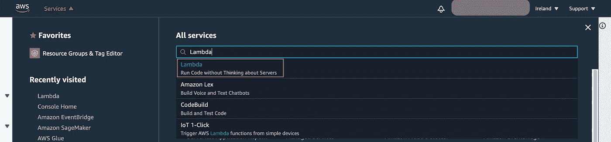

作者图片

点击侧边栏上*下的*层*。然后，选择*创建图层。**

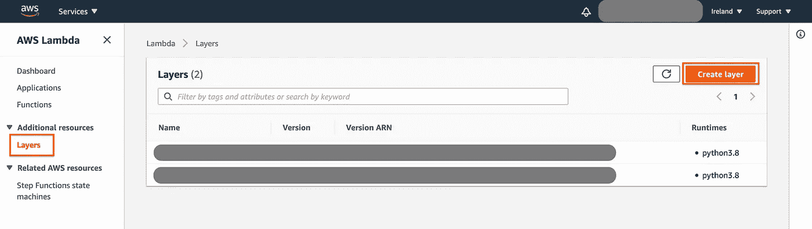

作者图片

在*创建层*部分，为您的层选择一个名称，上传您之前生成的`layer.zip`文件，并选择 *Python 3.8* 运行时。

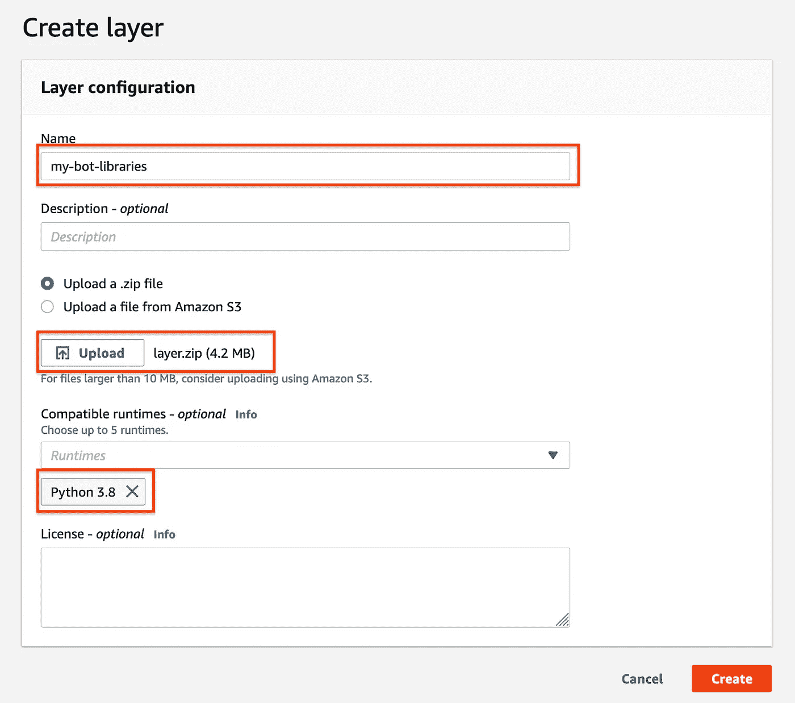

作者图片

仅此而已！你刚刚创建了你的 Lambda 层。不错吧。

接下来，您将创建一个新的 **Lambda 函数。**

选择侧边栏上的*功能*。然后，点击*创建功能。*

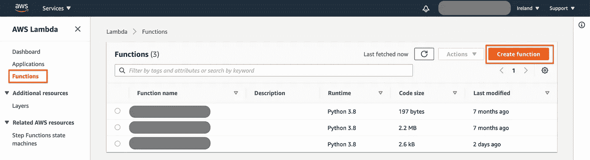

作者图片

接下来，为您的函数选择一个名称，并选择 *Python 3.8* 运行时。

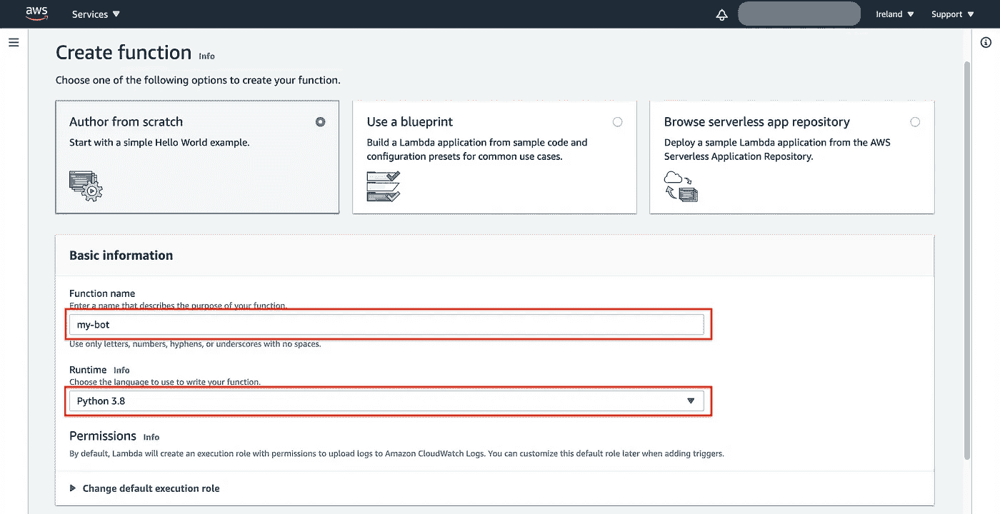

作者图片

你成功了！

接下来，您将上传您的代码，将 Lambda 层添加到您的函数中，并为它定义一个预定的触发器。

要上传代码，进入*功能代码*区，点击*动作、*并选择*上传一个. zip 文件。*上传`lambda_function.zip`并保存您的更改。

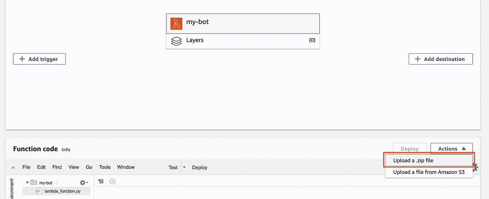

作者图片

除了代码之外，您还需要添加 Twitter API 键作为环境变量。转到*环境变量，*点击*编辑，*并将变量添加为键值对:

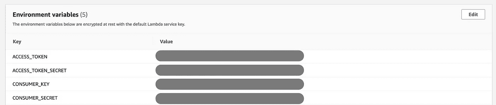

作者图片

接下来，您将向函数添加 Lambda 层。

选择*图层*和*图层*点击*添加一个图层。*

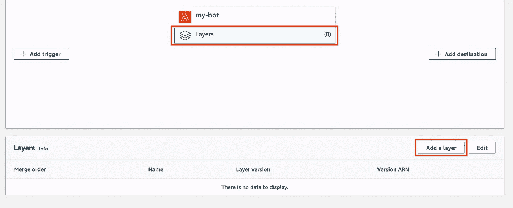

作者图片

在下一个屏幕上，选择*自定义图层*并找到您创建的图层。然后点击*添加。*


作者图片

现在，您已经上传了代码，设置了环境变量，并添加了层。您只是缺少执行您的功能的触发器。

选择*添加触发器*选项开始添加索具。

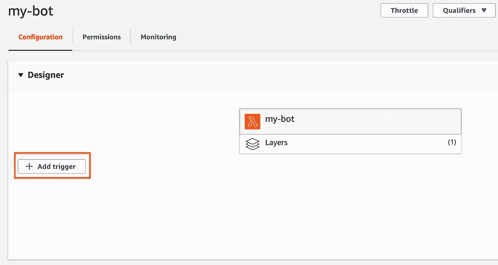

作者图片

在下一个屏幕中，按如下方式填写必填字段:

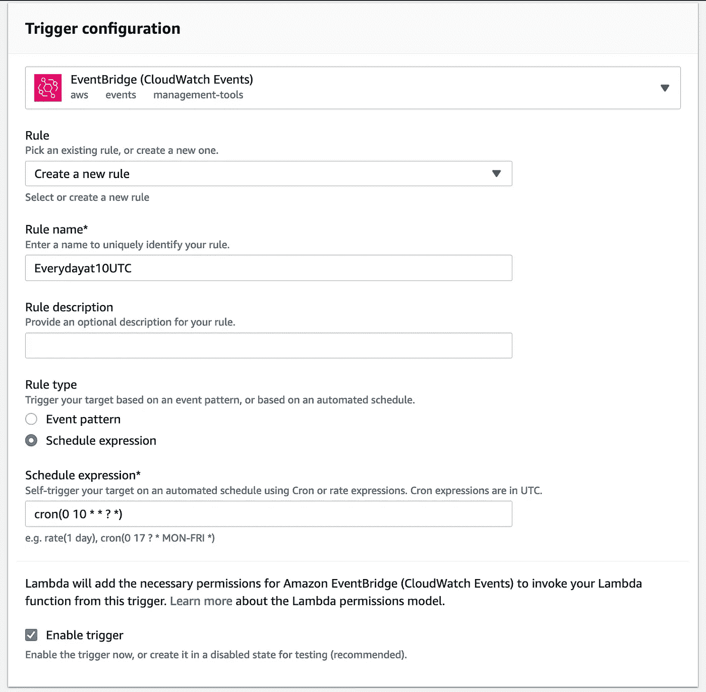

作者图片

此触发器将在每天 10.00 (UTC)执行您的 Lambda 函数。)如果你想添加一个不同的触发器，看看[调度表达式](https://docs.aws.amazon.com/eventbridge/latest/userguide/scheduled-events.html)文档。

最后，剩下的唯一一件事就是测试你的 Lambda 函数。点击*测试*按钮进行测试。它会要求您配置一个*测试事件*，您可以使用默认值。

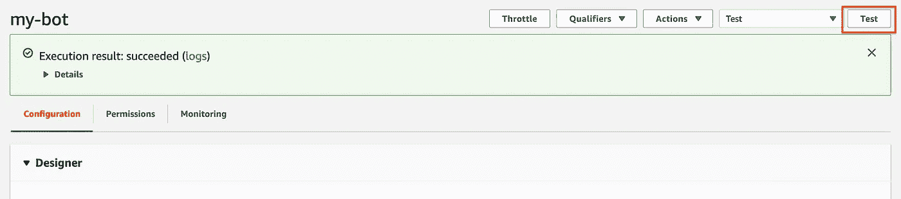

作者图片

如果一切顺利，在您测试您的函数之后，您会看到一个绿色的横幅，上面有*执行结果:成功*消息。否则，返回到前面的步骤，并确保您正确设置了所有内容。你也可以留下评论，我会尽力帮你解决的。

# 结论

干得好！你的推特机器人活蹦乱跳，或者说，*推特；)*

您经历了开发和部署 Twitter bot 的端到端过程。创建和配置 Twitter 应用程序、在本地机器上开发 bot 的逻辑、创建和配置 AWS Lambda 函数来部署 bot 是一条漫长的道路。

在本教程中，您已经学习了:

*   什么是推特机器人，它们能做什么，不能做什么
*   你有哪些**选项**来制作推特机器人
*   如何在你的本地机器上使用 **Python** 开发一个机器人
*   如何使用 **AWS Lambda 函数**将您的 bot 部署为无服务器函数

如果你觉得这有用，请[在 Twitter](https://twitter.com/_dylancastillo/status/1319337493666418688) 上表达你的爱。