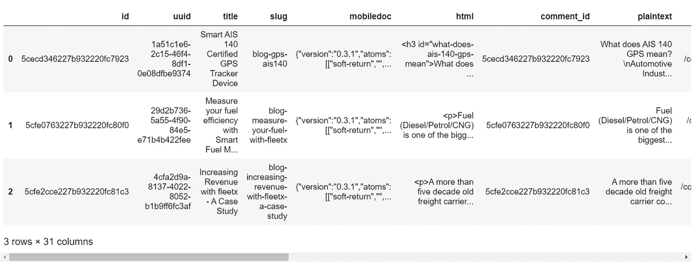
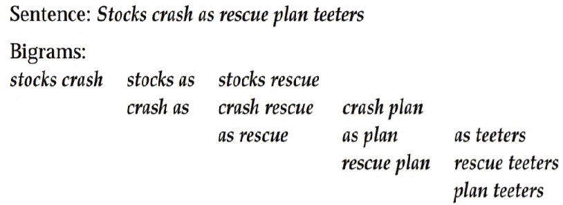

# 如何以编程的方式为你的博客制作文字云？

> 原文：<https://towardsdatascience.com/how-to-make-a-wordcloud-of-your-blog-programmatically-6c2bad1baa4?source=collection_archive---------39----------------------->

## Python 中的文本语料库可视化工具

最近，我需要一张我们博客的图片，希望它有一些*哇效果*，或者至少有一个*比我们一直使用的任何典型的*更适合*。*思索了一会儿，云字在脑海中闪过。💡通常，你只需要一长串文本就可以生成一个，但我想到了解析我们的整个博客数据，看看是否有什么有趣的东西冒出来，并获得我们博客使用的关键词的整体视图。所以，我把这个作为自己的周末趣味项目。

> PS:形象在营销中非常重要。给它质量！👀

# 弄脏你的手:

我们的博客托管在***Ghost****上，它允许我们将所有的帖子和设置导出到一个单独的、精彩的 JSON 文件中。而且，我们在 python 中内置了 *json* 包，用于解析 json 数据。我们的舞台已经准备好了。🤞*

*对于其他流行的平台，如 WordPress，Blogger，Substack 等。 它可能是一个或多个 XML 文件，你可能需要相应地切换包并在 python 中做基础工作。*

*在阅读 python 中的 JSON 之前，您应该了解它的结构、需要阅读的内容、需要过滤的内容等等。为此，使用一些 json 处理器来漂亮地打印你的 JSON 文件，我使用了[jqplay.org](https://www.jqplay.org)，它帮助我找出我的帖子位于➡
t0】*

*接下来，您想调用`pd.json.normalize()`将您的数据转换成一个平面表，并保存为一个数据框。*

> **👉注意:你应该已经为`*pd.json.normalize()*`安装了熊猫的更新版本，因为它已经修改了旧版本中的名字。另外，保持编码为 UTF-8，否则，你很可能会遇到 UnicodeDecodeErrors。(我们有这些坏人:' \xa0 '、' \n '和' \t '等。)**

```
*import pandas as pd
import jsonwith open('fleetx.ghost.2020-07-28-20-18-49.json', encoding='utf-8') as file: 
    data = json.load(file)  
posts_df = pd.json_normalize(data['db'][0]['data']['posts']) 
posts_df.head()*
```

**

*发布数据框架*

*查看数据帧，您可以看到 ***ghost*** 保留了我们创建的帖子的三种格式， [mobiledoc](https://github.com/bustle/mobiledoc-kit/blob/master/MOBILEDOC.md) (没有 HTML 解析器的简单快速呈现器)、HTML 和明文，以及帖子的其他属性范围。我选择使用明文版本，因为它需要最少的清理。*

## *清洁工作:*

*   *删除丢失的值(你可能有的任何空白帖子),以免在以后绘制图表时妨碍你的分析。我们有一篇草稿中的博客文章，里面什么也没有。🤷‍♂️*
*   *帖子中的 ***明文*** 几乎包含了所有可能不需要的字符，从空格和制表符 *(\n，\xao，\t)* ，到语法标点符号(点、逗号、分号、冒号、破折号、连字符、s 等)的 14 个标记。)甚至是要点。用空格替换它们。*
*   *接下来，我将每篇博文中的单词拆分到 ***明文*** 列下，然后将每个单元格的结果列表连接起来，得到一个很长的单词列表。这导致了 34000 字；我们有大约 45 篇已发表的博客，每篇平均 700 字，还有一些草稿，所以算出来是 45*700=31500 字。一致！🤜*

```
*posts_df.dropna(subset=['plaintext'], axis=0, inplace=True)posts_df.plaintext = posts_df.plaintext.str.replace('\n', ' ')
.str.replace('\xa0',' ').str.replace('.',' ').str.replace('·', ' ')
.str.replace('•',' ').str.replace('\t', ' ').str.replace(',',' ')
.str.replace('-', ' ').str.replace(':', ' ').str.replace('/',' ')
.str.replace('*',' ')posts_df.plaintext = posts_df.plaintext.apply(lambda x: x.split())
words_list =[]
for i in range(0,posts_df.shape[0]):
    words_list.extend(posts_df.iloc[i].plaintext)*
```

*如果你现在就渴望得到结果，你可以在那个`words_list`上运行`collections.Counter`，并获得每个词的频率，从而了解你的词云可能是什么样子。*

```
*import collectionsword_freq = collections.Counter(words_list)
word_freq.most_common(200)*
```

*猜猜博客中最常用的词是什么？🤞
如果你说***【the】***你就对了。对于非常长的文本，冠词***‘the’***将优先于任何其他单词。而且，不仅仅是“the ”,还有其他几个介词、代词、连词和动作动词出现在最高频率列表中。我们当然不需要它们，要移除它们，我们必须首先定义它们。幸运的是，我们将用来生成 wordcloud 的库自带了默认的停用词，但它相当保守，只有 192 个词。所以，让我们来看看自然语言处理(NLP)中的库，它们处理大量的文本并致力于此类任务。🔎*

*   *国家语言工具包库(NLTK):它有 179 个停用词，甚至比 wordcloud 停用词库还少。不要仅仅因为这个原因就给它一个邪恶的眼神，这是 python 中领先的 NLP 库。*
*   *Genism:它的集合中有 337 个停用词。*
*   *Sci-kit learn:他们还有一个 318 个单词的停用词库。*
*   *此外，还有 Spacy:它有 326 个停用词。*

*我选择了空间，你可以根据自己的喜好选择。*

## *但是…😓*

*这还不够！不过，从营销的角度来看，有些词看起来不太好，而且我们也没有尽可能地做好清理工作。因此，我将它们放在一个文本文件中(每个单词占一行)，然后读取它，并加入 spacy 的停用词表。*

> *[设置空间的说明](https://spacy.io/usage/models#quickstart)。*

```
*import spacynlp=spacy.load('en_core_web_sm')
spacy_stopwords = nlp.Defaults.stop_wordswith open("more stopwords.txt") as file:
    more_stopwords = {line.rstrip() for line in file}final_stopwords = spacy_stopwords | more_stopwords*
```

## *设立设计室:*

*现在我们已经准备好了重新设计的停用词表，我们可以调用神奇的制造者➡的单词云功能了。通过 Jupyter/CLI/Conda 使用 pip 命令安装 wordcloud 库。*

```
*pip install wordcloudimport matplotlib.pyplot as plt
import wordcloud#Instantiate the wordcloud objectwc = wordcloud.WordCloud(background_color='white', max_words=300, stopwords=final_stopwords, collocations=False, max_font_size=40, random_state=42)# Generate word cloud
wc=wc.generate(" ".join(words_list).lower())# Show word cloud
plt.figure(figsize=(20,15))
plt.imshow(wc, interpolation='bilinear')
plt.axis("off")
plt.show()# save the wordcloud
wc.to_file('wordcloud.png');*
```

*对于 python 用户来说，上述代码块的大部分内容都是不言自明的，不过让我们做一个简短的介绍:*

*   *`background_color`:你的文字云的背景，*黑*白*最常见。**
*   *`max_words`:你想在 wordcloud 中显示的最大字数，默认为 200 个。*
*   *`stopwords`:要从 wordcloud 中删除的停用词集合。*
*   *`collocations`:是否包含两个词的搭配(二元组)，默认为真。*

## *什么是二元模型？*

*这是两个相邻单词的序列。看看下面的例子。*

**

*句子的二元结构*

> *注意:将所有文本以小写解析到 wordcloud generator，因为所有停用词都是以小写定义的。它不会消除大写停用词。*

*好的，输出是这样的:*

**

*博客数据的文字云*

*对于一个做车队管理的公司来说，这是正确的！车队管理这个关键词比什么都有分量。*

*虽然，上面的图片错过了所有这一切的元素:车辆。幸运的是，你可以用 wordcloud 库在你选择的图片上屏蔽上面的 wordcloud。所以，我们开始吧。*

*   *选择您选择的矢量图像。我从 [Vecteezy](https://www.vecteezy.com/vector-art/329166-truck-illustration-isolated-on-a-white-background) 中挑选了我的图片。
    这次您还需要导入 *Pillow* 和 *NumPy* 库来读取图像并将其转换为 NumPy 数组。*
*   *下面是生成屏蔽的 wordcloud 的注释代码块，大部分内容和以前一样。*

```
*import matplotlib.pyplot as plt
from PIL import Image
import numpy as np
import os# Read your image and convert it to an numpy array.
truck_mask=np.array(Image.open("Truck2.png"))# Instantiate the word cloud object.
wc = wordcloud.WordCloud(background_color='white', max_words=500, stopwords=final_stopwords, mask= truck_mask, scale=3, width=640, height=480, collocations=False, contour_width=5, contour_color='steelblue')# Generate word cloud
wc=wc.generate(" ".join(words_list).lower())# Show word cloud
plt.figure(figsize=(18,12))
plt.imshow(wc, interpolation='bilinear')
plt.axis("off")
plt.show()# save the masked wordcloud
wc.to_file('masked_wsordcloud.png');*
```

## *以下是输出结果:*

**

*瞧啊。我们以编程的方式制作了我们的 wordcloud！🚚💨*

*谢谢你读到这里！🙌*

## ***参考:***

*   *[https://amueller.github.io/word_cloud/generated/wordcloud.WordCloud.html](https://amueller.github.io/word_cloud/generated/wordcloud.WordCloud.html)*
*   *【https://nlp.stanford.edu/fsnlp/promo/colloc.pdf】*