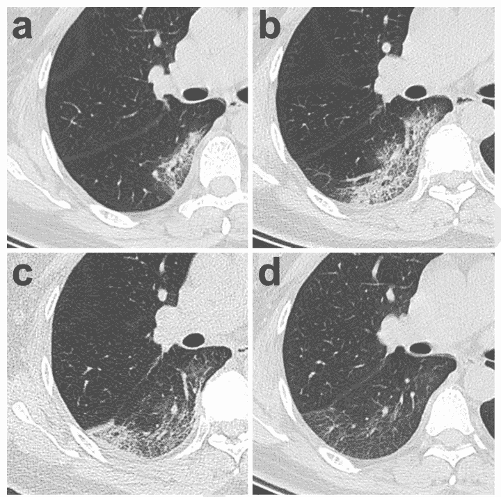

# 如何让 AI 在疫情中更有用

> 原文：<https://towardsdatascience.com/how-to-make-ai-more-useful-in-an-pandemic-144de89ced65?source=collection_archive---------62----------------------->

是什么限制了深度学习帮助测试、预测和预防的魔力？从人工智能社区的讨论中得到的一些教训。

自动化被吹捧为未来十年的灵丹妙药，但是当我们现在需要它的时候会发生什么——它会发生吗？从我阅读和讨论的内容来看，*并不受限于技术的能力，而是受限于我们在不同环境中应用技术的能力*。疫情的快速进化伴随着大量的噪音而不是大量的信号，所以这里是我将传授的见解的概要:

1.  一些**人工智能方法**是潜在的影响，现在。
2.  需要**联合学习** —来自 covid19 患者的数据目前被锁定在每个医院的基础上。
3.  处理**不一致数据的方法** —最先进的方法在数据集上工作，当我们共享扫描时会发生什么？
4.  **整合** —医生需要能够使用这些工具。


来源—作者。

# AI 能做什么？

人工智能可以提供帮助的方式数不胜数，我将分享几个:

1.  **强化学习** —将呼吸机的使用制定为一个强化学习游戏，这样我们可以更好地在短缺的高危患者中共享呼吸机。
2.  **计算机视觉**n——用于未来患者风险的时不变图像分类器(不是每个住院的人都在相同的几天前生病)。
3.  **自我监督学习—** 不断接受新数据并为不同子群的风险创建决策边界的辅助工具。对于医生来说，它将给出一个初始的行动过程，通过合并病人的个人资料来模仿过去的病人。


照片来自 [Pexels](https://www.pexels.com/photo/laptop-near-teal-stethoscope-in-wooden-table-3758756/?utm_content=attributionCopyText&utm_medium=referral&utm_source=pexels)

# 限制因素

## 数据被锁定—联合学习在哪里？

目前，为了将数据从一家医院传递到另一家医院，或者从一家医院传递到一群人工智能研究人员，律师必须为每个相关成员起草合同。

> 匿名数据需要能够流向一个安全的位置，即联邦位置，在那里可以优化模型。


照片由来自 [Pexels](https://www.pexels.com/photo/bandwidth-close-up-computer-connection-1148820/?utm_content=attributionCopyText&utm_medium=referral&utm_source=pexels) 的 panumas nikhomkhai 拍摄

联合学习是消除这一障碍的工具。

联合学习是一种结构化、安全的设置，其中数据流向一个中心位置进行模型训练和分析。在医疗保健行业，该中心位置可以对个人身份信息进行加密和保护(PII)，以便 1)技术公司(*不会将个人识别为处于风险中，并向保险提供商出售该信息……*)以及 2)可以创建更统一的全国性数据集。

*   我在 2019 年 12 月的这篇[反思 AI 的文章中写了更多。](/reflections-on-neurips-2019-6317f102ee09)
*   更多信息可以从[谷歌](https://ai.googleblog.com/2017/04/federated-learning-collaborative.html)，医疗[和](https://www.sciencedirect.com/science/article/abs/pii/S138650561830008X)[评论](https://dl.acm.org/doi/abs/10.1145/3298981?casa_token=ZigQLUQaLrIAAAAA%3AXZA8_m0Qzar-1KK5QQKhHtPE6NPZyfO_bGiIdNo4eyvHf4uJtQze_P2PXYmL5XkYSB1bEGnVbr-y)中找到。

## 数据一塌糊涂

从结构化数据集(基线)到现实世界实现的差距是明显的。在现实世界中，我们有来自不同医院和不同机器的数据。



胸部扫描是 covid19 患者的主要诊断手段。[来源](https://pubs.rsna.org/doi/pdf/10.1148/radiol.2020200370)。

> 我们如何保证我们的模型在最先进的胸部 x 射线上具有恒定的性能，而不是为新患者从仓库中取出的十年前的机器？

医生在 covid19 上使用的主要初始诊断是胸部扫描。它显示了肺部结构的损伤程度。医生可以很容易地说出当前的风险水平，但很难预测未来的风险(来源 NYU 医生)。我们认为人工智能可以有所帮助，因为计算机视觉已经在许多其他任务中发挥了作用。

希望是有的，但是模型在历史上很难适应**分布转移**——验证(测试)集从训练集变化而来。我们需要更好的方法来 1)解决训练时的这种转变，或者 2)使用新的验证集进行微调(元学习？).相关来源是[这里](https://mitpress.mit.edu/books/dataset-shift-machine-learning)和[这里](http://proceedings.mlr.press/v32/wen14.pdf)。

## 没有人告诉医生如何使用它

医生需要有用且直观的工具。对病人来说，屏幕时间有增加而面对面时间减少的趋势。有人会认为这让医生更愿意使用自动化技术，但事实未必如此。

> 如果没有医生的参与，医疗技术通常是一种负担。

这听起来就像是如果机器学习研究人员希望医生对患者数据进行这样的工作流时会发生的事情:

```
git clone new-classifier.git
conda export stuff.yaml
python setup [] .e
python model/train.py data=43
```

做这件事有什么更好的方法？我认为需要一个完全不同的数据流。也许这可以内置到联合学习中，也许不能。这是下一次紧急情况需要改进的领域，因为现在我们需要利用我们已经得到的东西，并且知道 ***医生没有时间学习和调试人工智能模型。***

这是另一篇关于技术和医疗保险互操作性困难的文章，以及这是如何减少病人有效时间的。

让我向你保证，人工智能社区真的很想帮忙。我们知道这些问题可以用简单的方法解决，但当拯救生命遇到额外的障碍时，医生和计算机工程师都感到愤怒。


关闭使得海湾地区的空气质量指数出现了前所未有的上升。来源——隔离骑自行车。

这些想法的灵感来自加州大学伯克利分校教授的电子邮件，NYU 医学和脸书人工智能研究合作的首次会议，以及将想法付诸实践的愿望。我希望我们现在可以通过了解缺点和为未来的挑战做准备来发挥作用。

注意安全，好好待着！

更多？订阅我关于机器人、人工智能和社会的时事通讯！

[](https://robotic.substack.com/) [## 自动化大众化

### 一个关于机器人和人工智能的博客，让它们对每个人都有益，以及即将到来的自动化浪潮…

robotic.substack.com](https://robotic.substack.com/)