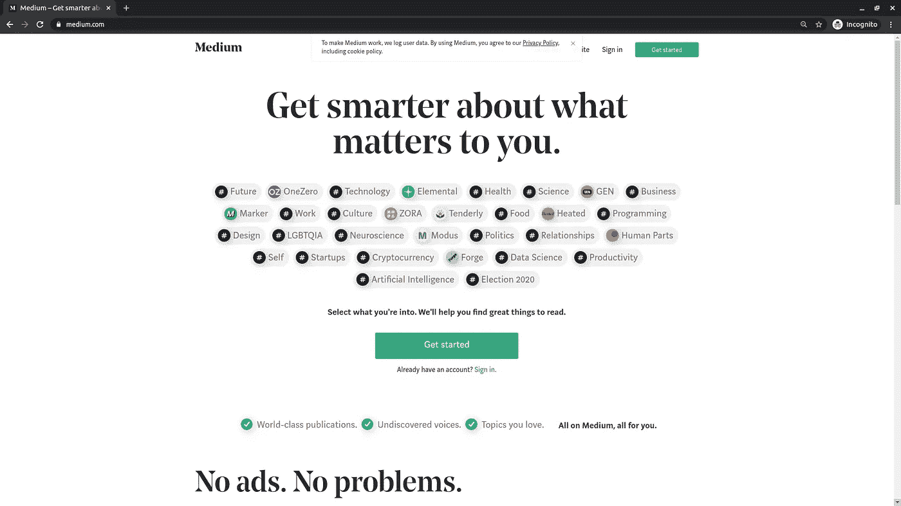
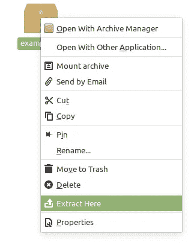
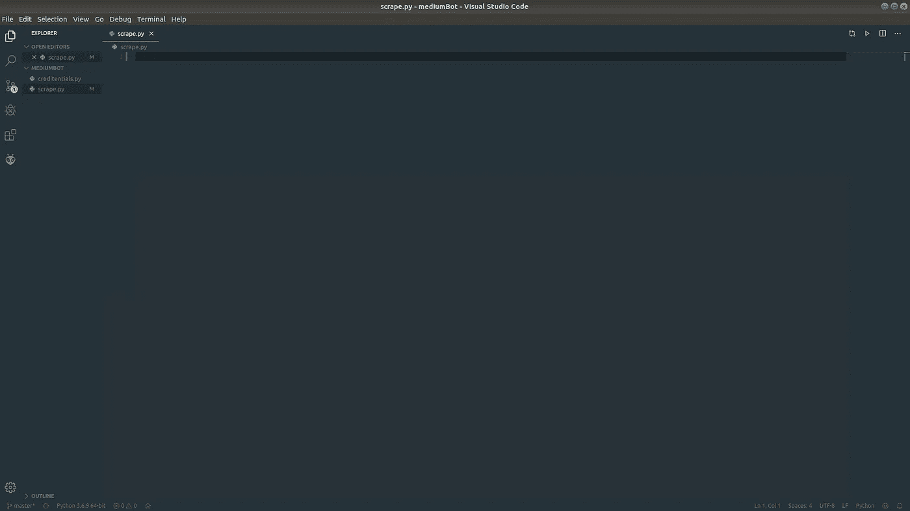
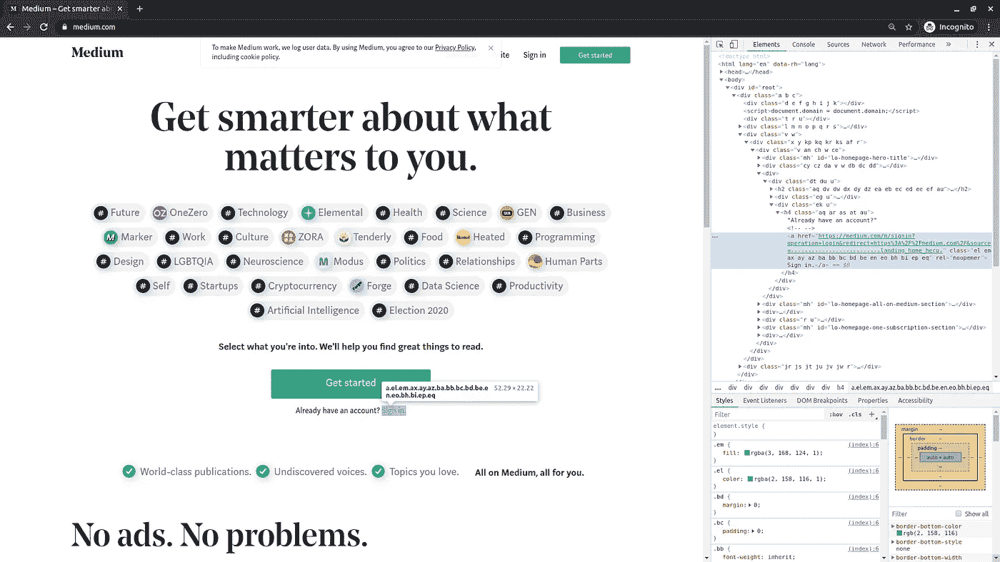
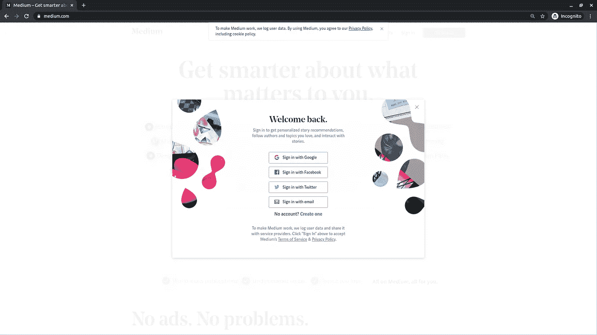
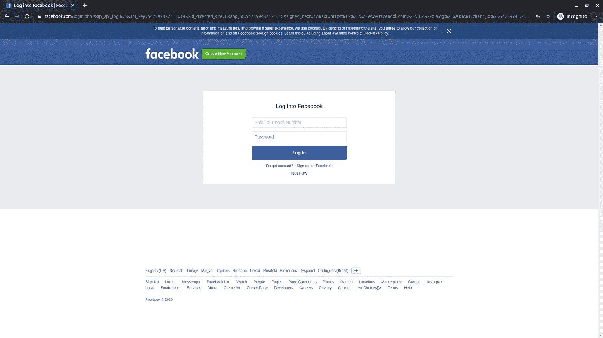
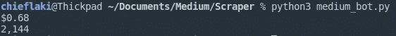

# 如何用 Python 制作分析工具

> 原文：<https://towardsdatascience.com/how-to-make-an-analysis-tool-using-python-c3e4477b6d8?source=collection_archive---------13----------------------->


在 [Unsplash](https://unsplash.com/s/photos/analysis?utm_source=unsplash&utm_medium=referral&utm_content=creditCopyText) 上由 [Carlos Muza](https://unsplash.com/@kmuza?utm_source=unsplash&utm_medium=referral&utm_content=creditCopyText) 拍摄的照片

S 自从去年 10 月的新政策以来，Medium 以不同的方式计算**收益**并且**每天更新它们**。在改变之前，它是基于成员的鼓掌次数和他们自己鼓掌的数量，但现在它是基于**阅读时间**。类似于 youtube 的算法，就是观看时间。

重要的是，它每天都在更新，你想知道在过去的 30 天里，你的故事制作了多少，有多少**浏览量**。

作为制作这个简单分析工具的示例网站，我们就拿**中**来说。但是你基本上可以在任何有你需要的统计数据的网站上做这件事。

这是 Python 的一个非常简单的用法，你不需要任何特殊的或者相当惊人的技能来和我一起做这件事。我们将一步一步来，从头开始建设一切。

让我们直接投入进去吧！


马克斯·杜济在 [Unsplash](https://unsplash.com?utm_source=medium&utm_medium=referral) 上拍摄的照片

# 编码

## 规划流程

构建这样一个工具需要几个步骤，首先，我们必须了解如何获得我们想要的东西。这是我们进入 [Medium](http://medium.com) 欢迎页面的地方。



媒体的欢迎屏幕

它相当简单，我们有登录/注册按钮。我们将使用这些来登录我们的个人资料。我们将使这个工具自动化，让它点击、填写电子邮件、密码并让我们登录。之后，我们将得到我们需要的数据。

## 设置环境

你将不得不安装一个 chrome 驱动程序，它将使我们能够操作浏览器并向它发送命令以供测试和使用。

打开链接并下载适用于您的操作系统的文件。我推荐**最新稳定版**，除非你已经知道自己在做什么。

接下来，您需要解压缩该文件。我建议进入文件，通过右键单击手动操作，然后单击“Extract here”。



在文件夹里面，有一个名为“chromedriver”的文件，我们必须将它移动到你电脑上的特定文件夹中。

打开终端，键入以下命令:

```
**sudo su** #enter the root mode
**cd**      #go back to base from the current location
**mv /home/*your_pc_name*/Downloads/chromedriver /usr/local/bin** 
#move the file to the right location
```

请插入您的实际电脑名称，而不是*您的电脑名称*。

完成后，我们打开编辑器。我个人选择的是 [Visual Studio 代码](https://code.visualstudio.com/)。它简单易用，可定制，并且对你的计算机来说很轻。

打开一个新项目，创建两个新文件。这是一个我的例子，看起来可以帮助你:



Visual Studio 代码—项目设置

在 VS 代码中，有一个“Terminal”选项卡，您可以使用它打开 VS 代码中的内部终端，这对于将所有内容放在一个地方非常有用。

当你打开它时，我们还需要安装一些东西，那就是虚拟环境和用于 web 驱动程序 selenium。在您的终端中键入这些命令。

```
pip3 install virtualenv
source venv/bin/activate
pip3 install selenium
```

激活虚拟环境后，我们就完全准备好了。

## 创建工具

我们将把它创建为一个类，并为它创建函数。所以我们开始吧！

用任何名字创建你的工具并启动 Chrome 的驱动程序。

```
class MediumBot():
  def __init__(self):
    self.driver = webdriver.Chrome()
```

这就是我们开始发展所需要的一切。现在转到您的终端并键入:

```
python -i scrape.py
```

这个命令让我们把我们的文件作为一个互动的游乐场。浏览器的新选项卡将会打开，我们可以开始向它发出命令。
如果你想试验，你可以使用命令行，而不是直接输入到你的源文件中。只是用 **bot** 代替 **self** 。

对于终端:

```
bot = MediumBot()
bot.driver.get('https://medium.com/')
```

现在来看看源代码:

```
self.driver.get('https://medium.com/')
```

现在，我们转到了灵媒欢迎页面，接下来我们需要登录。我们检查元素(键盘上的 F12)并复制元素 XPath。



右键单击标记为蓝色代码部分，并通过 XPath 进行复制。接下来，我们必须发出命令来为我们单击那个按钮。

```
**sign_in** = self.driver.find_element_by_xpath('//*[@id="root"]/div/div[4]/div/div/div[3]/div/div[2]/h4/a')
sign_in.click()
```

单引号(')是我的 XPath，如果你在做其他网站，你必须调整你的 XPath。

我将 XPath 保存到一个变量中，并对其执行 click()函数。

我已经做了两种类型的登录，分别是谷歌和脸书，你也可以选择哪种方法更适合你，但关闭双因素认证，这样这个过程会更容易。

对于脸书方法，您将选择“使用脸书登录”按钮，获取它的 XPath 并再次单击它。



现在我们必须输入我们的用户名和密码，我们通过 send_keys()函数来完成。



再次选择文本框，现在只需向该字段发送文本，如下所示:

```
email_in = self.driver.find_element_by_xpath('//*[@id="email"]')email_in.send_keys(username)
```

对密码做同样的操作，然后用 click()函数登录。登录后，我们可以访问我们想要的数据，我写了两个独立的函数来获得收入和你的故事的浏览量。

第一次查看:

```
def stats(self):
  self.driver.get('https://medium.com/me/stats')
  sleep(3)
  total_views = self.driver.find_element_by_xpath('/html/body/div[1]/div[2]/div/div[3]/div/ul/li[1]/div/div[1]')
  print(total_views.text)
```

现在是收益:

```
def earnings(self):
  self.driver.get('https://medium.com/me/partner/dashboard')
  sleep(3)
  total_earnings = self.driver.find_element_by_xpath('/html/body/div[1]/div[2]/div/div[3]/section/div/div[2]/div/div/div/div[3]')
  print(total_earnings.text)
```

在这两个示例中，我使用了 sleep()函数，该函数允许我将进一步的执行暂停一段时间，因此 sleep(1)将暂停 1 秒钟。你必须在代码的开头导入它。

一旦你提取完数据。您现在所要做的就是在类外创建这个工具的一个实例，并对它执行一个函数。

```
bot = MediumBot()
bot.login_facebook()
```

保存并运行脚本。亲眼目睹奇迹的发生！



我的分析

以下是我的 GitHub 页面上的完整代码:

[](https://github.com/lazargugleta/mediumBot/blob/master/scrape.py) [## lazargugleta/mediumBot

### 为你的故事收集收入和数据。通过在…上创建帐户，为 lazargugleta/mediumBot 的发展做出贡献

github.com](https://github.com/lazargugleta/mediumBot/blob/master/scrape.py) 

此外，您可以更改 creditentials.py 并用您自己的数据填充它以便登录。

> 我们完了！

# 后续步骤

如果你想更进一步，你还可以实现一些功能，比如在你达到某个目标时发送电子邮件，或者提取你想要跟踪数据的特定故事的数据。

我希望你喜欢这个小教程，并关注我更多！

**感谢阅读！**

[](https://medium.com/@lazar.gugleta)

跟着我上[中型](https://medium.com/@lazar.gugleta)

[](https://twitter.com/intent/user?screen_name=LazarGugleta)

在推特上关注我