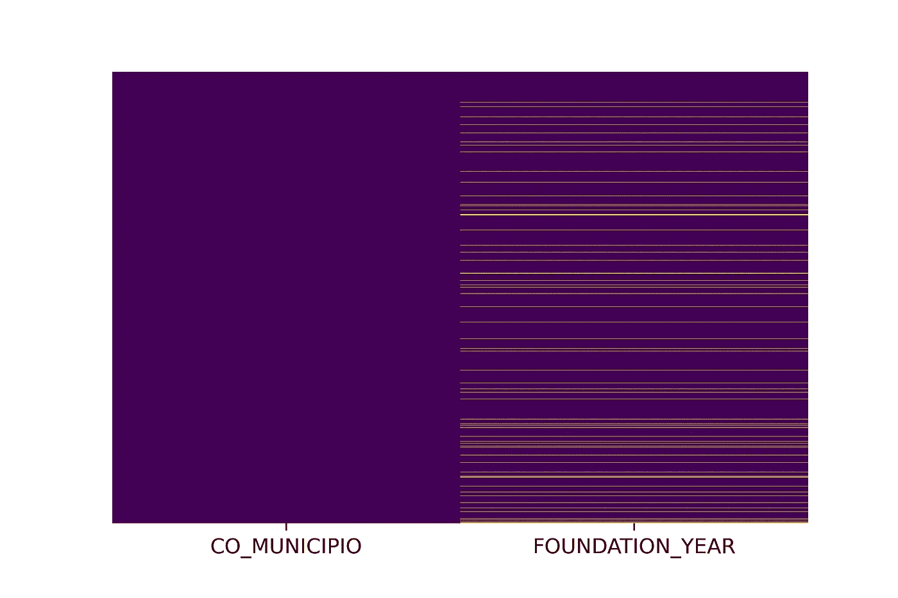
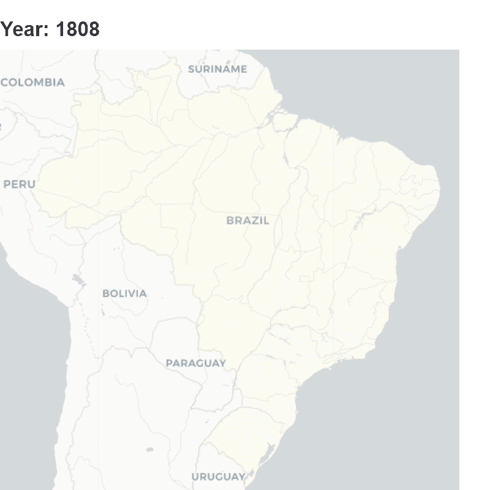

# 如何使用 Folium 和 Imageio 在 Python 中制作动画 GIF 图

> 原文：<https://towardsdatascience.com/how-to-make-an-animated-gif-map-in-python-using-folium-and-imageio-91d3fc60d084?source=collection_archive---------19----------------------->

## 巴西高等教育史的可视化分析

罗马法师在 [Unsplash](https://unsplash.com?utm_source=medium&utm_medium=referral) 上拍摄的照片

最近一直在清理分析巴西高等教育机构(HEI)的数据。巴西[“INEP 国家教育研究学院”](http://inep.gov.br/web/guest/about-inep)保存了来自基础教育和高等教育学生、教师和机构的大量微观数据，以及来自衡量课程质量和学生学习发展的外部评估的数据。

有大量研究(学术或非学术)分析巴西的基础教育(小学和中学)数据。在我攻读经济理论硕士学位期间，我调查了社会配额对公立高中学生在中学期末择校的影响。

分析高等教育数据的研究不太常见，尤其是在巴西大学之外。鉴于这种现象，我开始组织、描述和翻译关于巴西高等教育的数据和信息。[这一系列文章](https://medium.com/@thiago.guimaraesdf10/a-brief-exploration-of-brazilian-higher-education-data-using-python-fc37de7b8818)是将巴西高等教育数据的使用推广到巴西以外的首次尝试。

在这篇文章中，我强调了在更广泛的研究中产生的一个结果。也就是说，创建一组 choropleths 的代码映射了不同年份的图像，并将其转换为 Gif。

# 该产品

在乞讨，我的主要目标是有一个视觉代表的地理分布的高等教育提供多年来在巴西。我猜想巴西的大部分地区仍然没有机会接受高等教育。此外，考虑到过去 20 年公立高等教育机构的扩张过程众所周知(至少对巴西人而言),这一过程在中小城市的密集程度更高，我认为这张“高等教育普及图”最近有了很大改善。

为了达到这个目标，我选择每十年绘制一张 choropleth 地图，从第一个仍在进行的高等教育课程建立的那一年开始。幸运的是(或者不是)，最终的产品表明我之前的猜测是正确的。

# 库导入

这个项目中使用了两个主要的库:

*   首先是 Imageio。这个库用于追加。png 文件在一个动画 gif。有关该库的更多信息，请点击[此处。](https://pypi.org/project/imageio/)以下是 Imageio 网站上的简短描述:

> Imageio 是一个 Python 库，它提供了一个简单的界面来读写各种图像数据，包括动画图像、体积数据和科学格式

*   第二个是令人惊叹的叶库。follow”使得在交互式传单地图上可视化用 Python 处理的数据变得容易。''.基本上，使用 leav，您可以轻松地创建以任何位置为中心的地图，自定义其样式，并根据位置输入或在 GeoJson 文件中添加标记、颜色和其他功能。

此外，其他库用于提取. zip 文件(zipfile)、打开 HTML 文件和截图(webdriver)、读取 json 文件(Json)、裁剪图像(Image)、定义色标(braca.colormap)、管理数据框(pandas)等等。以下是完整的列表:

# 数据

巴西高等教育普查带来了每个机构、课程、学生和教师的年度数据。这是一个公开的非常丰富的数据集，还没有被广泛探索。为了制作这个产品，我使用了 2018 年微数据中的课程数据。

下面的代码从 INEP 网站提取微数据文件，解压并组织到项目文件夹中，读取 pd.dataframe 中的课程数据

# “清洗”

实际上，对于这个分析，不需要对课程数据框架进行重大清理。只有两列用于制作地图:

*   “城市”,代表提供课程的城市的 id；和
*   “DT_INICIO_DE_FUNCIONAMENTO”，表示课程开始提供的日期。

在只保留上述两列之前，我从数据库中删除了在线课程(约占所有课程的 8.3%)

从“DT_INICIO_DE_FUNCIONAMENTO”开始，我创建了一个新列“FOUNDATION_YEAR”，它仅指示课程开始提供的年份，不包括成立的月份和日期。

图 1 —缺失值分布的热图

快速“nan”值检查显示，FOUNDATION_YEAR 的 nan 值为 2.700(数据框的 5.1%)。热图(图 1)显示，这些缺失值在各个城市中分布良好。我在这里的选择是简单地放弃所有这些 nan 值。一个异常值也被删除。一门据说始于 2917 年的课程

清理课程数据框的代码描述如下。

# GeoJSON 文件

为了制作 choropleth 地图，我们需要地理区域的 JSON 或 shapefile。巴西各城市的 GeoJSON 可在 Git 上获得[。这项工作的一个小而有趣的改编是使用州或微区域边界，而不是市政当局。](https://github.com/tbrugz/geodata-br/blob/master/geojson/geojs-100-mun.json)

下面的代码使用 JSON 库读取 GeoJSON 文件

由于没有任何高等教育课程的城市没有出现在我们的课程数据框架中，因此有必要将其包括在内。否则，当我们“绘制”地图时，这些城市将会消失。

下面的代码根据 GeoJSON 文件创建了一个包含所有城市 id 的字典，以供将来使用。

# 设置色彩映射表比例

我选择在每年的课程总数中应用 np.log。我这样做是因为圣保罗(巴西最大的城市)等城市的球场数量比小城市多得多(小城市通常提供不到 12 个球场)。对数函数有助于我们获得更均匀的色彩映射表。

图 2 —我们的色图量表(所有球场的记录)

# 创建自第一个球场成立以来每十年的 choropleth 地图

下面是一步一步地创建和颜色的地图使用叶。欢迎对改进代码和描述质量提出任何疑问或建议。

# 关闭地图缩放控制

树叶地图带有缩放控制，类似于谷歌地图的功能。考虑到我们将为每十年创建一个图像，而不是一个交互式的 HTML，我选择使用下面的代码去掉这个缩放控件。基本上，fileinput 函数打开每个 HTML 代码，将“zoomControl: false”替换为“zoomControl: true”，并以相同的名称保存文件。

# 将 HTML 文件转换为 PNG

要创建 Gif，需要的是图像，而不是 HTML 文件。不幸的是，follow 只生成 HTML 地图。下面的代码打开所有这些 HTML，一次一个，截取一个屏幕截图，并保存为. png 文件。

重要的是选择一个延迟，保证浏览器在截图之前有时间加载地图。

# 裁剪图像以获得更好的视觉效果

截图捕捉了地图外的大量空白空间。我用过。从 PIL 图像裁剪功能，以调整图像的大小，只保留我们的文件的“心脏”。

# 最后(！)，使用 Imageio 创建我们的 Gif 地图

Imageio 使得追加非常简单。png 文件，并将其转换为动画 gif，每秒帧数(fps)可配置。为了保持我的项目文件夹整洁，我还删除了所有的 png 文件。

# 决赛成绩

好的。就是这样！:)下面是最终结果:

图 3 —我们的 Gif 地图，显示了几十年来每个直辖市的高等教育课程总数

# 超越

有了来自高等教育普查微观数据的“DM_CURSOS”数据库，我们可以做得更多。例如，可以区分私人和公共课程，在线和课堂，并获得每个城市的学生总数，而不是课程总数。

稍后，我将尝试为每个城市创建一个高等教育提供指数，比较公立和私立机构提供的席位数量以及高中最后一年注册的学生数量。

如果你想知道更多关于巴西高等教育的数据，我邀请你阅读这些帖子[关于巴西高等教育的可用数据](https://medium.com/@thiago.guimaraesdf10/a-brief-exploration-of-brazilian-higher-education-data-using-python-fc37de7b8818)和我已经使用的的[分析。如果你有什么建议，随时联系我。](https://medium.com/the-innovation/a-brief-exploration-of-brazilian-higher-education-data-using-python-1348f572f0d7)