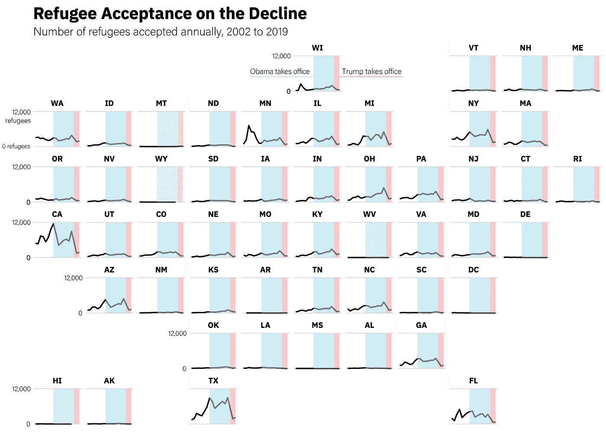
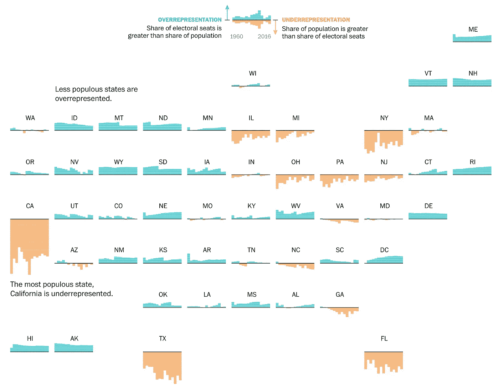
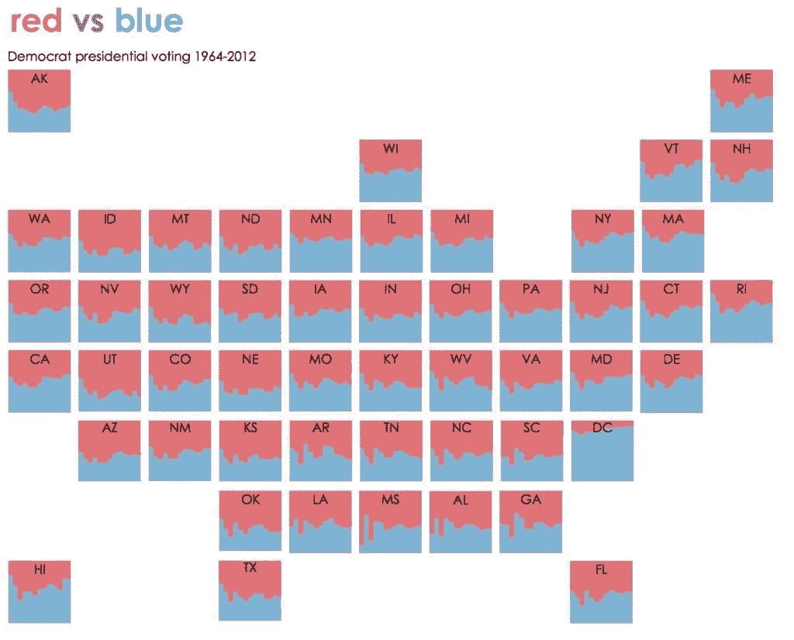
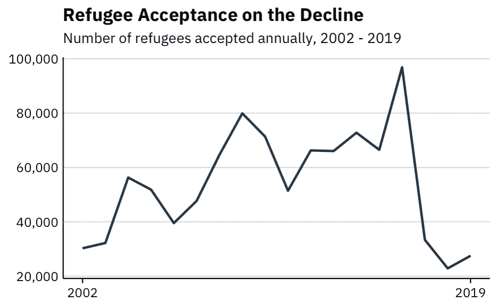
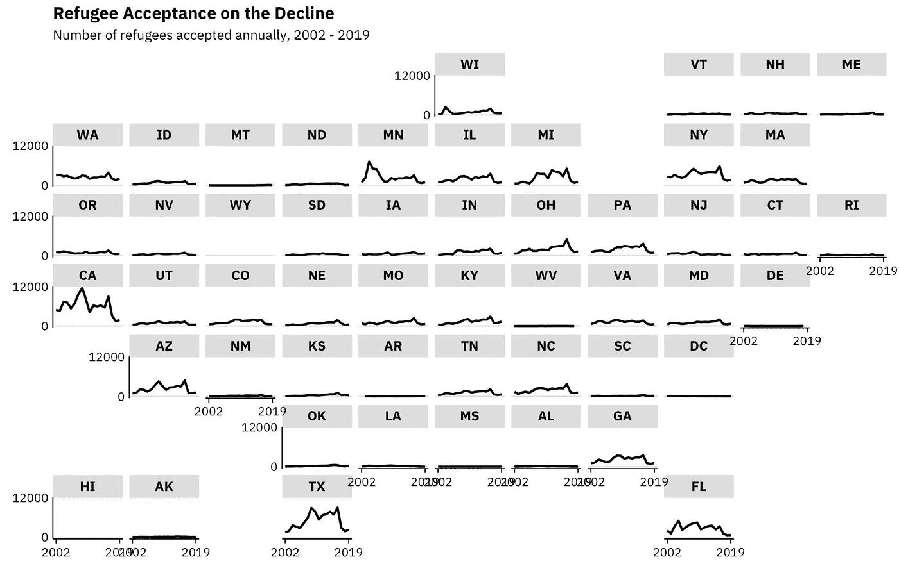
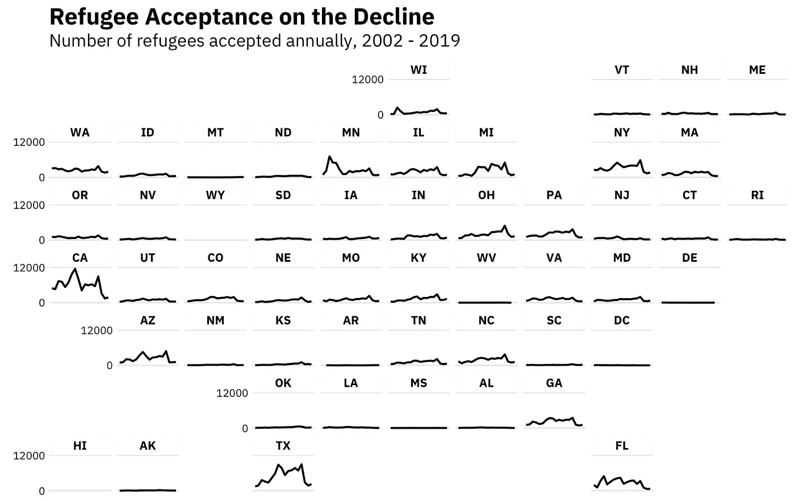
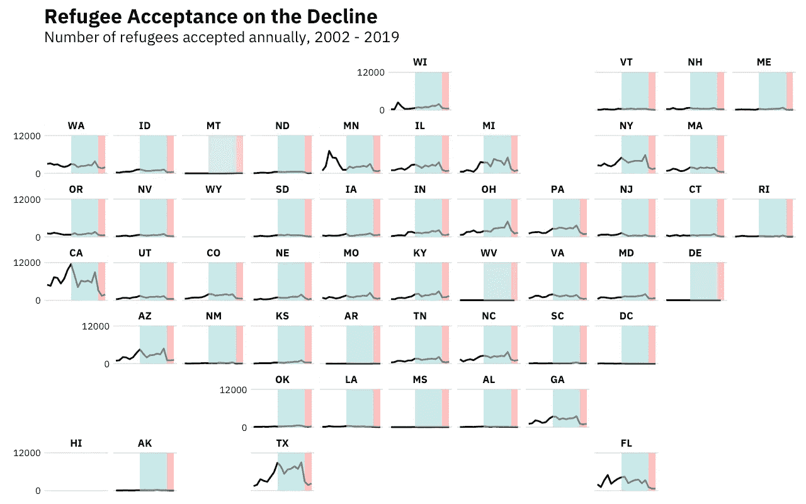

# 如何在 R 中制作漂亮的小型多用户地图

> 原文：<https://towardsdatascience.com/how-to-make-beautiful-small-multiple-us-maps-in-r-ad7e557cd463?source=collection_archive---------26----------------------->

## 一行代码就能让你的可视化更上一层楼



我最近偶然发现了一个关于美国难民接收情况的大型数据集。它包括难民来自的*、*以及前接收难民的*各州的数据。*

在[之前的项目](https://connorrothschild.github.io/map-missing-migrants/)中，我探索了迁徙是如何在*个地方*展开的:迁徙者在哪里旅行，他们在哪里失踪，以及他们的旅程在哪里到达致命的终点。

有了这个新的数据集，我想看看*收容国*是如何应对移民和难民危机的，特别关注美国。在我看来，美国对日益增加的难民数量的反应的有效可视化需要呈现两件事:难民接受度如何随着时间的推移而变化*以及各州难民接受度如何不同*。**

*呈现这两种趋势的一种有效方式是使用[小型多重](https://en.wikipedia.org/wiki/Small_multiple)折线图。出于审美的目的，将这些倍数排列成一种隐约类似美国的形状也是不错的。(这也让读者更容易找到自己感兴趣的状态。)*

*互联网上有这种小型多重地图的例子。《华盛顿邮报》对选举团的概述如下:*

**

*你也可以在 [PolicyViz](https://policyviz.com/2016/05/19/small-multiple-tile-grid-map/) 博客上找到*为什么*有效的概述，以及一些额外的例子:*

**

# *在 R 制作*

*在 R 中创建一个小的多瓦片栅格地图的过程相对容易(就像在 R 中完成的大多数事情一样)。这在 D3.js 中要困难得多；如果你对那类事情感兴趣，你可以看看[这个代码](https://bl.ocks.org/jinniluo/a95b27b1f4ea65ae94ab6ca3fcfb5934#index.html)寻找灵感。*

## *步骤 1:构建基本折线图*

*第一步(在讨厌的数据[合并](https://github.com/connorrothschild/R/blob/master/refugee-trends/merge.R)和清理之后)是对基本线图有个感觉。为了做到这一点，我们可以想象出所有州*接受难民的宏观趋势。**

*(变量名怪怪的；`region_name_3`对应年份，`textbox37`代表接受的难民人数。)*

```
*data %>% 
  group_by(region_name_3) %>% 
  summarise(textbox37 = sum(textbox37)) %>% 
  ggplot(aes(x = region_name_3, y = textbox37)) +
  geom_line() +
  labs(title = "Refugee Acceptance on the Decline",
       subtitle = "Number of refugees accepted annually, 2002 - 2019",
       x = element_blank(),
       y = element_blank()) +
  scale_y_continuous(labels = scales::comma_format()) +
  scale_x_continuous(breaks = c(2002, 2019))*
```

**

*现在我们有了第一个问题的答案:**随着时间的推移，难民接受度发生了怎样的变化？答案是:非常剧烈。美国在 2016 年接收了近 10 万名难民；两年后，这个数字刚刚超过 20，000。***

## *第二步:做小倍数*

*接下来，我们制作 50 行:每一行代表美国的一个州。我们使用瑞安·哈芬的`geofacet` [软件包](https://hafen.github.io/geofacet/rd.html)来实现。*

*这很简单，只需在我们之前的绘图中添加一行代码:*

```
*facet_geo(~ state)*
```

*这使得一个情节看起来像这样:*

**

*还可以，但不完美！我们肯定可以做一些改进。*

*首先，轴标签重叠。我们已经知道年份的范围是 2002 年到 2019 年之间(在我们的字幕里！).所以我们可以去掉 x 轴标签。*

```
*theme(
  axis.text.x = element_blank(),
  axis.ticks.x = element_blank()
  )*
```

*第二，轴线(在两个轴上)似乎是不必要的，并且(特别是 x 轴)有时可以隐藏那些具有较低值的状态的趋势。让我们把那些也拿掉！*

```
*theme(
  axis.line.x = element_blank(),
  axis.line.y = element_blank()
  )*
```

*最后，我不喜欢我的轴标签周围巨大的灰色方框。我们能让它们透明吗？*

```
*theme(
    strip.background = element_rect(color = "white")
)*
```

*将所有这些加在一起(并调整字体大小)，我们得到这样的结果:*

```
*data %>% 
  group_by(region_name_3, state) %>% 
  summarise(textbox37 = sum(textbox37)) %>% 
  ggplot(aes(x = region_name_3, y = textbox37)) +
  geom_line(color = "black") +
  scale_x_continuous(breaks = c(2002,2019)) +
  scale_y_continuous(breaks = c(0,12000)) +
  facet_geo(~ state, grid = "us_state_grid1") +
  labs(title = "Refugee Acceptance on the Decline",
       subtitle = "Number of refugees accepted annually, 2002 - 2019",
       x = element_blank(),
       y = element_blank()) +
  theme(
    axis.text.x = element_blank(),
    axis.ticks.x = element_blank(),
    axis.line.x = element_blank(),
    axis.line.y = element_blank(),
    plot.title = element_text(size = 24),
    plot.subtitle = element_text(size = 18),
    strip.background = element_rect(color = "white")
  )*
```

**

*好多了。但是我们仍然可以添加一些元素来使我们的可视化更上一层楼。*

*因为我们的数据跨越了近 20 年(2002 年至 2019 年)，所以我们可以用其他感兴趣的变量来覆盖我们的小倍数，例如在特定时期谁是总统。*

*我们使用`geom_rect`来实现:*

```
*geom_rect(mapping=aes(xmin=2009, xmax=2017, ymin=0, ymax=12000),
fill = "#ADD8E6", alpha = .05) +
geom_rect(mapping=aes(xmin=2017, xmax=2019, ymin=0, ymax=12000),
fill = "#FF9999", alpha = .05) +*
```

*第一行代码创建了一个跨越 2009 年到 2017 年(奥巴马任期)的蓝盒子。第二行为特朗普的总统任期创建了一个红框(到目前为止)。*

*综上所述，代码和输出如下所示:*

```
*data %>% 
  group_by(region_name_3, state) %>% 
  summarise(textbox37 = sum(textbox37)) %>% 
  ggplot(aes(x = region_name_3, y = textbox37)) +
  geom_line(color = "black") +
  geom_rect(mapping=aes(xmin=2009, xmax=2017, ymin=0, ymax=12000), fill = "#ADD8E6", alpha = .05) +
  geom_rect(mapping=aes(xmin=2017, xmax=2019, ymin=0, ymax=12000), fill = "#FF9999", alpha = .05) +
  scale_x_continuous(breaks = c(2002,2019)) +
  scale_y_continuous(breaks = c(0,12000)) +
  facet_geo(~ state, grid = "us_state_grid1") +
  labs(title = "Refugee Acceptance on the Decline",
       subtitle = "Number of refugees accepted annually, 2002 - 2019",
       x = element_blank(),
       y = element_blank()) +
  theme(
    axis.text.x = element_blank(),
    axis.ticks.x = element_blank(),
    axis.line.x = element_blank(),
    axis.line.y = element_blank(),
    plot.title = element_text(size = 24),
    plot.subtitle = element_text(size = 18),
    strip.background = element_rect(color = "white")
  )*
```

**

*我把这个情节带到 Illustrator 中，让它看起来漂亮多了。这是最终版本:*

**

*我们注意到了什么？几个关键的州(德克萨斯州、加利福尼亚州、佛罗里达州和密歇根州)占了难民接收人数的绝大部分，而其他州几乎不接收难民。自 2017 年以来，几乎每个州都减少了难民接收量，但这一下降的大部分来自这些较大的州。*

*[](https://twitter.com/CL_Rothschild) [## 康纳·罗斯柴尔德

### 康纳·罗斯柴尔德的最新推文(@CL_Rothschild)。@RiceUniversity 本科。对数据感兴趣…

twitter.com](https://twitter.com/CL_Rothschild) 

*原载于* [*我的博客*](https://connorrothschild.github.io/refugee-trends/) *。**