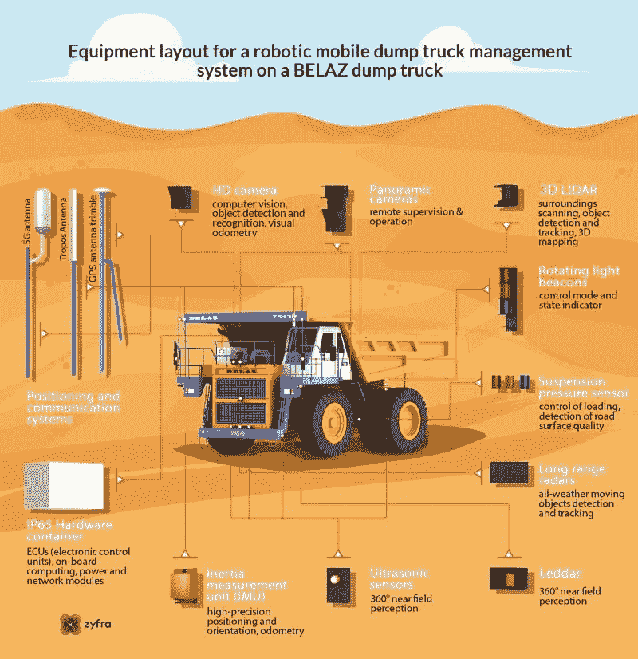

# 如何让 ML 在极端条件下工作？

> 原文：<https://towardsdatascience.com/how-to-make-data-science-models-work-in-extreme-conditions-bd6478fdc922?source=collection_archive---------36----------------------->

## ML 可应用于许多工业环境，以节约成本和改进流程。以下是方法。

由[海岸制片](https://www.shutterstock.com/g/Coast+Productions)在[上穿梭拍摄](https://www.shutterstock.com/image-photo/big-yellow-mining-truck-hauling-rock-1176092938)

数据科学可以应用于许多工业环境，以节省成本和改进流程。这种工业人工智能不仅包括驻留在计算机系统内部虚拟空间的智能算法和大数据概念，还包括物理设备本身。数据必须通过传感器获取。命令必须被发送到致动器和控制系统。这整个信息链和信息流，不管是无线的还是有线的，都要经过极端条件下的地方。从工厂、矿山或石油钻塔内部的操作点，到数据中心和控制室内部的大数据存储和巨大处理能力，还有很长的路要走。

工业生产设施、物理运输系统和分销渠道非常复杂，通常包含来自不同制造商的大量设备。随着自动化程度的提高，有许多现有的数字控制和管理系统。今天，您可以在工业环境中找到数据网络、监控和数据采集(SCADA)、可编程逻辑控制器(PLC)以及供暖、通风和空调(HVAC)。所有这些系统都是在不同的抽象层次上看待的。有复杂的概念和更高的管理级别，也有与物理挑战更紧密相关的较低级别。

# 越来越难了

现有的工业设施有许多电线和数公里长的电缆。这些复杂的网络保持运营。您拥有连接设备和交换机、提供网关和创建控制室连接的数字网络的工业标准。这些系统在恶劣环境下运行良好。随着数据科学和工业环境中新的全球数字连接的到来，新的智能设备也需要能够在这些极端条件下运行。ML 与工业物联网(IIoT)紧密相连，以提供更多的无线连接以及与企业范围系统和互联网的链接。

所有这些新系统都面临着自然的挑战和重工业机器的强大力量。生产设施可能位于遥远的地方，没有电网。想象一下在只有一条简易道路的丛林中作战。你必须通过发电机或电池自带所有能源。环境可能冷或热，有害气体会腐蚀电子设备或使其在爆炸中消失。但是热和冷不仅来自自然，也来自生产过程。熔化和冷冻工件可能是生产过程的一部分。许多工作发生在机械领域。你有高速运动的部件。你有制造振动和冲击的机器。数据科学现在主要以机器人和 IIoT 网络的形式面临这些物理挑战。

# 到处都有机器人

机器人是一项复杂的挑战。他们需要做事，他们需要把自己带到需要他们的地方。要在没有人类互动的情况下实现这一点，就需要这个机器人内部的 ML 大脑。但是，我们都记得机器人在核电站退役中的失败。在这种情况下，问题在于辐射破坏了电子设备。因此，需要一个坚强的大脑。此外，与外界的交流也很困难。在强辐射中，无线或有线通信是一个挑战。

然而，对于工业数据科学来说，不仅仅是核衰变的可怕性质，深海勘探或采矿的例子也是如此。它们也很有挑战性。由于缺乏通用基础设施，也没有固定电源或互联网可用，您需要调整现有的最佳实践，以适应数字化和数据驱动的转型。

您可能在日常生产设施的生产边缘找不到这些极端的例子。但是你会发现类似的挑战性情况。在工业生产中，运行中的环境和机器所造成的威胁无处不在。自主或准备成为自主机器人的舰队每天都在增长。

你有机器人手臂，行走和驾驶自动车辆，以及执行各种任务的飞行器。它们分为自动导向车(AGV)、无人驾驶地面车(UGV)、漫游者、自主水下车(AUV)、遥控水下车(ROV)、自主翻斗车、自主拖运或采矿车、无人驾驶飞行器(UAV)或无人机。

这些机器人以多种形式出现，以提高效率和成本效益。他们可以完成员工无法完成的任务。可能这些任务只是普通的长时间轮班，或者他们可能在更恶劣的环境中工作。他们可以随时随地根据需要进行检查。

通过 [Zyfra 矿业](https://www.linkedin.com/company/zyframining/)上 [LinkedIn](https://www.linkedin.com/posts/zyframining_zyframining-activity-6577923413812359168-_bfh/)

# 一切都会联系起来

工业数据科学的第二大应用是整个企业中数据的连接和聚合。收集的所有传感器数据都将存储在一个大数据湖中。在工业物联网的帮助下，可以创建一个像生命体一样运行的网络。这里，无线和有线数据连接面向物理世界。电缆、交换机、路由器和网关需要坚固耐用。它们需要能够承受灰尘、振动、雾和水，以及更危险和有害的物质和物理效应。它们必须是可靠的，并且应该能够在没有维护人员帮助的情况下运行多年。

新的工业数据科学也面临着集成安全性和安全性的挑战。许多遗留系统多年来一直以微调的方式运行。他们为在极端条件下的出色表现提供解决方案。他们的优化过程已经持续了一年。因此，新的工业数据科学不应危及这一已实现的平衡。另一个问题是数据和操作安全性。一旦生产设施连接到全球互联网，攻击者理论上就可以进入系统。由于重工业的价值和风险非常高，这是另一个极端的现实。

# 现有的数据是坏的和破碎的

在建立工业数据科学时，用于创建智能建议和预测的数据源面临问题。工业环境中需要的大量数据是时间序列数据和在恶劣环境中收集的数据。这意味着单个数据点可能不可靠。由于环境条件，传感器本身可能提供不精确的值。

我们可以称之为工业大数据的“3B”。当你开始一个新的工业数据科学项目时，你需要意识到这些问题。

第一个 B 是坏的。大多数工业数据都有明确的物理意义。它需要无数的传感器来检测空气、流量或运动速度。各种噪音、湿度、泄漏或水平都是可以获得的。每天高达数百万亿字节的运动数据。由于物理测量，所有这些数据的质量都可能很差。与数字系统内部收集的数据(如在线购买和客户数据)相比，这些数据在使用前需要彻底清理。此外，很难通过数据的数量来提高质量。

第二个 B 代表坏掉了。用于训练数据科学模型以提出预测和建议的数据没有明确的健康状态。没有指示工作条件的故障模式或更高级别的数据抽象。这可能会在 ML 系统的实现中导致大量的假阳性和假阴性。

第三个也是最后一个问题 B 是背景。在复杂的工业环境中，传感器数据的解释需要领域专家的大量经验。新出现的模式可能非常短暂，它们需要专业知识来解释。仅仅通过收集的数值数据来训练数据科学模型是非常困难的。

# 解决身体上的挑战

要解决工业数据科学中存在的挑战，一种方法是了解工业运营的具体情况。人们不应关注现成的数据科学解决方案，而应关注现成的工业解决方案。面向工业物联网的加固型组件和设备已经上市。由于许多传感器可通过现有的设置获得，数据的收集发生在现有的控制系统层面。SCADA 系统和工业机器人和机器提供了要捕获的数据。在这里，专门的 IIoT 网关将数据传送到 ML 系统。这些额外的网关不会干扰现有的控制系统。

要完成数字化转型，人才是最重要的因素之一。为了保持低成本和管理新的网络，与主题专家的合作是必由之路。这些专业人员需要了解行业的具体情况和工业数据科学。他们帮助选择正确的硬件和概念。

# 做出正确的选择

极端条件不仅是对身体要求苛刻的环境，也是其他行业丰富资源的短缺。由于电力供应、网络基础设施和互联网连接方面的问题，需要阐述行业特定的概念。当连接不稳定和不可靠时，可以选择不依赖于连续网络连接的解决方案。电池供电的 IIoT 解决方案，电池寿命长达数年，功耗超低。边缘计算在设备内部提供自动推理和聚合，无需不间断地连接到数据中心系统。

ML 模型将在工业物联网基础设施设计良好的极端条件下工作。普通 IoT 和 IIoT 之间的差异需要解决。尽管物联网和 IIoT 有着共同的目标，但实施策略的基本要求却大相径庭。由于电力和连接挑战，工业物联网需要更加关注可靠性和鲁棒性。

本文最初发表于 [AiThority](https://www.aithority.com/guest-authors/how-to-make-ai-work-in-extreme-conditions/) 。