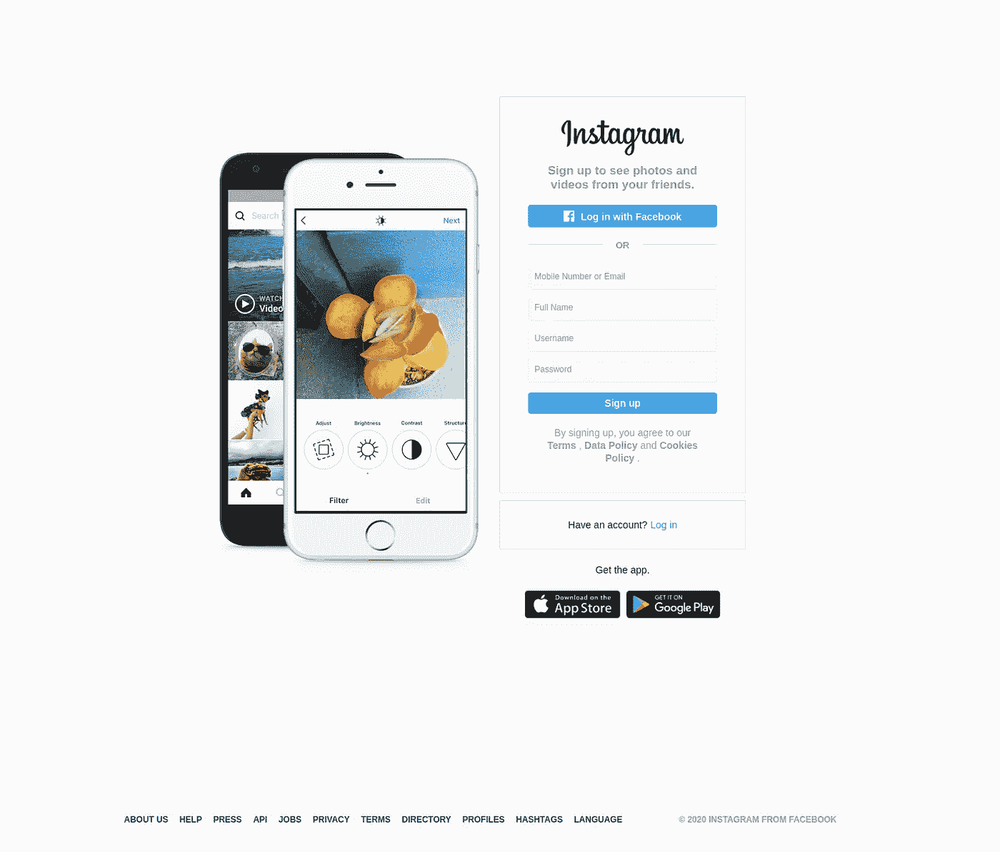

# 如何用 Python 制作 Instagram Unfollower 工具

> 原文：<https://towardsdatascience.com/how-to-make-instagram-unfollower-tool-with-python-ac04b6b05251?source=collection_archive---------3----------------------->


照片由 [Unsplash](https://unsplash.com/s/photos/instagram?utm_source=unsplash&utm_medium=referral&utm_content=creditCopyText) 上的 [Georgia de Lotz](https://unsplash.com/@georgiadelotz?utm_source=unsplash&utm_medium=referral&utm_content=creditCopyText)

根据 2018 年 6 月的统计数据，我自己是一个很大的 **Instagram** 用户，据谷歌称，其他 10 亿人也是如此。

在使用 Instagram 和他们的“关注者”系统时，你肯定有过关注某人的时候，并想知道他们何时以及是否会关注你。

现在有了强大的工具和编程语言，我们可以创建简单的脚本来检查谁没有跟着我们。

这是 Python 的一个非常简单的用法，你不需要任何特殊的或者相当惊人的技能来和我一起做这件事。我们将一步一步地走下去，从头开始建设一切。

让我们直接投入进去吧！


照片由[丹尼尔·里卡洛斯](https://unsplash.com/@ricaros?utm_source=unsplash&utm_medium=referral&utm_content=creditCopyText)在 [Unsplash](https://unsplash.com/s/photos/programming?utm_source=unsplash&utm_medium=referral&utm_content=creditCopyText) 上拍摄

# 编码

## 规划流程

构建这样一个工具需要几个步骤，首先，我们必须了解如何获得我们想要的东西。这是我们进入 Instagram 欢迎页面的地方。

[](https://www.instagram.com/)

Instagram 欢迎/登录页面

它相当简单，我们有登录/注册按钮。我们将使用这些来登录我们的个人资料。我们将**自动化**这个工具，以便它点击、填写电子邮件、密码并让我们登录。之后，我们将得到我们需要的数据。

在我们登录之前，你需要确保没有为 Instagram 设置[双因素认证](https://help.instagram.com/566810106808145)。

## 设置环境

你必须安装一个 [ChromeDriver](https://chromedriver.chromium.org/) ，这将使我们能够操纵浏览器，并向它发送命令以供测试和使用。

打开链接并下载适用于您的操作系统的文件。我推荐**最新稳定版**，除非你已经知道自己在做什么。

接下来，您需要解压缩该文件。我建议进入文件，通过右键单击手动操作，然后单击“Extract here”。


在文件夹里面，有一个名为“chromedriver”的文件，我们必须将它移动到你电脑上的特定文件夹中。

打开终端，键入以下命令:

```
**sudo su** #enter the root mode
**cd**      #go back to base from the current location
**mv /home/*your_pc_name*/Downloads/chromedriver /usr/local/bin** 
#move the file to the right location
```

请插入您的实际电脑名称，而不是*您的电脑名称*。

完成后，我们打开编辑器。我个人选择的是 [Visual Studio 代码](https://code.visualstudio.com/)。它简单易用，可定制，并且对你的计算机来说很轻。

打开一个新项目，创建两个新文件。这是一个我的看起来能帮助你的例子:


VS 代码设置

在 VS 代码中，有一个“Terminal”选项卡，您可以使用它打开 VS 代码中的内部终端，这对于将所有内容放在一个地方非常有用。

当你打开它时，我们还需要安装一些东西，那就是虚拟环境和用于 web 驱动程序 selenium。在您的终端中键入这些命令。

```
pip3 install virtualenv
source venv/bin/activate
pip3 install selenium
```

激活虚拟环境后，我们就完全准备好了。

## 创建工具

我们将把它创建为一个类，并为它创建函数。所以我们开始吧！

用任何名字创建你的工具并启动 Chrome 的驱动程序。我们还传递用户名和密码，这样我们就可以使用从另一个文件导入的它们。

```
*from* creditentials *import* username, passwordclass InstaUnfollowers:
  def __init__(self, username, password):
    self.driver = webdriver.Chrome()
```

这就是我们开始发展所需要的一切。现在转到您的终端并键入:

```
python -i unfollowers.py
```

这个命令让我们把我们的文件作为一个互动的游乐场。浏览器的新选项卡将会打开，我们可以开始向它发出命令。
如果你想试验，你可以使用命令行，而不是直接输入到你的源文件中。而且只是用 **bot** 代替 **self** 。

对于终端:

```
bot = InstaUnfollowers()
bot.driver.get('https://instagram.com/')
```

现在来看看源代码:

```
self.driver.get('https://instagram.com/')
```

现在，我们转到 Instagram 的欢迎页面，接下来我们需要登录。我们检查元素(键盘上的 F12)并复制元素 XPath。


接下来，我们必须发出命令来为我们单击那个按钮。

```
log_in = self.driver.find_element_by_xpath("//a[contains(text(), 'Log in')]")log_in.click()
```

我们通过 XPath 找到包含文本“Log in”的链接，并使用 **click** ()函数单击找到的链接。

单引号(')是我的 XPath，如果你在做其他网站，你必须调整你的 XPath。我还将向您展示 XPath 的更多用法。

在登录页面，我们必须像这样填写数据:

```
username_type = self.driver.find_element_by_xpath("//input[@name=\"username\"]")username_type.send_keys(username)password_type = self.driver.find_element_by_xpath("//input[@name=\"password\"]")password_type.send_keys(password)
```

再次使用 XPath，这次我们使用 **send_keys** ()函数将文本输入到字段中。


一旦我们完成了从登录开始的所有工作，是时候看看谁没有跟踪我们，所以我们必须比较追随者和跟随。

这是一个有点棘手的部分，但你会管理:

```
def get_people(self):sleep(2)scroll_box = self.driver.find_element_by_xpath("/html/body/div[4]/div/div[2]")prev_height, height = 0, 1*while* prev_height != height:prev_height = heightsleep(3)height = self.driver.execute_script("""arguments[0].scrollTo(0, arguments[0].scrollHeight);return arguments[0].scrollHeight;""", scroll_box)links = scroll_box.find_elements_by_tag_name('a')names = [name.text *for* name in links *if* name.text != '']close = self.driver.find_element_by_xpath("/html/body/div[4]/div/div[1]/div/div[2]/button")close.click()*return* names
```

这段代码专门用于使用存储所有关注者的滚动框，它会自动滚动它，当它结束时，它会将所有的名字存储到列表中。

我使用 sleep()函数，它让我将进一步的执行暂停一段时间，因此 sleep(1)将暂停 1 秒钟。你必须在代码的开头导入它。


当我们同时拥有关注者和关注列表时，我们只需比较这两者并打印结果。使用 Python，这相当简单:

```
not_following_back = [user *for* user in following *if* user not in followers]print(not_following_back)
```

基本上就是这样。

这里有一个简短的视频，展示了这个脚本实际上是如何工作的:

作者在 Youtube 上的教学视频

这是我的 GitHub 页面上的完整代码:

[](https://github.com/lazargugleta/instagramUnfollowers) [## lazargugleta/instagramUnfollowers

### 在 GitHub 上创建一个帐户，为 lazargugleta/instagramUnfollowers 的发展做出贡献。

github.com](https://github.com/lazargugleta/instagramUnfollowers) 

> 我们完了！

## 用法说明

你可能想知道为什么你会使用这种方式来检查 Instagram 的粉丝，而不只是从商店下载应用程序？
嗯，有一个很好的原因，那就是 Instagram 很快就会关闭它的 API，那些相同的应用程序将不再能够这么容易地做到这一点。
如果你不知道 API 是什么，API 或应用程序编程接口是一组允许创建访问操作系统、应用程序或其他服务的功能或数据的应用程序的功能和过程。

小心不要过度使用这个脚本，让你自己因为太多太频繁的登录而被禁止。(我从没遇到过，但要小心)

# 后续步骤

您可能希望将这个脚本提升到下一个级别，并且您可以对它进行多种修改。

也许可以自动观看故事(如果你真的不在乎任何人发布什么)，或者收集其他数据，如喜欢和评论，并观察这些变化。

在那之前，**关注我**获取更多！

**感谢阅读！**

[](https://medium.com/@lazar.gugleta)

在[媒体](https://medium.com/@lazar.gugleta)上跟随我

[](https://twitter.com/intent/user?screen_name=LazarGugleta)

在推特上关注我