# 如何让测度理论对你的问题有用？

> 原文：<https://towardsdatascience.com/how-to-make-measure-theory-usable-for-your-problem-d33f7a848c7d?source=collection_archive---------9----------------------->

## 深入研究勒贝格测度和概率分布

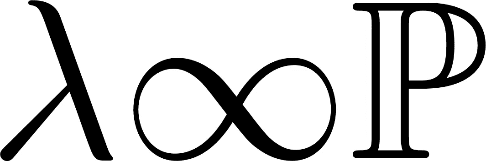

*所有图片均由作者创作*

一天晚上，一位数据科学家、一位工程师和一位数学家在酒吧相遇。

他们互相抱怨工作中的问题。

工程师说，“我有一个巨大的形状奇怪的容器，我需要知道它的体积。当然，我想做一件显而易见的事情，将整个容器装满水，然后称重以得到体积。遗憾的是，由于所有的密封和昂贵的材料，这是一个有点昂贵的设置。这就是为什么我的老板拒绝了这个想法。要是他能拒绝自己的年度奖金就好了……不管怎样，现在我必须用盒子填满整个容器，并估算出大致的结果。”

“那不是很不准确吗？我的意思是你如何填满所有的角落？”数学家问道，他对这种实用性的想法感到不安。

“也许吧，但应该足够好了。如果没有，我可以试着用电脑模拟，这样我可以更精确地估算容器的体积。”

"计算机是如何做到这一点的？"数学家插嘴说。

“有了计算机，我可以把小得多的盒子放进集装箱里，并且可以尽可能接近集装箱，”工程师回答道。

数学家很不服气地问，“但是当你减少容器中盒子的体积时，你怎么知道你的这种近似真的变好了呢？”如果你一直重复这个方法，你真的会得到容器的真实体积吗？这听起来很像是从有限逼近到无限逼近的过渡。这种情况下允许吗？”

“嗯，从技术上讲，计算机不能无限工作。娱乐你的想法。如果我没理解错的话，你是在问:如果我反复减小放入容器的盒子的大小，并总是尽可能多地装满容器，我的近似值是否接近容器的真实体积，对吗？”

“差不多，”数学家澄清道。“如果你永远这样做，或者更好地说(可数地)无数次，会发生什么。箱子的总体积接近集装箱的真实体积吗？我是说考虑一下。也许容器中有圆形部分。没有一个盒子能真正容纳整个体积。当然，你可以把盒子变小，放更多的盒子进去。但是不管你减少多少次你的盒子的大小，它们仍然不能完全捕捉到圆形。那么，如果你真的这样做了无数次，会发生什么呢？无限小的盒子能捕捉容器中的圆形和其他奇怪的角落，并给出容器体积的正确值吗？”

“听起来很数学，”工程师微笑着说。“我相信它会起作用的。只是从视觉上来说。但你是数学家。你告诉我。”

“嗯，你说得对。这正合我的胃口。让我在那上回复你。我确信测度论能以某种方式帮助回答这个问题。”

让数学家去思考，数据科学家开始说话，“你们不会相信我今天做了什么。你还记得在统计课上，我们总是要计算一个人的身高在两个值之间的概率吗？你猜怎么着。事实上，我今天不得不这么做。”

“没门。这位工程师感叹道:“我一直认为这些例子太过牵强。

“正是我所想的。当我们的统计学教授选择这个例子时，他们发现了一些事情。所以今天我重新计算了一下，感觉很怀旧。我甚至拿出我的旧标准正常 cdf 查找表来确定概率。”

“不错。我也会完全做同样的事情，”工程师同意道。

“哦，我记得，”数学家说。“难道不奇怪吗，我们可以积分这样的密度函数，并从中获得有效的概率测量。我是说，这怎么可能呢？”

“你总是带着你的问题，”工程师微笑着说。

“为什么不会呢？”数据科学家继续说道。“我的意思是对整个密度的积分是 1，部分积分总是返回 0 和 1 之间的值。对我来说，这似乎是一个显而易见的事情。”

“对于这样简单的应用，我同意，”数学家说。“但是你难道没有用它来做更多的事情吗？让我们以两个独立随机变量乘积的期望值为例。”

“但这只是个人期望值的产物，”数据科学家插话道。

“对。[证明](https://math.stackexchange.com/a/3712606)使用 Fubini-Tonelli 将两个随机变量乘积的期望值分割成单个随机变量的期望值。但是作为一个要求，这两个随机变量必须遵循一个真实的测度——理论上的概率测度。但是为什么密度函数的积分定义了一个恰当的测度——理论上的概率测度？”

“嗯……奇怪，”数据科学家说。“我以前从未想过这个问题。难道那个问题不会适用于几乎所有概率论的结果吗？”

“没错。”

“这么重要的一个细节在我的任何一次讲座中都没有提到，这难道不奇怪吗？”数据科学家沉思道。

“告诉你，”工程师对数学家说。“你为什么不花一天时间去寻找这些问题的答案呢？然后你可以告诉我们盒子是否真的可以近似圆形，以及为什么对密度函数的积分真的可以产生合适的概率度量。”

“这是一个伟大的想法，”数据科学家说。“我对这个答案很感兴趣。让我们进一步激励他。如果你能以一种可以理解的方式向我们解释，下次我们会为你的饮料买单。”

这个挑战让数学家很高兴，他离开了朋友，回到了家。

在桌前坐下后，数学家首先看他对测度论的预感是否能帮助解决他的两个问题。

为此，他打开他那本积满灰尘的旧测量理论书，开始阅读。

过了一段时间，数学家找到了两个无限逼近方案，肯定地回答了这样一个问题:如果工程师的容器可以用无限多个盒子来逼近。

1.  第一个方案类似于工程师提出的方法。在这种方法下，人们需要找到一种方法，将越来越多的简单对象添加到容器中，并在无数次重复后填满整个容器。那么，测量理论保证了这些无限个体的体积之和等于整个容器的体积。这意味着，如果工程师能找到无限的策略来精确计算容器的体积，这是可能的。
2.  或者，工程师也可以将整个容器装入一个盒子中，并开始凿出小形状。如果他在无数次移走物品后又找到了揭示容器的方法，那么他可以通过从装箱体积中减去无数次移走的体积来精确地计算出容器的体积。

这些方法只有在盒子测度是测度论定义下的恰当测度时才有效。

遗憾的是，通常不可能直接证明测度论测度的性质。一个合适的测度——理论上的测度必须能够测度无限大范围的物体。此外，它必须满足某些属性。除其他外，它必须完成上述计划。

幸运的是，测度论提供了一种方法来将简单的测度扩展为适当的测度——以一种合理的方式满足所有这些性质以及更多的性质的理论测度。

下面的列表描述了要使一个简单的候选度量成为一个合适的度量(理论度量)需要证明什么。

1.  需要一个集合(没有任何属性)。
2.  需要在集合上定义候选度量，这些集合是 1 中集合的子集。只有。
3.  候选测量值需要总是大于或等于零，但可以是无穷大。
4.  空集需要是可测的，并且它的测度必须等于零。
5.  如果两个集合可以由候选测度来度量，那么它们的交集也需要由候选测度来度量。
6.  如果我们把一个可测集从另一个可测集中去掉，那么这个新的可测集一定是可写的，它是有限多个互不相交的可测集的并集。注意，新的集合不需要通过我们的候选度量来度量。
7.  如果两个可测集是不相交的，即两个集中都没有点，并且两个集的并集具有由候选测度定义的测度，那么并集的测度必须与两个单独集的测度相加相同。
8.  1 中的集合。必须可写为可测集的(可数)无限并集，其单个测度不是无限的。
9.  作为任何(可数的)单独可测集的无限联合的子集的任何可测集的测量值必须小于或等于单独测量值的无限和。

为了从盒子体积的测量理论中得到好处，数学家开始研究清单。

作为第一步，他从数学上定义了他的盒子测度。

三维的盒子可以写成一个集合:

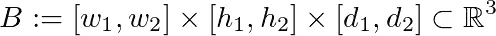

其中 w₁ ≤ w₂，h₁ ≤ h₂，d₁ ≤ d₂都是实数。

要计算立方体的体积，只需将盒子的宽度、高度和深度相乘。

宽度:= w := w₂ - w₁
高度:= h := h₂ - h₁
深度:= d := d₂ - d₁

体积测量用 **λ** 表示，以纪念数学家勒贝格。

因此，我们的数学家也将使用 **λ** 来进行盒测量。

他对盒子体积的度量提出了如下定义。

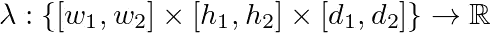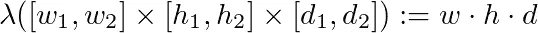

然后，他继续检查清单上的项目，寻找他的盒子尺寸。

1.基本集合是三维实数的集合。

2.根据定义，每个盒子都是该集合的子集。

3.每个盒子的体积都大于或等于零。

4.他的定义目前还不能度量空集。4.要求空集需要有一个体积为零的盒子，即 **λ** ({}) := 0。这是有意义的，因为空集可以被看作是不测量任何东西的体积。

5.他需要证明两个盒子的交集也是一个盒子。

如果两个盒子不重叠，它们的交集就是空集，他现在可以测量它。

如果两个盒子重叠，不难想象它们定义了一个新的盒子。

更精确一点。对于任意两行，以下为真。

[a₁，a₂] ⋂ [b₁，b₂] = [max{a₁，b₁}，min{a₂，bₙ}]

这对于三维的交叉点也是如此。这清楚地表明，两个盒子的交集确实是一个新盒子。

6.这里他需要证明，如果他从另一个盒子中去掉一个盒子，剩下的盒子可以写成有限多个不重叠的盒子的并集。

遗憾的是，他目前的方法发现了他的定义中的一个问题。看下面的例子，他意识到了自己的错误。

[1,3]³\[2,4]³ = [1,2)³

根据他的定义，这不是一个有效的盒子，因为他将盒子定义为封闭的盒子。

幸运的是，他提出了一个简单的解决方案。他只是定义了一个左开右闭的盒子

b:=(w₂w₁]×(h₂h₁]×(d₂d₁)

并且保持他的盒子测度的定义不变。

有了这个定义，以前的问题就解决了:

(1,3]³\(2,4]³ = (1,2]³

在这种情况下，从另一个盒子中移除一个盒子会产生一个有效的新盒子。

在正式测试了如何将一个盒子从另一个盒子中移除的各种组合，并看到新的对象都可以写成其他盒子的有限并集之后，他证明了 6。是真的。

不幸的是，数学家现在必须重新检查之前的 5 项。幸运的是，同样的论点也适用于新的盒子定义。

7.他需要证明两个不相交的盒子的并集(即盒子本身)的体积与两个盒子体积之和相同。

这很容易。合并两个不相交的框只能成为一个有效的框，如果它们可以在一个面上融合而没有任何重叠。这意味着三个维度中的两个(宽度、高度、深度)保持不变。不失一般性地假设盒子共享相同的宽度和高度配置。他得到了两个这样的盒子(⊍的意思是不相交的并集):

**λ**(b₁⊍b₂)= w h(d₁+d₂)= w hd₁+w hd₂=**λ**(b₁)+**λ**(b₂)

这也证实了。

8.在这里，他必须证明整个三维空间可以写成有限体积的盒子的(可数)无限联合。

幸运的是，这些盒子不必是分离的，它们可以包含自己。因此，他可以简单地从零附近的一个简单的盒子开始，让这个盒子在高度、宽度和深度上均匀增长。

形式上:

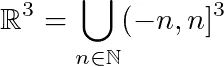

和

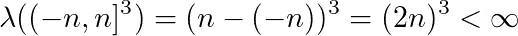

9.最后一步是关键的一步，它允许框度量与无穷大一起工作。

数学家必须证明，如果他有一个盒子被无限多个盒子以某种方式覆盖，那么被覆盖的盒子的体积小于或等于覆盖的盒子的体积之和。

形式上可以这样写。让

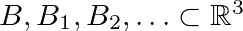

被装在盒子里

然后他必须表明:

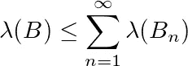

要做到这一点，他必须建立更多关于盒测度的性质。

他必须证明如果一个盒子包含在另一个盒子里，那么外盒子的体积比内盒子的大。
这直接来自于盒子体积的定义。

使用测量理论，他可以从(I)和 1 得出结论。— 7.如果盒子 B 仅被有限多个盒子覆盖，那么盒子的体积小于或等于有限多个盒子的体积之和。显示除 1 之外的(I)。— 7.保护任何其他基本度量候选的该属性，并且不限于框度量。

证据主要集中在 5 左右。和 6。
使用这两个属性，测度论者可以移除盒子并相交盒子，并获得原始盒子作为有限不相交盒子并集的表示。使用 7。然后，他们可以将这些单独的盒子体积相加来计算盒子体积。应用(I ),他们然后显示组合中的某些盒子必须位于(潜在地)覆盖盒子的更大的盒子中，由此他们可以得出结论，各个体积的总和必须更大。有点技术性，但幸运的是其他人已经做了这一部分。

(iii)
现在他知道了对于有限多个盒子来说这个断言是正确的，数学家现在试图将覆盖从无限多个盒子减少到有限多个盒子。

为此，他必须使用拓扑学中的一个常用技巧。他稍微缩小了内盒，使它更紧凑。与此同时，他稍微扩大覆盖盒，使它们打开。然后他有一个由无数个打开的盒子组成的紧凑盒子的盖子。由于内盒的紧性，他然后从紧性的(拓扑)定义中知道，有一种方法可以从那些仍然覆盖紧内盒的无限多个盒子中选择有限多个盒子。

由于盒子体积的连续性，他可以控制紧凑的内盒与真正的内盒有多近，以及外部开口盒与覆盖盒有多近。因此，他可以将问题从无限多个覆盖盒简化为他知道(见(ii))该要求为真的有限多个覆盖盒。

更正式地写下来。让

B := (a，b] := ( a₁，b₁ ] × ( a₂，b₂)×(a₃，b₃)

类似地

Bₙ := (aₙ，bₙ):=((aₙ)₁，(bₙ)₁)×((aₙ)₂，(bₙ)₂))×((aₙ)₃，(bₙ)⃉]

因此，他希望选择δ和δ(n)使得:

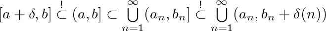

他选择

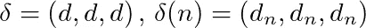

是相等分量大于零的三维向量。

根据紧性的定义，他得到:

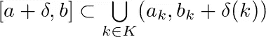

其中 K 是自然数的有限子集。

“长方体测量”仅允许计算左侧打开和右侧关闭的长方体的体积。但这很好，因为(a + δ，b)⊂[a+δ，b]，和

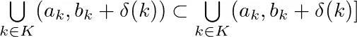

因此

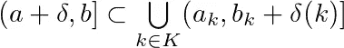

如同

和

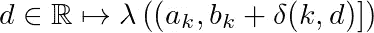

在 d 中是连续的他可以使体积任意接近

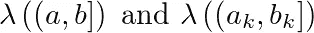

通过控制 *d* 和 *dₙ* 。

总的来说，对于任意的*ε*0，他得出如下结果:

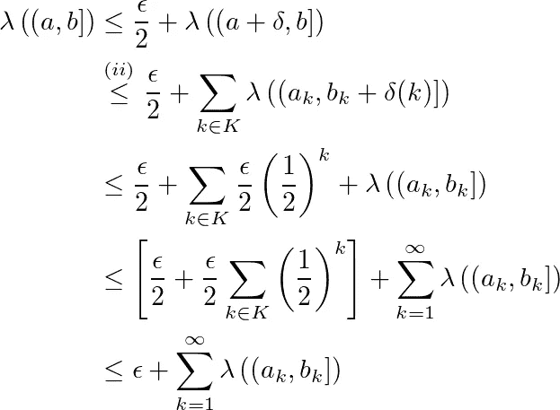

现在他让 *ε* 趋近于零，他完成了清单的验证。

由于盒体积测度满足所有需要的性质，它可以唯一地扩展到所有"[Borel-measured "](https://de.wikipedia.org/wiki/Borelsche_%CF%83-Algebra)集合的体积测度。
实际上，这意味着，任何现实生活中的物体的体积都可以使用上面两个方案概述的无限盒子的巧妙覆盖来精确测量。

在一些简单的线性代数的帮助下，可以证明体积在可逆矩阵变换下表现良好。
一个集合的每一点乘以一个可逆矩阵，得到一个物体，其体积与原体积乘以矩阵行列式的绝对值相同。使用它，现在只要知道原始体积，就可以非常简单地计算在任何维度上翻转、旋转或拉伸的任何变换对象的体积。这就是为什么一个球的体积随着半径的增加而立方增长。

度量理论保证的性质还有很多，跳过前 50-70 页后，可以从任何度量理论书籍中找到，因为它们大部分都包含了必要的证明，从而允许检查一些性质的过程。

走向数据科学家。数学家想要检查连续密度函数上的积分是否真正定义了测度论概念下的概率测度。为此，他将再次检查清单。第二次迭代会快得多，因为核对表的最后一个属性几乎与盒子度量的证明相同。

他首先定义了他想提升到测度论世界的基本测度。

让

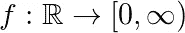

是连续的密度函数。

然后，候选概率度量被定义为

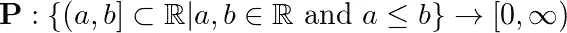

随着

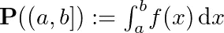

这一次，数学家直接定义了在第 6 项中左开右闭的基本对象。

他又来了。

1.基本集合是所有实数的集合。

2.这些集合都是实数的子集。

3.)由于中值定理

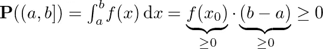

对于 x₀ ∈ (a，b)当 f 是连续的。

4.根据积分的定义，它遵循 **P** ({ }) = 0

5.和之前一样(a，b] ∩ (c，d] = (max(a，c)，min(b，d)]这是在 **P** 的定义域内。

6.正如预期的那样，(a，b] \ (c，d)也在 **P** 的定义域内，因为它总是(x，y)形式的区间。
查看有四个容易检查的案例。

7.因此，积分是独立于划分的(⊍意味着不相交的并集)

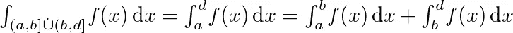

8.和以前一样，实数可以写成一个并集

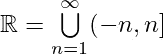

和

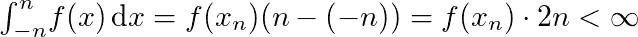

9.这个证明类似于勒贝格测度的证明。

当 f 大于或等于零时，积分是单调的。
从测度论中，我们知道，对于有限的和，这个要求是正确的。

微积分的基本定理表明

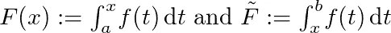

是可微的，因此在任何区间[a，b]都是连续的。

由此得出结论，区间(a，b)和(aₙ，bₙ)可以以可控的方式收缩和扩张，以创建一个紧集和一个开集的无限覆盖，对于这些开集必须存在一个有限覆盖。这样，无限索赔可以简化为一个有有限多个被加数的问题。

然后，使用与之前相同的计算方法进行索赔。

因为 f 是密度函数，我们知道

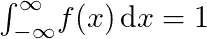

因此，P 可以扩展为测度论保护伞下的概率测度。因此，概率论和测度论的所有定理都适用于从密度函数得到的概率测度。

在找到问题的答案后，数据科学家、工程师和数学家再次在酒吧见面并点了饮料。

"你找到昨天那些问题的答案了吗？"工程师问数学家。

“是的，我做到了。这位数学家回答道:“我创建了一个简单的属性清单，需要对这些属性进行检查，以使一个候选测度成为测度理论框架下的一个适当测度。”。

“很好，”数据科学家说。"我想你已经检查过清单来回答这两个问题了吧？"

“没错，”数学家热情地表示同意。“我首先从一个简单的盒子体积测量开始。在检查清单时，我不得不两次修改我的定义，但最终，我能够证明清单中的属性。因此，如果你可以无限细化你放入容器的盒子，确实有可能精确计算出容器的体积。”

“很好，”工程师回答。"所以无限不再是一个问题了？"

“可数不定式不是。然而不可数不定式是另一个问题。对了，我还找到了另一种解决集装箱容积问题的方法。”

“我总是乐于接受可行的想法，”这位工程师大声说道。

“这个是可行的，”数学家继续说道。“除了用盒子填满容器，你还可以把容器放在盒子里，用小盒子填满容器和外盒之间的空间。最后，你可以简单地从外部盒子体积中减去单个盒子的体积。”

“等等，听起来是个好主意！今天我的老板否决了用盒子装满集装箱的想法。里面的材料显然太有价值了。你的想法解决了那个问题。我怎么没想到呢！？让我去找我的老板，把这个想法告诉他。谢谢！”说完，工程师离开了酒吧。

“我很久没见他这么兴奋了，”这位数据科学家笑着说。“那么你对分布函数有什么发现？你重复使用你的清单了吗？”

“是的，”数学家解释道。“更好的是，我可以将最具挑战性的证明几乎完全复制到分布函数中。这也使得检查清单变得非常简单。这里看一看。”

数学家将笔记交给数据科学家，数据科学家开始检查笔记。

“等一下，”数据科学家说。“这太直观了。利用紧致性将无限个被加数减少到有限个是非常聪明的。等一下。也许我可以用这个技巧来解决困扰我一整天的工作问题？我得去检查一些东西。干得好，你做得很好。回头见。我得走了。”

“等等，”数学家说，但是已经太晚了。他的两个朋友已经离开了酒吧。酒保正走向他的桌子。他为什么要把钱包留在家里？

[1]阿奇姆·克兰克，瓦赫尔斯·谢林凯茨理论(2020)，施普林格