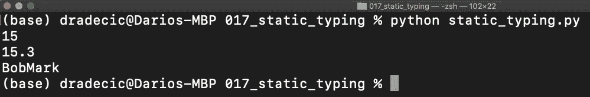
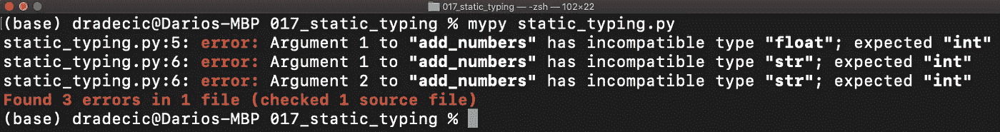

# 如何使 Python 成为静态类型——基本指南

> 原文：<https://towardsdatascience.com/how-to-make-python-statically-typed-the-essential-guide-e087cf4fa400?source=collection_archive---------4----------------------->

## 类型提示、变量注释和强制运行时类型检查——您需要知道的一切。

Python 是一种动态类型语言——我相信你知道这一点。这对初学者来说既简单又有趣，因为不需要考虑数据类型。尽管如此，静态类型还是有一些好处。今天我们将探索如何使 Python 尽可能静态化。

[弗洛里安·克拉姆](https://unsplash.com/@floriankrumm?utm_source=unsplash&utm_medium=referral&utm_content=creditCopyText)在 [Unsplash](https://unsplash.com/s/photos/keyboard?utm_source=unsplash&utm_medium=referral&utm_content=creditCopyText) 上的照片

不想看书？请观看相关主题的视频:

*那么，动态类型语言是怎么回事呢？简单地说，这意味着没有代码编译，所以 Python 解释器在代码运行时执行类型检查。因此，允许在整个应用程序中更改变量类型。*

这听起来像是一种优势，但是随着代码库变得越来越大，这可能会导致奇怪且难以跟踪的错误。

另一方面，静态类型语言在编译时执行类型检查(想想 *C* 或 *Java* )。此外，它们给了您一些安全感，因为您可以立即判断每个函数的参数类型。

在我们开始之前，有一个简短的声明——Python 将永远是一种动态类型的语言。你不能像 Java 或 c 一样把它变成静态的，因为 PEP 484 引入了类型提示，所以我们必须利用它。

这篇文章的结构如下:

*   类型提示
*   可变注释
*   表示更高级的数据类型
*   在运行时强制类型检查
*   结论

# 类型提示

类型提示仅仅是提示。它们向您展示了预期的数据类型，但是没有什么可以阻止您忽略它们。我们稍后将探讨如何通过 Python 解释器强制进行类型检查，但让我们先来看看基础知识。

让我们做一个没有类型提示的例子。下面是一个将两个数相加并返回总和的函数。Python 就是 Python，我们不必为参数或返回值指定数据类型:

函数调用的打印结果分别为 *15* 、 *15.3* 和 *BobMark* 。要引入类型提示，我们必须执行以下操作:

*   对于参数-将冒号(:)放在参数名称的右边，并在后面指定数据类型
*   对于返回值-将箭头符号和数据类型放在括号的右边

下面是如何给我们的`sum_numbers`函数添加类型提示:

这个函数现在看起来更清楚了，但是我们仍然可以传递任何数据类型——表明提示只是提示，而不是义务。

根据 PEP 8，以下是类型提示建议:

*   对冒号使用常规规则，即冒号前没有空格，冒号后有一个空格
*   将参数注释与默认值结合使用时，请在=符号周围使用空格
*   在->箭头周围使用空格

稍后我们将看到如何**强制**类型检查。

# 可变注释

我们还可以为变量提供类型提示。同样，这些只是提示，并不影响代码的运行。

下面是一个如何向变量添加类型提示的快速示例:

没有什么可以阻止你给变量`age`赋值 32.95，或者给`is_premium`赋值 no。暗示只是表示不应该。

# 表示更高级的数据类型

到目前为止，我们所介绍的一切都很好，但是如果您想声明一个字符串列表或一个键和值都是字符串的字典，该怎么办呢？

这就是`typing`模块发挥作用的地方。有了它，您可以使用任何更复杂的数据类型，比如列表、字典和元组。您也可以声明自己的数据类型，但这已经超出了今天的范围。

现在让我们使用`typing`模块来声明一个名字列表，然后是一个电子邮件字典，其中每封电子邮件都属于一个名字。在所有情况下，数据类型都是字符串:

冗长多了，但感觉更安全。更进一步，让我们看看如何使一个函数参数成为一个整数列表。这很简单:

您现在知道了如何使用类型提示来声明任何数据类型的变量，但是如何在运行时强制进行类型检查呢？接下来让我们来探索一下。

# 在运行时强制类型检查

我不知道在笔记本环境中有什么强制类型检查的方法——所以我们将切换到脚本。我做了一个名为`static_typing.py`的文件，但是你可以随意命名你的文件。

在继续之前，我们必须安装一个名为`mypy`的库。它用于在运行时强制进行类型检查，这正是我们所需要的。要安装它，从终端执行`pip install mypy`。

我们现在可以走了。`static_typing.py`脚本包含以下代码:

从终端，以传统方式执行脚本——通过编写`python static_typing.py`

图 1 —不带 mypy 的执行(作者图片)

代码将运行而不抛出错误。这相当于我们之前在笔记本中所做的。但是我们不希望这样。使用`mypy`，我们可以强制进行类型检查。从终端执行以下命令:`mypy static_typing.py`:

图 2 —使用 mypy 执行(图片由作者提供)

如你所见，程序崩溃了。这正是我们想要的行为，因为函数需要两个整数，但是我们没有在函数调用中提供数据类型。

这就是开始时你应该知道的。让我们在下一部分总结一下。

# 离别赠言

让我们以使用类型提示的利弊来结束这篇文章。

优点:

*   它们有助于记录您的代码——但不能代替 docstrings
*   出于显而易见的原因，它们有助于维护一个更干净的代码库
*   它们改进了代码编辑器的林挺功能——例如，如果检测到类型不匹配，PyCharm 会显示警告

缺点:

*   添加起来可能会很乏味，尤其是如果您不习惯它们的话

总结一下——类型提示不是必需的，但却是很好的实践，尤其是在处理大型代码库时——即使你决定不使用`mypy`。

你对类型提示有什么想法？您是一直使用它们，还是只是在代码库变大时才使用它们？请在下面的评论区告诉我。

## [加入我的私人邮件列表，获取更多有用的见解。](https://mailchi.mp/46a3d2989d9b/bdssubscribe)

*喜欢这篇文章吗？成为* [*中等会员*](https://medium.com/@radecicdario/membership) *继续无限制学习。如果你使用下面的链接，我会收到你的一部分会员费，不需要你额外付费。*

 [## 通过我的推荐链接加入 Medium-Dario rade ci

### 作为一个媒体会员，你的会员费的一部分会给你阅读的作家，你可以完全接触到每一个故事…

medium.com](https://medium.com/@radecicdario/membership) 

*原载于 2020 年 11 月 7 日 https://betterdatascience.com***。**