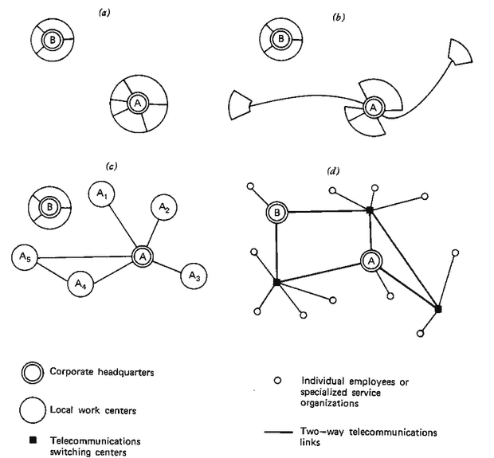
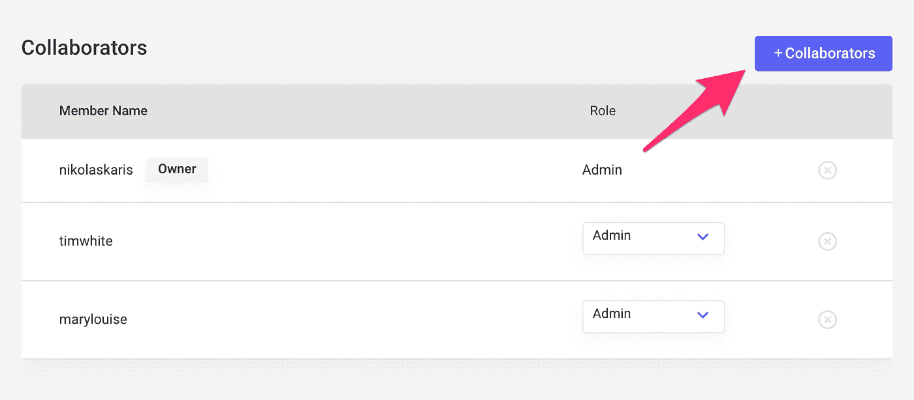
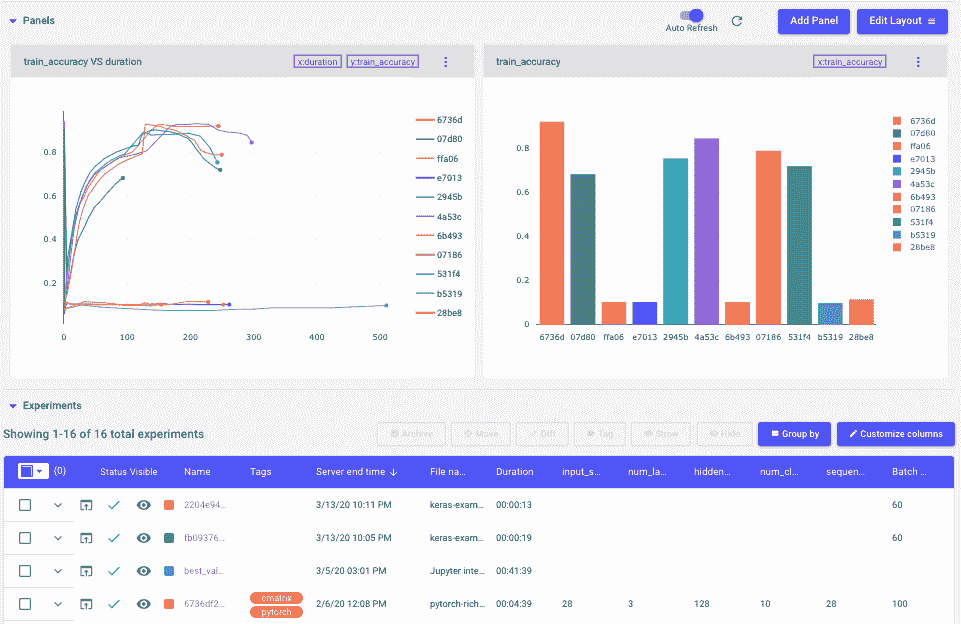

# 如何让远程工作对数据科学团队有效

> 原文：<https://towardsdatascience.com/how-to-make-remote-work-effective-for-data-science-teams-e784dee2f208?source=collection_archive---------23----------------------->

## 团队成员、经理的想法和帮助您提高效率的工具

1973 年，在石油输出国组织石油危机和燃料价格飞涨的高峰期，美国宇航局科学家和南加州大学教授杰克·奈尔斯开始思考不需要通勤就可以完成工作的方法。尼尔斯的思想实验演变成了案例研究，无数的书籍，包括**关于远程办公的原著，以及数十篇论文、文章和主题演讲。直到今天，Nilles 仍然是远程工作作为传统办公室的可行替代方案的主要倡导者之一。**

****

**两家不同公司远程办公的组织演变，来自电信运输权衡(Nilles)。**

**今天，认为尼尔斯的早期作品《透视》并不完全是夸张的。在过去的十年中，采用远程工作人员的公司急剧增加。由 Flexjobs 和 Global Workplace Analytics 汇编的一份 [2019 报告](https://www.flexjobs.com/blog/post/flexjobs-gwa-report-remote-growth/)发现，从 2005 年到 2017 年，美国远程办公的人数增加了 159%。随着围绕新冠肺炎的全球危机迅速发展，迫使越来越多的公司采取严格的在家工作政策，远程工作正进一步巩固其作为一种工作场所范式的地位，值得认真对待。**

**数据科学行业也不例外。就完全或部分远程工作的员工比例而言，大型计算机、IT 和软件开发行业属于[增长最快的](https://www.flexjobs.com/blog/post/100-top-companies-with-remote-jobs-2020/)行业。远程工作的好处是有据可查的:Buffer 和 Angellist 发布的一份联合报告——对 3500 多名远程技术人员的调查——发现灵活的时间表、在任何地方工作的能力以及不用通勤是远程工作最有吸引力的好处。**

****

***Buffer 和 Angellist*[*Report*](https://lp.buffer.com/state-of-remote-work-2020)**

**尽管有这些好处，但部署这些系统以提高远程团队的效率和生产力并不容易。协作和沟通等简单的事情变得具有挑战性。员工更容易感到孤独、心烦意乱，或者觉得工作日永无止境。在数据科学团队中，行业最佳实践[仍在成型](https://www.comet.ml/site/why-software-engineering-processes-and-tools-dont-work-for-machine-learning/)，这些问题可能会更加突出。**

****

***缓冲区和 Angellist*[报告 ](https://lp.buffer.com/state-of-remote-work-2020)**

**这篇文章旨在强调一些在家工作的最佳实践，包括一般的和特定于数据科学的，以帮助数据科学家和团队在远程工作时保持生产力、联系和快乐。**

# **数据科学团队成员的最佳实践**

****创建高效的工作空间****

**有一个专用的工作空间(阅读:不是你的床)。让你的手机远离你的工作场所，只在休息的时候查看。一定要保持你的工作环境整洁——在一个凌乱的环境中工作会令人难以置信地分心。**

****确保和你的同事聊天——即使你没有必要这样做****

**安排一天打几个视频电话来保持理智，即使它们不是绝对必要的。其中至少有一个是与同事/朋友的非工作相关的“远程咖啡”。始终打开摄像头，尽量扩大视频通话窗口，让您感觉像在进行一场真正的对话。**

****工作习惯****

**在你的日历中划出不受干扰的工作时间、锻炼时间、午餐时间等等。鼓励你的同事也这样做。过度沟通并假设意图良好。一条快速更新的信息可以确保你的经理对工作的进展感到放心。与此相关的是，同意每天与你的队友保持联系的节奏——例如每天早上的站立会议。**

**有一个明确的“关闭时间”(与您的团队达成一致)—远程的最大风险之一是您永远不会关闭和停止工作，因此在这一点上要积极主动**

# **远程管理数据科学团队的技巧**

**当考虑如何管理远程团队时，首先强调远程工作的主要优点和缺点是很重要的。**

**从高层次来说，作为一名经理，你的好处是你的团队有可能提高生产力，因为没有通勤，更少的分心(希望如此)，和更多的时间专注。**

**缺点通常是沟通效率较低，合作机会较少。有些人可能会说，你也可以远程协作和交流，但正如任何经济学家都会告诉你的那样:没有免费的午餐。虽然远程团队确实有缺点，但是有一些非常好的策略可以让你最小化这些缺点。**

****利用远程工作的优势****

**首先，关注并发挥远程工作的优势。你刚刚得到了一个比以前更有能力专注的团队。用那个！为此，您需要执行以下操作:**

1.  ****相信你的团队。**如果你从如何管理好一个远程团队中吸取了一点经验，那就是:相信你的团队能够有效地工作，并合理地管理他们的时间。如果你花很多时间做更多的微观管理，你将会放弃远程工作的几乎所有好处。**
2.  ****设定明确的期望。**如果你能设定清晰的工作优先级，并设定可衡量的里程碑，你就能让你的团队投入工作并专注。在这一点上，在家工作可能是一个巨大的优势，因为希望更少的干扰和更多的时间来完成工作。**

**如果你能设定明确的期望，并相信你的团队能完成工作，远程工作会是一个优势。例如，你可以在一天开始时与团队一起检查，设定期望，然后让每个人去工作。**

****建立系统和流程来平衡不利因素****

**现在，让我们来讨论一下它的缺点。沟通与协作。当你知道需要做什么，并且能够独立完成时，专注的工作是很棒的。但是那些面对面合作的偶然时刻呢？你如何复制它？我认为你不能完全。面对面的交流和合作可能总是更好(因此，没有免费的午餐)，但这并不意味着你不能最小化远程工作的缺点。为此，我建议如下:**

1.  ****视频交流。我们交流的很多方式都是非语言的，在通话中不打开视频会损害你的交流能力。****
2.  **在会议中不要总是直奔主题。对于远程团队，你没有时间进行“饮水机”式的讨论。在适当的时候，花些时间开会，只是为了保持联系。**
3.  ****安排远程友好的团队建设活动。**“水冷却器”讨论应该每天进行，但我也建议每月进行一次活动，集中时间放松和了解对方。我的团队最喜欢的是[黑手党](https://icebreakerideas.com/mafia-game/)。**
4.  **当接下来的步骤不明确，而您需要创造性的协作时，使用视频会议平台上的白板功能进行远程头脑风暴。不要只是参加一个虚拟会议，然后开始讨论想法。事先以书面形式发出目标，让人们单独进行头脑风暴，并将想法带到会议上，并允许每个人分享他或她的想法，然后进行讨论并确定优先顺序。这有时被称为无声头脑风暴，非常远程友好，往往更有效。**
5.  ****培养一种彻底坦诚和心理安全的文化。**你现在的一个弱点是沟通，因为你很偏远。确保你的文化在公开和诚实的反馈方面特别强大。正反都有！作为一名领导者，要在寻求、给予和接受反馈方面树立榜样。确保每个人在表达想法和发表意见时都感到安全。**

**这些步骤应该有助于在您的远程团队中建立友谊和信任，这两者对于强大的沟通和协作都是必要的。你无法享受面对面协作的偶然时刻，也无法享受人们共处一室时发生的会后讨论。**

# ****投资工具鼓励协作****

**你可以利用一些神奇的工具来提高沟通和协作的效率。**

****缩放****

**一个好的视频会议工具对于所有团队都是不可或缺的，尤其是远程工作的团队。我们每天使用 zoom 与远程团队成员开会。无论你选择什么样的视频会议工具，都要确保它易于使用，这样你的团队在和同事打电话时就可以尽量减少摩擦。**

****松弛****

**实时消息传递允许团队中的信息流动是临时的、对话式的和非正式的。这些都是至关重要的价值观，可以确保你保持你的团队能够轻松地、有机地、协作地开发创意。Slack 是一个流行且优秀的工具，允许团队这样做。**

****彗星****

**即使在同一个地方工作，数据科学团队也容易成为一群孤独的建模者。切换到远程，就更容易掉进这个陷阱。幸运的是，有工具可以让数据科学家、机器学习工程师或任何处理模型的人更容易地在分布式团队中实时记录、可视化、共享和重现他们的工作。Comet 提供了一个元机器学习平台，可在云中或本地/VPC 运行，允许数据科学团队这样做:重现完整的实验(而不仅仅是代码)，管理大型分布式数据科学团队的用户，并为经理提供对团队贡献和绩效的洞察。**

**Comet 允许数据科学团队通过与许多用户创建协作项目来轻松管理分布式团队:**

****

***在 Comet 中添加合作者***

**如果您的团队是一个协作项目的一部分，每个数据科学家都可以在一个中心位置发布他们的实验，在这里可视化、比较、分析和调试团队范围的工作变得很容易，即使在远程工作时也是如此:**

****

***彗星项目页面***

****结论****

**随着新冠肺炎迫使许多团队进行远程工作，新远程团队的成员和经理们将很好地考虑如何充分利用他们的新远程办公。利用远程工作优势的团队将保持高效、沟通和快乐。此外，可以实施安全措施和流程来有效应对远程团队面临的许多常见挑战。帮你自己一个忙，今天晚些时候和你的一个同事安排一次 15 分钟的视频通话。这将是值得的时间。**

**本文与 [Comet.ml](https://www.comet.ml/site/how-to-make-remote-work-effective-for-data-science-teams/) 的 [Nikolas Laskaris](https://www.comet.ml/site/how-to-make-remote-work-effective-for-data-science-teams/) 共同发表。我是 Comet 的用户，他们没有为这篇文章付钱。**

**有兴趣了解有关 Python 数据分析和可视化的更多信息吗？查看我的[课程](https://www.educative.io/courses/python-data-analysis-and-visualization)。**