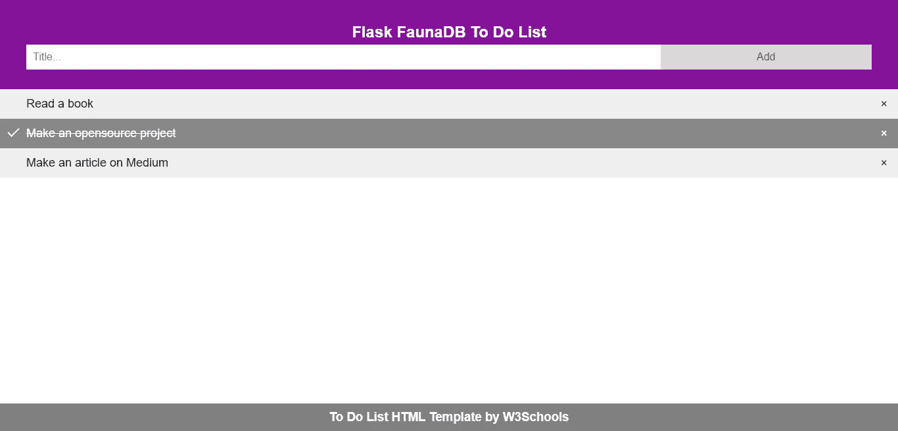
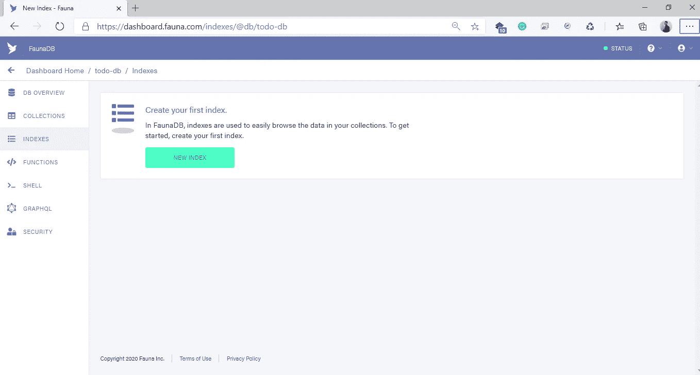
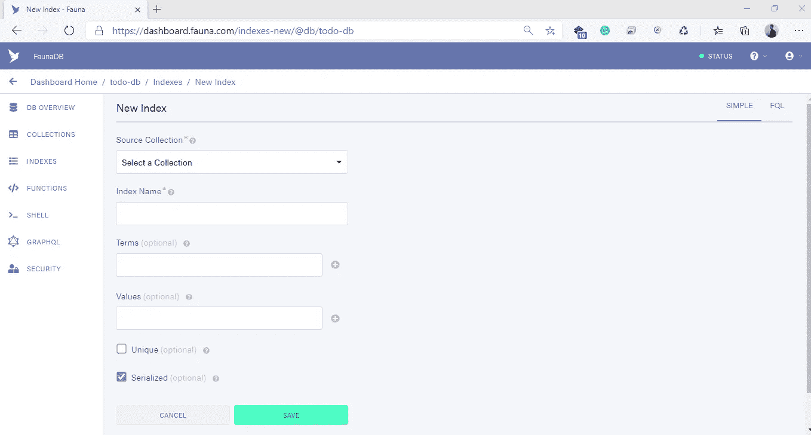
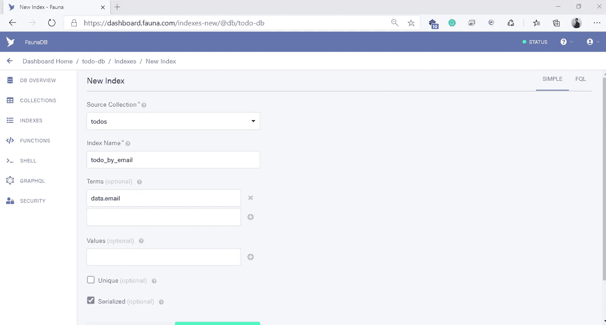
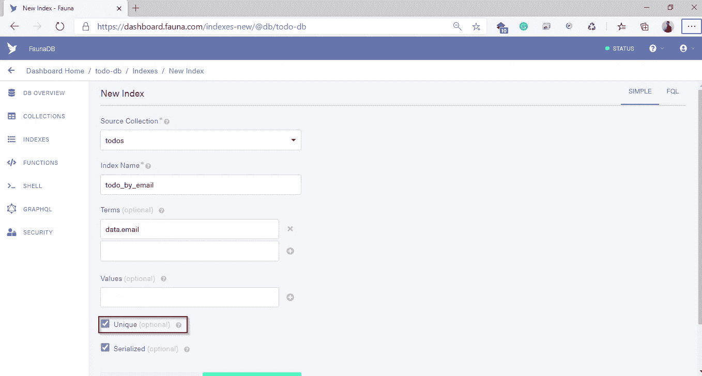

# 如何使用 Flask 和 FaunaDB 制作可伸缩的 API

> 原文：<https://towardsdatascience.com/how-to-make-scalable-apis-using-flask-and-faunadb-f6005d4a8065?source=collection_archive---------34----------------------->

## 帮助使用 Flask 和 FaunaDB 构建快速 API 的快速样板文件。


凯文·霍尔瓦特在 [Unsplash](https://unsplash.com?utm_source=medium&utm_medium=referral) 上的照片

随着无服务器技术的兴起，web 服务变得越来越简单。无服务器应用程序改变了应用程序的旧的整体架构，并促进了更多的微服务解决方案来解决技术问题。

凭借自动扩展和多区域部署的优势，无服务器应用近年来迅速崛起也就不足为奇了。无服务器的成本也重新定义了我们制作软件的方式，因为它现在是基于每个请求，而不是基于时间的服务。

> 更好的是，无服务器还使小型服务完全免费。大约一百万次请求后才需要支付。[Azure Function 的消费计划](https://azure.microsoft.com/en-us/pricing/details/functions/#:~:text=Azure%20Functions%20consumption%20plan%20is,function%20apps%20in%20that%20subscription.)就是一个例子。

# 无服务器和这个教程有什么关系？

这里提到无服务器的主要原因是因为 [FaunaDB](https://fauna.com/features) 是一个 NoSQL 数据库，它是为无服务器设计的。这个数据库的价格是基于请求的，这正是无服务器应用程序所需要的。

使用像 FaunaDB 这样的服务可以大大降低成本，以至于该应用程序的托管功能几乎是免费的。当然不包括开发成本。因此，对无服务器应用程序使用按月计费的数据库就失去了意义。

自由堆栈的例子是 Netlify、Netlify 函数和 FaunaDB 的组合。尽管它只对一定数量的请求是“免费的”。除非你开发的应用在部署的第一天就有成千上万的用户，否则我不认为这是什么大问题。

> 在我看来，对无服务器应用程序使用按月计费的数据库有点扼杀了这一点

另一方面，Flask 是用 Python 编写的微框架。它是一个极简框架，没有数据库抽象层、表单验证或其他框架提供的任何其他特定功能。

Flask 大体上是无服务器兼容的。你可以用 AWS Lambda 做一个无服务器的 Flask 应用。这里是来自 serverless.com 的官方指南。

# 入门指南

## 设置 Python 和 Pip

首先安装 Python 和 Pip。我不会列出所有可能的安装方式，对于 Windows 用户，你可以在这里获得安装程序[。至于 Linux 用户，如果你使用的是基于 Debian/Ubuntu 的发行版，打开你的命令提示符，安装 python 和 pip，如下所示:](https://www.python.org/downloads/windows/)

```
sudo apt update
sudo apt install python3 python3-pip
```

要检查安装是否正确，请尝试执行以下命令:

```
python --version
pip --version
```

然后会显示相应命令的版本号。

## 安装依赖项

环境设置完成后，下一步是安装 Flask 本身。安装过程很简单，只需输入:

```
pip install Flask
```

然后，为 FaunaDB 安装 python 驱动程序:

```
pip install faunadb
```

*瞧！*一切就绪！

# 制作待办事项应用程序

现在我们要用所有应用程序创意的**之母**制作一个示例应用程序，待办事项列表应用程序。

## 待办事项列表模板

对于这个例子，因为我们将主要关注如何制作 API，我们将使用 [W3School 模板](https://www.w3schools.com/howto/howto_js_todolist.asp)用于待办事项列表应用前端。



作者举例说明应用程序

## 基本项目结构

我们的项目将是一个助手模式的实现。我们项目的一个简单概要如下:

```
-/
 |--app.py 
 |
 |--services
    |--todo_service.py
 |--helpers
    |--todo_helper.py
 |--entities
    |--faunadb_entity.py
```

# FaunaDB 指数

## 等等，什么是索引？

索引是你在 FaunaDB 中做‘where’语句的方式。它允许您根据字段值获取特定的文档。

要创建新的索引，只需转到数据库的 Indexes 部分，然后单击 **New Index** 。



FaunaDB 索引页面，作者图片

创建索引时，选择您想要与之交互的集合。然后定义要搜索的字段名称。最后，定义你的索引名，确保它是唯一的和可读的。



FaunaDB 新索引表，作者图片

例如，让我们创建一个索引，在这个索引中我们可以获得现有集合中的所有数据。


所有待办事项索引，作者图片

哦，通过用户的电子邮件获取 todos 的索引怎么样？简单。



通过电子邮件获取待办事项，通过作者获取图片

如果要使术语唯一，请选中唯一复选框以添加约束。



在 FaunaDB 中添加约束，按作者排序的图像

要向某个集合添加约束，您需要使用包含唯一字段的术语创建索引。

为了帮助你更好地理解，这里有一篇来自《动物群》的官方文章来帮助你理解指数。

# 让我们制作 API

## 创建烧瓶启动文件

首先，编写一个运行 Flask 的 python 文件。

基本烧瓶应用程序

## 编写 FaunaDB 实体脚本

接下来，在我们开始编写服务和助手之前，我们必须首先定义一个实体文件来连接到 FaunaDB。

这用于通过索引获取 FaunaDB 文档。get 函数不返回多个文档，一次只能返回一个文档。

为了获得多个文档，我们需要使用一个映射函数，通过某个索引返回多个数据。

lambda 函数将传递索引中所需的数据，而 paginate 将在集合中搜索特定的文档，然后 map 函数将所有匹配的文档作为列表返回。

Get document by reference Id 是惟一一个不使用索引而是利用文档的引用 Id 的函数。

创建、更新和删除文档的代码是相似的。因为 FaunaDB 是一个 NoSQL 数据库，所以数据结构并不重要，只要它是作为字典传递的。更新和删除文档还需要一个额外的引用 Id 参数，类似于通过引用 Id 获取文档函数。

## 成为待办事项助手

在编写了 FaunaDB 实体脚本之后，为集合编写助手函数。辅助函数需要是精确的小函数，只做一件事。

## 制作待办事项服务

当所有的助手都准备好了，编写服务文件作为端点使用。所有的请求都在服务级别进行解析，因此助手级别将只接收处理过的数据。

## 将路由附加到服务端点

最后，当端点设置好后，将端点添加到 app.py

你完了！不要忘记在部署之前用 Postman 测试 API。

# 摘要

**TL；你可以查看我的项目 Github 库，并尝试自己运行它。**

[](https://github.com/agustinustheo/flask-faunadb) [## agustinustheo/flask-faunadb

### Flask 和 FaunaDB 项目的样板代码。

github.com](https://github.com/agustinustheo/flask-faunadb) 

在本教程中，您已经学习了使用 Flask 和 FaunaDB 制作 API。

概括地说，我们已经取得了:

*   使用 Flask 的 API 端点。
*   动物区的索引 b。
*   FaunaDB 的一个简单的实体助手。
*   未来 API 项目的可读样板。

当你想在几个小时内制作一个快速的应用程序时，你现在有了一个快速的模板设置。未来的计划包括在现有的样板文件中添加一个 Swagger 实现。

希望这是你的一个好的开始，祝你愉快！