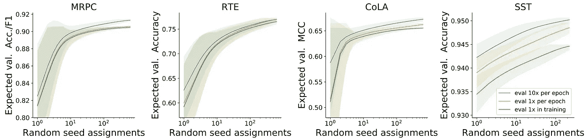
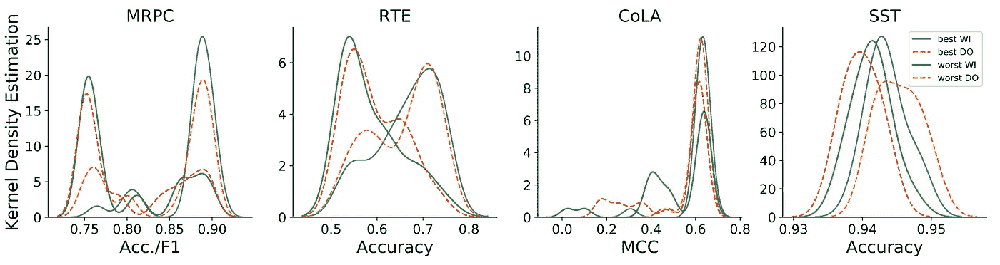
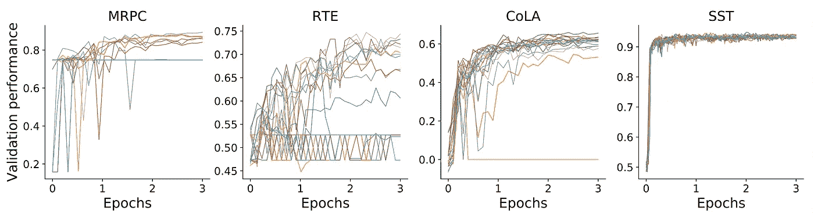
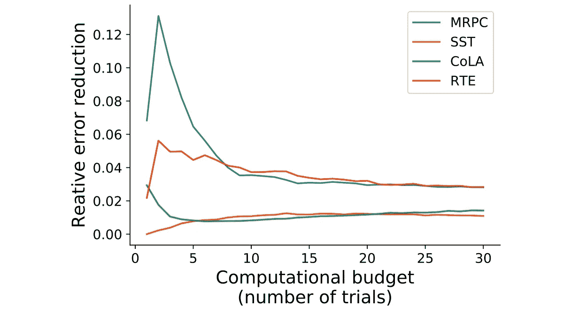

# 如何充分利用 BERT 微调

> 原文：<https://towardsdatascience.com/how-to-make-the-most-out-of-bert-finetuning-d7c9f2ca806c?source=collection_archive---------12----------------------->

## 资源受限的 BERT 微调

## 重量初始化、数据订单和提前停止

照片由[德鲁·帕特里克·米勒](https://unsplash.com/@drewpatrickmiller?utm_source=medium&utm_medium=referral)在 [Unsplash](https://unsplash.com?utm_source=medium&utm_medium=referral) 上拍摄

在下游任务中微调像 BERT 这样的预训练语言模型在 NLP 研究和应用 NLP 中已经变得无处不在。这部分是因为使用预训练模型可以节省大量时间和金钱。它们也经常作为强基线模型，当微调时，显著优于从零开始的训练模型。

W 尽管微调 BERT 在理论上相对简单，但由于不同训练运行的结果似乎是随机的，因此在实践中可能会非常耗时且得不到回报。事实上，即使反复微调具有相同超参数的模型，由于(1)权重初始化和(2)数据顺序(数据集如何被打乱)的随机性，最终模型性能也可能存在很大程度的可变性。在小数据集上微调 BERT 时，这尤其是个问题。

最近的研究探索了这些经常被忽视的随机性来源。作者提供了 **2 个实用技巧**,在给定一定计算预算的情况下，您可以使用它们来微调更好的模型，从而充分利用 BERT 微调:

1.  **在一个时期内多次评估您的模型；和**
2.  **尽早识别不良初始化并阻止它们。**

除了这些实用技巧之外，本文还提供了两个有趣的见解:

1.  使用与原始设置中相同的超参数训练 BERT，但使用不同的随机种子，导致性能大幅提高，使其在某些任务上可以与 ALBERT 等新架构竞争；和
2.  有一些权重初始化在全局上比其他的更好:它们在多个任务上比其他初始化产生更好的模型。

## 实验装置

作者在 4 个不同的 GLUE 二元分类数据集上多次微调 BERT。其中三个相当小(MRPC、RTE 和可乐)，一个相对大(SST)。

在每个数据集上，他们共同微调所有 BERT 参数，并在所谓的剧集中训练一个分类头。在每一集中，超参数是相同的，但是控制权重初始化和数据顺序的随机种子被修改。作者在小数据集上尝试了 25 种不同的随机种子，在 SST 上尝试了 15 种。也就是说，他们总共播放了 2100 集(3 x 25 + 15)。

# 技巧 1:经常评估

标准的机器学习工作流程相当于根据训练数据训练一定数量的模型，在验证集上挑选首选模型，并在测试集上评估其最终性能。

在这个工作流程中，训练更多的模型自然会导致最佳模型的更高的预期性能和更小的方差。但是训练更多的模型也需要更多的时间和资源。因此，从业者面临着预期性能和资源消耗之间的权衡。

了解这种权衡是什么样的非常重要。我们可以在运行一定数量的微调剧集后，通过绘制预期的验证性能来实现这一点:

x 轴:微调集的数量(训练的模型)，y 轴:最佳模型的预期性能。每个时期评估模型 10 次比每个时期评估一次或在训练中评估一次会导致更高的预期性能。[ [来源](https://arxiv.org/pdf/2002.06305.pdf)

正如所预期的，当用一些超参数训练一个模型仅一次时，验证性能的差异是巨大的。随着更多模型(具有相同的超参数，但是用于权重初始化和数据顺序的不同种子)被训练，方差减小。类似地，最佳模型性能的期望值随着我们尝试的不同初始化的数量而增加。

## 关键要点是:

从上面的图表中我们可以看出，每个时期评估模型 10 次(蓝线)比每个时期评估一次或更少会导致更高的预期验证性能。因此，作者得出结论认为

> “根据验证数据更频繁地评估模型会导致更高的预期验证值”

# 随机种子的影响有多大？

我们刚刚看到，如果我们仅微调 BERT 一次，在某个超参数设置下，验证性能会有很大差异。这是由于随机权重初始化 **(WI)** 和数据顺序 **(DO)** 。这些初始化对性能有多大影响？

为了回答这个问题，作者绘制了每个数据集的最佳/最差 WI/DO 种子的所有片段的验证性能分布:

对于最差的种子(绿色和红色虚线)，验证性能的密度往往位于较低的性能区域。这对于 MRPC 和 RTE 来说尤其如此，其中分布呈现双峰。[ [来源](https://arxiv.org/pdf/2002.06305.pdf)

从上面的图表中，我们看到最好的种子在高性能区域比最差的种子有更多的密度。作者进行了方差分析测试，证明了最佳和最差种子的分布确实具有不同的均值。

用不同的随机种子多次训练 BERT 会比之前报道的分数有很大的提高[ [来源](https://arxiv.org/pdf/2002.06305.pdf)

权重初始化和数据顺序的不同随机种子会对性能产生很大影响。与之前报道的具有相同超参数和实验设置的分数相比，作者的最佳微调 BERT 模型表现得更好。在某些任务上，BERT 甚至可以与 ALBERT 这样的新型号竞争。

I 有趣的是，似乎有**全局良好的初始化**。因为所有 4 个任务都涉及训练二进制分类器，所以可以检查用于一个任务的权重初始化的好种子是否也适用于其他任务。作者发现情况是这样的:**有一些初始化在所有任务中表现一致！这真的很令人兴奋，作者将这个问题留给未来的研究。**

## 关键要点是:

最佳和最差随机种子之间的性能差异是显著的。*我们能否在训练的早期识别出不良的随机种子，并从中获得实用的见解？*(答案是肯定的！继续阅读)

# 秘诀 2:开始很多，早点停止，继续一些

在实践中，资源通常是有限的——无论是时间还是金钱。因此，考虑到强加给我们的约束，我们希望尝试并获得最佳模型。如果我们能够在训练过程的早期识别出导致糟糕的最终模型的情节，我们就可以阻止它们，并将我们的资源花在更有希望的情节上。幸运的是，作者证明了我们可以做到这一点。

每个任务 20 次随机初始化的训练曲线。不良的初始化可以在早期识别出来。[ [来源](https://arxiv.org/pdf/2002.06305.pdf)

T 上图表明，识别不良初始化是可能的，这将在训练结束时导致不良模型。对于较小的数据集来说尤其如此。对于较大的 SST 数据集，这在图中似乎不太明显，但在这种情况下，2 个时期后的验证性能与最终验证性能之间仍有很强的相关性。

然后，问题变成了如何决定何时停止训练一个模型，以及训练多少个模型。为此，作者使用了一种受超参数搜索早期停止标准启发的算法。该算法采用以下 3 个参数:

*   *t:* 我们开始训练的车型数量
*   *f* :何时评估模型，占总历元数的百分比
*   继续训练的表现最好的模特的数量

运行该算法需要*(TF+p(1f))s*个步骤来完成，其中 *s* 是总历元数(在本例中 *s=3)。*作者在 20–30%的范围内使用 *f* 获得了最佳结果。他们还运行实验，并显示不同计算预算的最佳参数。共同趋势是:

*   *t* 应远大于*p；*还有
*   p 应该大约是我们的计算预算允许我们完全训练的模型数量的一半(对于 *s* 时代)。

结果总结在下图中。它显示了对 4 个任务中的每一个使用上述算法时的相对误差减少。误差减少是相对于不使用上述算法而言的——也就是说，只需要完全训练一定数量的模型(x 轴)并选择最好的一个。正如我们所见，对于任何计算预算，早期停止算法都会带来可观的性能提升。

与仅完全训练 *t* 个模型(x 轴)[ [源](https://arxiv.org/pdf/2002.06305.pdf) ]相比，使用上述提前停止算法微调 BERT 时的相对误差减少

## 关键要点是:

在预算有限的情况下对 BERT 进行微调时，启动许多模型，尽早停止坏的模型，并且只处理少数几个模型，可以获得更好的整体性能。

# 结论

在资源受限的环境中(有固定的计算预算)，使用以下两个技巧来充分利用 BERT 微调:

1.  在一个时期内多次评估你的模型；和
2.  尽早识别不良初始化并阻止它们。

# 资源受限的预训练

如果您觉得这很有趣，您可能还想看看下面的文章，其中讨论了改进像 BERT 这样的 Transformer 模型的预训练的方法。

 [## 这就是如何训练更好的变形金刚模型

### 如何训练更快、更高性能的变压器

towardsdatascience.com](/this-is-how-to-train-better-transformer-models-d54191299978) 

[1]:杰西·道奇，加布里埃尔·伊尔哈尔科，罗伊·施瓦茨，阿里·法尔哈迪，汉纳内·哈吉希尔兹，诺亚·史密斯，[微调预训练语言模型:权重初始化，数据顺序和提前停止](https://arxiv.org/abs/2002.06305) (2020)。

[2]:杰西·道奇，苏钦·古鲁兰根，达拉斯·卡德，罗伊·施瓦茨，诺亚·a·史密斯，[展示你的工作:改进实验结果的报告](https://arxiv.org/abs/1909.03004)。进行中。EMNLP 的(2019)。

[3]:李丽莎，凯文·杰米森，朱利亚·德萨沃，阿夫申·罗斯塔米扎德，阿米特·塔尔沃卡，[超波段:一种基于 bandit 的超参数优化新方法](https://arxiv.org/abs/1603.06560)。《机器学习研究杂志》(2018)。