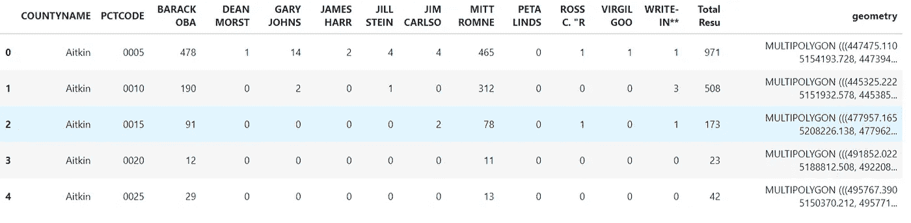
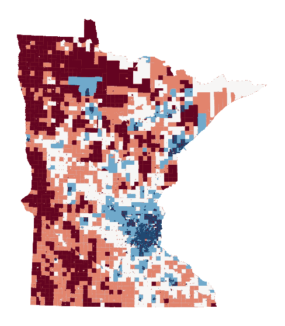
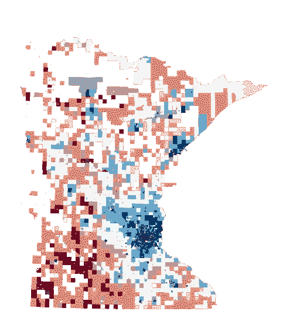
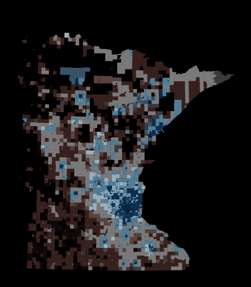
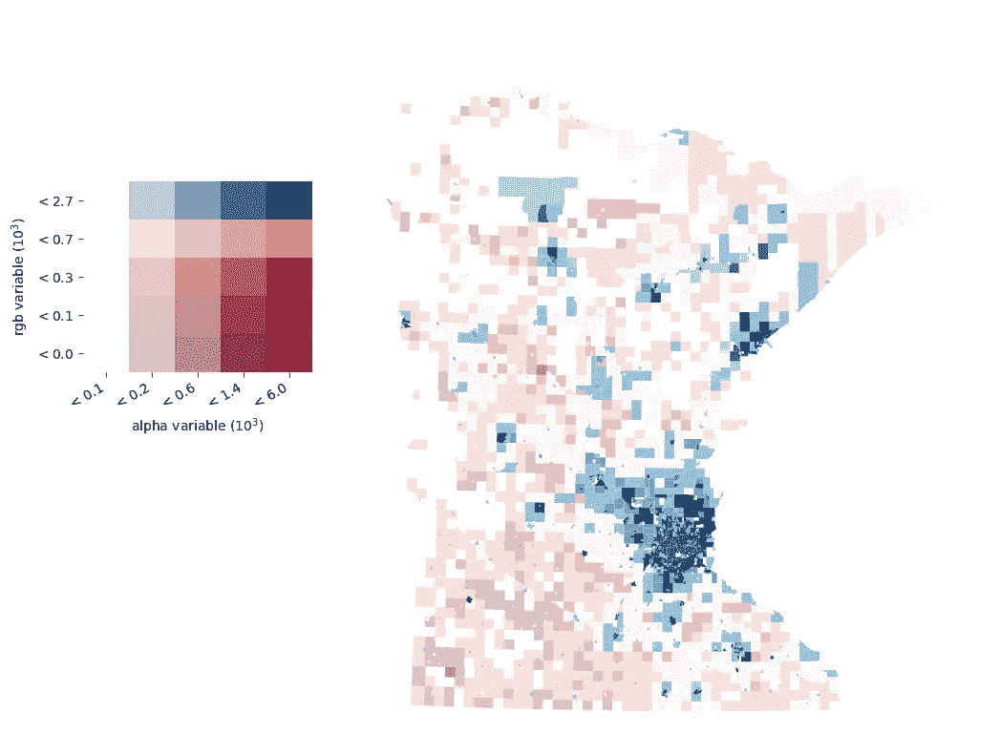
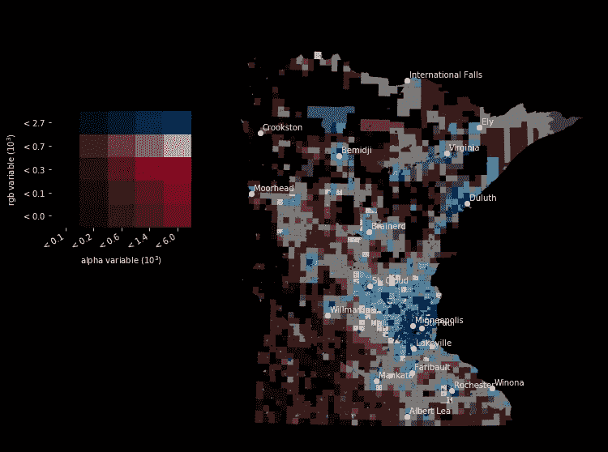

# 如何用 Python 制作按 Alpha 值的地图

> 原文：<https://towardsdatascience.com/how-to-make-value-by-alpha-maps-in-python-484722160490?source=collection_archive---------30----------------------->

## 关于如何用 Python 创建 Alpha 值映射的初学者指南和教程


[杨烁](https://unsplash.com/@yangshuo?utm_source=medium&utm_medium=referral)在 [Unsplash](https://unsplash.com?utm_source=medium&utm_medium=referral) 上拍照

自从我看到 Alpha 值地图的美丽美学，我就想做一个。当时，在 QGIS 或 ArcGIS 中稍加修改就能制作出它们并不困难。现在，由于 Pysal 库和 Splot，您可以使用 Python 制作按 alpha 值的地图。

在本教程中，我将指导你如何使用 Python 制作 alpha 值贴图。但是首先，让我们了解什么是按阿尔法值的地图，为什么要使用它，什么时候使用合适？

## 什么是阿尔法值图(VBA)

“按阿尔法值”是双变量 choropleth 技术，其中我们考虑两个相互影响的变量，例如，选举结果和人口密度。第二个变量充当另一个感兴趣的变量的均衡器。

因此，VBA 通过阿尔法变量(透明度)修改背景颜色。因此，较低的值会淡出背景，而较高的值会弹出。VBA 地图的出现是为了减少 choropleth 地图中较大的尺寸偏差。

除了美学部分，如果你想通过色彩而不是尺寸来突出聚光灯，使用 choropleth 技术，VBA 也是一个不错的选择。它确实比纯粹的 choropleth 图描绘了更好的信息。

但是，您首先需要有一个与感兴趣的变量相关的变量(即，拥有更多选民的县对选举结果有重要影响)。

## 如何用 Python 制作按 alpha 值排序的地图

我们将使用 [Splot Python 库](https://github.com/pysal/splot/tree/master/splot)来创建我们的地图和 Geopandas 来读取地理空间数据。我们使用了 2012 年美国大选的子集数据。让我们首先读取数据，看看前几行。

```
import geopandas as gpd
from splot.mapping import vba_choroplethimport matplotlib.pyplot as plt
%matplotlib inlinegdf = gpd.read_file("data/MN_elections_2012.gpkg")
gdf.head()
```

从下表中可以看出，我们有一个包含不同列的地理数据框架。例如，巴拉克·奥巴列保存该区域的结果。



2012 年选举数据

我们大部分时间使用 choropleth 地图，但是正如我们在前面提到的，它有其局限性。让我们首先从数据中制作一个 choropleth 图，为数据可视化创建一个基准。例如，我们可以选择使用巴拉克·奥巴马专栏。

```
fig, ax = plt.subplots(figsize=(12,10))
gdf.plot(column=’BARACK OBA’, scheme=’quantiles’, cmap=’RdBu’, ax=ax)
ax.axis(“off”)
plt.show()
```



等值区域图

现在，我们创建一个 alpha 值图。为了创建我们的地图，我们需要两列。第一列是我们感兴趣在地图中显示的内容；例如，巴拉克·奥巴马的结果。第二列保存要均衡的 alpha 值。这种 alpha 均衡将从贴图外观中消除低值，并增加高值区域的聚光灯效果。我们可以选择总结果作为 alpha 值。

```
fig, ax = plt.subplots(figsize=(12,10))
vba_choropleth(
     gdf[‘BARACK OBA’].values, 
     gdf[‘Total Resu’].values, 
     gdf, 
     rgb_mapclassify=dict(classifier=’quantiles’),
     alpha_mapclassify=dict(classifier=’quantiles’),
     cmap=’RdBu’, 
     ax=ax,
     revert_alpha=False )plt.show()
```

“按 alpha 值”贴图会立即高亮显示高值区域，即使它们是 n。与大区域在视觉上占主导地位的 choropleth 贴图相比，“按 alpha 值”贴图会清楚地显示高值区域。



按 alpha 值映射

我们可以简单地使用黑色背景来强调聚光灯的效果。将下面的“按 alpha 值”贴图与上面的贴图进行比较。

```
plt.style.use('dark_background')
fig, ax = plt.subplots(figsize=(12,10))
vba_choropleth(
     gdf[‘BARACK OBA’].values, 
     gdf[‘Total Resu’].values, 
     gdf, 
     rgb_mapclassify=dict(classifier=’quantiles’),
     alpha_mapclassify=dict(classifier=’quantiles’),
     cmap=’RdBu’, 
     ax=ax,
     revert_alpha=False )plt.show()
```



alpha 值贴图-黑色背景

没有图例，按 alpha 值的图很难阅读。Splot 提供了一种创建图例的简单方法，甚至比其他重量级 GIS 软件应用程序都要简单。我们也回复到白色背景。

```
plt.style.use('default')
fig, ax = plt.subplots(figsize=(12,10))
vba_choropleth(
     gdf[‘BARACK OBA’].values, 
     gdf[‘Total Resu’].values, 
     gdf, 
     rgb_mapclassify=dict(classifier=’quantiles’),
     alpha_mapclassify=dict(classifier=’quantiles’),
     cmap=’RdBu’, 
     ax=ax,
     revert_alpha=False,
     legend = True 
)plt.show()
```



最后，我们可以给地图添加一些上下文。例如，我们可以添加主要城市，以帮助读者有效地阅读地图。

```
cities = gpd.read_file(“data/ne_10_populated_places.geojson”)
cities = cities.to_crs(“EPSG:26915”)fig, ax = plt.subplots(figsize=(12,10))
vba_choropleth(
     gdf[‘BARACK OBA’].values, 
     gdf[‘Total Resu’].values, 
     gdf, 
     rgb_mapclassify=dict(classifier=’quantiles’),
     alpha_mapclassify=dict(classifier=’quantiles’),
     cmap=’RdBu’, 
     ax=ax,
     revert_alpha=False,
     legend = True 
)
cities.plot(ax=ax, color = "white")
for x, y, label in zip(cities.geometry.x, cities.geometry.y, cities.NAME):
    ax.annotate(label, xy=(x, y), xytext=(3, 3), textcoords="offset points")
plt.show()
```



现在，我们有了一个美观的地图，帮助我们传达聚光灯的效果，而没有 choropleth 地图的限制。

## 结论

按 alpha 值排序的地图是可视化地理空间数据的有效方法，避免了 choropleth 和 cartogram 地图的限制。在本教程中，我们已经探索了什么是 alpha 值贴图，以及如何使用 Splot 库创建一个。

本教程的代码可以从这个 Github 资源库获得。

[](https://github.com/shakasom/vba) [## shakasom/vba

### Python 中 alpha 贴图的值。在 GitHub 上创建一个帐户，为 shakasom/vba 开发做贡献。

github.com](https://github.com/shakasom/vba)