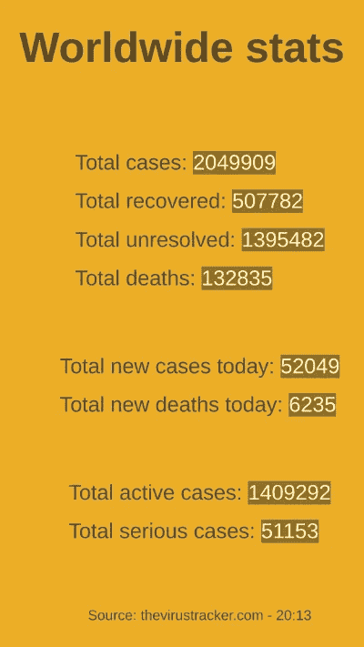
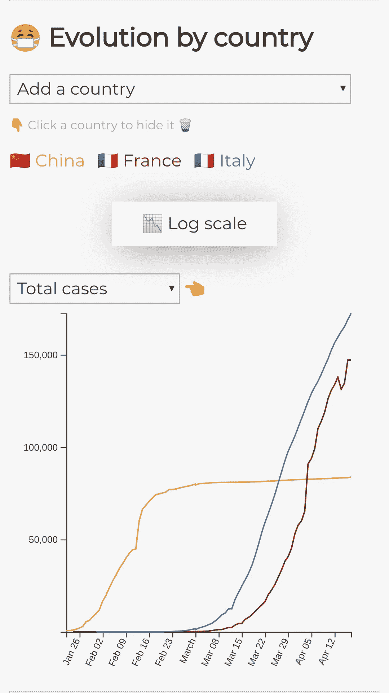
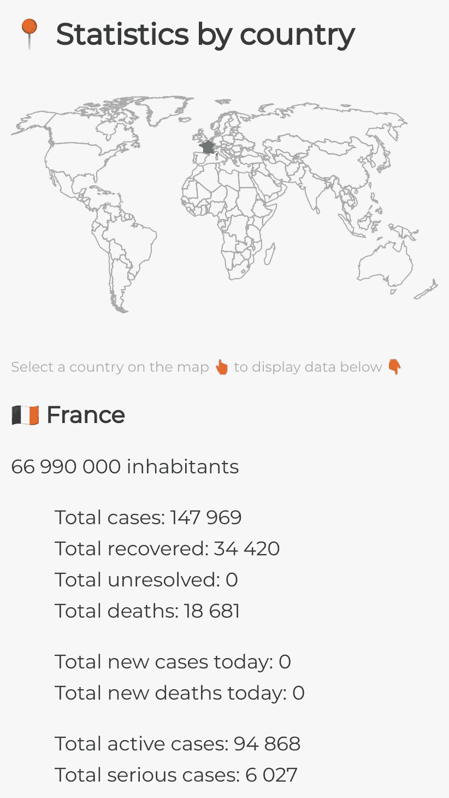
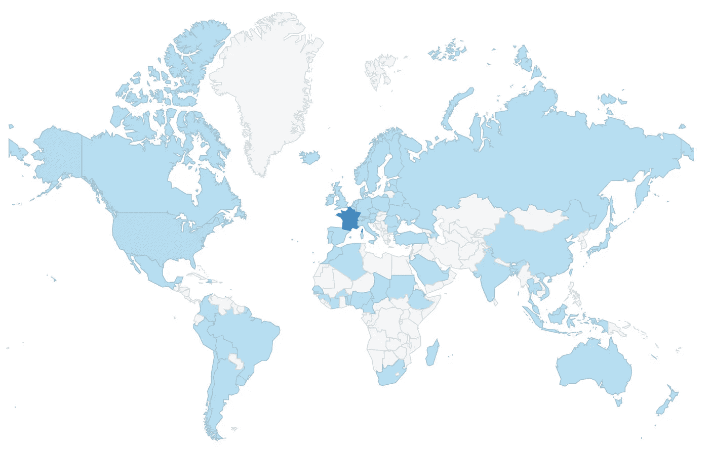
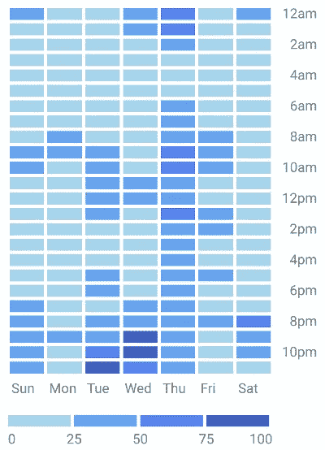

# 如何做一个病毒式传播的项目？

> 原文：<https://towardsdatascience.com/how-to-make-viral-project-ca1a71176d45?source=collection_archive---------54----------------------->

## 这是一个个人项目到达 79 个国家的故事。

由 [Jukan Tateisi](https://unsplash.com/@tateisimikito?utm_source=medium&utm_medium=referral) 在 [Unsplash](https://unsplash.com?utm_source=medium&utm_medium=referral) 拍摄的照片

> 我们所要决定的是如何利用给我们的时间。~ *甘道夫*

让我们从故事的结尾开始，这里是项目:

 [## 冠状病毒统计

### 此页面显示最新的新冠肺炎统计数据。

yleprince.github.io](https://yleprince.github.io/corona/) 

# 🌎️背景

和大多数法国人一样，我从 3 月 17 日起就一直生活在隔离区。我的工作变得 100%遥不可及，我的爱好也停止了。于是我浏览 [thenews.im](https://thenews.im/) 消磨空闲时间。我发现这个冠状病毒 API:[thevirustracker.com](https://thevirustracker.com/)。它提供了关于新冠肺炎传播的全球视角。他们也有一个很好的关于世界形势的仪表板。约翰·霍普金斯大学的仪表板也是如此。这些板的主要问题是它们很难加载到智能手机上。他们正在加载沉重的地块和地图需要很多时间来显示。

# 💡️ ️The 理念

我想在我的手机上以光速获得新冠肺炎的最新数据。

# 👶第一版

我决定从简单开始，非常非常简单。这是该项目的第一个版本:

第一版:极简主义的全球信息

这再简单不过了。显示的数据正是 thevirustracker.com 提供的数据。它丑得要命，但仍然很轻，满足了我的需求。有了它，我能够在一秒钟内实时了解疫情的发展。

由于数量不多，我把这个链接分享给了我的家人和密友。很少有人见过这种发黄的版本。但是他们正在使用，并且**给出了反馈**。我妈要的是法语版。完成了。

为了更具包容性，我向前迈了一步，更改了页面外观。我为色盲的人使用了更多的对比色，为视障用户使用了尽可能多的 HTML 标签。众所周知，有些浏览器会根据底层结构大声读出网页。对于这一页，它曾经说“`New section: Worldwide stats [...]`”。我把标题空白分割成了一个`<h1>`标签(即。标题第一级)。现在包容性的浏览器都在说“【T2”，你可以基于这个结构在页面中导航。

这并不多，提供公共内容的人应该始终记住尽可能地包容。大多数时候不需要额外的努力。

# 👧️第二版

从第一个版本开始，我发现人们希望对传播进化有更多的见解。我决定添加一个折线图来显示一个国家或更多国家的趋势。

第二个版本:增加了分析国家趋势的折线图。

在左边，你有这个功能的截图。第一个下拉列表`Add a country`允许您选择国家。第二个选项让用户选择显示的数据(病例数、恢复数…)。

该图旨在表明版本 2 正在解决这一新的需求。此时，用户能够相互比较国家。你可以看到蔓延的趋势，并估计即将到来的情况。数据直接从 thevirustracker.com[加载，提供最新数字。](http://thevirustracker.com)

为了更进一步，我添加了一个按钮`Log scale`，允许用户显示日志视图。它拉平了指数方面。这一特征证明非常有用，因为不同阶段的国家之间的比较在线性尺度上可能是困难的。

# 👩第三版

折线图便于探索/比较趋势，但无法准确洞察一个国家的情况。我从第二个版本的反馈中收集到，用户现在希望能够选择一个国家，并查看这个特定国家的实时数据。

第三个版本:添加地图以显示国家级别的见解

在左边，你可以看到一个新的特性:一个允许用户选择一个国家并显示详细数据的地图。

信息字段与第一次发布的版本相同。

在我从朋友和用户那里收到的反馈中，有一条很好地说明了这个项目是如何运作的:

一旦疫情达到几千人，数字就变得难以阅读。字体太细，数字之间距离太近。在他的评论中，我的朋友建议增加一个额外的空格以增加可读性。**容易发现，更容易修复。**受到了用户的热烈欢迎。这是一个快速的胜利！

# 👵️版本 4

第四个版本(这里将详细介绍的最后一个版本)包含一些视觉上的变化。用户界面中添加了两个按钮。

按钮来添加人类数量的比例

第一个允许用户根据人数来缩放数据。所以病例数变成了病例百分比。这个功能看起来很有用，但并没有被大量使用。页面查看者对这个参数并不感兴趣。

按钮来复制和共享配置链接

第二个按钮对页面的传播起到了巨大的作用。这是一个共享按钮，允许查看者复制页面配置。从这个阶段开始，每个用户都可以设置页面，并将其视图共享到自己的网络中。

# 📈️监控传播

就个人而言，我必须承认我喜欢探索数据。随着项目的展开，我的目标有了新的维度。我本可以决定停在版本 1，因为我的个人需求得到了满足。但是随着我的朋友、我的网络以及我朋友的网络使用这个页面，我有了更大的野心。我想改善网页带来的服务。这就是我监控页面使用的原因。

从技术的角度来说，每次用户在页面上做出改变，都会改变 url。将此与 Google Analytics 相结合，我能够看到如下指标:

*   目前浏览次数最多的配置:

 [## 冠状病毒统计

### 被浏览最多的页面是中国、美国、法国和意大利的对比，地图上选择了美国。人口比例和对数比例均被禁用。

这是页面的链接:yleprince.github.io](https://yleprince.github.io/corona/?comp=CNUSFRIT&main=US) 

*   使用最多的语言: *fr* 🇲🇫
*   页面被浏览的国家数量: *79*

突出显示用户国籍的地图

*   独立访问者的数量:*几千人*
*   每个用户的平均访问次数: *1.9*
*   一天中不同时间的用户数量:

突出显示每天每小时页面流量的热图

*   还有更多…

通过结合 url 持续更新和谷歌分析，我能够清楚地了解正在使用的功能和用户兴趣。在开发阶段对任务进行优先排序对我帮助很大。

# 💼️结论

就个人而言，这个项目是一次伟大的冒险。这是我的一个项目第一次接触到如此多的用户，他们来自不同的人群。我从一个想法开始，看到结果在十天内传播到世界各地是一种巨大的体验。尽管网络上已经有现成的工具，但它的简单性和包容性(智能手机、视障人士……)已经找到了它的受众。

从不了解你的人那里获得反馈是从客观评价中学习的最佳方式。

# 📌️外卖

简而言之，如何做一个像病毒一样传播的项目。

# ✍️ *后脚本*

我希望我能够分享数据，为人们提供他们想要的信息。这个项目并不打算以任何方式从疫情获利。我投入了几个晚上的工作来满足人们的愿望，除了建设性的评论和良好的氛围，我一无所获。也就是说，项目中呈现的数据是 thevirustracker.com**提供的数据。即使他们工作出色，每个人都应该考虑几个数据源。有多少个国家，就有多少种计算方法。**

*这是故事的结尾，我希望你喜欢读它，就像我喜欢生活一样！感谢所有在全球分享我的作品并给我反馈的粉丝们，没有你们，这篇文章就写不出来。*

*如果你想知道它是如何工作的，下面是代码:*

* [## 伊莱普林斯/科罗纳

### 基于 thevirustracker.com API 的项目。请随意贡献这段代码！

github.com](https://github.com/yleprince/corona) 

呆在家里，保重🙏️*