# 如何使您的分类器安全

> 原文：<https://towardsdatascience.com/how-to-make-your-classifier-safe-46d55f39f1ad?source=collection_archive---------41----------------------->

## 一个关于基于统计距离度量的机器学习/深度学习分类器的准确度估计的故事(SafeML 和 safe dl)——第一部分。

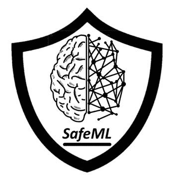

来自[[https://github.com/ISorokos/SafeML](https://github.com/ISorokos/SafeML)]的 SafeML 标志

# 目录

1.  **简介**
2.  **SafeML 创意**
3.  **统计距离**
4.  **结论**
5.  **参考文献**
6.  **相关 GitHub 项目**
7.  **相关中等岗位**

# 1.介绍

如今，人工智能(AI)正在迅速发展，其应用涵盖了许多不同的学科。在这种快速增长的同时，对人工智能安全的担忧也在上升。对于人类生命、环境、金钱和隐私面临风险的安全关键系统，AI 安全不容忽视。(Amodei 等人，2016 年)已经讨论了认证该领域中运行的现代机器学习系统的不同现有问题。如下图所示，安全问题可分为五类，包括 A)安全探索，B)对分布转移的稳健性，C)避免负面副作用，D)避免“奖励黑客”和“电线接头”，E)可扩展的监督。

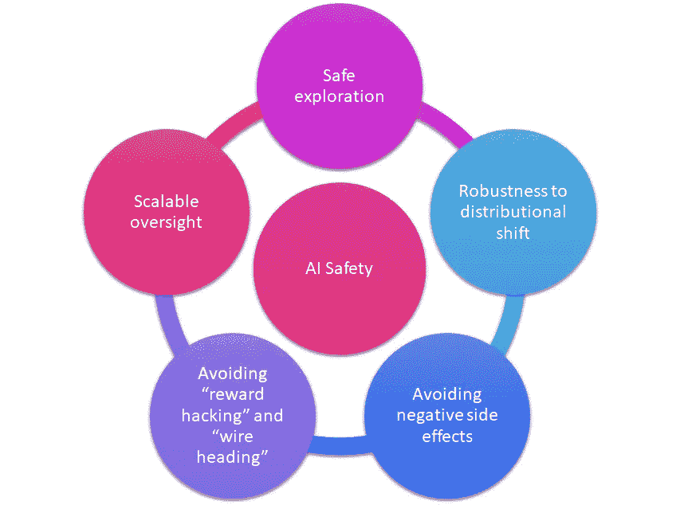

人工智能安全的五个主要类别

这个故事的主题可以被认为是人工智能安全中的“对分布变化的鲁棒性”问题。基于下图，我们将要解释的 SafeML 方法包括安全机器学习(SafeML)和安全深度学习(SafeDL)。

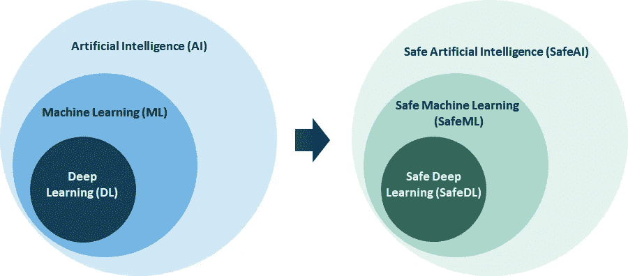

左:人工智能(AI) vs 机器学习(ML) vs 深度学习(DL)。右图:安全人工智能(SafeAI) vs .安全机器学习(SafeML) vs .深度学习(SafeDL)。

存在不同的现有方法来增加 ML 算法的安全性和鲁棒性。一些论文研究了分类器中结果的不确定性评估，而另一些论文则关注于提高对不确定性的鲁棒性。例如，下图显示了神经网络的 ETH 鲁棒性分析器(ERAN ),它对输入“8”使用可能的扰动，并试图创建一个抽象所有可能输出的形状。如果创建的形状违反了定义的边界，并且无法验证结果。否则，输出将得到保证。有关更多详细信息，请查看(Gehr，t .等人，2018 年和 Balunovic，m .等人，2019 年)。

神经网络的 ETH 鲁棒性分析器(ERAN)[[https://github.com/eth-sri/eran](https://github.com/eth-sri/eran)

在第 2 节中，简单讨论了 SafeML 的思想，第 3 节通过一些 python 例子来说明统计差异度量的应用。第 5 节提供了一个简短的结论。一些相关的 medium 帖子和 Github 项目在故事的结尾有所暗示。

# 2.安全理念

SafeML 的想法是由(Aslansefat 等人，2020-b)提出的，目标是在没有可用标签时以某种方式监控分类器的决策。

下图展示了 SafeML 理念的流程图。在这个流程图中，有两个主要部分，包括培训阶段和应用阶段。

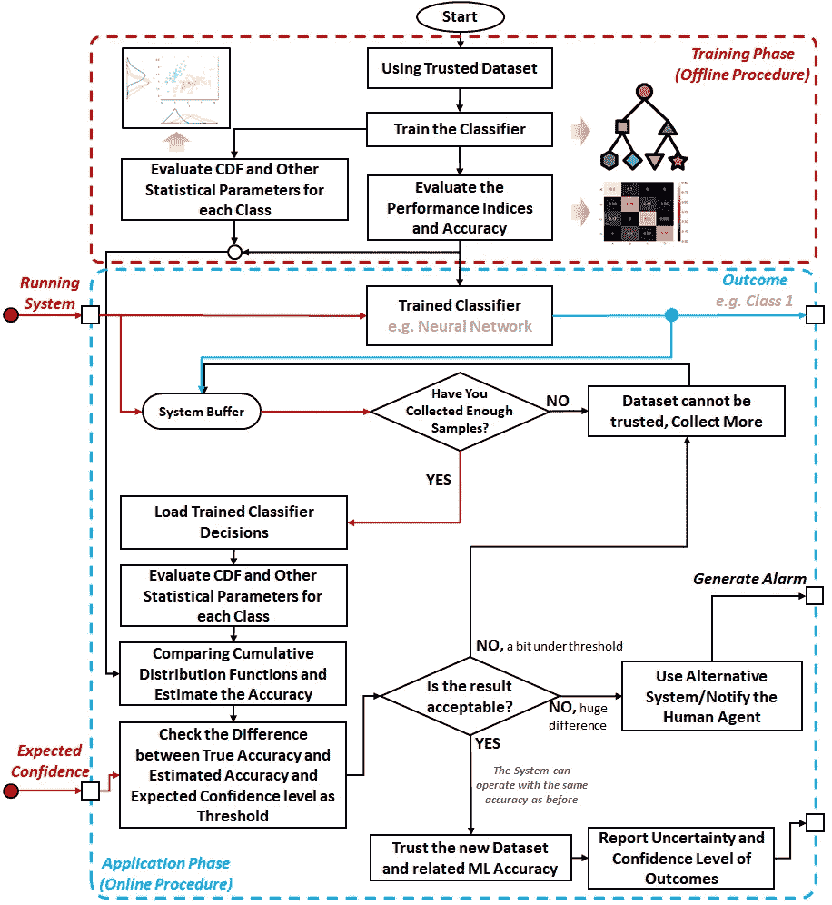

SafeML 流程图(Aslansefat 等人 2020-b)

a)**训练阶段**是一个离线过程，在该过程中，将使用可信或认证的数据集来训练智能算法，该算法可以是机器学习或深度学习算法。因此，将使用可信数据集来训练分类器，并且将使用现有 KPI(例如，ROC、准确性和 Kappa)来测量其性能。同时，每类的统计参数和分布将被估计和存储以用于比较(例如，平均值、方差值和经验累积分布函数(ECDFs))。

b)**应用阶段**是一个在线程序，其中实时和未标记的数据将被输入系统。例如，考虑一个已经被训练来检测不同安全攻击的安全攻击检测器，它应该过滤攻击者 IP。因此，在应用阶段，经过训练的分类器应该区分正常的网络流量和安全攻击(分类任务)。应用阶段的一个重要且关键的问题是数据没有任何标签。因此，不能保证分类器能够像训练阶段一样准确地运行。

在应用阶段，将根据分类器决策(未经认证)分离缓冲数据，并将存储每个类别的统计参数，以便与训练阶段的数据进行比较。使用将在下一节中解释的统计距离测量，将比较训练阶段和应用阶段中每个类的要素之间的距离。如果计算的距离和预期置信度(由专家定义)的差异非常低，则分类器结果及其准确性是可信的(系统是自主行动的)，如果差异很低，则系统可以要求更多数据并重新评估以确定距离。在较大差异的情况下，分类器结果和准确性不再有效，并且系统应该使用替代方法或通知人工代理(在该示例中，系统将要求负责的安全代理手动检查网络流量并做出决定)。

SafeML 在安全入侵检测中的应用(如 CICIDS2017 数据集)

机器学习和深度学习在各种疾病的早期检测或诊断方面有无数的应用。例如，(Scudellari，S. (2020))写道“医院部署人工智能工具，在胸部扫描中检测新冠肺炎”。这种人工智能工具可以完全自主进行检测或诊断吗？他们安全吗？我们对他们安全的定义是什么？人们相信 SafeML 或类似的方法可能是这些问题的答案。下图说明了 SafeML 在医疗诊断中的应用(例如，使用肺部扫描的新冠肺炎诊断)。

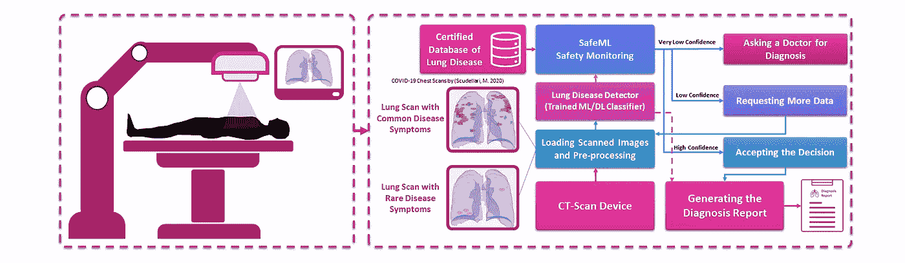

SafeML 在医疗诊断中的应用(例如使用[肺部扫描](https://spectrum.ieee.org/the-human-os/biomedical/imaging/hospitals-deploy-ai-tools-detect-covid19-chest-scans)进行新冠肺炎诊断)

另一个例子可以是自动驾驶汽车或自动驾驶车辆中的交通标志检测器，它使用机器学习或深度学习来检测交通标志并生成所需的动作。下面的框图显示了如何在这个案例研究中使用 SafeML。这也可用于自主排系统(Kabir，s .等人(2020))。

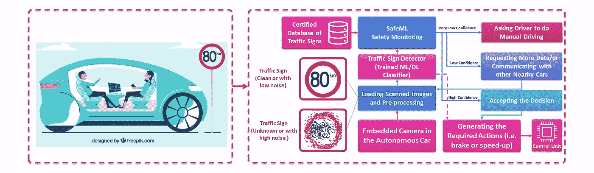

SafeML 在自动驾驶汽车中的应用(如交通标志检测)freepik 创建的汽车矢量—【www.freepik.com 

上述每一个应用程序都将使用 SafeML 实现，在我们接下来的文章(第二部分、第三部分和第四部分)中会有一些著名的案例研究。

# 3.统计距离及其在精度估计中的潜在应用

阈值线可以被认为是分类器的最简单版本。考虑下图；在这个简单的分类器中，阈值线(Xtp)以下的任何点将被认为是第 1 类，阈值线以上的任何点将被认为是第 2 类。假设我们知道时间 0 到 20 之间的点为 1 类，其他点为 2 类。从这个简单的例子中可以看出，x 和 v 点被错误分类。

假设信号和 Xtp 的简单阈值(Aslansefat 等人，2020-a)

如果我们估计每一类的概率密度函数(如下图)，那么误差的概率可以计算为:

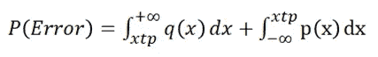

使用 1-P(误差)可以容易地获得分类器精度。在这个简单的分类器中，两个概率密度函数合并的区域导致误差。

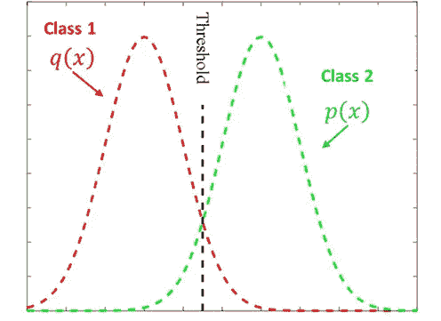

第一类和第二类概率密度函数

[Fukunaga](https://www.google.com/search?rlz=1C1CHBD_en-GBGB877GB877&sxsrf=ALeKk03ALt8gLtDnn4rboINnHhj6V0MSMw:1591081899154&q=Keinosuke+Fukunaga&stick=H4sIAAAAAAAAAOPgE-LVT9c3NMwwTKuMN6_MVYJw03JMzCtys3O0ZLKTrfST8vOz9cuLMktKUvPiy_OLsq0SS0sy8osWsQp5p2bm5ReXZqcquJVml-YlpifuYGUEAG9AE8xWAAAA&sa=X&ved=2ahUKEwjoh6H7yeLpAhVTu3EKHT2QAHkQmxMoATARegQIEhAD) ，K. (1990)表明，可以使用基于概率密度函数(PDF)的距离(如 Bhattacharyya 距离)来计算上限误差。基于 PDF 的距离测量通常依赖于均值和方差距离，如下图所示。然而，一些现有的先进方法也可以比较不同 pdf 的形状。

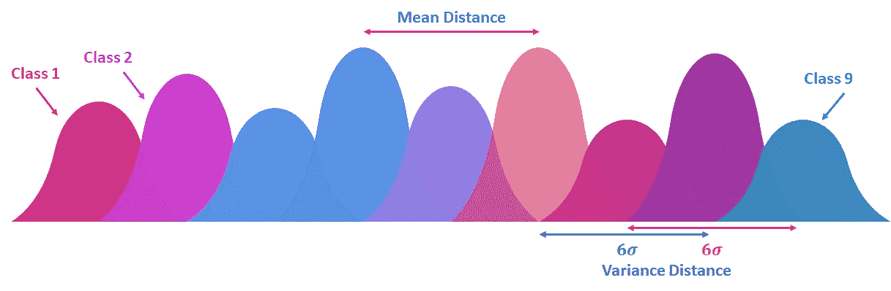

基于概率密度函数的距离度量

下图显示了四种众所周知的基于 PDF 的距离测量方法。

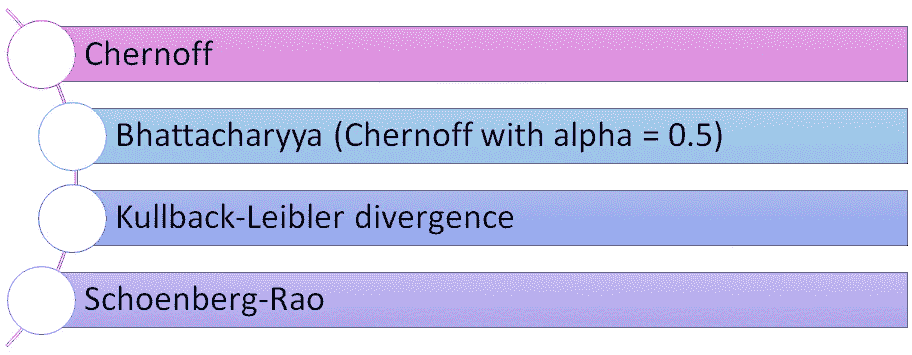

一些著名的基于 PDF 的距离测量

## 3.1 基于 Chernoff 和 Bhattacharyya 的上限误差

下面提供了基于切尔诺夫方法的上限误差概率估计的 python 示例。在这个代码中，如果考虑“s = 0.5”，那么它将是 Bhattacharyya 上界误差估计。

可以证明，误差概率与累积分布函数(CDF)之间的距离相关(Aslansefat，k .等人 2020-b)。一些著名的基于 CDF 的距离度量可以列举如下:

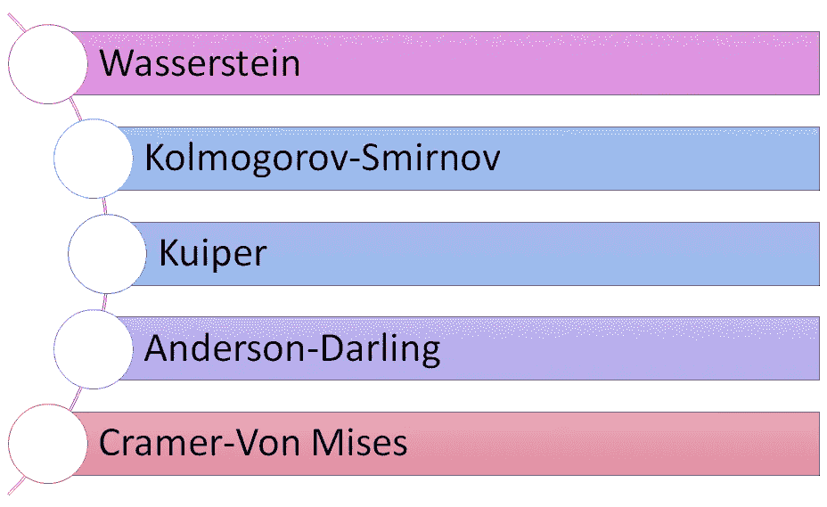

一些著名的基于 CDF 的距离度量

有时使用特征的经验累积分布函数(ECDF)会更容易。基于 ECDF 的距离测量的 Python 示例如下。

## 3.2 Kolmogorov-Smirnov 距离

假设我们有一个包含两个类和一个要素的数据集。下图显示了等级 1(蓝色)和等级 2(红色)的要素的 ECDF。Kolmogorov-Smirnov 简单地找到两个 ECDFs 之间的最大退出距离。

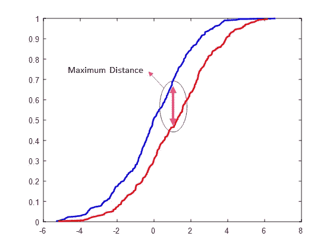

Kolmogorov-Smirnov 距离度量图

例如，您可以检查 Kolmogorov-Smirnov 距离测量的以下 python 代码:

## 3.3 柯伊伯距离

柯伊伯距离与柯尔莫哥洛夫-斯米尔诺夫距离具有相似的功能。然而，这种方法考虑了如下所示的两个最大距离；a)当蓝色 ECDF 的值大于红色 ECDF 的值时，b)当红色 ECDF 的值大于蓝色 ECDF 的值时。柯伊伯距离可以通过两个最大值相加得到。

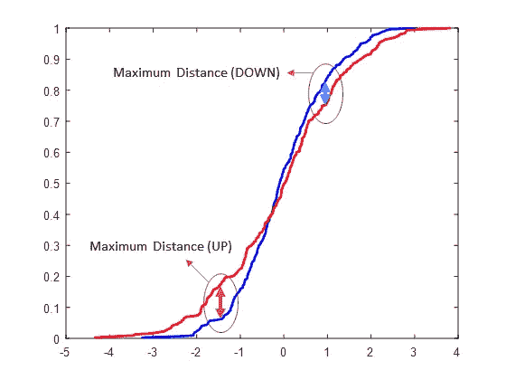

柯伊伯距离度量插图

python 中的柯伊伯距离测量示例如下。

## 3.4 克莱姆-冯米塞斯距离

ECDF 是由许多小步骤形成的。考虑两个台阶在相同间隔内的绝对差作为高度。如果我们计算所有台阶的所有计算高度值的总和，那么我们就有了克莱姆-冯米塞斯距离。

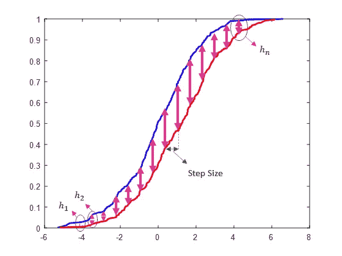

克莱姆-冯米塞斯距离测量插图

您可以按如下方式检查 Cramer-Von Mises 距离的示例 python 代码:

## 3.5 安德森-达令距离

安德森-达林距离类似于克莱姆-冯米塞斯距离。唯一的区别是安德森-达林通过标准偏差(SD)对身高值进行标准化。请查看以下安德森-达令距离的 python 示例。

## 3.6 瓦瑟斯坦距离

Wasserstein 距离已经用于许多应用中。例如，它已被用作生成对抗性神经网络(GANs)中的损失函数(Gulrajani，I. 2017)。Wasserstein 距离我们考虑所有台阶的高度值和宽度值。当我们认为幂等于 1 时，这种方法以某种方式测量两个 ECDFs 之间的面积。当功率因数为 1 时，瓦瑟斯坦距离等于推土机距离。

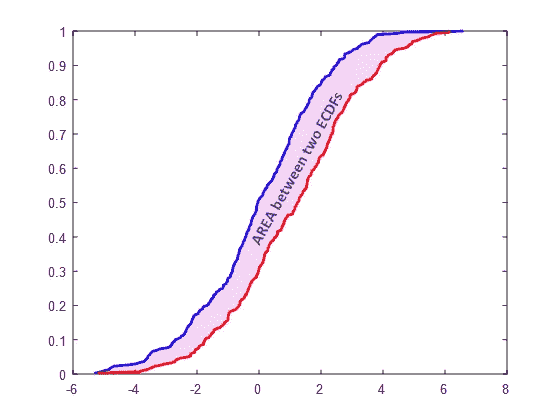

Wasserstein 距离测量插图

您可以查看以下 Wasserstein 距离的 python 示例。

以上 python 代码在 [Google Colab](https://colab.research.google.com/drive/1pfATDDr98PJg8S-nRpnF85nJxYaijeMF?usp=sharing) 上也有。如果使用 R 编程，建议使用[二样本库](https://github.com/cdowd/twosamples)。上面的 Python 代码是从这个库中改写的。对于 MATLAB 用户，推荐一组[基于 ECDF 的距离测量函数](https://uk.mathworks.com/matlabcentral/fileexchange/75282-ecdf-based-distance-measure-algorithms)。

要查看 SafeML idea 的一些示例和案例研究，请查看下面的 GitHub 项目:

[https://github.com/ISorokos/SafeML](https://github.com/ISorokos/SafeML)

关于 SafeML 的更多细节可以在我们最近的论文[[arXiv](https://arxiv.org/abs/2005.13166v1)][[research gate](https://www.researchgate.net/publication/341699548_SafeML_Safety_Monitoring_of_Machine_Learning_Classifiers_through_Statistical_Difference_Measure)][[DeepAI](https://deepai.org/publication/safeml-safety-monitoring-of-machine-learning-classifiers-through-statistical-difference-measure)][[paper with code](https://paperswithcode.com/paper/safeml-safety-monitoring-of-machine-learning)]中找到。

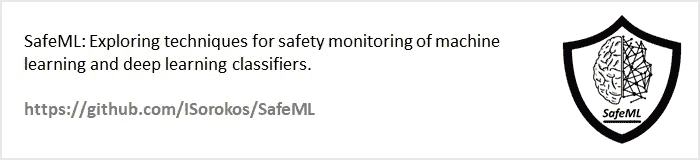

# 4.结论

在这个故事中，人工智能安全的主题已经简要介绍，SafeML 的思想已经解释了一些可能的应用。一些著名的基于 ECDF 的距离测量算法都提供了简单的 python 示例。在我们接下来的故事中，上述 SafeML 的应用将提供代码实现。上述每一种基于 ECDF 的方法都适用于某一类系统。因此，系统的特征和基于 ECDF 的距离测量之间的关系将在接下来的故事中讨论。

SafeML 仍处于早期开发阶段，旨在将其扩展到处理时间序列数据、预测和回归算法(即 Schulam，p .等人(2019))和领域适应(即 Shen，j .等人(2018))。使用 SafeML 作为可解释的 AI 也是可能的，这将在后面讨论。应该提到的是，在“人工智能安全”研究的同时，还有一些其他研究工作专注于人工智能在改善安全模型方面的应用(Gheraibia，y .等人(2019))。

# 参考

Amodei，d .，Olah，c .，Steinhardt，j .，Christiano，p .，Schulman，j .，和 Mané，D. (2016)。人工智能安全的具体问题。 *arXiv 预印本*[arXiv:1606.06565。](https://arxiv.org/abs/1606.06565v2)

k .阿斯兰塞法特，Gogani，M. B .，Kabir，s .，Shoorehdeli，M. A .，和亚尔，M. (2020-a)。基于半马尔可夫过程的可变门限报警系统性能评估与设计。 *ISA 事务*， *97* ，282–295。[https://doi.org/10.1016/j.isatra.2019.08.015](https://doi.org/10.1016/j.isatra.2019.08.015)

阿斯兰塞法特，k .，索罗科斯，I .，怀汀，d .，科拉加里，R. T .，帕帕多普洛斯，Y. (2020-b)。SafeML:通过统计差异度量对机器学习分类器进行安全监控。 *arXiv 预印本*[*arXiv:2005.13166*。](https://arxiv.org/abs/2005.13166v1)

Balunovic，m .，Baader，m .，Singh，g .，Gehr，t .，& Vechev，M. (2019 年)。证明神经网络的几何鲁棒性。在*神经信息处理系统进展*(第 15287-15297 页)[链接](http://papers.nips.cc/paper/9666-certifying-geometric-robustness-of-neural-networks)。

Gehr，m . Mirman，d . drach sler-Cohen，t . tsan kov，p . Chaudhuri，s .，& Vechev，M. (2018 年 5 月)。Ai2:具有抽象解释的神经网络的安全性和鲁棒性认证。在 *IEEE 安全和隐私研讨会(SP)* (第 3-18 页)。[https://doi.org/10.1109/SP.2018.00058](https://doi.org/10.1109/SP.2018.00058)

Gulrajani，I .，Ahmed，f .，Arjovsky，m .，Dumoulin，v .，和库维尔，A. C. (2017)。改进了瓦瑟斯坦·甘斯的训练。在*神经信息处理系统进展*(第 5767–5777 页)[ [链接](http://papers.nips.cc/paper/7159-improved-training-of-wasserstein-gans)。

Gheraibia，y .，Kabir，s .，Aslansefat，k .，Sorokos，I .，和 Papadopoulos，Y. (2019)。安全+人工智能:使用人工智能更新安全模型的新方法。 *IEEE 访问*， *7* ，135855–135869。[https://doi.org/10.1109/ACCESS.2019.2941566](https://doi.org/10.1109/ACCESS.2019.2941566)

Kabir，s .，Sorokos，I .，Aslansefat，k .，Papadopoulos，y .，Gheraibia，y .，Reich，j .，… & Wei，R. (2019，10 月)。开放适应系统的运行时安全分析概念。在*基于模型的安全和评估国际研讨会*(第 332–346 页)。斯普林格，查姆。[https://doi.org/10.1007/978-3-030-32872-6_22](https://doi.org/10.1007/978-3-030-32872-6_22)

Scudellari，S. (2020)医院部署人工智能工具在胸部扫描中检测新冠肺炎， [IEEE Spectrum](https://spectrum.ieee.org/the-human-os/biomedical/imaging/hospitals-deploy-ai-tools-detect-covid19-chest-scans) 。

舒拉姆，p .和萨里亚，S. (2019 年)。你能相信这个预测吗？学习后审核逐点可靠性。 *arXiv 预印本*[*arXiv:1901.00403*。](https://arxiv.org/abs/1901.00403v2)

沈军，瞿，杨，张，魏，于(2018 年 4 月)。领域适应的 Wasserstein 远程引导表征学习。在*第三十二届 AAAI 人工智能大会上* [环节](https://www.aaai.org/ocs/index.php/AAAI/AAAI18/paper/viewPaper/17155)*。*

# *相关 GitHub 项目*

*[SafeML 项目:](https://github.com/ISorokos/SafeML)这个故事里已经简要说明过的想法。*

*[NN-可信性工具包项目:](https://github.com/dependable-ai/nn-dependability-kit)人工神经网络软件可信性工程工具箱。*

*[confidential-NN 项目:](https://github.com/cfinlay/confident-nn)基于神经网络的分类中经验置信度估计的工具箱。*

*[SafeAI 项目:](https://eth-sri.github.io/research/safeai)不同的工具箱，如 SRILab ETH Zürich 的 [DiffAI](https://github.com/eth-sri/diffai) 、 [DL2](https://github.com/eth-sri/dl2) 和 [ERAN](https://github.com/eth-sri/eran) ，专注于健壮、安全和可解释的 AI。*

# *相关中等职位*

* [## 构建安全的人工智能:规范、鲁棒性和保证

### 佩德罗·a·奥尔特加、维沙尔·迈尼和 DeepMind 安全团队

medium.com](https://medium.com/@deepmindsafetyresearch/building-safe-artificial-intelligence-52f5f75058f1)  [## 人工智能安全——你如何防止敌对攻击？

### 与 IBM 研究人员 Pin-Yu 和 Sijia 就他们最近关于“修剪”和……

towardsdatascience.com](/ai-safety-how-do-you-prevent-adversarial-attacks-ede17480a24d)  [## 人工智能安全、人工智能伦理和 AGI 辩论

### Alayna Kennedy 在 TDS 播客上

towardsdatascience.com](/ai-safety-ai-ethics-and-the-agi-debate-d5ffaaca2c8c)  [## Zen 和自动驾驶中机器学习的安全保证艺术

### 西蒙·伯顿博士

medium.com](https://medium.com/@AssuringAutonomy/zen-and-the-art-of-safety-assurance-for-machine-learning-in-autonomous-driving-77ebb4c0a302)  [## AI“安全”vs“控制”vs“对准”

### 定义我所说的“人工智能安全”、“人工智能控制”和“价值一致”的含义

ai-alignment.com](https://ai-alignment.com/ai-safety-vs-control-vs-alignment-2a4b42a863cc) 

# 确认

我要感谢 SafeML 项目的贡献者:

*   雅尼斯·帕帕多普洛斯教授(赫尔大学)
*   Ioannis Sorokos 博士(弗劳恩霍夫实验软件工程研究所)
*   Ramin Tavakoli Kolagari 博士(纽伦堡理工大学)
*   德克兰·怀汀(赫尔大学和 APD 通信)

# 未完待续…*