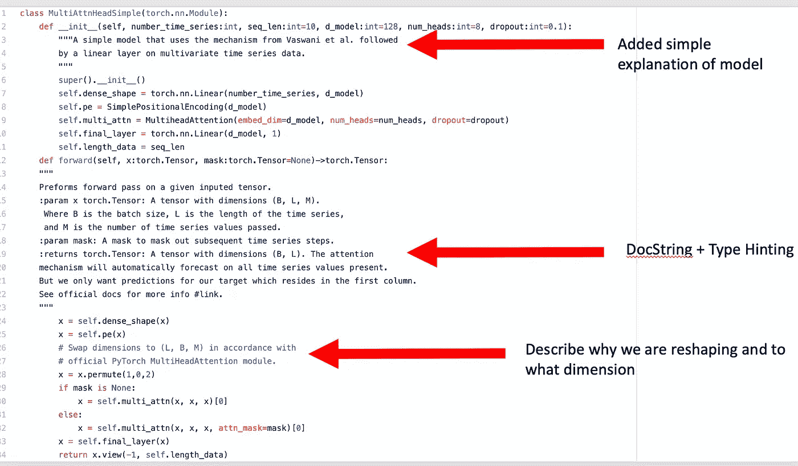
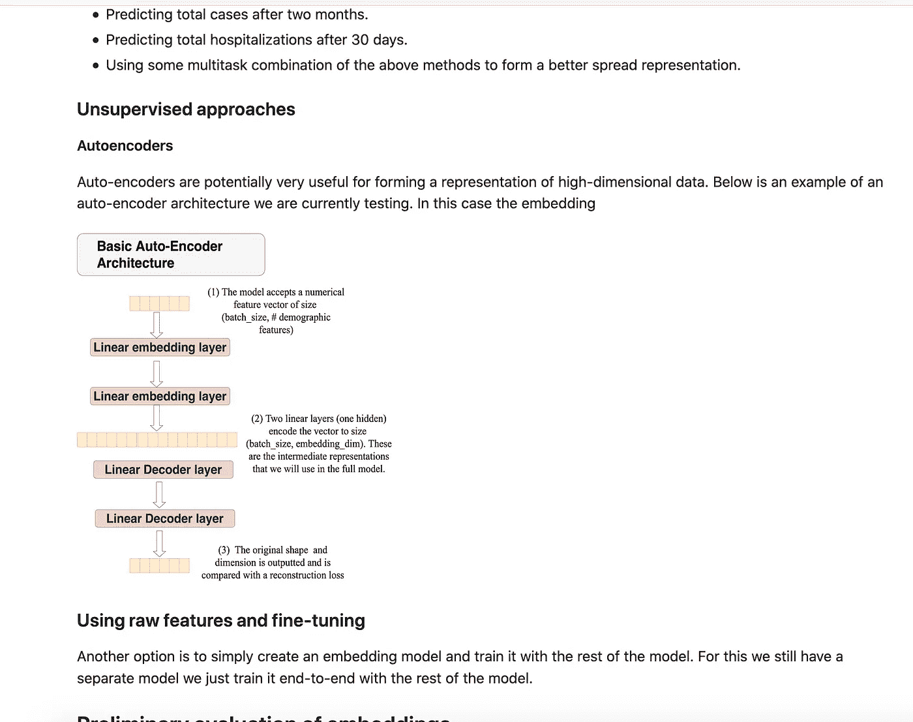
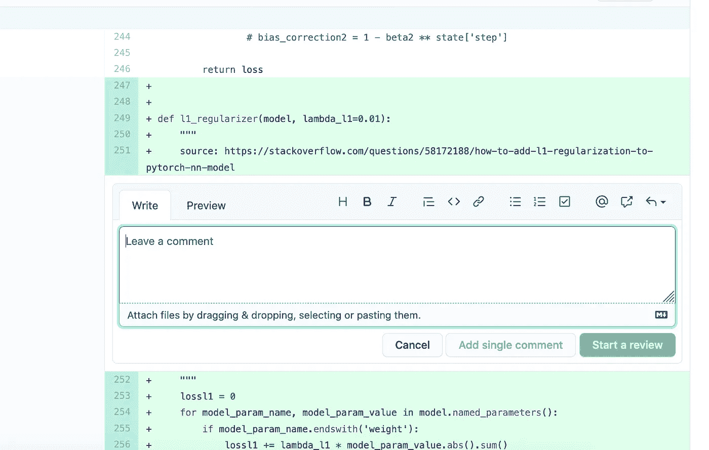

# 提高深度学习代码质量(第一部分)

> 原文：<https://towardsdatascience.com/how-to-make-your-deep-learning-experiments-reproducible-and-your-code-extendible-7ef56767dddb?source=collection_archive---------35----------------------->

## 构建开源时间序列深度学习框架的经验教训。

作者照片(在马基雅斯米的卡特勒海岸保护区徒步旅行时拍摄)

*注意这大致是基于我二月份在波士顿数据科学会议小组* *上做的一个* [*演示。你可以在这里找到*](https://tps://www.youtube.com/watch?v=Z_ubURcsRGc) [*全幻灯片*](https://docs.google.com/presentation/d/1ZlQM80OsfGVRoY9GGQBfwqMRq5tj2aJfQe1Rm5pflrU/edit) *。我还附上了一些最近的经历和见解，以及对我遇到的常见问题的回答。*

## **背景**

当我第一次开始我的河流预报研究时，我设想只用一个笔记本。然而，我很清楚，有效地跟踪实验和优化超参数将在任何河流模型的成功中发挥至关重要的作用；特别是，我想预测美国超过 9000 条河流的流量。这让我走上了开发 flow forecast 的轨道[，它现在是一个多用途的时间序列深度学习框架](https://github.com/AIStream-Peelout/flow-forecast)。

## **再现性**

机器学习(尤其是深度学习)最大的挑战之一是能够重现实验结果。其他几位已经谈到这个问题，所以我不会花太多时间详细讨论。要想更好地了解再现性为何如此重要，请参见乔尔·格鲁的演讲和幻灯片。TLDR:为了建立在先前的研究基础上，我们首先需要确保它是有效的。类似地，为了部署模型，我们必须能够容易地找到最佳“一个”的工件

我的第一个建议是不要使用 Jupyter 笔记本或 Colab(至少不要全部使用)。Jupyter Notebooks 和 Colab 非常适合快速构建模型或利用现有的代码库(我将在稍后讨论)进行实验，但不适合构建模型或其他功能。

## **写出高质量的代码**

1.  **编写单元测试(最好是在编写代码的时候)**

我发现测试驱动开发在机器学习领域非常有效。人们问我的第一件事是，我如何为一个我不知道其输出是什么的模型编写测试？基本上，您的单元测试应该属于以下四个类别之一:

(a)测试您的模型返回的表示的大小是否正确。

这可能是最简单的测试之一。有了这个，你就可以简单地看到形状是否正确。尽管这看起来微不足道，但我多次看到人们弄乱了他们模型的维度，然后想知道为什么它不收敛。

(b)测试您的模型针对您指定的参数正确初始化，并且正确的参数是可训练的

另一个相对简单的单元测试是确保模型按照你期望的方式初始化，并且正确的参数是可训练的。

(c)测试定制损失函数和训练循环的逻辑:

经常有人问我这是怎么做到的？我发现最好的方法是创建一个具有已知结果的虚拟模型来测试定制损失函数、指标和训练循环的正确性。例如，您可以创建一个只返回 0 的 PyTorch 模型。然后用它来编写一个单元测试，检查损失和训练循环是否正确。

(d)测试数据预处理/加载程序的逻辑

另一个要涵盖的主要内容是确保您的数据加载器以您期望的格式输出数据，并处理有问题的值。数据质量问题是机器学习的一个大问题，因此确保您的数据加载器经过正确测试非常重要。例如，您应该编写测试来检查 NaN/Null 值是否被填充或者行是否被删除。

最后，我推荐使用工具 CodeCov 和 Codefactor。它们对于自动确定您的代码测试覆盖率非常有用。

推荐工具: [Travis-CI](https://travis-ci.org/) ， [CodeCov](https://codecov.io/)

**2。利用端到端代码覆盖的集成测试**

进行单元测试是好的，但是确保代码以端到端的方式正确运行也很重要。例如，有时我发现一个模型的单元测试运行，却发现我将配置文件传递给模型的方式不起作用。因此，我现在为我添加到存储库中的每个新模型添加集成测试。集成测试还可以演示如何使用您的模型。例如，[我用于我的](https://github.com/AIStream-Peelout/flow-forecast/blob/master/tests/custom_encode.json)集成测试的配置文件，我经常作为我的完整参数扫描的主干。

**3。利用类型提示和文档字符串:**

同时拥有类型提示和文档字符串大大增加了可读性；尤其是在传递张量的时候。当我写代码的时候，我经常不得不回头看文档串来记住我的张量是什么形状。没有它们，我必须手动打印形状。这浪费了大量时间，并可能增加您后来忘记移除的垃圾。

**4。创建良好的文档**

我发现为机器学习项目创建文档的最佳时间是在我写代码的时候，甚至是之前。经常设计 ML 模型的架构设计，以及它们如何与现有的类接口，在实现代码时节省了我大量的时间，并且迫使我批判性地思考我所做的 ML 决策。此外，一旦实施完成，你已经有了一个良好的开端，告知你的同行/研究人员如何使用你的模型。

当然，您需要添加一些东西，比如您传递的参数及其类型的细节。对于文档，我通常在 [Confluence](https://flow-forecast.atlassian.net/wiki/spaces/FF/pages/17760257/A+Dual-Stage+Attention-Based+Recurrent+Neural+Network) (或者 GH Wiki 页面，如果没有的话)中记录更广泛的架构决策，而在 [ReadTheDocs](https://flow-forecast.readthedocs.io/en/latest/?badge=latest) 中记录关于代码/参数的细节。我们将在第二部分讨论。拥有良好的初始文档也使得添加模型结果和解释设计工作的原因变得非常简单。

工具:[读取文档](https://readthedocs.org/)，[汇合](https://www.atlassian.com/software/confluence)

**5。利用同行评审**

同行评审是在运行实验之前确保代码正确的另一个关键步骤。很多时候，第二双眼睛可以帮助你避免各种各样的问题。这是不使用 Jupyter 笔记本的另一个好理由，因为检查笔记本的差异几乎是不可能的。

作为同行评审者，花时间一行一行地检查代码并在你不理解的地方进行评论也是很重要的。我经常看到审阅者只是快速批准所有的更改。

**最近的一个例子**:在为大 RNN 添加元数据时，我遇到了一个 bug。这部分代码确实进行了集成测试，但不幸的是，它缺乏全面的单元测试。结果，我做的几个实验，我以为使用了元数据，结果却没有。这个问题非常简单；在第 23 行，我在调用编码器时忘记包含元数据。

通过编写一个单元测试来检查元数据模型的参数在向前传递时是否被更新，或者通过一个测试来检查有和没有元数据的结果是否相等，这个问题可能已经被避免了。

在本系列的第二部分中，我将讨论如何让您的实验具有可重复性，因为您已经拥有了高质量且(大部分)无 bug 的代码。具体来说，我将关注诸如数据版本化、记录实验结果和跟踪参数之类的事情。因此

## 相关文章和资源:

[单元测试机器学习代码](https://medium.com/@keeper6928/how-to-unit-test-machine-learning-code-57cf6fd81765)

[乔尔·格鲁为什么我讨厌笔记本](https://www.google.com/url?sa=t&rct=j&q=&esrc=s&source=web&cd=&cad=rja&uact=8&ved=2ahUKEwiTpovX9ITsAhXFg3IEHdBNCwkQwqsBMAB6BAgNEAU&url=https%3A%2F%2Fwww.youtube.com%2Fwatch%3Fv%3D7jiPeIFXb6U&usg=AOvVaw0ch3qY7ngWfThJF0tp_J5e)