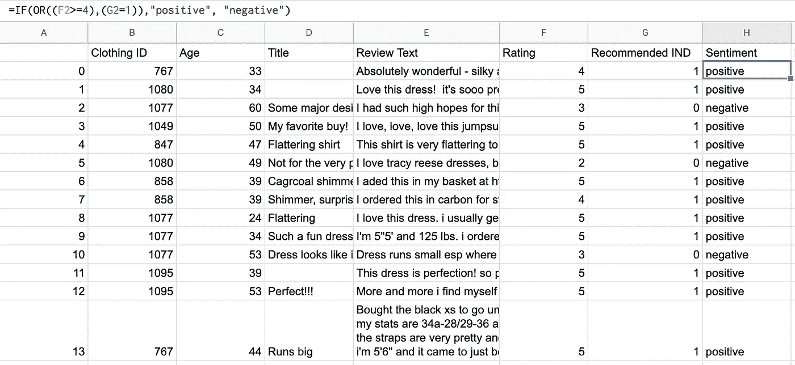

# 如何通过情感分析让你的 iOS 应用更智能

> 原文：<https://towardsdatascience.com/how-to-make-your-ios-app-smarter-with-sentiment-analysis-6b592f0e1482?source=collection_archive---------42----------------------->

## 情感分析在 Swift 时尚客户评论中的应用


[来源](https://undraw.co/)

很长一段时间以来，我一直对数据分析感兴趣，以寻找改进移动应用程序的新方法。我最近花了一些时间来试验神经语言处理，这是一个与我日常工作相关的非常具体的用例，对顾客对时尚商品的评论进行情感分析。

# 语境

我从事时尚电商已经快四年了，对于任何电商来说，真正重要的是顾客评论。所以我在想，“如果我们可以预测客户的评论，这样我们就可以在他们提出要求之前帮助他们”。如果你看看亚马逊，或者应用商店的评论，想象一下如果你能减少所有的负面反馈。所以我更仔细地研究了一下，只花了几个小时就让它工作了。

比方说，我们有一个产品页面，客户可以在那里留下评论，作为一家企业，我想限制负面评论，但也帮助我的客户。从这个角度来看，我的想法很简单，如果客户输入否定的东西，我们会显示一个客户支持按钮。但是怎么知道是不是阴性呢？

嗯，这才是有趣的地方。我将使用一些基本的神经语言处理(NLP)算法对其进行情感分析。与 iOS 开发相比，这部分混合了更多数据分析知识和一点机器学习，但请相信我，苹果为我们做得非常简单。

# 资料组

首先，我需要一些数据来训练我的模型。足够幸运的是，我在 [Kaggle](https://www.kaggle.com/nicapotato/womens-ecommerce-clothing-reviews) 上找到了一个包含 2 万多条记录的女装评论数据集。这就足够开始了。它包括评级和评论，但不包括建议字段。

根据这些数据，我需要定义什么是“积极的”反馈和“消极的”反馈。我不是数据科学家，我没有太多这方面的背景，所以我只应用了一个简单的逻辑:如果客户对该项目的评分是 4 或 5(满分为 5)，或者如果客户推荐了该项目，那么我会认为它是积极的。否则，它将是负的。我相信，我真的相信我也是这样做的:如果我向朋友推荐一项服务，或者如果我留下一个好的评价，它至少会是 4。



*理想情况下*，你也希望保持中立的评论，以保持平衡，但我暂时会保持简单。

从那时起，我将该规则应用于整个数据集。现在我们可以在 Swift 中训练我们的机器学习模型。

# 培训模式

通过 CoreML 和 CreateML，苹果让开发人员可以非常容易地基于预定义的计算模型创建新的机器学习模型。因为我对文本中的情感分析感兴趣，所以我将使用 MLTextClassifier。我很惊讶构建它的代码有多短。

培训模式

运行时，这将需要几分钟时间。与我之前在[时尚图像分类器](https://benoitpasquier.com/machine-learning-fashion-swift/)中的尝试相比，感觉要快得多。

```
Parsing JSON records from /Users/benoit/Desktop/clothing-review.json
Successfully parsed 23486 elements from the JSON file /Users/benoit/Desktop/clothing-review.json 
Tokenizing data and extracting features 
10% complete 
20% complete 
30% complete [...] 
Iteration 19 training accuracy 0.993544 
Iteration 20 training accuracy 0.993597 
Iteration 21 training accuracy 0.993703 
Iteration 22 training accuracy 0.993756 
Finished MaxEnt training in 2.00 seconds 
Trained model successfully saved at /Users/benoit/Desktop/FashionSentimentClassifier.mlmodel.
```

现在我的时尚情绪分析模型的第一个版本已经准备好了，我们来测试一下。还好，我在 Xcode 游乐场还能这么做。

Xcode 游乐场中的测试模型

从结果来看，工作似乎还不错，*，这让我很震惊。*

当然，我可以设法让*假阳性*使用更复杂和微妙的句子，例如双重否定，但对于我花在这上面的时间，我对第一个结果非常满意。

> 下一步是什么？

从这里，我可以将这个模型放入一个 iOS 应用程序，当用户在评论期间暂停输入时，我可以让设备对它进行快速情绪分析，并显示“呼叫客户支持”以防止他留下差评，同时帮助他改善整体用户体验。

我还可以对模型本身做进一步的工作，你拥有的数据越多，你花在调整模型上的时间越多，你就会得到更好的准确性。每个项目都不一样，我感觉每个模式都应该，适应你自己的问题。

**结论**从用户体验问题或者业务问题出发，我们找到了一种利用机器学习和简单的数据分析概念来改善用户体验的方法。如果这看起来与 iOS 的日常开发相去甚远，那么它的第一个版本的原型开发速度之快让我感到惊讶。显然，你的应用程序(和产品)越复杂，你需要提炼的数据就越多，并保持高精度。

目前，这个仅限于女装，但它让我想知道我们能走多远，以保持我们的 iOS 应用程序的 UX 非常清晰。

*关于*[*https://benoitpasquier.com*](https://benoitpasquier.com/2020/01/how-to-make-your-ios-app-smarter-with-sentiment-analysis/)*可以阅读原文。*

[](https://benoitpasquier.com/2020/01/how-to-make-your-ios-app-smarter-with-sentiment-analysis/) [## 如何通过情感分析让你的 iOS 应用更智能

### 很长一段时间以来，我一直对数据分析感兴趣，以寻找改进移动应用程序的新方法。我已经…

benoitpasquier.com](https://benoitpasquier.com/2020/01/how-to-make-your-ios-app-smarter-with-sentiment-analysis/)