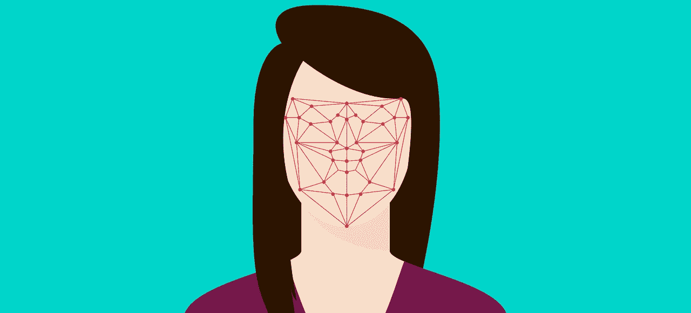

# 如何使用 python 制作自己的带面部识别的 Instagram 滤镜

> 原文：<https://towardsdatascience.com/how-to-make-your-own-instagram-filter-with-facial-recognition-from-scratch-using-python-d3a42029e65b?source=collection_archive---------9----------------------->

## [实践教程](https://towardsdatascience.com/tagged/hands-on-tutorials)

[图片由 teguhjati pras 拍摄；通过 Pixabay 获得知识共享许可](https://pixabay.com/illustrations/flat-recognition-facial-face-woman-3252983/)

在过去的 10 年里，面部识别技术发展迅速，并迅速开发出多种用途。从实用的(解锁手机)，到好玩的(Instagram 滤镜)，再到有争议的(安全、监控和警务)，我们的脸可以在许多方面被技术使用。好奇如何自己创造一些面部识别技术吗？脸书提供了 [SparkAR 平台](https://sparkar.facebook.com/ar-studio/)，为脸书和 Instagram 创建面部识别过滤器。 ***然而*** ，我们可以很容易地使用 python 中的 OpenCV 包自己创建一个，因此我们可以在任何地方使用面部识别。

## 背景信息:计算机是如何“看见”的？

对计算机来说，图像只是一系列指示像素位置的数字。计算机程序员可以创建算法，教会计算机如何识别图像中的独特特征。有趣的是，计算机“看”到了类似于人类如何解决拼图游戏。考虑下图:

[图片由比尔·塞拉克拍摄；通过 Flickr 获得知识共享许可](https://www.flickr.com/photos/billselak/3299520132)

三叶草的拼图块很容易放置，因为它们有不同的形状，逻辑上只能放在一个地方。边缘件还具有明显的扁平特征，限制了它可能到达的位置，只有沿着边缘的一组可能性。剩下的碎片可能真的在任何地方。这个过程被称为特征图像提取，其中用户识别图像的特征以帮助他们构建整体图像。计算机可以通过像素数据的趋势来模仿这种思路。数据科学家使用机器学习算法来教计算机如何识别这些日益复杂的趋势。对于面部识别，首先识别眼睛(面部最显著的特征之一)，然后使用模板绘制面部的其余特征。

## 第一步:在照片中寻找面孔

现在我们知道了计算机视觉的基本原理，我们可以开始构建过滤器了。首先，让我们在静态图片中找到人脸和眼睛。首先在您的计算机上安装，然后将 [OpenCV](https://opencv-python-tutroals.readthedocs.io/en/latest/py_tutorials/py_setup/py_table_of_contents_setup/py_table_of_contents_setup.html) (一个用于图像处理的开源 python 包)导入到 py 文件中。OpenCV 中的所有图像结构都可以与 NumPy 数组相互转换，因此导入 NumPy 也很有用。一旦你安装了 OpenCV，你应该可以访问。包含面部识别和其他图像处理算法的 xml 文件。在本教程中，我们将使用一种叫做[哈尔级联](http://www.willberger.org/cascade-haar-explained/)的算法来处理人脸和眼睛。如果你找不到这些文件所在的目录。xml 文件是，我建议快速文件搜索“haarcascade”。一旦找到存储 Haar 级联的目录的路径，调用 CascadeClassifier 并通过它传递路径:

太好了，现在我们设置好了，我们可以加载图像并寻找人脸。请注意，哈尔级联和许多面部识别算法要求图像是灰度的。所以，在加载图像后，将其转换为灰度，然后使用 face_cascade 来检测人脸。得到脸部后，在它周围画一个矩形，在脸部区域搜索眼睛。然后在每只眼睛周围画矩形。

通过程序输出传递来自 [Unsplash](https://unsplash.com/s/photos/family?utm_source=unsplash&utm_medium=referral&utm_content=creditCopyText) 的库存图像:

照片由 [Gustavo Alves](https://unsplash.com/@gustavoalvesl12?utm_source=unsplash&utm_medium=referral&utm_content=creditCopyText) 在 [Unsplash](https://unsplash.com/s/photos/family?utm_source=unsplash&utm_medium=referral&utm_content=creditCopyText) 上拍摄；由作者修改

酷！效果很好！请注意，有时 Haar Cascade 无法正确识别人脸和眼睛，特别是如果有人没有完全面对相机，有时它会认为嘴角和鼻子是眼睛。如果发生这种情况，对于本教程，我建议使用另一张照片。否则，您将需要自己创建一个完整的其他算法，而不是使用 OpenCV 的 Haar Cascade。

## 步骤 2:创建你的图像过滤器

对于我的过滤器示例，我将使用女巫帽，因为本周末是万圣节。编辑上面的代码，我们可以在图片中读取一个女巫的帽子和我们的库存照片。因为我们要把帽子放在库存照片的上面，所以我们必须得到放置帽子的坐标。我们还必须弄清楚我们实际上想要使用女巫图像的哪些部分。我们可以通过使用 cv2.threshold()和 cv2.bitwise_not()方法来确定我们希望保留女巫图像的哪一部分，不保留哪一部分(这称为遮罩)。

然后，对于每一张脸，我们必须把女巫的帽子放在哪里。使用面部的高度和宽度确定面部区域边界的坐标。然后调整女巫图像(或您选择的任何滤镜)的大小以适合面部区域，并选择适当的坐标来放置它。你可能不得不摆弄这些坐标，以获得你选择的图像降落在正确的地点。在我的女巫示例中，我必须上移过滤器/女巫图像，如下面的 witch_y1 所示，因为帽子的边缘应该落在人的前额上。如果我没有这样做，帽子图像将被准确地放置在脸部区域。一定要检查你的滤镜图像是否超出了主图像的框架。最后，使用遮罩来雕刻出放置滤镜的地方。

在我们的股票图像上运行这个新脚本:

古斯塔沃·阿尔维斯在 [Unsplash](https://unsplash.com/s/photos/family?utm_source=unsplash&utm_medium=referral&utm_content=creditCopyText) 上的照片；由作者修改

我们已经成功构建了静态图像的面部识别过滤器！

## 步骤 3:应用到实时视频源

到目前为止，我们已经识别了静态照片中的人脸，并在它们上面放置了过滤图像。最后，我们需要用活动图像来做这件事。代码和以前一样，但是这次我们让 OpenCV 访问我们计算机的摄像头，而不是静态图像。我们还需要在 while 循环中包装我们在前面两步中使用的 faces 循环，以保持它在我们提供的每一帧直播视频中查找人脸。用户可以按字母“q”退出程序。

## 步骤 4:屏幕截图或屏幕录制

在这一点上，最简单的方法就是使用我们电脑内置的屏幕捕捉或屏幕记录来保存我们摄像头过滤后的视频。

Mitchell Krieger 创建的 GIF

或者，如果你想用代码做任何事情，或者对捕获或记录有更多的控制，你可以使用 [PIL](https://pillow.readthedocs.io/en/3.1.x/reference/ImageGrab.html) 或 [PyAutoGUI](https://pyautogui.readthedocs.io/en/latest/screenshot.html) 通过代码捕获你的屏幕。

*对我的原创剧本好奇吗？签出* [*这个 GitHub 库*](https://github.com/mitkrieg/live-image-face-filter-blog)