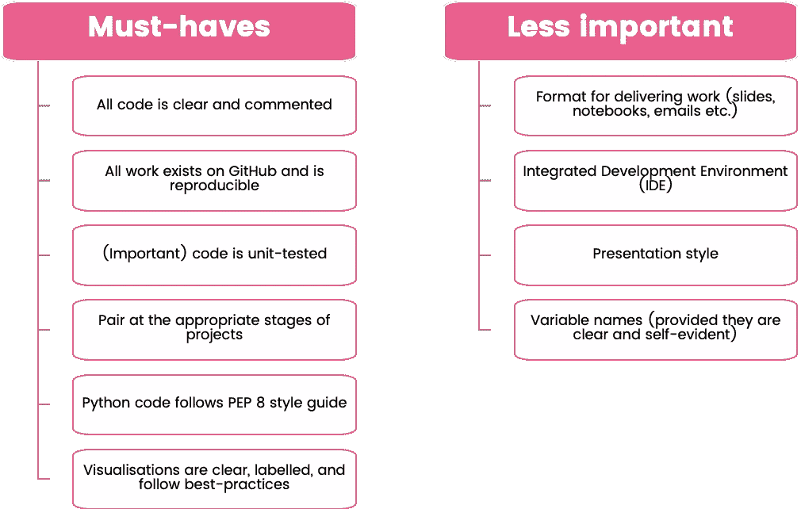
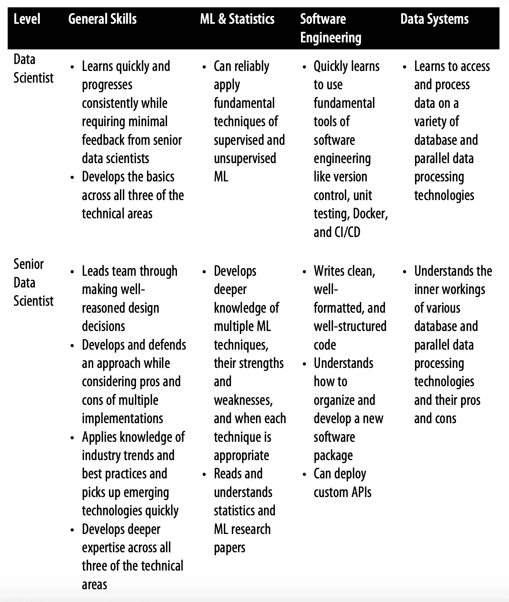
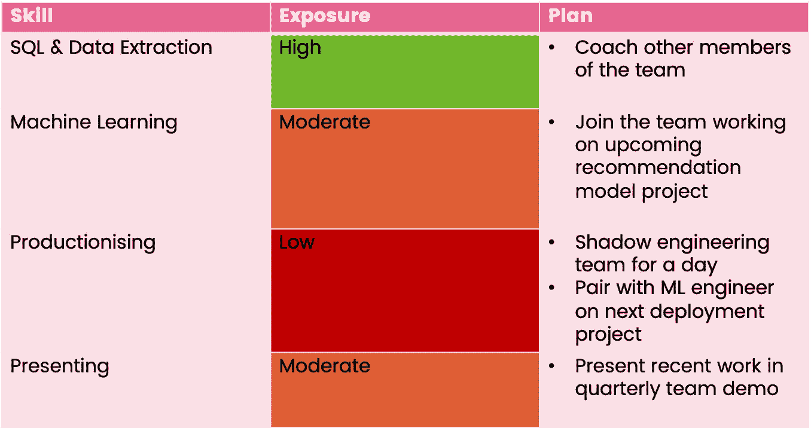

# 如何管理一名初级数据科学家

> 原文：<https://towardsdatascience.com/how-to-manage-a-junior-data-scientist-2a5b023eda37?source=collection_archive---------39----------------------->

## 让你和你的团队保持快乐和高效的个人思考

你是否曾经希望你能克隆一个自己？信息永远不会在翻译中丢失，你会确切地知道你的直线报告能够做什么工作，他们会觉得你的笑话很好笑。


弗兰克·麦肯纳在 [Unsplash](https://unsplash.com?utm_source=medium&utm_medium=referral) 上拍摄的照片

但是我们不能这样做，尽管我对自己的看法有些夸大，但这并不是特别可取的。相反，当团队拥有多样化的背景和思维时，他们工作得最好。另外，知道你的经理可能也有同样的想法也是一种有益的谦虚练习。

因此，在这个没有克隆的世界里，你需要在初级数据科学家开始实地工作时，迎接管理他们所带来的挑战和回报。

一点点判断，大量的尝试和错误，让我停下来思考和反思那些对我有效的事情，以及那些失败的事情。

冒着听起来像是一篇自助文章的诱饵的风险，我挑选了 6 个关键点，作为一名经理，我会记住它们。

本文主要是为管理团队中更多初级成员的数据科学家(或高级)而写的，但希望对每个人都有帮助。

让我们来看看我的 6 个观察。

# 一对又一对

[配对](https://martinfowler.com/articles/on-pair-programming.html)是软件工程师之间的一种常见技术，两个工程师使用双显示器或共享屏幕来处理相同的代码。通常，一个人是领航员，指导工作并编写代码，而另一个人是导航员，沿途进行观察或提出建议，在适当的时候也可以直接编写代码。


照片由阿米尔-阿巴斯·阿卜杜拉里在 [Unsplash](https://unsplash.com?utm_source=medium&utm_medium=referral) 上拍摄

结对的美妙之处在于你可以互相学习，发现你自己不会发现的错误，并且作为一个集体写出更高质量的代码。

感觉配对在数据科学中变得越来越普遍，因为软件工程的界限越来越模糊。结对在整个团队中产生了巨大的成果，尤其是对初级成员而言。

如果您正在向他们介绍新的或令人畏惧的东西，结对是一个很好的机会，在移交控制权之前，您可以作为试点开始您的项目，在实践中演示代码，以便您的团队成员可以在实践中学习，您可以在他们旁边提供指导。

这可能是你已经不太正式做的事情，但我发现如果你在某个时间预订并说…

> 让我们两人一组，一起写这个

…而不是简单地事后审查一些代码，或者在没有帮助他们开始的情况下向他们抛出一个新话题。

试一试，找到适合你们两个人的动力，确保你在日历上留出适当的时间，让你们不受干扰地富有成效地配对。

# 选择你的战斗

随着开始结对越来越多，我也注意到自己说的越来越多。虽然沟通是关键，但开始吹毛求疵并*纠正*任何作品直到它看起来完全像你写的一样是很容易的。


由[詹姆斯·庞德](https://unsplash.com/@jamesponddotco?utm_source=medium&utm_medium=referral)在 [Unsplash](https://unsplash.com?utm_source=medium&utm_medium=referral) 上拍摄的照片

这种模式让我思考(担心)，所以我拿出了我给我的直线报告的最后 5 条书面反馈。重读我的信息后，我很快意识到其中大部分源于个人偏好。本质上，我是说我不会用一种特殊的方式写代码，或者我会用我的风格展示一些幻灯片。

而不是问“这份工作和我自己的相比如何？”，我应该问唯一重要的问题，“这项工作是否达到了我们设定的目标？”。

例如，我有什么资格说这个代码…

```
df.rename(columns={“old_name”: “new_name”}, inplace=True)
```

…比这更好…

```
df = df.rename(columns={“old_name”: “new_name”})
```

实际上，我列出了数据科学的一些方面，这些方面是我认为普遍良好的实践，并希望我的团队遵循。如果我对一个不在清单上的主题提供反馈，它就像一个有用的电击，因为如果它不是必须的，那么它可能就没那么重要了。



当涉及到反馈和评审工作时的优先级。图片由作者提供。

什么会出现在你的清单上？你可能会发现，放下不太重要的东西会让你的评审更有效率，也不太可能让你的团队感到被反馈轰炸了。

# 在职和脱产学习

数据科学是一个广阔而动态的领域，不可能与所有的进步保持同步，也不应该指望你能跟上。

尽管如此，无论你是数据科学通才、ML 工程师还是研究人员，一个不可回避的事实是，你需要了解你的洋葱并拥有一定的技术技能。


蒂姆·莫斯霍尔德在 [Unsplash](https://unsplash.com?utm_source=medium&utm_medium=referral) 上的照片

[冒名顶替综合征](/how-to-manage-impostor-syndrome-in-data-science-ad814809f068)可能会袭击团队的任何成员，不仅仅是初级成员，但初级数据科学家应该得到足够的耐心和支持，特别是要稳步掌握这个角色。比以前的经验更重要的是他们学习交易的意愿、热情和好奇心。

明确你的团队可以花一些时间专注于可能对他们有益的新技能，例如每月一个星期五专门用于培训。

一定程度的学习也必须发生在工作之外。分享教程、为团队订阅[时事通讯](https://www.datascienceweekly.org/)、参加[聚会](https://www.meetup.com/)以及经营日志俱乐部都是鼓励持续学习的好方法。这也是一个有用的酸性测试；如果你的团队没有以某种形式致力于个人发展，警钟应该敲响了。

# 定义进展

这是我团队中一名成员的坦率反馈。在我们每周一次的谈话中，他们说…

> 我不确定我在公司的发展方向，也不知道我需要做些什么才能进步

不是一个好地方，也不是一个好经理。但是他们是绝对正确的，我们从来没有真正坐下来讨论过车队的发展会是什么样子。


林赛·亨伍德在 [Unsplash](https://unsplash.com?utm_source=medium&utm_medium=referral) 上拍摄的照片

这个反馈作为一个有用的唤醒电话来执行两个动作。

1.  创建一个文档，表达初级数据科学家的职责和特点，以及下一步的发展方向。这不需要太多的规定，但它有助于透明地显示他们应该以什么为目标。
2.  询问他们在这个角色中最开心的是什么。他们什么时候感到最自豪？如果可以选择，他们最想做什么类型的工作？了解某人是个人贡献者还是将自己视为未来的团队领导者，意味着你可以相应地调整他们的进展。

你对团队内部的发展有清晰的规划吗？你应该为你自己和你的初级数据科学家创建一个透明的描述，说明你的期望，以及他们需要展示什么来证明一个令人信服的晋升案例。



来自数据科学家的关怀和喂养的职业阶梯示例。[https://or eilly-ds-report . S3 . Amazon AWS . com/Care _ and _ Feeding _ of _ Data _ scientists . pdf](https://oreilly-ds-report.s3.amazonaws.com/Care_and_Feeding_of_Data_Scientists.pdf)

# 寻找合适的机会

如上所述，团队成员应该有一定的自由来表达他们想成为什么类型的数据科学家，以及他们觉得自己的专长是什么。

尽管如此，您仍然需要一个了解交付数据科学项目的完整端到端流程的团队。拥有一个不知道如何将他们的模型投入生产的机器学习专家或者一个不能与利益相关者互动的强大的编码员是没有用的。

如果你已经定义了进展的样子，下一步就是确保你准备好帮助你的团队到达那里。


由[马库斯·温克勒](https://unsplash.com/@markuswinkler?utm_source=medium&utm_medium=referral)在 [Unsplash](https://unsplash.com?utm_source=medium&utm_medium=referral) 上拍摄

我发现一起坐下来，为数据科学家应该具备的不同技能以及他们在每个领域的暴露程度创建一个记分卡是一个有用的练习。

这个练习不是关于优势，而是关于他们是否有机会获得他们需要的技能。这样做是双赢的，因为他们将有一个明确的发展计划，而你也将因此拥有一个更全面的团队。

例如，您的生产线报告可能会说…

*   “在过去的几个月里，我一直埋头于 SQL 代码和摄取管道，我想回到一些机器学习上来”。
*   “我做过很多模型，但总是有人接手并为我在生产中部署它。”

创建记分卡可以让你直接听到他们关心的问题或发展需求，然后提出解决盲点的计划。

这是记分卡的一个高级示例。这个练习可以是你想要的任何形式，但是你们应该一起做。



记分卡示例。图片由作者提供。

# OKR 的

你是数据科学家。你喜欢测量东西。在为你管理的人设定目标时，你应该运用这种思维。

关于 [SMART](https://www.professionalacademy.com/blogs-and-advice/what-are-smart-objectives-and-how-do-i-apply-them) 目标、 [OKRs](https://www.perdoo.com/the-ultimate-okr-guide/) 、 [BHAGS](https://www.investopedia.com/terms/b/big-hairy-audacious-goal-bhag.asp) 以及任何你能想到的其他缩写词的文章数不胜数。可以说，目标应该是相关的、雄心勃勃的、可衡量的。


照片由[弗勒](https://unsplash.com/@yer_a_wizard?utm_source=medium&utm_medium=referral)在 [Unsplash](https://unsplash.com?utm_source=medium&utm_medium=referral) 上拍摄

数据科学家通常是一群充满激情的人，我们可能会因为想要学习最新和最伟大的框架或寻找使用深度学习的机会而分心。但我们不是在泡沫中工作，最终，我们的雇主会期待一些有价值的东西回来。

因此，在个人发展目标之外，指定一个与商业成果相关联的目标是有意义的。

比方说，你的公司每月都要发邮件来吸引新客户，收到邮件的人中有 10%会成为客户。

数据科学团队被要求提高其绩效，这对初级数据科学家来说是一个完美的项目。在开始工作之前，你可以设定这个目标和可衡量的结果…

> **目标**:提高邮件活动的转化率
> 
> **关键** **结果**:预测谁应该成为目标的一个模型

似乎是个不错的起点。我们有一个项目要做，做这个项目的人需要交付一个模型是有意义的。但是这个模型发生了什么，它是如何投入使用的，我们如何知道这项工作是否成功？

也许关键结果的下一次迭代会是…

> **关键结果**:一个预测谁应该是 60%召回目标的模型

我们离成功越来越近了，但它依赖于像召回这样的统计测量，而不是影响业务 KPI 的东西。

如果你强迫自己从商业角度思考，你可以和 CRM 和财务团队谈谈，了解什么是有意义的改进。也许他们会告诉你转换率必须从 10%增加到 15%,以证明更新他们的工作流程和将你的模型合并到产品中的额外工作是合理的。

太好了。接下来，你必须考虑如何测量，以及实验会是什么样子。如果你得到了你无法衡量的东西，你还应该继续努力吗，因为你永远不知道它是否值得？

这个关键结果感觉比较扎实…

> **关键结果**:使用数据科学模型与现有方法进行活动的 A/B 测试，证明通过使用该模型，转化率至少提高了 15%

你无法控制的事情总会发生。你可能交付了世界上最好的模型，但是利益相关者没有以正确的方式使用它。在这些情况下，至少你开始时有了正确的意图，并且可以在你的评估中考虑减轻因素。

首先从一个有商业头脑的目标开始，并考虑你想要进行的实验来验证你的工作，你的团队将开始变得对你和你的公司更有价值。

# 那是一个包裹

就像生活中的所有事情一样，当涉及到数据科学和管理时，还有很多东西需要学习，但我希望这 6 条建议中的一些可以帮助你一路走来。

*   配对
*   定义你必须拥有的东西，放下个人喜好
*   重视日常工作之外的学习
*   传达从初级晋升到高级所需的特质
*   为工作的不同元素创建记分卡
*   设定商业目标

祝你和你的团队好运！

# 当你在这里的时候

请随意查看我的其他文章:

*   [避免内存耗尽的简单窍门](/a-simple-trick-to-avoid-running-out-of-memory-d45b0a014ceb)
*   [如何找到正确的聚类数](https://kieran-95138.medium.com/how-to-find-the-right-number-of-clusters-acc1130ed231)
*   [计算损失函数](/making-your-loss-function-count-8659cf65feb1)
*   [排列测试的威力](/the-power-of-permutation-testing-c2ac66f2d166)