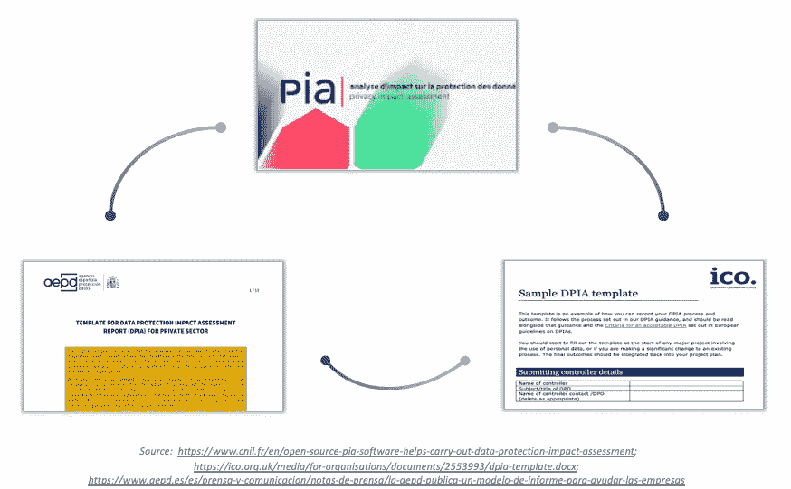
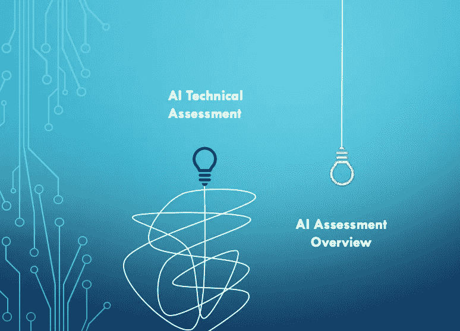
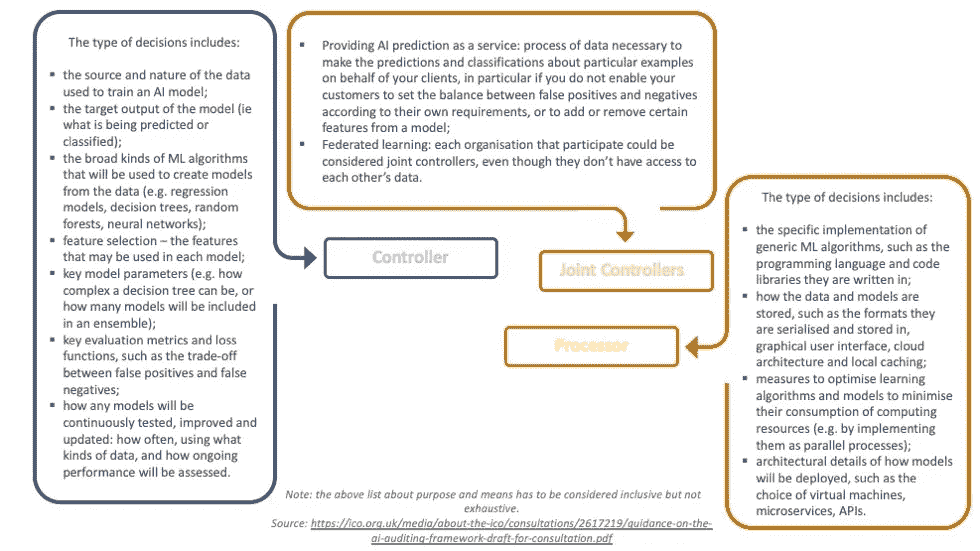

# 如何管理人工智能的风险

> 原文：<https://towardsdatascience.com/how-to-manage-the-risks-of-artificial-intelligence-7985215727d1?source=collection_archive---------45----------------------->

## **面向未来的现代方法，来自英国数据保护局**

来源: [Mixkit](https://mixkit.co/)

***前提*** *:本文意在作为‘活’文档。这意味着当我们有来自监管机构的更新时，我将增加审查跟进(我有时间…)。*

***22.09.20 更新*** *:几周前，监管机构发布了关于该主题的最终指导意见。除了一些小的调整(特别是关于人工智能、安全性、合成数据和透明度的潜在“偏见”)和额外的术语表，该文件几乎与之前的草案相同。*

在 AI 公司工作，基本上有两种潜在的团队类型。这些可以概括为:

1)“我们已经采取了所有安全措施来保护我们的机器学习系统及其数据”，以及

2)“有了所有新的指导方针和程序，我们需要做一些事情，但我们不知道具体做什么或如何做”。

来源: [Mixkit](https://mixkit.co/)

如今，这两种方法都是可以理解的。随着我们看到的关于人工智能和数据保护的不同论文，很难判断最好的做法是什么。

> 我们应该等待更明确的规则，还是继续前进？

*【更新】*今天，我将总结 ICO(英国数据保护局)的最新[指南](https://ico.org.uk/for-organisations/guide-to-data-protection/key-data-protection-themes/guidance-on-ai-and-data-protection/)及其关于管理人工智能培训和部署的实用建议，以及一些关于相关风险的进一步建议。

我保证，我会尽量避免任何形式的法律术语，但请记住，数据保护领域的基本知识将有助于理解这些内容。

如果您想立即跳到可执行任务的章节，您可以跳到最新章节( **[+1】)。那么，我们该怎么办？**’)。

好，我们开始吧。

# 1.DPIA 是基本支柱

ICO 以特别关注数据保护影响评估(DPIA)的实施而闻名，这是人工智能系统处理个人数据时所需的。

ICO 规定，将所涉及的数据主体的所有风险降低到零是“不现实的”(事实上法律并不要求这样做)。相反，最主要的一点是在可行的最大程度上识别和减轻风险。

现在，我们有几种工具可以实现这一点。

关于人工智能领域，DPIA 的实施应具体解决并提供:

*   可能影响过程公平性的任何相关变化或与系统相关的误差范围的解释(见第 3 节)。详情)；
*   人工智能系统作出的所有决定的记录；
*   过程中任何人类参与的程度，其影响(换句话说，是否有意义)以及人工智能系统产生的输出的可能覆盖；
*   需要考虑或做出的任何**权衡**(例如，在隐私权和其他竞争权利之间；统计准确性、透明度、商业秘密和商业知识产权方面)。

尽管如此，ICO 指出，在两个独立的评估中描述所有不同的方面可能是有用的:为 ML/IT 专家和工程师提供的全面的技术描述，以及更通用和易读的概述，其中包含有关输入、输出和所涉及的个人数据逻辑的所有关键信息。

来源:作者

# 2.你在人工智能项目中的角色是什么？

假设您与一家公司合作，该公司提供具有处理和存储功能的专用云计算环境，以及一套用于机器学习的通用工具。您可能需要定义想要使用的数据和模型、关键的模型参数，以及评估、测试和更新这些模型的过程。

在这种情况下，很容易看出你的供应商是一个“加工者”(他们代表你行事，根据你的指示，只决定非必要的细节)，而你是一个“控制者”(你对项目的最终结果有完全的控制权，你最终负责加工)。

但是，如果您的供应商将这些数据用于其他目的(例如，改进他们的培训系统)，会发生什么情况呢？

> 在这种情况下，他们立即成为此类处理的**控制者**，这需要与您就您的数据的披露和进一步处理达成另一份具体协议。

当考虑到一些公司向其客户提供实时人工智能预测和分类服务时，该框架可能会变得更加不清楚。

它们是控制器、处理器还是联合控制器？这取决于部署的每个阶段。我认为信息图在这种情况下会有所帮助。

# 3.让我们试着做到(统计上的)准确

在人工智能中,“准确性”的衡量标准强调了人工智能系统猜测正确答案的频率。这些答案通常包括个人数据作为可能的预测或推断。简单干净。

也就是说，ICO 补充说，该系统在统计上越准确，处理过程就越有可能对相关数据主体公平。

这就是为什么应该在持续的基础上评估系统的统计准确性，重点关注精确度(即被确定为阳性的病例的百分比实际上是阳性的)和召回率(所有被确定为阳性的病例的百分比)。

# 4.法律基础

另一个要考虑的方面是为人工智能项目收集和处理个人数据的适当法律基础。抛开同意、法律义务、重大利益和执行公共任务(这在大多数现有活动中似乎难以申请)不谈，我们能否依赖合同的履行和企业的合法利益？

> 答案是肯定的。

该指南阐明，人工智能可能是**向相关个人交付**合同服务或在合同前阶段提供支持(例如，人工智能衍生的服务报价)所必需的。

在这种情况下，“履行合同”是使用系统(交付阶段)的最佳理由，但它可能不是前一阶段(人工智能系统的培训/开发)的最佳选择。

因此，“合法利益”似乎是最合适的法律基础来**训练**你的人工智能模型，但不要忘记实施你的[合法影响评估](https://ico.org.uk/for-organisations/guide-to-data-protection/guide-to-the-general-data-protection-regulation-gdpr/legitimate-interests/how-do-we-apply-legitimate-interests-in-practice/)来平衡所有涉及的变量。

> 请记住:即使您有处理个人数据的适当法律依据，仅仅一些数据可能有用的可能性本身并不足以让组织证明处理这些数据对于构建模型是必要的(稍后将详细介绍数据最小化)。

# 5.针对歧视和偏见的措施

实施人工智能最常见的抑制因素是它可能产生的歧视形式，特别是当我们有不平衡的训练数据或只是过去歧视的眩光时。该指南建议的一些措施是:

*   训练单独的模型；
*   反分类；
*   结果/错误奇偶校验；和
*   同等校准。

我不会深入讨论这些方面，因为我们可以花几天时间来讨论与每个方面相关的困难。关于这个主题的精彩论文可以在[这里](https://arxiv.org/pdf/1808.00023.pdf)找到。

*【更新】*该指南还强调，每项衡量标准也应保持平衡，因为它们会对人工智能系统性能的统计准确性产生影响。

# 6.安全性和数据最小化

*(注:这一小段比较有技术含量。我试图尽可能地简化，但对于这些方面的大部分，你需要一个强大的人工智能相关的技术知识。)*

在人工智能中，安全性值得大多数企业关注。

如果你认为工程团队通常使用第三方框架和代码库是为了创建、维护和开发人工智能系统，那么你就会明白每个人工智能公司都可能存在的潜在风险。幸运的是，社区已经在致力于减少这些算法及其开源包背后的潜在漏洞，但我们仍处于这种方法的初级阶段。(更多技术细节[此处](https://ieeexplore.ieee.org/stamp/stamp.jsp?arnumber=8424643))。

在这个问题上，ICO 描述了每家公司可能面临的一些具体风险。特别是:

*   '模型反演':如果攻击者已经获得了训练数据，他们可以从 AI 模型中推断出进一步的个人信息(更多细节[在此](https://royalsocietypublishing.org/doi/10.1098/rsta.2018.0083)和[在此](https://www.cs.cmu.edu/~mfredrik/papers/fjr2015ccs.pdf))；
*   “成员推断”:攻击者能够推断出特定个体是否存在于 ML 模型的训练数据中的风险。在这种情况下，他们不需要了解任何关于所涉及的数据主体的额外个人数据；
*   “对抗性示例”:不是适当的数据保护风险，但这些示例可能被故意修改，以至于它们被错误分类，从而对 IT 系统构成风险。在这种情况下，值得注意的是，这可能被视为违反了网络和信息系统指令( [NIS 指令](https://ico.org.uk/for-organisations/the-guide-to-nis/gdpr-and-nis/))。

抛开适用于开发工作的维护代码和管理安全风险的标准要求，ICO 基本上建议，“系统中的数据越少，就越安全”(数据最小化原则)。

为了实现这一目标，指南探讨了可以实施的不同措施，包括:

*   特征选择，通过从训练系统中移除所有不相关的属性(技术细节[此处](http://www.jmlr.org/papers/volume3/guyon03a/guyon03a.pdf))；
*   记录和记载个人数据从一个位置到另一个位置的所有传输和存储，包括第三方系统；
*   差分隐私，以便了解和评估在培训系统中增加干扰或“噪音”的潜在影响(更多技术细节[此处](https://arxiv.org/pdf/1812.06210.pdf))；
*   联合学习，允许多方根据自己的数据训练模型(“本地”模型)。然后，您可以将识别出的一些模式(称为“梯度”)组合成一个更准确的“全局”模型，而不必彼此共享任何训练数据(更多详细信息[此处](https://blog.openmined.org/federated-learning-recommendations-part1/))；
*   在从源中提取和共享训练数据之前，对其进行去识别；
*   直接在生成查询的设备上的本地推断，该设备已经收集并存储了每个数据主体的个人数据(而不是在云服务器上)；
*   隐私保护查询方法(更多详情[此处](https://link.springer.com/article/10.1007/s10115-012-0573-y?shared-article-renderer))；
*   *【更新】*使用合成数据，与真人无关，而是人工生成的(更多详情[此处](https://iapp.org/news/a/accelerating-ai-with-synthetic-data/))。

# 7.快完成了:如何管理数据主题请求？

出于几个原因，用户请求(“数据主体请求”或“DSRs”)似乎是新技术最复杂的方面之一。

例如:

*   通常，训练数据只包括与预测相关的信息，而不包括联系方式的详细信息。然而，即使数据已经通过某种技术过程进行了转换，训练数据**仍可能被认为是个人数据**。
*   即使没有直接收集，也可以从采用的模型中推断出更多的个人数据。

在这种情况下，简单地访问他们的个人数据可能会很麻烦，有时，您也无法识别培训数据中的个人。

此外，可移植性请求可能是最难解决的一个问题，尤其是当数据以机器可读的形式大量转换时。原始数据可以提供，但是，ICO 指出，如果这种转换很重要，则产生的数据可能不再被视为由数据主体“提供”,因此不再受可移植性请求的约束

> (尽管它仍然是个人数据，所以可以是不同请求的焦点，例如访问权限)

另一方面，可能的擦除或纠正请求可能是可管理的，并且应该对所构建的模型有较小的影响。

然后，该指南强调，在自动决策的情况下，个人请求人工干预的流程应该简单且方便用户(例如，带有链接或清晰信息的网页，允许个人联系可以参与进来的工作人员)。

这里的关键点是透明度:制定一个隐私政策，用常见和可理解的术语解释人工智能系统的整体结构，其目的和从中做出的决定。这可以极大地帮助建立用户的信任，并且(希望)减少收到的请求数量。

> 有人说‘黑盒’？

是的，这是真的，对于非常复杂的系统来说，可能很难理解系统的逻辑，也很难解释它们是如何工作的。此外，一些方法可能会意外泄露有关人工智能模型的敏感专有信息，并有助于暴露外部参与者的隐私攻击。[解释指南](https://ico.org.uk/about-the-ico/ico-and-stakeholder-consultations/ico-and-the-turing-consultation-on-explaining-ai-decisions-guidance/)可以帮助你。

# [+1].那么，我们该怎么办？

如果你一直关注我的文章，并且同意我的观点，你可能会想知道你现在可以采取什么行动。

为了给你一个答案，我创建了一个[人工智能数据保护清单](https://drive.google.com/file/d/1TIbpAZoJL9x_DXxAOl8TEb9NMh6l3ktk/view?usp=sharing)，它完整地追溯了 ICO 官方文件，可以作为你在人工智能团队中识别和控制风险的路线图。

> 这是团队合作，不是一个人的项目！

> 你的同事对上述每一步的看法可能是简化流程的关键，也是最终结果的关键。支持性的组织文化是基础。

# 简单地

*【更新】*该指南还阐明，它将不断努力为这一新兴领域提供更多支持，并在未来几年内发布适当的“工具包”和新的“云竞争指南”。

尽管如此，该文件已经提供了 ICO 的相关建议，并说明了减轻人工智能风险所需的关键步骤，以及可以立即采取的步骤。

# PS:

你想多读点吗？下面你可以找到更多关于这个主题的论文:

欧盟委员会- [人工智能白皮书](https://ec.europa.eu/info/sites/info/files/commission-white-paper-artificial-intelligence-feb2020_en.pdf)

隐私论坛的未来- [警告标志](https://fpf.org/wp-content/uploads/2019/09/FPF_WarningSigns_Report.pdf)

AEPD - [嵌入人工智能处理的 RGPD 符合性|简介](https://www.aepd.es/sites/default/files/2020-02/adecuacion-rgpd-ia-en_0.pdf)

ICO - [大数据、人工智能、机器学习和数据保护](https://ico.org.uk/media/for-organisations/documents/2013559/big-data-ai-ml-and-data-protection.pdf)

ICO 和艾伦图灵研究所- [项目解释](https://ico.org.uk/media/about-the-ico/consultations/2616434/explaining-ai-decisions-part-1.pdf)