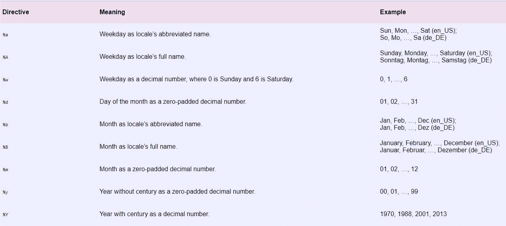

# 如何像老板一样在 Python 中操纵日期和时间

> 原文：<https://towardsdatascience.com/how-to-manipulate-date-and-time-in-python-like-a-boss-ddea677c6a4d?source=collection_archive---------17----------------------->

## 常用的日期时间函数及示例


伊莲娜·科伊切娃在 [Unsplash](https://unsplash.com?utm_source=medium&utm_medium=referral) 上的照片

使用 Python 时，我们都有试图弄清楚如何“操纵”日期和时间的时刻。

这是我创建的一个备忘单，涵盖了 Python 中最常用的日期时间相关函数。如果你想要一些简单但实用的例子，看看吧！

我们将涵盖以下所有 7 个热门话题:

*   *不同格式的今天的日期和时间*
*   *字符串到日期的转换*
*   *日期时间计算的差异*
*   *日期时间加/减某段时间*
*   *日期时间比较*
*   *时区设置*
*   *Unix 时间戳/纪元时间计算*

## 不同格式的今天的日期和时间

让我们从最基本的开始热身。下面是打印当前年、月、日、小时、分钟、秒和毫秒的代码。

```
**In:** from datetime import datetime d = datetime.now() #today's datetime
    d**Out:**datetime.datetime(2019, 12, 22, 13, 14, 18, 193898)
```

这是非常有用的信息，但我们通常只需要其中的一部分。我们可以打印下面不同的部分。

```
**In:** print(d.weekday()) #day of week - Monday is 0 and Sunday is 6
     print(d.year)
     print(d.month)
     print(d.day)
     print(d.hour)
     print(d.minute)
     print(d.second)**Out:** 6
     2019
     12
     22
     13
     14
     18
```

此外，可能需要某些日期/时间格式。我们可以使用下面的列表来定制不同的日期格式。这也可以被认为是将日期转换为字符串的一种方式。完整的名单可以在这里找到。



```
**In:**  print(d.strftime("%A %d/%m/%Y")) # date to string**Out:** Sunday 22/12/2019
```

## 字符串到日期的转换

下面的示例显示了两个被转换为日期格式的流行字符串:

```
**In:**  date_string = '2016-02-01 12:00PM'
     print(datetime.strptime(date_string, '%Y-%m-%d %I:%M%p'))**Out:** 2016-02-01 12:00:00**In:**  date_string = '02/01/2016'
     d2 = datetime.strptime(date_string, '%m/%d/%Y')
     print(d2)**Out:** 2016-02-01 00:00:00
```

## 日期时间计算的差异

下面的示例打印天数的差异(例如今天和 2016 年 2 月 1 日):

```
**In:**  from datetime import timedelta d = datetime.now()
     date_string = '2/01/2016'
     d2 = datetime.strptime(date_string, '%m/%d/%Y')
     print(d - d2)**Out:** 1420 days, 13:18:27.386763
```

我们也可以只打印两个日期时间的差异，以天、周或年为单位，等等。

```
**In:** date_diff = (d - d2)/timedelta(days=1)
    print('date_diff = {} days'.format(date_diff))**Out:** date_diff = 1420.5544836430902 days**In: ** date_diff = (d - d2)/timedelta(weeks=1)
     print('date_diff = {} weeks'.format(date_diff))**Out:** date_diff = 202.93635480615575 weeks**In:**  date_diff = (d - d2)/timedelta(days=365)
     print('date_diff = {} years'.format(date_diff))**Out:** date_diff = 3.8919300921728497 years
```

## 日期时间加上/减去某一段时间

让我们按秒、分、小时、天、周或年的不同时间间隔做一些“时间旅行”:

```
**In:**  print(d + timedelta(seconds=1)) # today + one second print(d + timedelta(minutes=1)) # today + one minute print(d + timedelta(hours=1)) # today + one hour print(d + timedelta(days=1)) # today + one day print(d + timedelta(weeks=1)) # today + one week print(d + timedelta(days=1)*365) # today + one year **Out:** 2019-12-22 13:18:28.386763
     2019-12-22 13:19:27.386763
     2019-12-22 14:18:27.386763
     2019-12-23 13:18:27.386763
     2019-12-29 13:18:27.386763
     2020-12-21 13:18:27.386763
```

## 日期时间比较

日期之间的比较用通常的比较符号很简单:

```
**In:** print(d < (d2 +(timedelta(days=365*6)))) # d is no more than 6 years (assume each year has 365 days) after d2?
     print(d > (d2 +(timedelta(weeks=52*6)))) # d is more than 6 years (assume each year has 52 weeks) after d2?
     print(d != d2) # d2 is not the same date as d?
     print(d == d2) # d2 is the same date as d?**Out:** True
     False
     True
     False
```

## 时区设置

我们还可以比较不同时区的时间，比如多伦多和上海:

```
**In:**  import pytz
     timezone = pytz.timezone("America/Toronto")
     dtz = timezone.localize(d)
     print(dtz.tzinfo)
     print(dtz)**Out:** America/Toronto
     2019-12-22 13:18:27.386763-05:00**In:**  shanghai_dt = dtz.astimezone(pytz.timezone("Asia/Shanghai"))
     print(shanghai_dt)**Out:** 2019-12-23 02:18:27.386763+08:00**In: ** (dtz - shanghai_dt)/timedelta(days=1) # same datetimes**Out:** 0.0
```

如果您对不同时区的完整列表感兴趣。使用下面的代码将打印它们:

```
**In:**  for tz in pytz.all_timezones:
        print(tz)**Out:** Africa/Abidjan
     Africa/Accra
     Africa/Addis_Ababa *(Only showing the first three as examples)*
```

## Unix 时间戳/纪元时间计算

Unix 时间戳通常用于操作系统中的文件。通常它们也会出现在数据集中。

首先，我们可以获得当前的 Unix 时间戳:

```
**In:** from datetime import timezone dt_now = datetime.now(timezone.utc)
     print(dt_now)
     print(dt_now.tzinfo)
     print(dt_now.timestamp()) # the unix timestamp.**Out:** 2019-12-22 18:21:28.681380+00:00
     UTC
     1577038888.68138
```

此外，我们可以将 Unix 时间戳转换为日期时间格式:

```
**In:** utc_timestamp = 1377050861.206272
     unix_ts_dt = datetime.fromtimestamp(utc_timestamp, timezone.utc) print(unix_ts_dt)
     print(unix_ts_dt.astimezone(pytz.timezone("America/Toronto")))
     print(unix_ts_dt.astimezone(pytz.timezone("Asia/Shanghai")))**Out:** 2013-08-21 02:07:41.206272+00:00
     2013-08-20 22:07:41.206272-04:00
     2013-08-21 10:07:41.206272+08:00
```

***更多数据科学相关文章来自 Lianne 和 Justin:***

[](/how-to-visualize-a-decision-tree-in-5-steps-19781b28ffe2) [## 如何用 5 个步骤可视化决策树

### 为企业 Windows 环境量身定制

towardsdatascience.com](/how-to-visualize-a-decision-tree-in-5-steps-19781b28ffe2) [](/how-much-do-you-need-to-retire-at-age-30-based-on-simulation-424fa9e0922b) [## 根据模拟，30 岁退休需要多少钱

### 很多人年纪轻轻就有辞掉工作的梦想，活在世上没有经济上的牵挂。怎么…

towardsdatascience.com](/how-much-do-you-need-to-retire-at-age-30-based-on-simulation-424fa9e0922b) [](/when-is-the-best-time-to-buy-lottery-tickets-7735191b3c76) [## 买彩票的最佳时机是什么时候？

### 根据理性(或统计)分析

towardsdatascience.com](/when-is-the-best-time-to-buy-lottery-tickets-7735191b3c76)