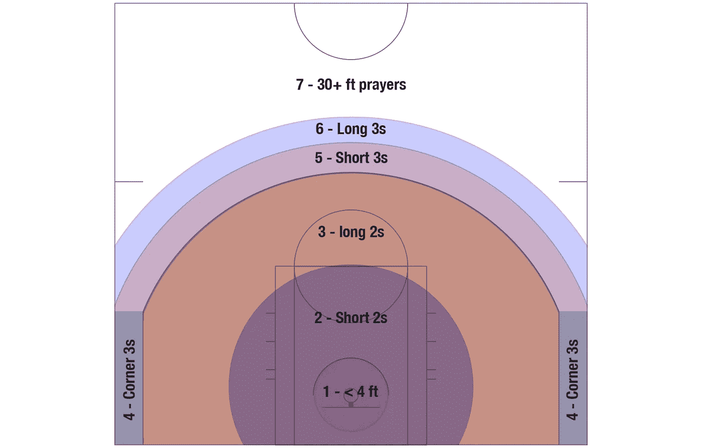
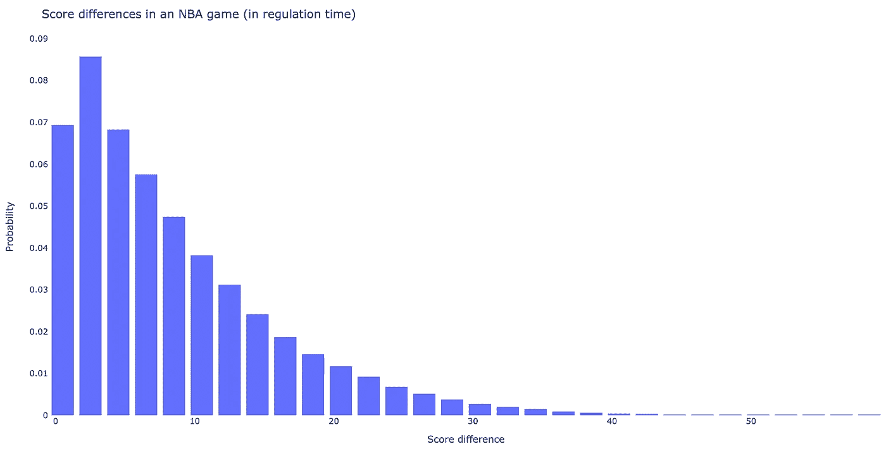
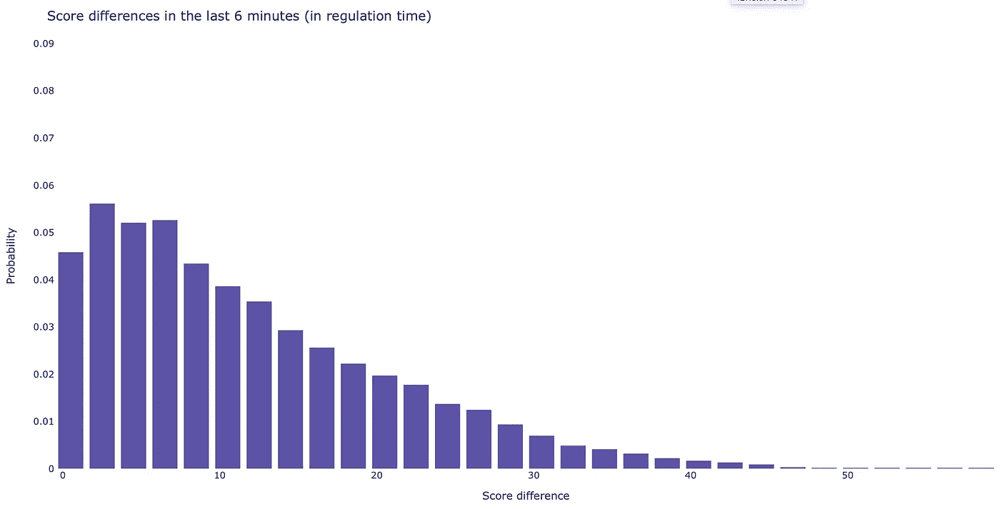
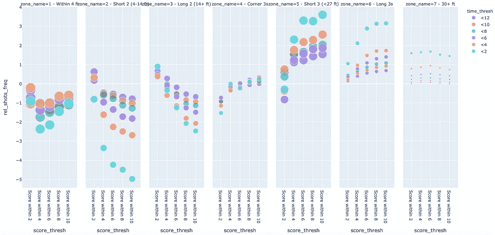
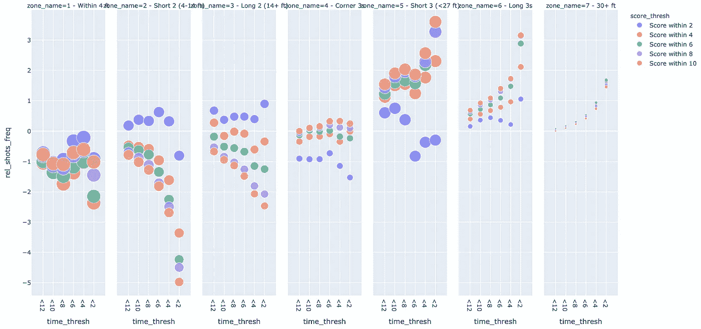
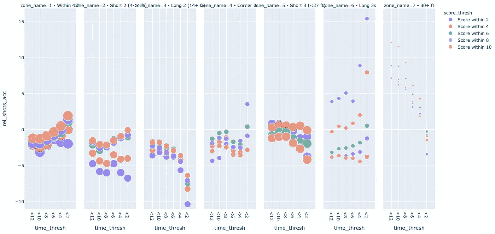
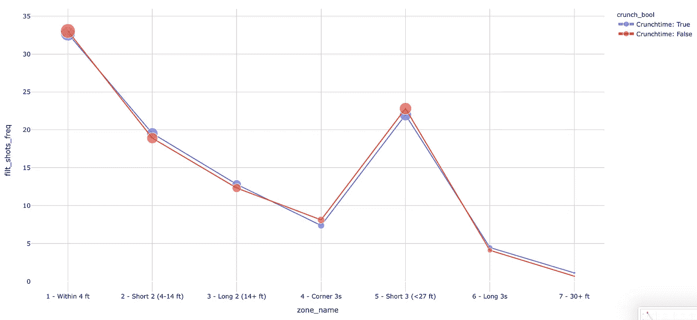
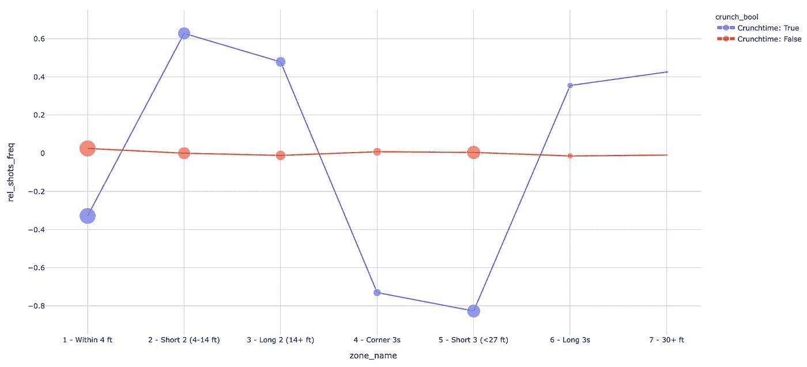
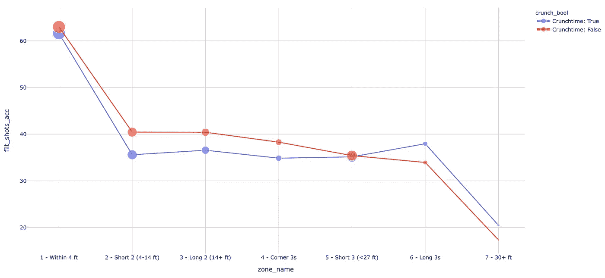
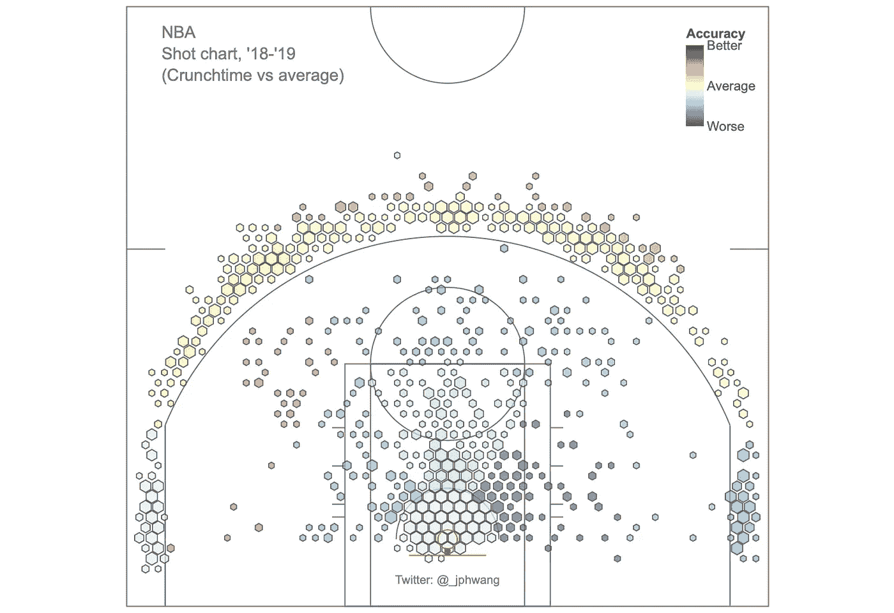

# 如何操纵和可视化数据以进行比较分析 NBA 的关键时刻

> 原文：<https://towardsdatascience.com/how-to-manipulate-visualize-data-for-comparative-analysis-crunch-time-in-the-nba-f20540e23b54?source=collection_archive---------16----------------------->

## 使用 Python 和 Pandas 和 Plotly 对数据进行切片、分组和可视化，以获得新的见解(代码和数据在我的 [GitLab repo](https://gitlab.com/jphwang/online_articles) 中)。


[Jason Dent](https://unsplash.com/@jdent?utm_source=unsplash&utm_medium=referral&utm_content=creditCopyText) 在 [Unsplash](https://unsplash.com/s/photos/comparison?utm_source=unsplash&utm_medium=referral&utm_content=creditCopyText) 上的原始照片

在这篇文章中，我演示了如何操作和可视化数据以获得比较性的洞察力。我从一个数据集开始分析，将对其进行分析以找到合适的分割，并找到与剩余数据进行比较的最佳子集。

实际上，这篇文章着眼于上个赛季的 NBA 数据，以了解接近，比赛后期的情况。有些人喜欢林格氏[比尔·西蒙斯](https://twitter.com/BillSimmons)称之为“关键时刻”。

我们将使用数据来了解这些高风险时刻的更多信息。真正的关键时刻是什么时候？这期间的游戏玩法有什么不同吗？这里采用了什么样的策略？

和往常一样，本文的重点将是适用于您自己的领域和数据的数据分析，而不是特定于篮球的输出。

我们走吧。

# 在开始之前

## 数据和代码

我在我的 [GitLab repo here](https://gitlab.com/jphwang/online_articles) (在 **basketball_crunchtime** 目录中)中包含了这方面的数据和代码，所以请随意下载并使用它/改进它。

## 包装

我假设您熟悉 python。即使你相对较新，这个教程也不应该太难。

你需要`pandas`和`plotly`。用一个简单的`pip install [PACKAGE_NAME]`安装每一个(在你的虚拟环境中)。

# 创建“关键时刻”数据

这里的假设很简单。在篮球运动中，有些情况会得到不同的对待，会得到球员和教练更多的努力和关注。让我们称之为“关键时刻”，看看数据是否显示出它与游戏其余部分之间的任何差异和模式。

我们的数据集包括 2018-19 赛季的详细数据。正如你可能想象的那样，在我可以过滤的数据中没有' *crunch time* '特性。但根据我们的直觉，关键时刻数据与剩余时间有限且分数差异较小的时期相关似乎是合理的。

首先，我们将研究这些数据，看看选择关键时间子集的合理标准是什么。

## 在熊猫中创建新栏

现有数据集不包括剩余时间或得分差异的要素，但它包括这些要素的基础数据。

在 Pandas 中创建新列有多种方法，但我更喜欢使用`.assign`方法，因为它[返回一个全新的对象](https://pandas.pydata.org/pandas-docs/stable/reference/api/pandas.DataFrame.assign.html)。这有助于避免操作错误对象的麻烦。

数据集特征包括`period`，共 4 分钟，以及每个时间段的`elapsed`时间(共 12 分钟)。`period`数据是整数，`elapsed`时间是字符串，所以我们想把它们转换成一致的时间单位。

`Pandas`有一个`timedelta`函数可以方便地将字符串转换为时间，而`timedelta64`函数`numpy`可以将时间转换为秒，所以将它们相加就可以得出游戏所用的总时间。

让我们也为当前得分差异创建一个新列:

```
shots_df = shots_df.assign(tot_time=(shots_df.period-1)*np.timedelta64(60*12, 's') + pd.to_timedelta(shots_df.elapsed, unit='s'))
shots_df = shots_df.assign(score_diff=abs(shots_df.home_score-shots_df.away_score))
```

以前`max(shots_df.elapsed)`给`‘0:12:00'`，现在`max(shots_df.tot_time)`给`Timedelta(‘0 days 00:48:00’)`。*(我暂时排除了超时)*

## 过滤数据

这些新列现在可以用来过滤我们的数据集。我们将使用它们来生成一些潜在的关键时间子集进行比较。

首先，我想看看镜头的分布是否会改变。在之前的一篇文章中，我们把球场分成了不同的区域，就像这样:



每个镜头都有一个特征编码，记录它来自这 7 个区域中的哪一个。

拍摄位置的改变可能和精度的改变一样有意义。实际上，情况可能更是如此，因为数据可能没有射击精度那么“嘈杂”。

因此，让我们捕捉这些区域的拍摄分布是否发生了变化，将每个区域的拍摄精度/频率等统计数据添加到我们的数据帧中。

为了评估各种时间和分数阈值的效果，我构建了一个具有各种时间和分数阈值的嵌套循环，并使用 pandas 根据循环中的这些值过滤数据帧:

```
for time_thresh in [12, 10, 8, 6, 4, 2]:
    for score_thresh in [2, 4, 6, 8, 10]:
        filt_shots_df = shots_df[
            (shots_df.tot_time > np.timedelta64(60*(48-time_thresh), 's'))
            & (shots_df.score_diff <= score_thresh)
        ]
```

每个统计数据也是作为与整体数据相比较的相对值被捕获的，因为我们希望在关键时刻捕获游戏的*变化*。

如果你不确定如何使用？groupby methods with dataframes，[这里是文档](https://pandas.pydata.org/pandas-docs/stable/reference/api/pandas.DataFrame.groupby.html)。

这给了我们一个可行的数据框架进行比较，我们已经准备好开始研究我们的数据集。

# 可视化“关键时刻”数据

## 健全性检查—样本大小

每当我处理数据的子集时，我都希望警惕引入随机错误，或无意识的偏差，这可能会导致我得出错误的结论。

在这里，让我们快速看一下分布情况，以了解每场比赛在每个分数差异范围内花费了多少。

我们的数据库包含整个 NBA 赛季大约 217，000 张照片。粗略估计，每分钟包含 4500 个镜头。将这些绘制成直方图:

```
import plotly.express as px
fig = px.histogram(shots_df, x='score_diff', nbins=40, histnorm='probability density', range_y=[0, 0.09])
fig.update_layout(
    title_text='Score differences in an NBA game',
    paper_bgcolor="white",
    plot_bgcolor="white",
    xaxis_title_text='Score difference', # xaxis label
    yaxis_title_text='Probability', # yaxis label
    bargap=0.2,  # gap between bars of adjacent location coordinates
)
fig.show()
```



同样，在最后的 6 分钟里:



即使在最后 6 分钟，NBA 比赛也有约 4.5%的比分在 1 分以内，约 10%在 3 分以内。

在超过 215，000 张照片的基础上，获得这些子集似乎是合理的，但这是值得关注的事情，特别是当子集是基于时间和分数导出的。

## 识别关键时刻

我们有两个感兴趣的变量，剩余游戏时间(`time_thresh`)和得分差(`score_thresh`)。我们还有拍摄区域的变量(`zone_name`)。有三个变量要考虑，这对于气泡图来说是完美的，一个变量沿着 x 轴，另一个是颜色，第三个是支线剧情。

使用这段代码，我们创建了一个这样的气泡图:

```
fig = px.scatter(
    summary_df, x='score_thresh', y='rel_shots_freq', color='time_thresh', size='filt_shots_freq',
    facet_col='zone_name', hover_data=['filt_shots_taken'])
fig.show()
```



支线剧情/颜色系列可以像这样翻转，产生:

```
fig = px.scatter(
    summary_df, x='time_thresh', y='rel_shots_freq', color='score_thresh', size='filt_shots_freq',
    facet_col='zone_name', hover_data=['filt_shots_taken'])
fig.show()
```



这些图已经告诉我们很多。

他们告诉我们，在比赛后期，三分球投得比比赛其他时间多得多。这随着分数差距的增加而增加(即，团队冒更大的风险来追赶)。

[现代分析指出，最好的投篮来自靠近篮筐和角落的 3s](https://fansided.com/2014/11/01/geometry-distance-corner-3s/) ，而这里的数据显示，这些投篮变得越来越难。据推测，这是由于防守投入了更多的努力，特别是在比赛的后期，当比分接近时(看看紫色的< 2 分比赛数据)。

仔细观察底部的情节也可以发现，在大多数次要情节中，大约在 8 分钟或 6 分钟处有一个拐点。这一点在第一个支线剧情(4 英尺以内)和第五个(短 3s)中表现得最为明显。

让我们来看看射击精度。它告诉我们一个相似的故事吗？



好像是这样的！随着得分差距的增加，在近距离投篮时，准确性往往会增加，而在远距离投篮时，准确性会降低。这可能是因为领先的球队对三分球保持警惕，以防止他们的对手迅速追上来，而落后的球队更经常从远距离射门。上图中显示的频率证实了这一点。

总的来说，这些支线剧情中的许多都表明在游戏还剩 6 分钟的时候发生了一些变化。这似乎是一个很好的门槛。

分数呢？当我们从越来越大的分数差距中观察数据时，虽然对数据的影响是渐进的，但我的观察是，分数在 2 分以内的情况下的数据点在大多数这些支线剧情中脱颖而出。(自己看看，如果你不同意，请告诉我。)

**所以让我们采用关键时刻的定义，即剩余时间为 6 分钟或更少，得分在 2 分以内。**

## 紧缩时间 vs 常规(平稳？)时间

既然我们已经为 crunch time 设置了参数，我们可以创建一个新列来区分这两个数据集。

```
shots_df = shots_df.assign(
    crunchtime=(shots_df.tot_time > np.timedelta64(60*(48-6), 's'))
               & (shots_df.score_diff <= 2))
```

`crunch_df`包含 3886 个镜头，没什么可轻视的。(但我们可能不希望变得更小。)

让我们基于这个属性来比较两个数据集。现在，只需围绕`crunchtime`变量的布尔值构建数据，即可轻松实现这一点:

```
for crunch_bool in [True, False]:
    filt_shots_df = shots_df[shots_df.crunchtime == crunch_bool]
```

或全部:

结果很有意思。



虽然比赛很接近，但球队没有采取极端的策略(例如更多的三分球)。但是很明显，想要在 1 区、4 区和 5 区拍出理想的照片是很难的。或许我们应该看看相对于整体平均值的百分比:



很明显，防守队员的额外努力迫使球队在效率低的位置(2，3，6 和 7)投篮更多，而在好的位置(1，4 和 5)投篮更少。虽然这可能只是数据中的噪声，但下降来自已知的理想拍摄区域这一事实使我怀疑这一点。

看看拍摄的准确性，画面变得更加有趣。



在比赛的最后 6 分钟，当比分接近时，在越过三分线之前，投篮命中率会全面下降，从而变得更加准确*长距离*。这令人困惑，但是有一些潜在的解释。

一个是*选择偏差*，在团队中最优秀的球员这个时候得到这些镜头。另一个是与博弈论相关的，因为防守可能会在某种程度上鼓励球队采取这些相对较低比例的投篮(在正常情况下)。

尽管如此，研究这些数据的团队会说，进行长时间的三分可能是一个令人惊讶的高价值命题。

为了总结这一点，让我们使用拍摄图表来更详细地查看数据。



在三分线内的几乎所有地方，投篮都变得越来越不准确，三分角球变得明显更加困难，这可能是因为防守增加了压力。

虽然我们预计这些数据可能会有点嘈杂，因为只有 3886 张照片，而不是超过 210，000 张)，但这里反映了全面的下降。

出于这个原因，我不会对方向差异做过多解读。给定小样本量，左/右的差异可能只是噪声，而不是趋势的反映。

# 总结

我个人发现，尽管现在找到大型数据集相对容易，但它们并不总是包含允许我轻松地对数据进行切片、进行比较或从中得出结论的功能。

相反，我经常不得不从现有的数据中创建新的特征，并使用我的直觉来评估创建数据子集的适当截止点。

为此，我希望上面的例子对你有用，也可能有趣。

请下载数据和代码，玩一玩，用你自己的数据集构建类似的东西。我很想听听你的经历或评论！

如果你喜欢这个，比如说👋/在 [twitter](https://twitter.com/_jphwang) 上关注，或关注更新。我还写了这些关于篮球数据的文章，可能对本文有帮助，如果你以前没看过的话。

[](/how-to-visualize-hidden-relationships-in-data-with-python-analysing-nba-assists-e480de59db50) [## 如何用 Python 可视化数据中的隐藏关系 NBA 助攻分析

### 使用交互式快照、气泡图和桑基图操纵和可视化数据，使用 Plotly(代码和数据…

towardsdatascience.com](/how-to-visualize-hidden-relationships-in-data-with-python-analysing-nba-assists-e480de59db50) [](/interactive-basketball-data-visualizations-with-plotly-8c6916aaa59e) [## 用 Plotly 实现交互式篮球数据可视化

### 用 hexbin shot 图表分析体育数据，用 Plotly 和 Plotly Express 分析气泡图(源代码&我自己的数据…

towardsdatascience.com](/interactive-basketball-data-visualizations-with-plotly-8c6916aaa59e)