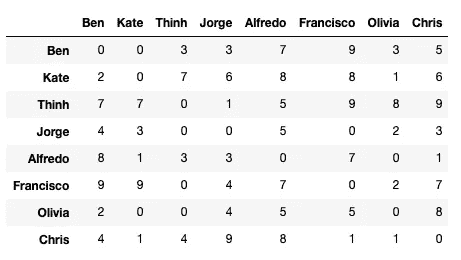
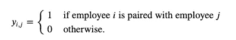
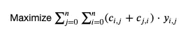
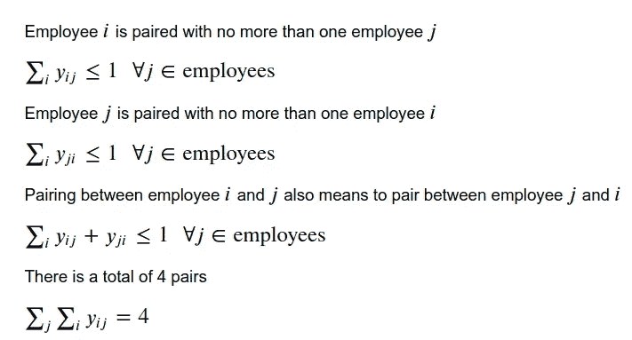
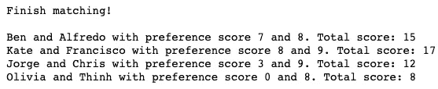
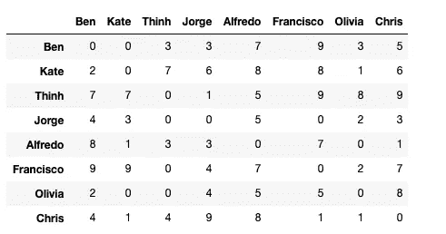

# 如何用 Python 找到最佳匹配

> 原文：<https://towardsdatascience.com/how-to-match-two-people-with-python-7583b51ff3f9?source=collection_archive---------15----------------------->

## 给定个人偏好，如何最大化总偏好？

# 方案

恭喜你！你是由 8 名优秀员工组成的新团队领导。你想把他们分成 4 组，分别负责 4 个不同的项目。作为一名有经验的领导者，你知道员工在和他们喜欢的人一起工作时效率最高。所以你想出了一个员工评级系统。等级从 1 到 10，10 分意味着员工真的喜欢另一个员工，1 分意味着雇主根本不想和另一个员工一起工作。进行调查后，您会得到以下结果:



因为雇员不能给自己评分，所以对角线元素为零。好消息是你知道每个雇主有多喜欢其他人。坏消息是你不知道如何搭配它们，这样每个人都会对他们的队友感到满意！作为一个热衷于数据的人，你知道一定有某种方法可以用数据来解决这个问题。你是对的。

这个问题可以通过**数学编程**轻松解决。虽然机器学习在从数据中学习和做出预测方面很棒，但它在做出最佳决策方面有局限性。当你的问题涉及多种约束并允许多种可能的解决方案时，只有数学规划有能力找到最佳解决方案。

让我们来看看如何用数学编程来匹配你的员工！


迪伦·吉利斯在 [Unsplash](https://unsplash.com?utm_source=medium&utm_medium=referral) 上的照片

# 纸浆优化

如果您不熟悉 PuLP，它是一个 python 库，使您能够解决优化问题。你可以在这里找到关于这个图书馆的纪录片。我将使用这个方便的包来制定和解决我们的问题。

## 安装软件包并定义问题

```
!pip install pulpfrom pulp import *prob = LpProblem("Matching Employees", LpMaximize)
```

在`LpProblem`方法中，第一个参数是问题的名称，而第二个参数是你的目标(最大化或最小化)

## 因素

您需要匹配 8 名员工。NumPy 数组是简介中显示的 8 名员工的偏好矩阵。

## 变量

使用`LpVariables`创建变量`y`，这是一个决策变量，用于确定是否将员工 I 与员工 j 进行匹配



```
y = LpVariable.dicts("pair", [(i,j) for i in employees for j in employees] ,cat='Binary')
```

## 目标

最大化员工 I 和 j 之间的偏好得分



```
prob += lpSum([(c[i][j] + c[j][i]) * y[(i,j)] for i in employees for j in employees])
```

## 限制



```
for i in employees: prob += lpSum(y[(i,j)] for j in employees) <= 1 prob += lpSum(y[(j,i)] for j in employees) <= 1 prob += lpSum(y[(i,j)] + y[(j,i)] for j in employees) <= 1prob += lpSum(y[(i,j)] for i in employees for j in employees) == 4
```

## 解决问题

在定义了参数、变量、目标函数和约束条件之后，我们就可以用一行代码来解决问题了！

```
>>> prob.solve()
1
```

打印解决方案

```
print("Finish matching!\n")
for i in employees:
    for j in employees:
        if y[(i,j)].varValue == 1:
            print('{} and {} with preference score {} and {}. Total score: {}'.format(names[i],names[j],c[i,j], c[j,i], c[i,j] +c[j,i]))
```



# 对结果的解释



在用这个结果匹配你的员工之前，我们先仔细看一下结果，看是否合理。请记住，目标是最大化一对中**双方**的偏好，而不仅仅是一个个体。

*   凯特将弗朗西斯科作为她的首选，弗朗西斯科也将凯特作为她的首选。所以他们绝对是很好的一对。
*   阿尔弗雷多把本作为他的首选。即使本不像弗朗西斯科那样喜欢阿尔弗雷多，但本仍然喜欢阿尔弗雷多(偏好得分为 7)。
*   乔治似乎不喜欢克里斯，但克里斯非常喜欢乔治。所以也许克里斯会让乔治更喜欢他，因为他们一起工作？
*   奥利维亚和 Thinh 之间的配对似乎不是奥利维亚想要的。她一点也不喜欢这件事！但是 Thinh 真的很喜欢 Olivia，所以也许他会热心帮助 Olivia；因此，这对整个团队都有好处？

# 你可以成为一个伟大的媒人

这个结果仍然有一些局限性:一些人没有把他们的队友作为他们的首选，甚至讨厌他们的队友。但总的来说，该算法很好地将它们分成对，以便最大化整个组的匹配分数。更好的是，您不需要处理做出最佳决策的难题，因为算法已经为您完成了！

这篇文章的笔记本可以在我的 [Github 库](https://github.com/khuyentran1401/linear-programming-with-PuLP)中找到。如果你想知道如何将你的员工或朋友分组，我建议你创建一个偏好分数的小调查，并尝试这个算法。也许最大化偏好会创造一个高效的工作环境？

在[Github repo](https://github.com/khuyentran1401/linear-programming-with-PuLP/blob/master/Cutting%20Stock%20Problem.ipynb)中，您可以随意使用本文的代码。

我喜欢写一些基本的数据科学概念，并尝试不同的算法和数据科学工具。你可以在 LinkedIn 和 Twitter 上与我联系。

如果你想查看我写的所有文章的代码，请点击这里。在 Medium 上关注我，了解我的最新数据科学文章，例如:

[](/maximize-your-productivity-with-python-6110004b45f7) [## 使用 Python 最大化您的生产力

### 你创建了一个待办事项清单来提高效率，但最终却把时间浪费在了不重要的任务上。如果你能创造…

towardsdatascience.com](/maximize-your-productivity-with-python-6110004b45f7) [](/choose-stocks-to-invest-with-python-584892e3ad22) [## 用 Python 选择要投资的股票

### 您计划在未来 3 年投资几只股票，每只股票的每一美元都有不同的预期回报…

towardsdatascience.com](/choose-stocks-to-invest-with-python-584892e3ad22) [](/linear-algebra-for-machine-learning-solve-a-system-of-linear-equations-3ec7e882e10f) [## 用于机器学习的线性代数:求解线性方程组

### 代数是机器学习算法的底线机制

towardsdatascience.com](/linear-algebra-for-machine-learning-solve-a-system-of-linear-equations-3ec7e882e10f) [](/dictionary-as-an-alternative-to-if-else-76fe57a1e4af) [## 字典作为 If-Else 的替代

### 使用字典创建一个更清晰的 If-Else 函数代码

towardsdatascience.com](/dictionary-as-an-alternative-to-if-else-76fe57a1e4af) [](/how-to-learn-data-science-when-life-does-not-give-you-a-break-a26a6ea328fd) [## 当生活不给你喘息的机会，如何学习数据科学

### 我努力为数据科学贡献时间。但是发现新的策略使我能够提高我的学习速度和…

towardsdatascience.com](/how-to-learn-data-science-when-life-does-not-give-you-a-break-a26a6ea328fd)