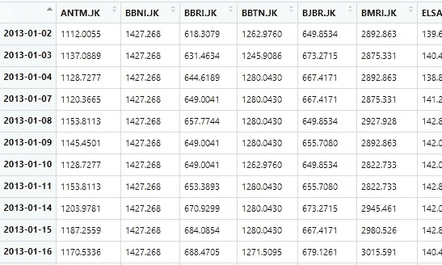
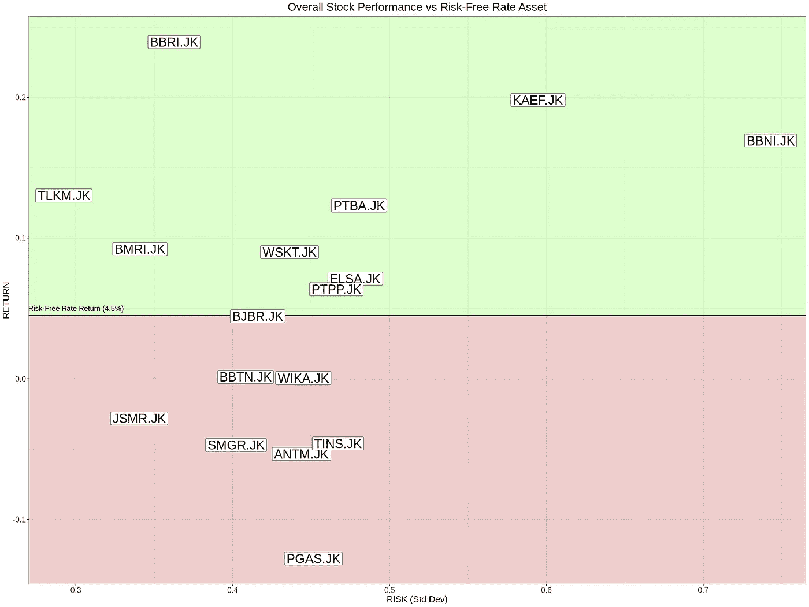
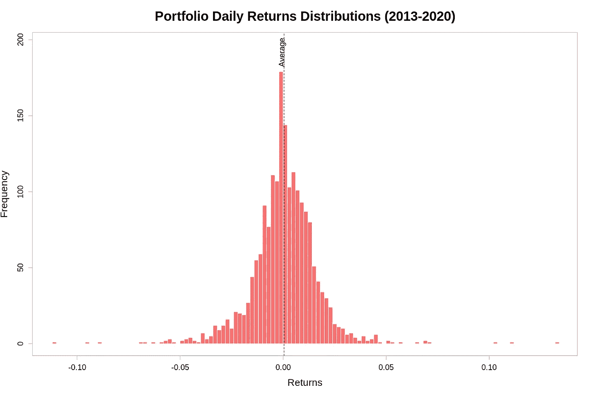
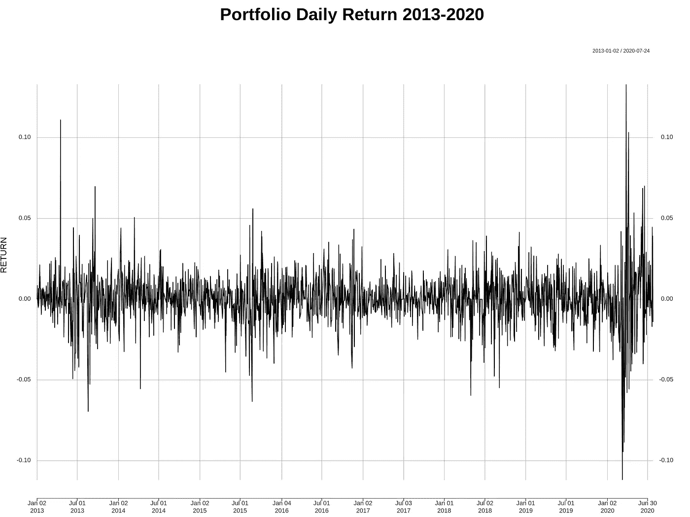

# 如何用 R 来衡量股票投资组合的表现

> 原文：<https://towardsdatascience.com/how-to-measure-stock-portfolio-performance-using-r-847c992195c2?source=collection_archive---------13----------------------->

## 利用印尼股市数据进行投资组合分析的案例研究


克里斯·利维拉尼在 [Unsplash](https://unsplash.com/s/photos/stock?utm_source=unsplash&utm_medium=referral&utm_content=creditCopyText) 上的照片

> 股票市场是人们安排买卖上市公司股票交易的地方

印尼被世界银行命名为东南亚最大的经济体*。作为世界上人口最多的四个国家之一，有超过 2 亿人生活在这个国家，印度尼西亚有着成为世界上最大的经济体之一的议价能力。印度尼西亚经济状况的良好前景使这个国家成为投资的最佳选择之一。*

*印尼股市有 600 多家上市企业，在冠状病毒爆发前仍处于上升趋势。一些上市企业是国有企业，对于这个案例研究，我将只分析 17 家国有企业，它们是最新的 IDX-布朗 20 指数的成员。*

***用于分析的股票:***

*ANTM。JK，BBNI。JK BBRI。JK BBTN。JK，BJBR。JK BMRI。JK 艾尔莎。JK，JSMR。JK，KAEF。JK PGAS。JK PTBA。JK PTPP。JK SMGR。JK，TINS。JK，TLKM。JK，WIKA。JK，WSKT。女高中生*

*本案例研究的假设是:*

1.  *股票在投资组合中的权重对每个企业都是一样的。*
2.  *基于 2013 年 1 月 1 日至 2020 年 7 月 26 日的历史调整收盘价数据的分析。*
3.  *无风险利率:4.5%*
4.  *投资组合再平衡季刊*

## *导入和准备股票数据*

*我们将使用 **getSymbols()** 函数从 **quantmod** 包中导入股票价格数据。 **getSymbols()** 函数是加载和管理来自各种来源的财务数据的特定函数，但是对于这个例子，我们将使用 *Yahoo Finance* 作为我们的数据源。*

*从 Yahoo Finance 导入股票价格数据*

*默认情况下，我们会将每个股票价格数据作为 xts 对象分配给它们的股票代码(例如:ANTM。JK 价格将存储在 ANTM。JK 变量作为 xts 对象)。为了便于分析，我们应该将所有这些独立的数据收集到一个 xts 对象中。*

*将单独的数据收集到单个 xts 对象中*

**

*图一。索引 xts 对象预览*

## *投资组合分析*

*我们已经制作了一个投资组合，它作为单个 xts 对象存储在名为 **Index** 的变量中。我们存储在该变量中的数据仍然是每个交易日的收盘价格式，因为大多数投资组合分析方法需要通过**回报**数据来提供，我们必须在进入投资组合分析之前先计算其回报。*

**

*图二。回报计算公式*

*幸运的是，在 R 中我们不必每天手动计算每只股票的回报，我们只需要调用 return。calculate()函数，它将以 xts 对象格式返回输出。*

*因为没有人能预见未来，大多数股票市场投资者在决定买哪只股票之前依赖两件事，第一是基本面分析，第二是技术分析。**基本面分析**涉及到经济和金融数据的运用(如生产、消费、可支配收入等。)来预测未来的价格，而**技术分析**主要(通常是唯一)基于对价格数据本身模式的研究。本文将只涵盖一些可用的技术分析方法。*

*对于第一个分析，我们将尝试从年化回报的回报和风险的角度来看每只股票的表现，因为投资者有时希望看到他们的投资与其风险相比是否有良好的回报，而**夏普比率**是一个可以衡量这一切的伟大计算。较高的夏普比率意味着，与投资期间的风险相比，我们的投资回报丰厚。为了计算，我们假设印度尼西亚的无风险利率为每年 4.5%。*

*如何计算 R 中的年夏普比率*

**

*图三。投资组合中每只股票的夏普比率*

***年化**是指我们每年重新计算一定时期的数字，例如 ANTM 回归。在 2013 年至 2020 年期间，JK 为-5.35%/年。我们的投资组合年化表现显示，不同股票之间存在差异。我们投资组合中表现最差的是 PGAS。JK 收益为负，期间波动太大，使得 PGAS。JK 夏普比率是其中最低的。我们投资组合中表现最好的是 BBRI。JK 显示最高的回报，最小的标准差和最高的夏普比率。*

**

*图 4。BBRI。JK 对 PGAS。JK 调整收盘价图表*

*如果我们比较我们投资组合中表现最好的*股票*和表现最差的*股票*的折线图，我们可以明显看出它们之间的差异。BBRI。JK 有更一致的运动，并且逐年稳步增加，与 PGAS 相反。JK 运动在波峰和波谷之间有一个巨大的跨度。*

*我们还可以使用 **ggplot2** 包**中的标签图，大致了解我们的股票表现与无风险利率资产(4.5%年回报率)相比如何。***

**

*图五。股票表现与无风险利率资产*

*如果我们从大的方面来看，在此期间，10 家公司非常值得投资，这意味着如果我们投资这些股票，我们将比投资无风险资产获得更多。利用这个图，我们知道多样化在投资中是多么重要，我们的一些投资会有很高的回报，但其他投资正在失去它的价值。*

*现在，我们将开始将这些股票作为一个投资组合进行分析，如果我们从 2013 年到 2020 年 7 月以相同的比例持有所有这些股票，我们将看到其表现如何。*

*首先，我们将看看我们的投资组合日收益率分布。使用这个分布，我们将看到我们的投资组合给我们带来正回报的频率，以及它失去价值的频率。*

**

*图六。投资组合日收益分布*

*每日回报分布图显示我们的投资组合在某段时间平均正回报接近于零。它可以在一天内给出超过 10%的回报，但另一方面，它也可能在一天内损失超过 10%的价值。我们将使用时间序列每日回报图来证明这一点，并找出我们的投资组合何时损失如此之大，何时获得最高回报。*

**

*图七。时间序列每日回报图*

*从时间序列图中，我们可以明显地看到我们的大部分回报将在 5%的范围内，尽管有一些异常值，最近的一次是由于冠状病毒在 2020 年上半年的影响。*

*仅使用每日回报不足以显示我们的投资组合表现如何。幸运的是，有**图表。R 中的 PerformanceSummary()** 函数将产生投资组合*累积回报、日回报和提款图*作为其输出。*

1.  **累积回报*:显示我们从投资组合中获得多少回报的时间序列图。*
2.  **每日回报*:显示我们投资组合每日回报的时间序列图。*
3.  **下降*:时间序列图显示波峰和波谷之间的距离，以及需要多长时间才能恢复其值*

```
***charts.PerformanceSummary**(Portfolio_Return, main = 'Portfolio Performance Summary')*
```

**

*图八。投资组合表现摘要图表*

*业绩摘要图表总结了我们在分析我们的投资组合在此期间的业绩时需要的所有信息。**从累积回报图来看，**我们知道我们的投资组合在 7 月 26 日之前仍将有超过 100%的回报，尽管一些股票的负回报和冠状病毒效应在很大程度上扰乱了世界上所有的股票市场活动。**从每日回报图中，我们将获得关于哪个时期我们的投资组合回报波动如此之大的信息，利用这些信息，我们可以深入了解某个时期的重大事件如何扰乱股票市场交易，并制定未来是否会有任何其他重大事件的计划。**从跌势图**、中，我们可以了解我们的投资组合在跌势中表现如何，以及它能恢复多久，这样我们就可以有一个适当的策略，如果未来跌势发生，我们如何持有股票。***

## ***摘要***

***技术分析是利用历史模式和市场统计数据来预测股票价格的变动。本文讨论了如何使用 R-计算来提取模式，并深入了解我们的投资组合在特定时期的运动和表现。***

***对于未来的投资，我们可以将分析结果作为我们将要采取的每一个行动的基础。例如，我们可以将这种分析划分为一个更小的时间段，并根据形状比率修改我们的投资组合构成。***

***还有一种方法可以根据历史数据找到我们投资组合的最佳权重。希望它能在其他文章中讨论。***

> *****注意:**只要数据源中的数据可用，我们就可以为每只股票和每个时期重建本文中的每个代码。只是试着把它改成你的投资组合构成，看看你的投资组合在某个时期表现如何。***

***[1] Schwarger，Jack.D .，& Etzkorn，M. (2017)，*期货市场完全指南*，第二版，John Wiley & Sons，Inc .，新泽西州霍博肯。***