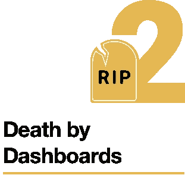
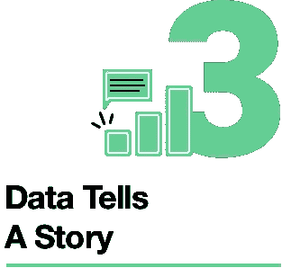
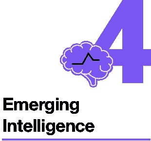
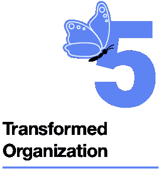

# 如何衡量您组织的数据成熟度

> 原文：<https://towardsdatascience.com/how-to-measure-your-organizations-data-maturity-2352cbaf1896?source=collection_archive---------15----------------------->

数据到人工智能成熟度量表

今天，大多数组织都在努力提高数据的使用(见我们最近的文章[为什么你的人工智能项目会失败](https://medium.com/@alexbratton/why-your-ai-project-is-going-to-fail-f03972f5b9f9))。好消息是，使用数据来提高团队的能力并为员工创造更多价值非常简单(不需要在技术上进行巨额投资，也不需要雇佣大量新技术人员)。第一步是认识到你今天在通往人工智能成熟的旅程中所处的位置——这正是*数据到人工智能剧本*中的第一个工具向你展示的。

让我们看看数据到人工智能成熟之旅的五个阶段。

## **第一阶段:手动数据处理**

我们不断听到销售管理人员讲述他们对手工数据处理的失望。销售人员正在创建他们自己的电子表格跟踪器，以跟踪他们的客户在做什么，以及他们的佣金或奖金是如何根据销售业绩形成的——这是一个对他们特别重要的数据点。这些销售人员也在处理业绩数据，并与他们的现场销售经理分享。

现场经理提取数据并分析销售代表的表现。因为他们还需要创建整个现场团队的绩效图，所以他们必须运行不同的报告(现场销售团队无权访问这些报告)，汇总信息，然后创建 PowerPoint 演示文稿以“向上”发送给他们的区域经理。

区域经理也在做同样的事情。他们查看各个地区的表现，手动创建整个地区的数据和可视化摘要，然后发送给国家领导人。依此类推……在组织中一路向上。每个级别查看他们自己的表现(出于个人原因)，然后创建一个文档来“向上”传递。

由于每个人都在创建一个独特的文档，这种手动方法缺乏一致性，导致大量时间浪费在探究具体数字是如何得出的以及验证准确性上，而不是理解数据想要告诉我们什么。

## **第二阶段:仪表盘死亡**

数据共享挑战通常通过向链中的每个个体发送更多数据来解决。BI(商业智能)是企业中最常被误用的工具之一。难怪员工生产力的死亡呼喊是…

> “如果我们可以将它加载到 BI 工具中，团队可以根据需要对其进行操作和深入研究，那么每个人都将获得相同的信息！”

不幸的是，现在组织中的每个人都需要成为分析师，才能了解他们的世界正在发生什么。这通常会鼓励影子 IT 和数据团队的创建(本地团队成员创建工具来回答他们团队在整体数据和 IT 责任链之外的许多特定问题)。

然后是神奇的“仪表板”。最初的设想是提供一个关于组织中正在发生的事情的简化视图(想想你汽车上的仪表板，上面有不到五个数据点)，仪表板迅速成为每一个可能项目的垃圾场，通常类似于航天飞机的驾驶舱，有数百个刻度盘、读数和闪烁的灯。我们见过用户导航的网站仪表板，或者创建 100 多页的幻灯片，以涵盖讨论中的每一个可以想到的问题和场景。再一次，大量的时间被浪费在创建和浏览这些工具以试图找到答案上。

手动数据处理和神奇的仪表盘都掩盖了这个成熟阶段的一个核心问题:多个不一致的真相来源。相同的答案存在于不同的系统中，组织的每个部分在不同的地方寻找答案。当数据被处理时，数据的副本被分散开来，报告作者通常会抓住最容易访问的内容，因为通常只有关键的个人知道在哪里以及如何获得事实的来源。

这就把我们带回了关于报告中的数据来自哪里的争论，因为用于生成答案的业务逻辑并不明显。

## **第三阶段:数据讲述故事**

随着组织的数字化发展，数据开始向他们的团队讲述故事。这通常始于工作重点是了解不同角色的员工成功完成工作实际需要哪些信息。这种关注简化了数据讨论，并使业务和 IT 合作为这些员工服务。

关注员工角色级别还揭示了回答最有价值的问题(我们的销售业绩如何，为什么？)需要查看和组合来自整个组织当前使用的多个系统的数据。为了防止这种情况给团队带来更多的信息过载，必须将汇总的数据分解为回答手头问题所特别需要的内容。

这种简化的、以角色为中心的方法允许将数据转化为员工的简略答案，在一个屏幕上提供他们需要的一切，以了解正在发生的事情并相应地做出更好的决策。此外，他们没有浪费时间点击无数的报告、工具和仪表板来显示所需的数据，并手动将其混合在一起。

成功实现以角色为中心的数据需要 IT 和业务部门密切合作，以了解角色的需求，并在正确的时间提供正确的答案。例如，了解各种角色的交集(即销售人员和现场销售经理)并确保有工具支持这些交互非常重要。这些工作直接影响数据在链上和链下的一致性，并确保交互的人面前有相同的信息，而不管每个角色的特定工具。

## **第四阶段:智能出现**

随着来自数据的智能开始出现，组织开始看到真正的业务成果。随着员工学习工具，提高对数据的理解，变得更加舒适，创造价值的速度开始加快。随着您在设置警报和例外方面变得越来越老练，员工应该会感觉到主动信息提供了更多支持。然而，即使你的数据提供了更多的相关信息，好的跨职能开发团队仍然是至关重要的。

在这个成熟度级别，个性化的客户体验可以成为现实。您的数据已经足够成熟，可以更好地识别个人需求，并为您的员工提供必要的工具来提高客户服务水平。这并不意味着建立更多的呼叫中心规则和程序；这只是意味着您可以更密切地衡量独特的客户，员工也可以做出相应的反应。

与直觉相反，您的团队可能开始与客户和供应商员工共享更多数据，因为您的信息现在更加可靠。根据我们的经验，您组织中从未与客户交谈过的人将开始这样做，并且自然希望分享有价值的相关信息。

如果您确实发现您的员工正在共享更多的信息，请确保您的数据治理流程正在高效地工作。例如，拥有与客户和供应商共享数据的可行指南。这包括共享哪些数据、易于理解的限制以及如何共享数据的流程。

在这一阶段，仅限于少数关键用户的限制性传统数据访问(在第 2 阶段中描述)应该会消失，员工应该普遍对根据需要访问数据感到满意。员工可以自由地在数据范围内进行调查，从而得出新颖的解决方案。

最后，随着数据成熟度的提高，改进的业务成果应该更加有形和可衡量。虽然你可能刚刚开始机器学习和其他人工智能应用，但你的员工应该已经从你的数据中获得了重大价值。你的组织积累的价值应该很高——足以暂停你的机器学习工作，并简单地收获所有团队辛勤工作的好处。

## **第五阶段:组织转型**

不管你在网上看什么，现阶段运营的机构很少。无论现在这个阶段有多么令人向往，它仍然是大多数企业的目标阶段。在这个阶段，机器学习是成熟的，你的数据是干净的，你的团队拥有广泛的数据科学技能。

您的员工使用数据代表彼此和客户开展工作。他们较少受到限制性规则和审批层级的约束，更有能力使用数据来“做正确的事情”。总的来说，组织的运作结构更加扁平化，治理的跨职能性比部门领导更强。

机器学习正在自动化低价值的重复性工作，员工能够专注于高价值的活动，特别是异常处理。他们使用算法对竞争性定价、服务、产品盈利能力、预测等进行更深入的分析。事实上，你对市场的新数据驱动观点正在改变游戏规则。

我们认为，这一阶段最困难的管理问题是使用算法来创建可能影响员工角色的新商业模式的压力。虽然这会威胁到员工，但改变从来都不容易。团队可能是多余的，不仅仅是因为被淘汰的低价值工作，而是因为你如何定价、开发产品以及如何与彼此、供应商和客户互动的变化。这些算法如何支持你的团队，并使他们能够接受新的挑战，这将是成功的关键，而不仅仅是将人们自动化出今天的流程。

## 下一步是什么？

确定您的组织在数据到人工智能成熟度曲线中的位置对于创建一个推动数据使用的计划至关重要。一旦你知道你的立场，你就可以采取行动。我们的数据到人工智能行动手册的下一步将涵盖在成熟阶段之间前进所需的内容，并保持您的数据成熟之旅向前发展。

亚历克斯·布拉顿和凯文·格林

# 关于作者:

[**亚历克斯·布拉顿**](/@alexbratton)作为 [Lextech](https://lextech.com) 的首席执行官兼首席极客，亚历克斯领导着一个创造员工体验的团队，为员工赋权并实现业务成果。他热衷于改善工作的未来，帮助组织从固定的工作场所过渡到任何地方工作。Alex 是《十亿美元应用》的作者，也是北伊利诺伊大学计算机科学的兼职教授。
[lextech.com](https://lextech.com)

[**凯文格林**](/@kevin_glynn)凯文是一名 3x 首席信息官，领导人工智能的早期工作，为数据团队带来新的工具和流程。凯文被评为 2019 年芝加哥首席信息官年度创新者。他是西北大学微软 IT 项目顾问委员会的主席。
[laminargroup.com](https://laminargroup.com)