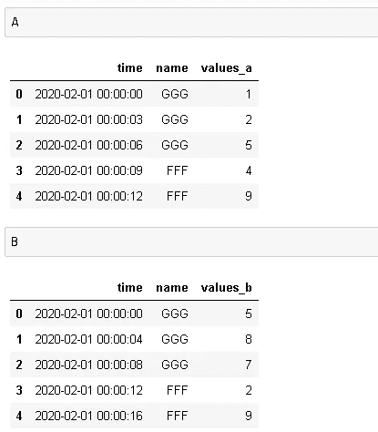
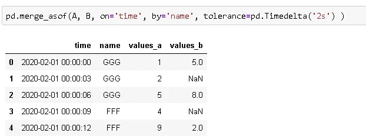
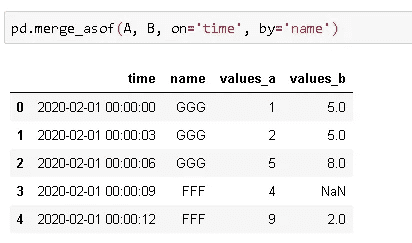
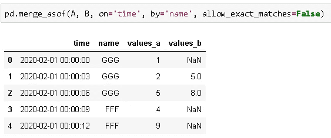

# 如何合并与熊猫“不匹配”的时间序列

> 原文：<https://towardsdatascience.com/how-to-merge-not-matching-time-series-with-pandas-7993fcbce063?source=collection_archive---------8----------------------->

## 如何使用 merge_asof 函数

由 [Djim Loic](https://unsplash.com/@loic?utm_source=unsplash&utm_medium=referral&utm_content=creditCopyText) 在 [Unsplash](https://unsplash.com/s/photos/clock?utm_source=unsplash&utm_medium=referral&utm_content=creditCopyText) 上拍摄的照片

时间序列数据有许多定义，所有这些定义都以不同的方式表示相同的含义。一个直截了当的定义是，时间序列数据包括附加到连续时间戳的数据点。

Pandas 由 Wes Mckinney 创建，旨在提供一个高效灵活的工具来处理时间至关重要的财务数据。因此，Pandas 是处理时间序列数据的一个非常好的选择。

金融数据通常包括在非常短的时间内(例如在秒级)进行的测量。因此，当我们合并两个由时间序列数据组成的数据帧时，我们可能会遇到测量值相差一两秒的情况。对于这种情况，熊猫提供了一种由 **merge_asof** 完成的“智能”合并方式。

假设我们正在合并数据帧 A 和 B。如果左侧数据帧(A)中的一行在右侧数据帧(B)中没有匹配的行， **merge_asof** 允许获取其值接近左侧数据帧(A)中值的一行。

> 左和右是根据函数中参数的顺序定义的。pd.merge_asof (A，B，…)表示 A 是左边的那个。

“亲近”是有一些限制的。根据“on”参数指定的列进行比较，右数据帧(B)中的值必须小于左数据帧(A)中的值。简单解释一下，merge_asof 的意思是:

> **没有匹配的，取前面的。**

当我们看一些例子时，它会更有意义。

样本 A 和 B 数据帧如下:

我们想按“名称”列合并“时间”上的这些数据帧，但一些时间值不匹配。例如，在第二行中，A 中的时间比 b 中的时间晚一秒，假设我们可以容忍 2 秒的延迟。

在这种情况下，可以使用 **merge_asof** :

*   第一行:时间匹配，因此根据行索引取值。
*   第二行:左侧数据帧(A)上的时间为 00:00:03，但右侧数据帧(B)此时没有值。因此，merge_asof 会查看前面的步骤，如果在指定的时间间隔(2 秒)内有一个值，它会将最后一个值放入合并的数据帧中。在时间 00:00:00 只有一个先前值，它落后 3 秒，因此不在指定的时间内。因此，values_b 列这次用 NaN 填充。
*   第三行:左侧数据帧(A)上的时间是 00:00:06。右数据帧(B)在这一秒没有值，但它在 00:00:04 有一个值，该值在指定的内部时间内，因此 merge_asof 获取该值并放入合并的数据帧中。
*   第四行:这一行很重要，所以请密切注意。左侧数据帧(A)上的时间是 00:00:09。右侧数据帧(B)此时没有值，但在指定时间间隔内的 00:00:08 时有值。但是，“名称”列也必须匹配，因为我们是按“名称”列合并的。由于名称不同，merge_asof 不接受该值，因此 values_b 列用 NaN 填充该行。
*   第 5 行:两个数据帧都有时间值 00:00:12，并命名为 FFF。

如果我们不指定时间间隔，merge_asof 将查找前一个时间间隔，而不考虑时差。

当时间间隔为 2 秒时，values_b 为 NaN。如果没有指定的时间间隔，则用之前的值 5 填充。

Merge_asof 还提供了一个排除精确匹配的选项。如果 allow_exact_matches 设置为 False，merge_asof 仅在右侧数据帧中查找以前的值，匹配行中的值不会放入合并的数据帧中:

测量时间的方法是无限的，因为我们可以精确到纳秒。根据不同的任务，我们可以选择最佳的测量频率。Merge_asof 允许我们在匹配时间序列或者有序数据时有一定的余地。

感谢阅读。如果您有任何反馈，请告诉我。