# 如何用 R 建模一个社交网络

> 原文：<https://towardsdatascience.com/how-to-model-a-social-network-with-r-878b3a76c5a1?source=collection_archive---------11----------------------->

## 网络理论实用介绍


由 [Unsplash](https://unsplash.com?utm_source=medium&utm_medium=referral) 上的 [Clarisse Croset](https://unsplash.com/@herfrenchness?utm_source=medium&utm_medium=referral) 拍摄的照片

使用网络来表示我们的数据给了我们一个视角，通过这个视角，问题往往变得更容易解决。当我们有兴趣了解更多关于连接对象之间的交互时，网络特别有用。一些典型的用例包括通信渠道的分析，流行病传播的建模，或者一群人内部的社会互动的研究。

在本文中，我们将看看我们通常如何表示网络数据。

# 什么是网络？

> [非正式地说，图是由一组线或箭头连接起来的一组节点。](https://www.cl.cam.ac.uk/teaching/1011/PrincComm/slides/graph_theory_1-11.pdf)

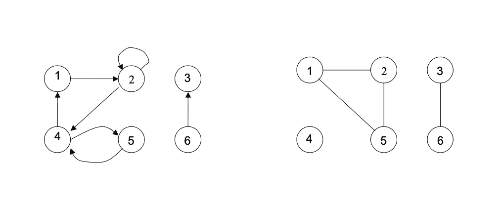

[资料来源:剑桥大学，通信原理课程材料(2010-11)，网络理论介绍，幻灯片 2](https://www.cl.cam.ac.uk/teaching/1011/PrincComm/slides/graph_theory_1-11.pdf)

图形是抽象的数学结构。当我们将现实世界的场景映射到这个结构上时，我们称之为网络。您可能会听到“图形”和“网络”这两个词可以互换使用。

这是一个用来展示人与人之间长期互动的网络示例:

在建立网络模型时，我们会考虑三个主要因素:

*   **节点**
*   **链接**
*   以及它们的**属性**

## 节点

节点是网络中的点(在[图论](https://en.wikipedia.org/wiki/Graph_theory)中也称为[顶点](https://en.wikipedia.org/wiki/Vertex_(graph_theory)))。它们代表了我们想要建模的实体。让我们以一个社交网络为例，其中每个节点模拟一个人。

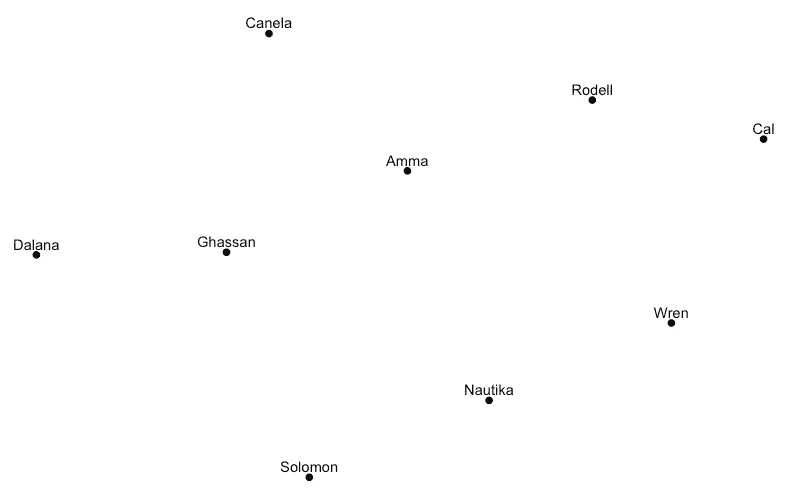

样本社交网络中的节点

## 链接

链接是连接节点的线(在图论中称为边)。它们代表了我们想要在网络中的实体(节点)之间建模的连接。我们可以画出链接来显示在这个网络上谁是谁的朋友。

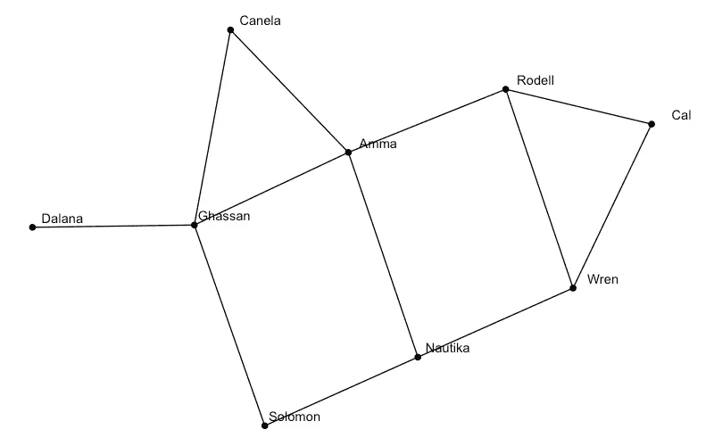

示例社交网络(节点+链接)

## 属性

属性给了我们更多关于网络的信息。在我们的社交网络中，**节点属性**描述了系统中的个体，包括年龄、姓名、性别等细节。

**链接属性**描述了两个人之间的联系。例如，它可以显示关联的强度，或者表明人与人之间的关系类型。

我们可以用不同的颜色或尺寸在网络上显示这些属性。

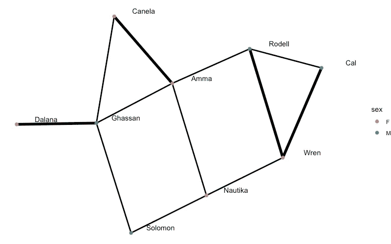

带有属性的示例社交网络。在这个例子中，链接的大小表示个体之间关联的强度。

# 我们如何代表一个网络？

既然我们已经介绍了网络的基础知识，那么让我们来看看几种常见的表示网络数据的方法。

## 邻接矩阵

> 邻接矩阵是二维正方形阵列，其中行和列由图中的节点索引。矩阵的元素不是零就是一…

简单地说，邻接矩阵是一种在表格中表示网络的方式。我们的社交网络中的每个人(节点)都在表格的一行和一列中表示。我们对行和列保持相同的顺序。例如，如果我们的第一行是“*卡内拉*，那么我们的第一列也将是“*卡内拉*”。

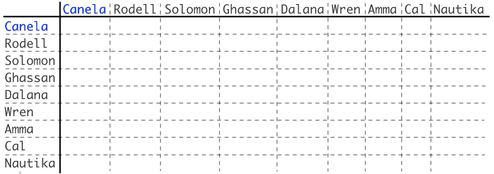

示例(空)邻接矩阵-由节点名称索引的列和行

表中的条目显示两个节点之间是否存在链路:

*   **行 *Ghassan* 中的 1** ，列 *Canela* 表示这两者之间有联系。
*   **0** 表示两个节点之间没有链接。

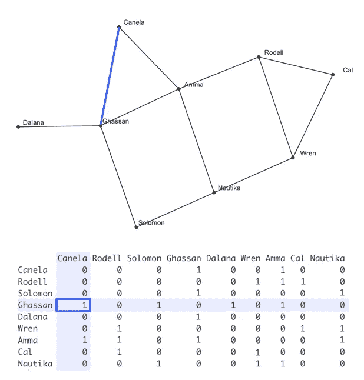

让我们假设我们想要指出人们相互交往的频率。我们可以将此视为链接属性(它告诉我们关于两个节点之间的连接的一些信息)。在网络上，我们可以用链接的相对粗细来表示这一点，其中较粗的链接意味着更频繁的交互。

我们可以通过在网络中使用除 **1** 以外的数字在邻接矩阵中显示这一点。在我们的例子中，数字越大，那对人之间的互动越有规律。当表中的值不是二进制(不是 1 或 0)时，我们说我们的矩阵是“加权的”。

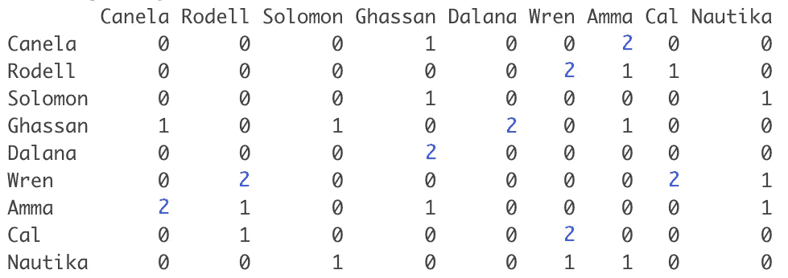

加权链接-网络的邻接矩阵表示，上面呈现了链接属性。注意重量为 **2** 的连杆被画得更粗。

邻接矩阵是一个受欢迎的选择，因为它使大型图形易于分析。举以下例子:

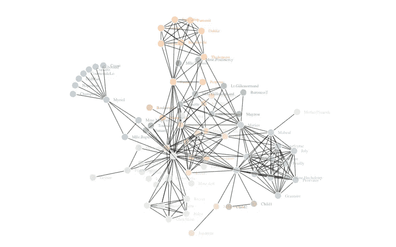

悲惨世界人物网络

在这种情况下，我们可以对网络的邻接矩阵进行简单的计算，以快速识别网络的[属性](https://en.wikipedia.org/wiki/Network_science#Network_properties)。

然而，在 IDE 中创建这些网络时，更常见的选择是用两个**单独的表**来表示网络。

## 单独的表格

在创建要显示的网络结构时，我们通常使用两个表的格式——一个用于节点，另一个用于边。

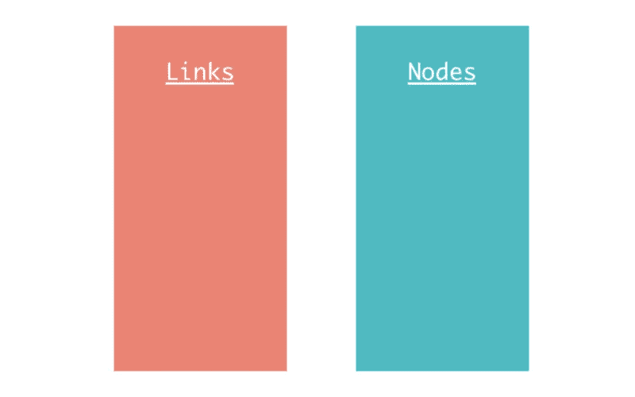

两个独立的表用于描述一个网络。链接表和节点表。

节点表:

*   包含网络中所有唯一节点的列表
*   第一列通常是每个节点的唯一标识符
*   我们可以为节点属性添加其他列

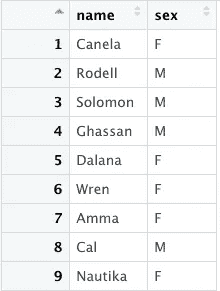

节点表，带有性别属性(男性/女性)

链接表:

*   包含网络中所有链路的列表
*   一列显示每个链接从哪个节点开始
*   一列指示链接在哪个节点结束
*   我们可以为链接属性添加其他列

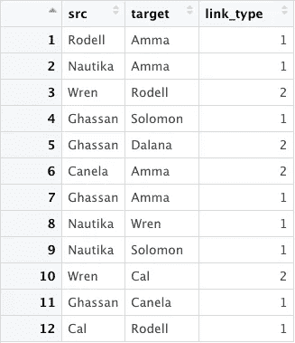

具有“链接类型”属性的链接表

现在我们已经介绍了基础知识，让我们看看如何在 r 中创建一个网络。

# 用 R 创建一个网络

我们将尝试复制上面创建的示例。我们的目标是创建一个由九个人组成的小型社交网络，他们随机连接在一起。对于本例，我们将采用使用两个单独的表来创建网络的方法。在添加属性时，两个表为我们提供了更大的灵活性。在我们开始之前，让我们将任务分解成一步一步的组成部分。

1.  加载所需的库。
2.  创建一个随机节点列表。我们将使用该名称作为每个节点的唯一 id。
3.  创建一个链接表。我们将从节点列表中随机选择每个链接的起点和终点。
4.  绘制我们的网络。
5.  向图中添加属性。

## 加载库

在开始之前，我们需要加载所需的库。这些功能使我们能够创建自己的网络。在我们的例子中，我们将使用以下内容:

*   [**tidy verse**](https://www.tidyverse.org)**:**这是一个用来操作和绘制数据的包的集合——R 开发者工具包中的一个标准。
*   [**ggraph**](https://www.rdocumentation.org/packages/ggraph/versions/2.0.3) :我们将要用来绘制我们的网络的库。
*   **t**[**idy graph**](https://www.rdocumentation.org/packages/tidygraph/versions/1.2.0)**:**用于创建一个“表格图形”对象，一种我们可以很容易转换成网络的格式
*   [**婴儿名字**](https://www.rdocumentation.org/packages/babynames/versions/1.0.0) :库包含了 SSA 提供的 1980 年到 2017 年间的婴儿名字列表。我们将使用它来为网络中的节点选择随机名称。

```
library(tidyverse)
library(ggraph)
library(tidygraph)
library(babynames)
```

## 创建节点表

我们想从我们放入环境的婴儿名字数据中得到 9 个随机的名字。我们首先看一下数据的结构，如下所示:

```
head(babynames)
```

这将返回婴儿姓名表的前 6 行。我们利用这一点来了解数据的结构:

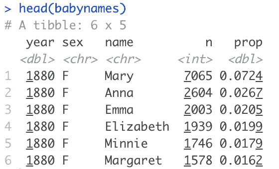

这里我们可以看到，我们有一个名字、性别和一些其他变量的列表，这些变量可能不会直接应用到我们的用例中。这种结构表明，名称每年重复出现，并且 *prop (* proportion)和 *n (number)* 的值不同。

我们想确保我们随机抽取的名字是唯一的。快速检查显示，婴儿姓名表中有 1，924，665 行。虽然两次抽中同一个名字的几率很低，但还是有可能的。这告诉我们，我们的解决方案将需要包括一些东西，以确保我们在最后的抽签中没有重复。

要获得一个唯一的随机名称列表，最好是编写一个小函数，我们可以重用它来生成一个大小为 *n* 的节点列表(我们将来可能想要绘制一个更大的网络)。

下面是我们可以采取的步骤的概要:

1.  过滤表格以删除任何重复的名称
2.  从 1 到我们过滤后的表中的行数之间随机选择一个 *n* 的数字样本(没有替换——意味着一旦一个数字被抽取，就不能再被抽取)
3.  从过滤后的表中，取出由我们选择的随机数索引的行
4.  返回这些行—这将是我们的节点表

下面是我们如何在 R 中实现这一点:

```
get_random_names <- function(n) { 
  unique_babynames <- distinct(babynames, name, .keep_all = TRUE) 
  index <- sample(1:nrow(unique_babynames), n, replace = FALSE) 
  names <- unique_babynames[index, ] 
  names 
}nodes <- get_random_names(9)
```

## 创建链接表

为了创建链接表，我们将首先分别考虑源列和目标列。从 source 列开始，我们得到一个从 1 到 9 的随机数字样本(因为只有 9 个节点)。这一次，我们用替换的对**进行采样，因为每个节点可以连接多个链接。我们对目标列重复相同的过程。在 R 中:**

```
source <- sample(1:nrow(nodes), nrow(nodes)*2, replace = TRUE)  
target <- sample(1:nrow(nodes), nrow(nodes)*2, replace = TRUE)
```

这给了我们一对列表，如下所示:

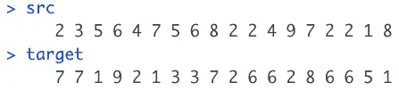

随机生成的源向量和目标向量

然后，我们将这两个列表粘在一起，得到我们的链接表(或数据框):

```
links <- data.frame(src, target)
```

看起来是这样的:

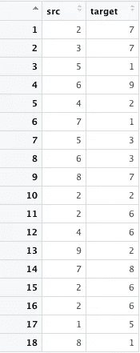

一旦我们有了这张桌子，就该稍微清理一下了。在绘制我们的网络之前，我们需要考虑几个案例。

1.  将节点连接到自身的链接——这在某些用例中有意义，但在我们的社交网络中没有意义。这里，我们可以通过过滤掉链接表中源值和目标值不匹配的行来实现。
2.  重复链接—我们不希望在相同的两个节点之间绘制两次链接，因为如果我们决定将链接属性添加到我们的图形中，这可能会导致一些麻烦。在它继续绘制我们的网络之前，我们可以很容易地解决这个问题。

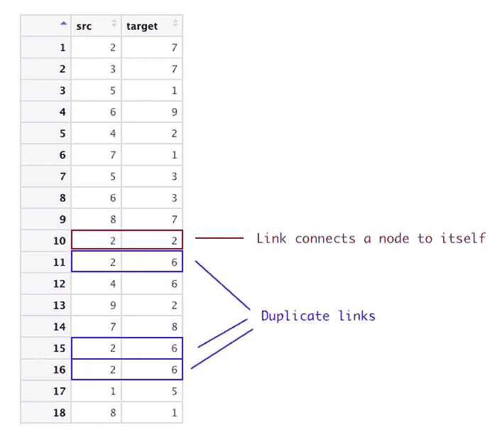

```
links <- data.frame(src, target) %>%  
  filter(!(src == target)) links <- unique(links[c("src", "target")]) 
```

关于我们应该画多少个链接，这将取决于你希望你的网络的连接程度。在本例中，我们在删除冗余链接之前，任意创建两倍于节点数量的链接。

## 用图形绘制网络

准备好节点和链路表后，我们就可以开始绘制网络了。在将表传递给创建列表的函数之前，我们还需要完成最后一步。

在我们将这些表格传递给绘图函数之前，我们只需要确保它们的格式正确，以便 ggraph 包进行解释。这里，我们将独立的表转换成一个名为 tbl_graph 的对象。

```
social_net_tbls <- tbl_graph(nodes = nodes, 
                             edges = links, 
                             directed = FALSE)
```

现在，我们准备开始绘图。ggraph 包遵循与其他流行绘图包相同的图形语法原则。基本的想法是，我们建立我们的图形层。 [**这篇文章**](https://medium.com/tdebeus/think-about-the-grammar-of-graphics-when-improving-your-graphs-18e3744d8d18) 很好地解释了这个概念。在我们的示例中，我们按照以下顺序对网络进行分层:

1.  我们从数据开始(我们刚刚创建的 *tbl_graph* 对象)
2.  选择我们图表的布局
3.  指定属性——被称为*美学映射*的一部分
4.  添加节点，名称为文本，然后链接层-称为*几何*
5.  修改主题(改变背景颜色)

在 R 中:

```
social_net <- ggraph(social_net_tbls, layout = "stress") +                                                                                                         
  geom_node_point(size = 2) +                                         
  geom_node_text(aes(label = name), nudge_y = 0.05, nudge_x = 0.2)+ 
  geom_edge_link() +
  theme_void()
```

将所有这些整合在一起:

# 奖金👀

干得好，文章写到这里。关于这个话题，我还有一件事要分享。


虽然 ggraph 在渲染网络时提供了简单性和灵活性，但在视觉美学方面，还有另一个包值得一提— [**networkD3**](https://www.rdocumentation.org/packages/networkD3/versions/0.4) 。[networkd 3 包](https://www.rdocumentation.org/packages/networkD3/versions/0.4)将一些 [Java Script](https://d3js.org/) D3 的功能扩展到 R 程序员。我们可以使用与上图相同的链接和节点表来生成这个网络。

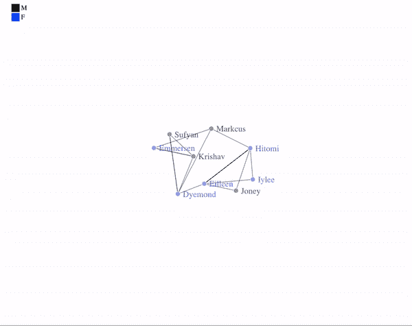

网络 3 的几个优点是:

1.  它是交互式的——你可以放大和缩小，拖动节点，在悬停时添加显示/隐藏选项，等等
2.  与图形网络相比，它们开箱后看起来更好

主要的缺点是不容易定制。为了充分利用 networkD3 的定制选项，需要精通 JS。

## 有用的链接

*   你可以在 [github **这里**](https://github.com/AymanBari/sample_networks) 查看完整的项目。
*   这篇文章包含了一个动画网络的例子，它是用 ggraph 和 ganimate 包创建的。

[](/will-covid-19-overwhelm-our-healthcare-systems-f5bc49bc77a2) [## 基本生殖数字对新冠肺炎和医疗保健意味着什么

### 新冠肺炎会压垮我们的医疗系统吗？

towardsdatascience.com](/will-covid-19-overwhelm-our-healthcare-systems-f5bc49bc77a2) 

*   Github 回购。对于简单的动画图形[这里的](https://github.com/AymanBari/tree_animation)****。****

# **参考**

1.  **剑桥大学。(2010–11).网络理论导论。【在线】。可用:[https://www . cl . cam . AC . uk/teaching/1011/princcom/slides/graph _ theory _ 1-11 . pdf](https://www.cl.cam.ac.uk/teaching/1011/PrincComm/slides/graph_theory_1-11.pdf)**
2.  **麻省理工学院。乌勒、布雷斯勒。数据科学和大数据分析:做出数据驱动的决策:网络和图形模型；代表一个网络。访问时间:2020 年 6 月 21 日。【在线】。**