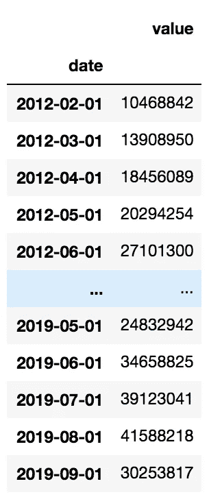
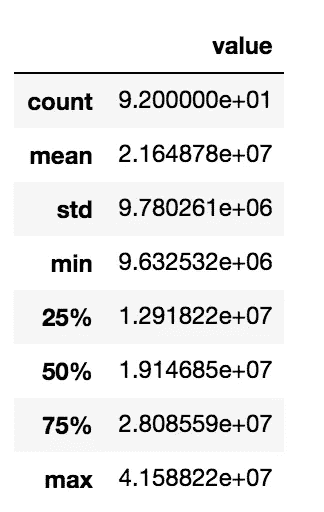
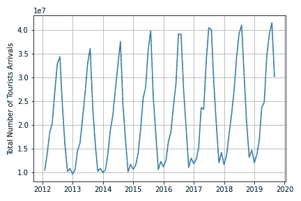
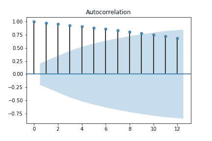
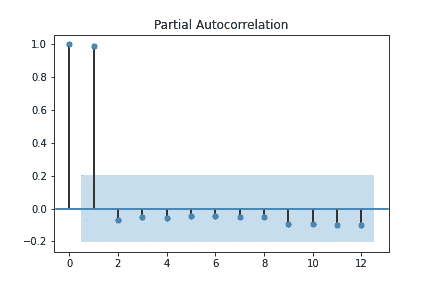
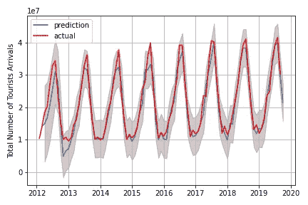

# 如何通过 SARIMA 模型对时间序列建模

> 原文：<https://towardsdatascience.com/how-to-model-a-time-series-through-a-sarima-model-e7587f85929c?source=collection_archive---------15----------------------->

## *季节性时间序列建模教程。*


来自 [Pixabay](https://pixabay.com/it/?utm_source=link-attribution&utm_medium=referral&utm_campaign=image&utm_content=158601) 的[openclipbart-Vectors](https://pixabay.com/it/users/OpenClipart-Vectors-30363/?utm_source=link-attribution&utm_medium=referral&utm_campaign=image&utm_content=158601)

在本教程中，我将向你展示如何通过 SARIMA 模型对季节性时间序列进行建模。

[在这里](https://github.com/alod83/papers/blob/master/jsit_covid-tourism/SARIMA%20Model/SARIMA%20IT%20Tourists%20Arrivals.ipynb)你可以下载本教程中描述的代码的 Jupyter 笔记本。

# 入门指南

## 将数据集转换为时间序列

在这个例子中，我们将使用到达意大利的游客数量。数据摘自[欧洲统计:旅游业年度数据](https://ec.europa.eu/eurostat/web/tourism/data/database)。首先，我们导入与 2012 年至 2019 年 10 月抵达意大利的外国游客相关的数据集，然后将其转换为时间序列。

为了执行到时间序列的转换，需要两个步骤:

*   包含日期的列必须转换为 datetime。这可以通过函数`to_datetime()`来完成，该函数将字符串转换成日期时间。
*   将 dataframe 的索引设置为包含日期的列。这可以通过应用于数据帧的函数`set_index()`来完成。

```
import pandas as pddf = pd.read_csv('../sources/IT_tourists_arrivals.csv')
df['date'] = pd.to_datetime(df['date'])
df = df[df['date'] > '2012-01-01']
df.set_index('date', inplace=True)
```



通过`describe()`函数，我们可以得到一些与时间序列相关的有用的统计数据。

```
df.describe()
```



# 初步分析

## 绘制时间序列以检查季节性

初步分析包括对时间序列的直观分析，以了解其总体趋势和行为。首先，我们创建时间序列，并将其存储在变量`ts`中。

```
ts = df['value']
```

然后，我们绘制出`ts`趋势。我们使用 Python 提供的`matplotlib`库。

```
import matplotlib.pylab as plt
plt.plot(ts)
plt.ylabel('Total Number of Tourists Arrivals')
plt.grid()
plt.tight_layout()
plt.savefig('plots/IT_tourists_arrivals.png')
plt.show()
```



# 计算模型的参数

## 调整模型

我们建立了一个 SARIMA 模型来表示时间序列。SARIMA 是季节性自回归综合移动平均线的缩写。它由 AR 和 MA 两个模型组成。该模型由三个参数定义:

*   d =所涉及的一阶差分的程度
*   p = AR 部分的顺序
*   q =移动平均部分的阶数。

p 的值可以通过 ACF 图来确定，ACF 图显示了测量观察值与其前一个观察值之间关系的自相关。d 的值是积分的阶数，可以计算为使时间序列稳定所需的变换次数。q 值可以通过 PACF 图来确定。

为了确定`d`的值，我们可以执行 Dickey-Fuller 测试，该测试能够验证时间序列是否平稳。我们可以使用包含在`statsmodels`库中的`adfuller`类。我们定义一个名为`test_stationarity()`的函数，如果时间序列为正，则返回 True，否则返回 False。

```
from statsmodels.tsa.stattools import adfullerdef test_stationarity(timeseries):

    dftest = adfuller(timeseries, autolag='AIC')
    dfoutput = pd.Series(dftest[0:4], index=['Test Statistic','p-value','#Lags Used','Number of Observations Used'])
    for key,value in dftest[4].items():
        dfoutput['Critical Value (%s)'%key] = value

    critical_value = dftest[4]['5%']
    test_statistic = dftest[0]
    alpha = 1e-3
    pvalue = dftest[1]
    if pvalue < alpha and test_statistic < critical_value:  # null hypothesis: x is non stationary
        print("X is stationary")
        return True
    else:
        print("X is not stationary")
        return False
```

当时间序列变得稳定时，我们通过`diff()`函数对时间序列进行多次变换。

```
ts_diff = pd.Series(ts)
d = 0
while test_stationarity(ts_diff) is False:
    ts_diff = ts_diff.diff().dropna()
    d = d + 1
```

为了计算 p 和 q 的值，我们可以分别画出 ACF 和 PACF 图。我们可以使用`statsmodels`库中的`plot_acf()`和`plot_pacf()`函数。p 值对应于 ACF 图中置信区间之外的最大值(以浅蓝色显示)。在我们的例子中，正确的 p = 9。

```
from statsmodels.graphics.tsaplots import plot_acf, plot_pacf
plot_acf(ts_trend, lags =12)
plt.savefig('plots/acf.png')
plt.show()
```



类似地，q 的值对应于置信区间之外的 PACF 图中的最大值(显示为浅蓝色)。在我们的例子中，q 的正确值= 1。

```
plot_pacf(ts_trend, lags =12)
plt.savefig('plots/pacf.png')
plt.show()
```



# 建立萨里玛模型

## 如何训练萨里玛模型

现在我们已经准备好构建 SARIMA 模型了。我们可以使用`statsmodels`库提供的`SARIMAX`类。我们拟合模型，通过`get_prediction()`函数得到预测。我们还可以通过`conf_int()`函数检索置信区间。

```
from statsmodels.tsa.statespace.sarimax import SARIMAXp = 9
q = 1
model = SARIMAX(ts, order=(p,d,q))
model_fit = model.fit(disp=1,solver='powell')

fcast = model_fit.get_prediction(start=1, end=len(ts))
ts_p = fcast.predicted_mean
ts_ci = fcast.conf_int()
```

我们绘制结果。

```
plt.plot(ts_p,label='prediction')
plt.plot(ts,color='red',label='actual')
plt.fill_between(ts_ci.index[1:],
                ts_ci.iloc[1:, 0],
                ts_ci.iloc[1:, 1], color='k', alpha=.2)plt.ylabel('Total Number of Tourists Arrivals')
plt.legend()
plt.tight_layout()
plt.grid()
plt.savefig('plots/IT_trend_prediction.png')
plt.show()
```



# 计算一些统计数据

## 检查模型的性能

最后，我们可以计算一些统计数据来评估模型的性能。我们通过`scipy`库提供的`pearsonr()`函数计算皮尔逊系数。

```
from scipy import stats
stats.pearsonr(ts_trend_p[1:], ts[1:])
```

我们还计算了 R 平方度量。

```
residuals = ts - ts_trend_p
ss_res = np.sum(residuals**2)
ss_tot = np.sum((ts-np.mean(ts))**2)
r_squared = 1 - (ss_res / ss_tot)
r_squared
```

# 吸取的教训

在本教程中，我已经演示了如何通过 SARIMA 模型对时间序列进行建模。概括地说，你应该遵循以下步骤:

*   将数据框转换为时间序列
*   计算 p、d 和 q 的值以调整 SARIMA 模型
*   用计算出的 p、d 和 q 值建立 SARIMA 模型
*   测试模型的性能。

对拟议模型的改进可以包括将时间序列分成两部分:训练集和测试集。通常，训练集用于拟合模型，而测试集用于计算模型的性能。

# 文献学

*   [时间序列分解分析的可视化指南](https://medium.com/better-programming/a-visual-guide-to-time-series-decomposition-analysis-a1472bb9c930)
*   [时间序列的一个例子](https://github.com/arshren/TimeSeries/blob/master/Stock%20Price%20APPL.ipynb)
*   [ARIMA 模型 Python 示例—时间序列预测](/machine-learning-part-19-time-series-and-autoregressive-integrated-moving-average-model-arima-c1005347b0d7)
*   [ARIMA 模型预测不丹布姆唐的国际游客量](https://iopscience.iop.org/article/10.1088/1742-6596/1039/1/012023/pdf)
*   [Python 中的增强 Dickey-Fuller 测试](http://www.insightsbot.com/augmented-dickey-fuller-test-in-python/)
*   [汽车 ARIMA 使用金字塔 ARIMA Python 包](https://datafai.com/auto-arima-using-pyramid-arima-python-package/)
*   [Python 中 t 检验的置信区间(均值之间的差异)](https://stackoverflow.com/questions/31768464/confidence-interval-for-t-test-difference-between-means-in-python)
*   [从数据中提取季节性和趋势:使用 R 分解](https://anomaly.io/seasonal-trend-decomposition-in-r/index.html)
*   [如何用 Python 创建时间序列预测的 ARIMA 模型](https://machinelearningmastery.com/arima-for-time-series-forecasting-with-python/)
*   [如何使时间序列平稳？](https://www.researchgate.net/post/How_can_I_make_a_time-series_stationary)
*   [如何用 Python 中的差分变换去除趋势和季节性](https://machinelearningmastery.com/remove-trends-seasonality-difference-transform-python/)
*   [如何在 Python 中调优 ARIMA 参数](https://machinelearningmastery.com/tune-arima-parameters-python/)
*   [非季节性 ARIMA 车型](https://otexts.com/fpp2/non-seasonal-arima.html)
*   [解读偏自相关函数(PACF)](https://support.minitab.com/en-us/minitab/18/help-and-how-to/modeling-statistics/time-series/how-to/partial-autocorrelation/interpret-the-results/partial-autocorrelation-function-pacf/)
*   [使用扩展的 Dickey-Fuller 测试进行平稳性测试](https://medium.com/wwblog/stationarity-testing-using-the-augmented-dickey-fuller-test-8cf7f34f4844)
*   [信号和噪音](http://people.fisica.uniroma2.it/~solare/en/wp-content/uploads/2018/12/Lez_12_Noises.pdf)
*   [时间序列分解](http://course1.winona.edu/bdeppa/FIN%20335/Handouts/Time_Series_Decomposition.html#multiplicative-decomposition)
*   [时间序列预测:使用 Python 的基本介绍。](https://medium.com/@stallonejacob/time-series-forecast-a-basic-introduction-using-python-414fcb963000)
*   [Python 中的时间序列分析—包含示例的综合指南](https://www.machinelearningplus.com/time-series/time-series-analysis-python/)
*   [Python 时间序列预测案例研究:波士顿每月武装抢劫案](https://machinelearningmastery.com/time-series-forecast-case-study-python-monthly-armed-robberies-boston/)
*   [使用 SARIMAX 的时间序列预测](https://medium.com/datadriveninvestor/time-series-prediction-using-sarimax-a6604f258c56)
*   [了解 ARIMA 并调 P、D、Q](https://www.kaggle.com/sumi25/understand-arima-and-tune-p-d-q)

​