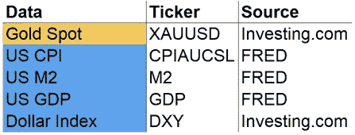

# 如何对黄金价格建模

> 原文：<https://towardsdatascience.com/how-to-model-gold-price-940e809ac665?source=collection_archive---------26----------------------->

## [现实世界中的数据科学](https://towardsdatascience.com/data-science-in-the-real-world/home)

## 利用领域知识和监督学习模型理解和预测黄金价格

由[德米特里·德米德科](https://unsplash.com/@wildbook?utm_source=unsplash&utm_medium=referral&utm_content=creditCopyText)在 [Unsplash](https://unsplash.com/s/photos/gold?utm_source=unsplash&utm_medium=referral&utm_content=creditCopyText) 上拍摄的照片

在本文中，我将通过依次介绍以下内容，向您展示一个非常简单但功能强大的黄金价格模型:

*   黄金的历史和当前用途；
*   理论上影响黄金价格的因素；
*   用于预测黄金价格的回归模型:
*   回归模型在投资决策中的应用。

对于忙碌的读者，文章还提供了 TL；附录中的博士，连同免责声明，浓缩 Jupyter 笔记本，和源列表。

照片由 [Unsplash](https://unsplash.com/s/photos/gold?utm_source=unsplash&utm_medium=referral&utm_content=creditCopyText) 上的[霍尔格连杆](https://unsplash.com/@photoholgic?utm_source=unsplash&utm_medium=referral&utm_content=creditCopyText)拍摄

# 1.我们为什么需要黄金？

公元前 3600 年左右，古埃及首次冶炼出黄金。300 年后，第一枚金币在土耳其西部的一个古代王国铸造，从此被强大的王国作为一种实物货币。

在现代，黄金已经从实物货币演变为货币储备。1819 年，英国通过将其货币与黄金挂钩，正式采用了有史以来第一个金本位制。到 1900 年，除了中国，大多数国家都采用了金本位制。然而，当第一次世界大战开始时，由于许多国家需要印刷钞票来支付战争费用，金本位最终消失了。

今天，黄金在我们的生活中有多种用途，如造币、珠宝、电子和牙科治疗。然而，货币政策和金融需求的影响会对黄金价格产生更大的影响。

# 2.有哪些因素可以影响金价？

理论上，有很多基本面、宏观面和情绪因素会影响金价。在基本面方面，央行、珠宝买家和交易所交易基金对实物黄金有需求，而在宏观空间，则有通胀、利率、货币供应和美元走强。此外，一些交易员跟踪 CFTC 净头寸数据，以判断投机者的情绪。

每个因素理论上如何影响金价？

基本面因素的影响是最容易理解的。政府和人民购买的黄金越多，市场上的黄金就越少，价格就会攀升。

在宏观空间中，通货膨胀(通货紧缩)率是衡量一篮子商品和服务价格上涨(下降)的指标。如果通货膨胀率上升，我们的午餐和黄金价格也会上涨。相反，如果利率上升，作为投资工具的黄金相对于美国国债就变得没有吸引力了。就像巴菲特说的，黄金是不下蛋的母鸡。

> “如果你永远拥有一盎司黄金，那么你还拥有一盎司黄金。”—沃伦·巴菲特

最重要的因素之一是货币供应量，它衡量一个经济体中可用的货币总量。让我们举两个例子来解释为什么货币供应量的增加会提高黄金价格。

1.  想象一下，你和你的朋友们组成了一个小型经济体，他们同意用你的垄断资金互相买卖黄金。如果你开始在你的车库里印大富翁的钱，并开始从你的朋友那里购买所有的黄金，那么相对于你的大富翁的黄金价格将会攀升。换句话说，如果美联储开始印刷成吨的美元，黄金相对于美元的价格可以攀升。
2.  再想象一下你和你的朋友们使用美元进行贸易的小型经济体。如果你印钱并给每个人免费的钱，商品和服务的价格会上涨，因为免费的钱会被用来购买额外的商品和服务。货币供应量的增加最终会导致通货膨胀率的上升，因此黄金价格会上涨。

最后但同样重要的是，美元的强势会影响黄金和任何其他以美元计价的商品的价格。如果美元变弱，其他国家可以购买更多的美元，然后购买更多的黄金，推高金价，以及其他商品，只要它们以美元报价。

# 3.我们如何对黄金价格建模？

为了对黄金价格建模，我们首先收集输入数据并应用数据转换。利用转换后的数据，我们使用线性回归模型来解释预测因素和黄金价格之间的关系。为了验证模型，进行样本外回测，并计算 R 值来衡量模型的性能。

## 3.1 数据收集

为了准备分析和模型开发，收集并清理了自 1981 年以来的以下数据:

*   XAUUSD:黄金现货价格以美元计价。
*   美国 CPI:该指数跟踪城市消费者支付的商品和服务价格的变化(即通货膨胀率)。
*   美国 M2:货币供应包括现金、支票存款和容易兑换的货币。
*   美国 GDP:这一特色指标衡量美国经济产出的规模。
*   美元指数:追踪美元相对于一篮子外币价值的指数。

输入数据和来源

数据的一个显著挑战是，这些因素在不同的频率下被观察到。为了调整频率，这些值按季度分组，然后取平均值。

## 3.2.数据转换和特征工程

## 3.2.1.目标变量

该模型的目标变量是经通胀调整后的黄金现货价格。为了通过通货膨胀来调整黄金现货价格，我们通过美国 CPI 来紧缩黄金现货时间序列。今后，这个经通胀调整的黄金时间序列将被称为“黄金现货价格”、“黄金价格”或“XAUUSD”。

## 3.2.2.预言者

这个回归模型有两个预测指标:货币供应量与国内生产总值(M2/国内生产总值)的比率和美元指数。虽然美元指数可以保持不变，但我们需要用美国 M2 除以美国 GDP 来得出这个比率。货币供应量与 GDP 的比率比货币供应量更受青睐，因为它是衡量经济中过剩货币供应量的指标。

## 3.2.3.对数变换

在两次转换之后，我们对目标变量和预测值应用对数转换，因为所有值都是正的，并且表现出很高的正偏度。这将有助于任何线性模型更容易找到模式。

相关矩阵表明预测值和目标变量之间有很强的关系。

使用转换后的变量，我们绘制了一个相关矩阵，以了解黄金价格和预测之间的线性关系。如图所示，黄金现货价格与货币供应量占 GDP 的比例高度相关，与美元指数有一定的负相关关系。

黄金价格与货币供应量和 GDP 之比:正相关

更重要的是，这两个预测值几乎不相关，相关度为 **-0.08** 。这表明，尽管美元指数的相关性小于货币供应量与 GDP 比率的相关性，但美元仍然有用，因为它可以添加非重叠信息。

黄金价格与美元指数:负相关

## 3.3.模型训练和回溯测试性能

现在使用预测值和目标变量，我们使用两个预测值和一个线性回归方程来拟合黄金价格。

黄金价格线性回归模型

请注意，添加 L1 和 L2 正则化参数以减少过度拟合不太可能增加该模型中的值，因为预测值数量较少，预测值之间的相关性也较小。不管怎样，其他算法包括随机森林和 XGBoost 也可以被训练。

样本外回测结果表明不需要复杂的模型。

为了评估该模型，通过使用 100 个季度的滑动窗口重复训练该模型，并预测下一季度的平均黄金价格，来进行样本外回测。最终，将预测值与实际值进行比较以计算 R，R 大约为 **92%** 。

r 是决定系数，代表模型可以解释的总变异的百分比。因此，这个简单的模型可以解释黄金价格总体变化的巨大差异。

# 4.我们如何使用这个模型？

使用这个模型，我们可以通过将我们对*货币供应量对 GDP* 、*美元强势*和*通货膨胀率*的看法转化为对黄金价格的影响来预测黄金价格。

在我看来，货币供应量与 GDP 的比率在短期和长期内都会增加，因为各国政府将继续印钞，以分别抵消全球封锁和信贷市场担忧的影响。

然而，美元指数可能会因避险需求而走强。当市场出现抛售时，对美元等避险资产的需求增加，从而推高美元。

综合这些因素，我预计金价在短期内仍将保持相当大的波动，因为这两个预测因素可以相互抵消。然而，从长期来看，我相信期待已久的牛市将会回归。

# 附录

## TL；速度三角形定位法(dead reckoning)

在疫情和货币战争中，黄金可以成为意外通货膨胀、极端货币贬值和经济增长缓慢的完美对冲。数据分析表明，黄金价格主要受以下因素驱动:

*   通货膨胀率
*   相对于经济规模的货币供应量
*   计价货币的强势和弱势

其他可能影响金价的基本面和情绪因素有:

*   利率
*   中央银行要求
*   黄金 ETF 需求
*   珠宝需求
*   CFTC 职位

## 放弃

这篇文章的唯一目的是通过表达作者的个人观点来教育读者。内容仅反映作者在写作时的观点，不构成任何财务建议，也不反映作者附属组织的任何观点。

## **源代码**

*   [Jupyter 笔记本](https://github.com/ayh9kim/Commodity/blob/master/Gold/Gold%20Price%20Model%20-%20Version%201.0.ipynb)

## 来源

*   [https://fred.stlouisfed.org/](https://fred.stlouisfed.org/)
*   [https://www.investing.com/](https://www.investing.com/)
*   h[ttps://articles . royalmintbullion . com/a-history-of-gold/](https://articles.royalmintbullion.com/a-history-of-gold/)
*   [https://www.econlib.org/library/Enc/GoldStandard.html](https://www.econlib.org/library/Enc/GoldStandard.html)