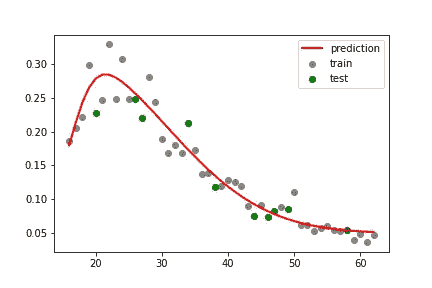
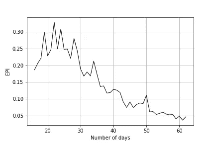
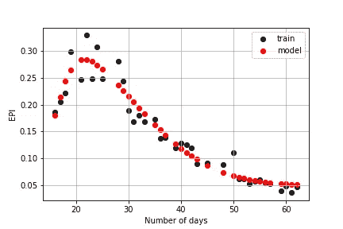
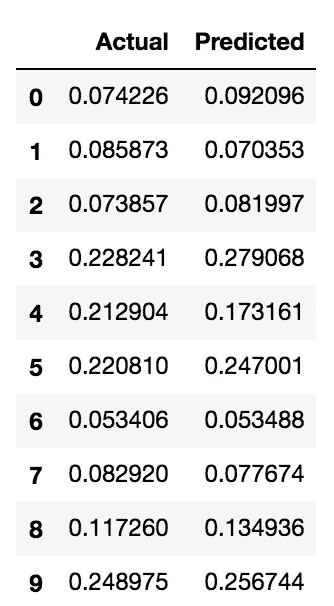
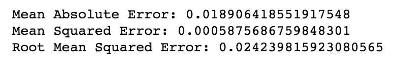
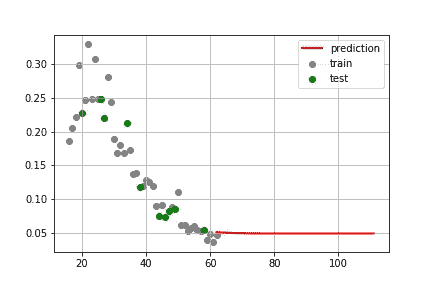

# 如何通过偏斜正态分布模拟意大利新冠肺炎疫情

> 原文：<https://towardsdatascience.com/how-to-model-italian-covid-19-outbreak-through-a-skew-normal-distribution-474abef1ec02?source=collection_archive---------30----------------------->



本教程使用 Python 分析与意大利新冠肺炎趋势相关的数据。数据由意大利公民保护组织发布。在下面的文章中描述了这个预测器背后的一般概念:[https://medium . com/@ angelica . lo duca/predicting-the-end-of-the-coronavirus-epiderations-in-Italy-8da 9811 f 7740](https://medium.com/@angelica.loduca/predicting-the-end-of-the-coronavirus-epidemics-in-italy-8da9811f7740)。在我的[上一篇文章](/italian-covid-19-analysis-with-python-1bdb0e64d5ac)中，我使用线性回归来逼近数据，在本文中，我们通过偏斜的正态分布来逼近 EPI，这似乎比线性回归更好。

您可以从 [my GitHub repository](https://github.com/alod83/data-science/blob/master/DataAnalysis/covid-19/Italian_covid-19_analysis_skewnorm.ipynb) 下载笔记本，在那里您也可以找到线性模型的实现。

# 入门指南

## 导入数据并计算 EPI

首先，我们从意大利 Protezione Civile 的 Github 库导入数据，然后计算流行病进展指数(EPI)。我们提取列`totale_casi`，其中包含自疫情开始以来的新冠肺炎感染总数，以及`tamponi`，其中包含自疫情开始以来的新冠肺炎拭子总数。我们将 EPI 存储在`y`变量中。最后，我们打印所有有数据的日期列表(`data[‘data’]`)。

```
import pandas as pd
data = pd.read_csv(“[https://raw.githubusercontent.com/pcm-dpc/COVID-19/master/dati-andamento-nazionale/dpc-covid19-ita-andamento-nazionale.csv](https://raw.githubusercontent.com/pcm-dpc/COVID-19/master/dati-andamento-nazionale/dpc-covid19-ita-andamento-nazionale.csv)") 
data.head()
```


然后，我们计算要分析的指标:流行病进展指数(EPI)并将其存储在`y`变量中。我们还定义了`X`来存储天数。最后，我们跳过前 15 天，来考虑限制法的影响。

```
tc = data['totale_casi']
tt = data['tamponi']
y = []
tt_increase = []
for i in range(1, len(tt)):
    current_epi = (tc[i] - tc[i-1])/(tt[i]-tt[i-1])
    tt_increase.append(tt[i]-tt[i-1])
    y.append(current_epi)X = []
for i in range(1, len(y)+1):
    X.append(i)skip = 15
X = X[skip:]
y = y[skip:]
```

现在我们可以绘制 EPI 趋势。

```
import matplotlib.pyplot as plt
import matplotlib
import numpy as npdef my_plot(X,y):
    plt.plot(X, y, color="black", linewidth=1)plt.grid()
    plt.xlabel('Number of days')
    plt.ylabel('EPI')
    plt.show()my_plot(X,y)
```



# 提取样本

## 在训练集和测试集中拆分数据

为了测试模型，我们将`X`和`y`拆分成`X_train`和`y_train`。我们将在训练变量上训练模型，并将在测试变量上进行测试。

```
from sklearn.model_selection import train_test_splitX_train, X_test, y_train, y_test = train_test_split(X, y, test_size=0.2, random_state=0)
```

# 模型定义

## 通过偏斜正态分布近似数据

我们可以通过偏斜的正态分布来近似计算数据。我们将`X`和`y`转换成 numpy 数组，并定义了一个名为`skewnorm()`的函数，它包含了偏斜正态分布的公式。我在这里找到了公式[。查看](https://stackoverflow.com/questions/15400850/scipy-optimize-curve-fit-unable-to-fit-shifted-skewed-gaussian-curve)[这里的](https://www.vosesoftware.com/riskwiki/SkewNormaldistribution.php)了解更多关于偏斜正态分布的细节。或者，我们可以使用函数`scipy.stats.skewnorm`，这里定义，这里定义，这里定义。

```
import numpy as np
import math
from scipy.optimize import curve_fit
import scipy.special as spX = np.array(X)
y = np.array(y)def skewnorm(x, sigmag, mu, alpha, c,a):

    normpdf = (1/(sigmag*np.sqrt(2*math.pi)))*np.exp(-(np.power((x-mu),2)/(2*np.power(sigmag,2))))

    normcdf = (0.5*(1+sp.erf((alpha*((x-mu)/sigmag))/(np.sqrt(2)))))
    return 2*a*normpdf*normcdf + c
```

现在我们能够通过`scipy`函数`curve_fit()`用训练数据拟合模型。曲线拟合是构建曲线或数学函数的过程，它对一系列数据点具有最佳拟合。`curve_fit()`函数将样本和初始参数作为输入。该函数返回最佳参数`popt`和协方差矩阵`pcov`作为输出。

```
popt, pcov = curve_fit(skewnorm, X_train, y_train, p0=(1./np.std(y_train), np.mean(y_train) ,0,0,0))
```

拟合后，我们绘制训练集的结果。我们通过简单地调用函数`skewnorm()`并使用函数`curve_fit()`返回的参数来计算预测`y_train_pred`。

```
y_train_pred = skewnorm(X_train,*popt)plt.scatter(X_train, y_train, color="black", linewidth=1, label='train')
plt.scatter(X_train, y_train_pred, color="red", linewidth=1, label='model')
plt.grid()
plt.legend()
plt.xlabel('Number of days')
plt.ylabel('EPI')
plt.show()
```



# 模型评估

我们在`X`的剩余部分，即`X_test`上测试模型。我们将函数`skewnorm()`应用于`X_test`。

```
y_pred = skewnorm(X_test,*popt)
```

我们将预测值与实际值进行比较。

```
df = pd.DataFrame({'Actual': np.array(y_test).flatten(), 'Predicted': y_pred.flatten()})
df
```



我们计算所有的评估指标。请看:[https://www . data Vedas . com/model-evaluation-regression-models/](https://www.datavedas.com/model-evaluation-regression-models/)了解更多详情。

我们希望 RMSE 值尽可能低，RMSE 值越低，模型的预测就越好。

```
from sklearn import metrics
print('Mean Absolute Error:', metrics.mean_absolute_error(y_test, y_pred))  
print('Mean Squared Error:', metrics.mean_squared_error(y_test, y_pred))  
print('Root Mean Squared Error:', np.sqrt(metrics.mean_squared_error(y_test, y_pred)))
```



我们还计算皮尔逊相关系数，以确定实际值和预测值之间是否存在相关性。我们使用包含在`stats`库中的`pearsonr()`函数。该函数返回皮尔逊相关系数作为第一个参数，p 值作为第二个参数。

## 皮尔逊相关系数

完美:如果值接近 1，那么它就是完美的相关性:随着一个变量的增加，另一个变量也会增加(如果为正)或减少(如果为负)。

高度:如果系数值介于 0.50 和 1 之间，则称之为强相关。中度:如果该值位于 0.30 和 0.49 之间，则称之为中度相关。低度:当值低于+ .29 时，则称之为小相关。无相关性:当值为零时。相关页面:[https://www . statistics solutions . com/pearsons-correlation-coefficient/](https://www.statisticssolutions.com/pearsons-correlation-coefficient/)

## p 值

我们想让它尽可能小。相关页面:[https://it.wikipedia.org/wiki/Valore_p](https://it.wikipedia.org/wiki/Valore_p)

```
from scipy import statsstats.pearsonr(y_test, y_pred)
```

# 将模型扩展到全体人口

## 将模型应用于所有可用数据

整个种群由`X`和`y`组成。我们通过将`skewnorm()`函数应用于`X`来计算`y_pred`。然后我们绘制结果。

```
y_pred = skewnorm(X,*popt)
plt.scatter(X_train, y_train, color="gray", label='train')
plt.scatter(X_test, y_test,  color='green', label='test')
plt.plot(X, y_pred, color='red', linewidth=2, label='prediction')
plt.legend()plt.show()
```


# 未来趋势预测

## 将模型应用于未来的日子

现在我们试着预测未来 50 天的趋势。我们从包含在`X`中的最后一天+ 1 开始构建一个列表`X_future`。然后，我们将函数`skewnorm()`应用于`X_future`，并绘制结果。

```
X_future = []
n_start = skip+len(X)
for i in range(n_start, n_start + 50):
    X_future.append([i])y_future = skewnorm(X_future,*popt)plt.scatter(X_train, y_train, color="gray", label='train')
plt.scatter(X_test, y_test,  color='green', label='test')
plt.plot(X_future, y_future, color='red', linewidth=2, label='prediction')
plt.legend()
plt.grid()
plt.show()
```



现在，我们可以预测新冠肺炎疫情的结束。当 y 的值等于偏移`c`时，就会发生这种情况，偏移在 skewnorm 公式(`y[i] = c`)中定义。由于`c`是一个浮点数，我们在移动逗号后将其转换为 int。`c`的值包含在`curve_fit()`返回的`popt`变量中。通过应用与`c`相同的技术，我们也将`y_future`转换为 int。最后，我们使用函数`np.where()`找到索引`i`，使得`y[i] = c`。

```
c = int(popt[3]*10**9)
y_search = np.array([int(i*10**9) for i in y_future])
i = np.where(y_search == c)
```

我们获得两个索引，我们取第一个并将其存储在`x0`中。

```
x0 = i[0][0] + n_start
y_future[i[0][0]]
```

将天数转换为日期。数据从 2020 年 2 月 24 日开始。那我们已经跳过了 15 天。

```
from datetime import datetime
from datetime import timedelta  
data_eff = datetime.strptime(data['data'][skip], '%Y-%m-%dT%H:%M:%S')
```

现在我们能够计算新冠肺炎疫情的结束时间，只需将`x0`转换成日期。根据这一模型，疫情不会在 2020 年 6 月 13 日登记任何病例。

```
def n_to_date(n):
    return data_eff + timedelta(days=n-skip)n_to_date(int(x0))
```

最后，我们实现了一个函数来预测某个通用日期的 EPI 值。

```
def date_to_n(my_date):
    initial_date = datetime.strptime(data['data'][0], '%Y-%m-%dT%H:%M:%S')
    return (my_date - initial_date).days + 1my_date = datetime.strptime("2020-04-25", '%Y-%m-%d')
n = date_to_n(my_date)
predict = skewnorm([[n]],*popt)
predict
```

# 摘要

## 对所吸取教训的简短总结

在本教程中，我们学习了以下概念:

*   在为数据集选择模型之前，重要的是绘制数据，以便了解数据是否具有特定的形状；
*   许多不同的模型可以用来表示数据。因此，评估模型的表现非常重要。在本教程中，我们使用了不同的度量来评估模型:平均绝对误差、均方误差、均方根误差、皮尔逊相关系数和 p 值；
*   `scipy`库提供了函数`curve_fit()`，该函数允许对任何形状或曲线进行建模。困难在于定义表示曲线的数学方程。